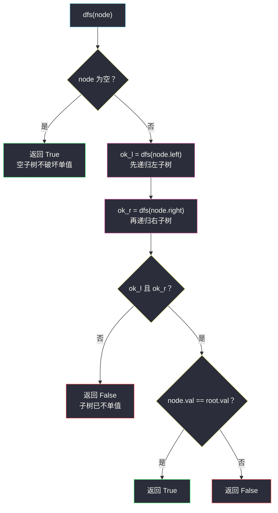
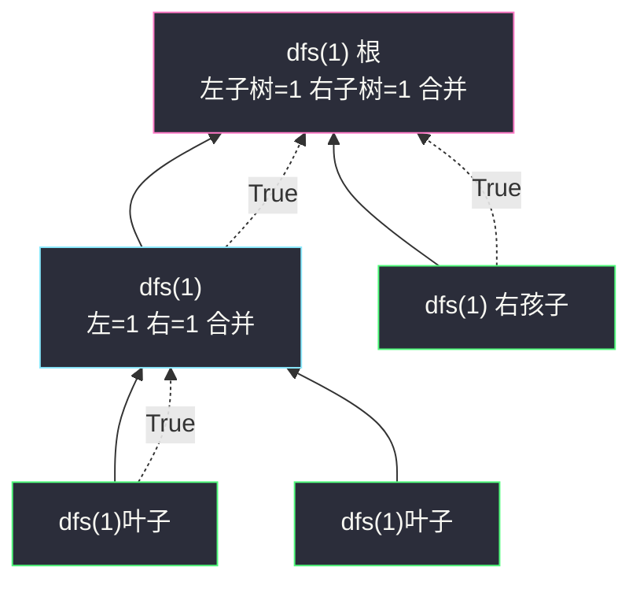

# 965. 单值二叉树（Univalued Binary Tree）

> 题目来源：[https://leetcode.cn/problems/univalued-binary-tree/](https://leetcode.cn/problems/univalued-binary-tree/)
>
> 灵茶题单小节：§2.3 自底向上 DFS（后序遍历）（难度分 1178）

## 一、问题描述

如果二叉树**每个节点**都具有相同的值，那么这棵树就是**单值二叉树**。

只有当给定的树是单值二叉树时，返回 `true`，否则返回 `false`。

**数据范围**：

- 树的节点数范围是 `[1, 100]`
- 每个节点的值都是整数，范围 `[0, 99]`

**示例 1**：

```text
输入：[1,1,1,1,1,null,1]
输出：true
解释：

      1
    /   \
   1     1
  / \     \
 1   1     1

全部节点值都为 1，是单值二叉树。
```

**示例 2**：

```text
输入：[2,2,2,5,2]
输出：false
解释：

      2
    /   \
   2     2
  /       \
 5         2

存在值为 5 的节点，不是单值二叉树。
```

**核心思考点**：这是「整棵树满足某性质」的最小原型。关键一步是**把性质拆到子结构上**：「整树单值」=「根值是标准」且「左子树单值」且「右子树单值」——一旦能写出这样的递归等式，代码就只剩翻译工作。这是题单 §2.3「自底向上 DFS」的入门思想：**先递归求解子树，再把子树答案与当前节点合并**。

## 二、暴力解法

### 思路

不做任何结构推理，直接按定义翻译：

1. 把整棵树遍历一遍（先序、层序均可），把所有节点值收进一个集合；
2. 集合大小 ≤ 1 即单值（节点数 ≥ 1 保证集合非空）。

### 代码

```python
from collections import deque

class Solution:
    def isUnivalTree(self, root: Optional[TreeNode]) -> bool:
        vals = set()                        # 出现过的值
        q = deque([root])                   # 层序遍历队列
        while q:
            node = q.popleft()
            vals.add(node.val)              # 收集值
            if node.left:
                q.append(node.left)
            if node.right:
                q.append(node.right)
        return len(vals) <= 1               # 只出现一种值 → 单值
```

### 复杂度

- 时间 `O(n)`：每个节点进出队列一次。
- 空间 `O(n)`：队列（最坏一层全满）+ 值集合（最坏 `n` 个不同值）。

## 三、优化探索

### 暴力版差在哪

- **无法提前退出**：哪怕第一步就遇到不同值（如示例 2 的 `5`），也要把整棵树走完、集合建全才下结论。
- **多余的记忆**：我们其实不关心「出现过哪些值」，只关心「是否全都等于标准值」——标准值天然存在：**根节点的值**。比较即可，无需集合。

### 递归等式

设 `dfs(node)` 表示「`node` 子树是单值二叉树（所有值都等于根值 `root.val`）」，则：

```text
dfs(node) = False                          若 node.val ≠ root.val
dfs(node) = dfs(node.left) and dfs(node.right)   否则
dfs(None)  = True                          空子树不破坏单值性
```

按「先算左右子树、最后结合自身」的顺序执行，就是**后序遍历（自底向上 DFS）**的形态；配合 `and` 的**短路求值**，左子树已不单值时右子树根本不会递归——提前退出免费获得。



对照暴力版：集合消失了，比较发生在**回溯的路上**——每个节点只回答一个 `bool` 问题，答案自下而上合并。

## 四、代码实现

```python
class Solution:
    def isUnivalTree(self, root: Optional[TreeNode]) -> bool:
        target = root.val                   # 标准值：根节点的值

        def dfs(node):
            """返回 node 子树是否全为 target（自底向上：先孩子后自己）"""
            if node is None:
                return True                 # 空子树：不破坏单值性
            ok_left = dfs(node.left)        # 后序第一步：左子树
            ok_right = dfs(node.right)      # 后序第二步：右子树
            # 第三步：子树结论与自身值合并（and 短路）
            return ok_left and ok_right and node.val == target

        return dfs(root)
```

### 细节说明

- **标准值取根值**：单值树上任意节点都可当标准，但根一定存在（节点数 ≥ 1），取 `root.val` 最省事，不用给 `dfs` 传参。
- **空树返回 `True`**：`None` 是「不违反任何性质」的中立元素。这样 `dfs` 对有孩子/没孩子的节点写出**统一**的递归式，不必在调用前判空。
- **`and` 短路即剪枝**：`ok_left and ok_right and node.val == target` 从左到右求值，左侧已 `False` 时右侧不执行——递归树上「已判死」的分支不再展开。
- **为什么这是「自底向上」**：`node` 的答案**依赖**子树答案（先 `dfs` 孩子拿到 `ok_*`，再合并自身），信息从叶往根流。与之相对，若把 `node.val == target` 的判断放在递归**之前**（先序），则信息从根往叶流，本题两者皆可——但「子问题合并」的后序形态是树形 DP 的通用骨架（见第八节）。
- **递归深度**：`n ≤ 100`，最坏斜树深度 100，远在 Python 默认递归限制内。

## 五、例子演示

**示例 2**（`[2,2,2,5,2]`）的后序递归过程，节点按「左→右→根」回溯：

```text
      ②  ← 根（target = 2）
    /   \
   ①     ④
  /       \
 ③(=5)     ⑤(=2)
```

| 步骤 | 调用 | 说明 | 返回值 |
|---|---|---|---|
| 1 | `dfs(③)`（叶 5） | 无孩子；自身 `5 ≠ 2` | `False` |
| 2 | `dfs(①)` | `ok_left = False`，`and` 短路——`dfs(③)` 已失败，**右孩子（空）与自身比较不再执行** | `False` |
| 3 | `dfs(④)` | 左空 `True`；`dfs(⑤)`：叶 2，`2 == 2` | `⑤=True`；`④` 回来 `True` |
| 4 | `dfs(②)` 根 | `ok_left=False`，短路——**右子树 ④ 整棵不再递归** | `False` |

结果：`False` ✅（与官方输出一致）。注意步骤 3 的整棵右子树虽然其实也是单值，但由于左路已失败，它被短路完全跳过——**这正是暴力版做不到的**。

**示例 1**（`[1,1,1,1,1,null,1]`）全部节点值相同，每个 `dfs` 都走满三条检查，回溯到根返回 `True`。



示例 1 中答案沿虚线自下而上合并：叶子都返回 `True`，内部节点把「子树 True + 自身值相等」继续上报，最终根返回 `True`。

## 六、复杂度分析

- **时间复杂度：`O(n)`**。最坏（全单值）每个节点访问一次；含不同值时被短路的分支不再访问，实际更快。
- **空间复杂度：`O(h)`**，`h` 为树高（递归栈）。平衡树 `O(log n)`，最坏斜树 `O(n)`；`n ≤ 100` 无压力。

## 七、对比总结

| 方案 | 遍历方式 | 额外结构 | 提前退出 | 空间 |
|---|---|---|---|---|
| 暴力：收集值进集合 | 层序 BFS | 值集合 `set` | ❌ 必须走完整树 | `O(n)` |
| 后序 DFS + 短路 `and` | 深度优先 | 无 | ✅ 首个不同值即封死回溯路径 | `O(h)` |

| 易错点 | 说明 |
|---|---|
| 空子树返回 `False` | 空不违反单值性，返回 `True` 才能让递归式统一 |
| 标准值选择 | 直接用 `root.val`；用「第一个叶子的值」等都要额外判空 |
| 判断放递归前还是后 | 本题先序后序都对；但「合并子树答案」的后序写法可平移到树形 DP |
| 集合比较写成 `len(set) == 1` | 节点数 ≥ 1 时等价，但 `≤ 1` 表达「至多一种值」更贴定义 |

**一句话**：单值判断 = 「标准值 + 一票否决」；后序 DFS 把否决票从叶往根传递，短路让它跑得比集合版更快。

## 八、举一反三

- **#100 相同的树**（https://leetcode.cn/problems/same-tree/）：双树同步后序——「两树都单值」到「两树逐节点相等」，递归式 `dfs(p, q) = dfs(p.l,q.l) and dfs(p.r,q.r) and p.val == q.val` 是本题的直接推广。
- **#226 翻转二叉树**（https://leetcode.cn/problems/invert-binary-tree/）：后序骨架的「改造版」——先递归处理子树，回溯时交换两个孩子。
- **#110 平衡二叉树**（https://leetcode.cn/problems/balanced-binary-tree/）：后序返回 `(是否平衡, 高度)` 二元组，「子问题合并 + 自身信息」的标准树形 DP 入门。
- **#872 叶子相似的树**（站内姊妹篇 `leaf-similar-trees.md`）：同批 DFS 族文章，侧重「生成器流式产出」；与本文的「返回值设计」互补。
- **#993 二叉树的堂兄弟节点**（站内 `cousins-in-binary-tree.md`）：DFS 换成 BFS 后如何携带父节点与深度信息。
- **网格图的分量判定**（站内 `making-a-large-island.md`）：「子结构结论合并」的思想在网格连通分量上的形态——访问过的格子打标，DFS 汇总面积。

> **框架总结**：**「整树满足性质 P」类问题的通用三步**——① 把 P 拆成 `P(子树)` 的递归等式；② 想清楚空树返回什么；③ 用 `and`/`or` 组织短路。本题是最小样例，后面所有树形 DP 都是它的放大版。
