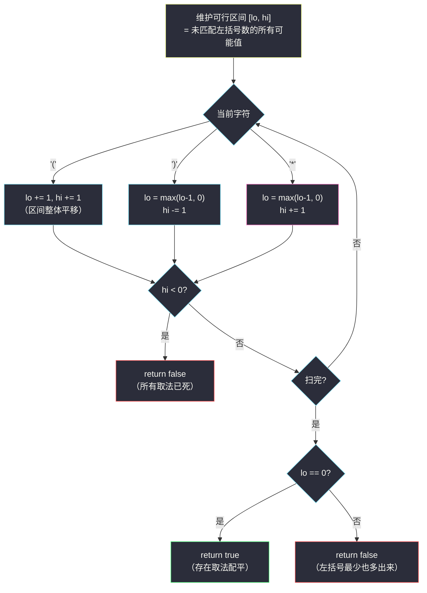
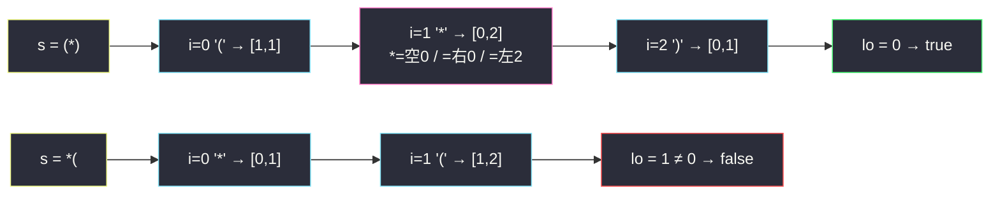

# 有效的括号字符串（合法括号串 RBS · 可行区间 [lo, hi] 处理 * 通配）

## 一、问题描述

给你一个只包含三种字符的字符串 `s`：`'('`、`')'` 和 `'*'`。

星号 `*` 是**通配符**，可以充当**左括号**、**右括号**或**空字符串**（三种身份任选其一，每个 `*` 独立选择）。

判断 `s` 是否**有效**——即是否存在一种 `*` 的取法，使得结果是一个合法括号串（RBS：任意前缀中左括号数 ≥ 右括号数，且总数相等）。

> 🔗 LeetCode 678：https://leetcode.cn/problems/valid-parenthesis-string/
>
> 数据范围：`1 <= s.length <= 100`。
>
> 📚 本题出自灵茶题单 **§3.4 合法括号字符串（RBS）**。

**示例 1**

```
输入：s = "()"
输出：true
```

**示例 2**

```
输入：s = "(*)"
输出：true
解释：'*' 可以当做空字符串，得到 "()"；也可以当做右括号，同样得到 "()"。
（若把 '*' 当左括号，得 "(()"，不合法——但只要存在一种合法取法即可。）
```

**示例 3**

```
输入：s = "(*))"
输出：true
解释：'*' 当左括号，得 "(())" 合法。
```

**直观理解**

没有 `*` 时，判 RBS 只需一个计数器：`cnt` 遇 `(` 加一、遇 `)` 减一，全程 `cnt ≥ 0` 且结尾 `cnt = 0`。有了 `*`，计数器的值不再是**一个数**，而是**一段可能区间**——每个 `*` 都可能让未匹配左括号数 `+1`、`-1` 或不变。于是把「计数器」升级成「**可行区间 `[lo, hi]`**」：只要区间里还包含 0，就仍有希望；区间一旦变空，立刻判负。

---

## 二、暴力解法

枚举每个 `*` 的三种身份，逐组合检查。`s` 长度 ≤ 100，最坏 100 个 `*`，`3^100 ≈ 5 * 10^47` 个组合，直接枚举不可行，但 DFS + 计数器检查是思路最直白的版本：

```python
class Solution:
    def checkValidString(self, s: str) -> bool:
        def dfs(i: int, cnt: int) -> bool:
            if cnt < 0:                       # 剪枝：中途失配
                return False
            if i == len(s):
                return cnt == 0
            if s[i] == "(":
                return dfs(i + 1, cnt + 1)
            if s[i] == ")":
                return dfs(i + 1, cnt - 1)
            return (dfs(i + 1, cnt + 1)       # * 当左括号
                    or dfs(i + 1, cnt - 1)    # * 当右括号
                    or dfs(i + 1, cnt))       # * 当空串
        return dfs(0, 0)
```

### 复杂度

- **时间**：最坏 `O(3^k · 1)`（`k` 为 `*` 个数），靠 `cnt < 0` 剪枝后对官方数据勉强能过，但理论指数级。
- **空间**：递归栈 `O(n)`。

### 🔴 瓶颈在哪里

指数级分支全部来自 `*` 的三选一。但注意：**我们并不需要知道每个 `*` 选了什么，只需要知道「未匹配左括号数」的所有可能取值**。而计数器每一步只变动 1，可能取值天生是**连续区间**——区间合并掉分支，就是多项式解法。

---

## 三、优化探索（核心章节）

> 📚 灵茶题单 **§3.4 合法括号字符串（RBS）** 模板：**用可行区间 `[lo, hi]` 讨论 `*` 的三种身份**；等价的另一板斧是**正反两遍扫描**。本题是「把计数法从单值推广到区间」的代表。

### 3.1 关键不变式：可能取值是连续区间

**断言**：扫描到任意位置时，所有 `*` 取法组合下「当前未匹配左括号个数」的**幸存取值集合**（即尚未中途 `cnt < 0` 的分支）恰好是区间 `[lo, hi]` 中的全部整数。

归纳维护（区间 `[lo, hi]`，已知取值连续）：

- **遇 `(`**：所有取值 `+1` → 区间平移为 `[lo+1, hi+1]`；
- **遇 `)`**：所有取值 `-1`，负值分支死亡（丢弃）→ `[max(lo-1, 0), hi-1]`；若 `hi-1 < 0`，全部分支死亡，直接 `false`；
- **遇 `*`**：三种身份的并集 = `[lo-1, hi] ∪ [lo, hi] ∪ [lo+1, hi+1]` 中幸存部分 → `[max(lo-1, 0), hi+1]`（负值照旧丢弃）。

三步操作后取值依然连续，断言成立。最终有效 ⟺ 幸存区间里含 0 ⟺ `lo = 0`。



### 3.2 为什么「lo 夹到 0」是安全的

`lo = max(lo - 1, 0)` 里那步「夹住」初看可疑：取值 `-1` 的分支明明死了，为什么 `lo` 不变成负数而是停在 0？

因为**未匹配左括号数本来就不能为负**——如果某个分支在此处已经归零，再遇 `)` 或「`*` 当右括号」它确实死了，但区间 `[0, hi-1]` 或 `[0, hi+1]` 里的其他取值仍活着；`lo` 表示的是**幸存分支的最小值**，归零分支的死亡只会让 `hi` 端收缩，而 `lo` 端只要还有取值 0 的分支就保持 0。换句话说：**0 是「还能被后续 `)` 消耗」的下限**，夹住它不会引入虚假的可行解——最终判定依然要求 `lo = 0`，此时存在一个真实分支从未跌破 0 且恰好配平。

### 3.3 等价解法：正反两遍扫描

灵神给出的另一板斧，`O(n)` 且只需一个计数器：

- **正向扫**：`(` 和 `*` 都算 `+1`，`)` 算 `-1`，中途 `< 0` 即 `false`。含义：*全部当左括号*时，任何前缀不缺左括号；
- **反向扫**：`)` 和 `*` 都算 `+1`，`(` 算 `-1`，中途 `< 0` 即 `false`。含义：*全部当右括号*时，任何后缀不缺右括号；
- 两遍都通过 → `true`。

**正确性**：RBS 合法 ⟺ 「任意前缀 `(` + `*` ≥ `)`」且「任意后缀 `)` + `*` ≥ `(`」（后者是「总数配平」的逐后缀版本，与霍尔条件同理）。正向遍保证前者、反向遍保证后者，两者合起来恰好等价于区间法 `hi ≥ 0` 且 `lo = 0` 的结论。

### 3.4 区间法 vs 两遍法

| | 区间法 `[lo, hi]` | 正反两遍 |
|--|--------------------|-----------|
| 一趟判定失败 | `hi < 0`（全死） | 正向 `< 0` |
| 最终判定成功 | `lo == 0` | 反向也通过 |
| 视角 | 同一时刻所有分支的幸存集合 | 两个极端取法的可行性 |
| 扩展性 | 易推广（如锁定字符的 #2116） | 实现最短 |

### 3.5 一句话核心

> `*` 把计数器变成**区间**：遇 `(` 平移、遇 `)` 收缩、遇 `*` 左端下探右端扩张（均夹住 0）；`hi < 0` 提前判负，扫完看 `lo` 是否为 0。

---

## 四、代码实现

### Python 主解（可行区间 [lo, hi]）

```python
class Solution:
    def checkValidString(self, s: str) -> bool:
        lo = hi = 0                  # 未匹配左括号数的可行区间
        for c in s:
            if c == "(":
                lo += 1
                hi += 1
            elif c == ")":
                lo = max(lo - 1, 0)
                hi -= 1
            else:                    # '*' 三种身份的并集
                lo = max(lo - 1, 0)
                hi += 1
            if hi < 0:               # 所有取法都已中途失配
                return False
        return lo == 0               # 存在恰好配平的取法
```

**变量含义**

| 变量 | 含义 |
|------|------|
| `lo` | 所有幸存取法中，未匹配左括号数的最小可能值（≥ 0） |
| `hi` | 最大可能值；`hi < 0` 表示一个活口都没有了 |

**不变式**：处理完第 `i` 个字符后，幸存取值集合 = `[lo, hi]` 中全部整数。

### Python 变体（正反两遍扫描）

```python
class Solution:
    def checkValidString(self, s: str) -> bool:
        cnt = 0                      # 正向：* 当左括号
        for c in s:
            cnt += 1 if c != ")" else -1
            if cnt < 0:
                return False
        cnt = 0                      # 反向：* 当右括号
        for c in reversed(s):
            cnt += 1 if c != "(" else -1
            if cnt < 0:
                return False
        return True
```

### Java（最优解同款，区间法）

```java
class Solution {
    public boolean checkValidString(String s) {
        int lo = 0, hi = 0;
        for (char c : s.toCharArray()) {
            if (c == '(') {
                lo++;
            } else {
                lo = Math.max(lo - 1, 0);
            }
            hi += (c == '(' || c == '*') ? 1 : -1;
            if (hi < 0) return false;
        }
        return lo == 0;
    }
}
```

---

## 五、具体例子演示

### 例 1：s = "(*)"（示例 2）

逐步跟踪区间 `[lo, hi]`：

| i | s[i] | 规则 | lo | hi | 幸存取值集合 |
|---|------|------|----|----|--------------|
| 0 | `(` | lo+1, hi+1 | 1 | 1 | `{1}` |
| 1 | `*` | lo=max(0,0)=0, hi+1 | 0 | 2 | `{0, 1, 2}`（*=空/右/左） |
| 2 | `)` | lo=max(-1,0)=0, hi-1 | 0 | 1 | `{0, 1}` |

扫完 `lo = 0` → **true** ✓。最终取值 0 的分支是 `*` 当**空串**（得 `"()"`）；`*` 当右括号的分支（`"())"`）在第 2 步取值就跌成 -1 被丢弃，`*` 当左括号的分支（`"(()"`）结尾取值 1、也没配上。

### 例 2：s = "(*))"（示例 3）

| i | s[i] | 规则 | lo | hi | 幸存取值集合 |
|---|------|------|----|----|--------------|
| 0 | `(` | +1, +1 | 1 | 1 | `{1}` |
| 1 | `*` | max(0,0), +1 | 0 | 2 | `{0, 1, 2}` |
| 2 | `)` | max(-1,0), -1 | 0 | 1 | `{0, 1}` |
| 3 | `)` | max(-1,0), -1 | 0 | 0 | `{0}` |

扫完 `lo = 0` → **true** ✓。唯一幸存分支是 `*` 当左括号，得 `"(())"`。

### 例 3：s = "*("（自定义反例）

| i | s[i] | 规则 | lo | hi | 说明 |
|---|------|------|----|----|------|
| 0 | `*` | max(-1,0)=0, +1 | 0 | 1 | `{0, 1}` |
| 1 | `(` | +1, +1 | 1 | 2 | `{1, 2}` |

扫完 `lo = 1 ≠ 0` → **false** ✓。验证：`*` 三种取法得 `(`、`((`、`)(`，全非法。

### 例 4：s = "((*)"

| i | s[i] | lo | hi |
|---|------|----|----|
| 0 | `(` | 1 | 1 |
| 1 | `(` | 2 | 2 |
| 2 | `*` | 1 | 3 |
| 3 | `)` | 0 | 2 |

`lo = 0` → true ✓。取值 0 的分支是 `*` 当**右括号**（得 `"(())"`）；`*` 当空串的分支（`"(()"`）结尾取值 1，当左括号（`"((()"`）结尾取值 2，均未配上。



---

## 六、复杂度分析

| 方法 | 时间 | 空间 | 说明 |
|------|------|------|------|
| DFS 枚举 `*` 身份 | `O(3^k)` | `O(n)` | 剪枝后勉强过官方数据，理论指数级 |
| 记忆化 DP（状态 = 位置 × 计数值） | `O(n²)` | `O(n²)` | 区间法的「显式展开」版本 |
| 可行区间 `[lo, hi]` | `O(n)` | `O(1)` | 两个整型变量 |
| 正反两遍扫描 | `O(n)` | `O(1)` | 一个计数器跑两趟 |

`n ≤ 100` 时四者都能过，但区间法/两遍法的 `O(n)` + `O(1)` 是质变——它把「所有分支」压缩成一个区间，本质是利用了取值的连续性做状态合并。

---

## 七、对比总结

在灵茶题单 §3.4 的 RBS 家族中，本题引入了**不确定性**：

| 题 | 确定性 | 工具 |
|----|--------|------|
| #1249 最少移除（同批 `minimum-remove-to-make-valid-parentheses.md`） | 全确定 | 栈存下标定位删除 |
| #1963 最小交换（同批 `minimum-number-of-swaps-to-make-the-string-balanced.md`） | 全确定 | 清匹配剩失配，公式 `(m+1)//2` |
| **#678 本篇** | `*` 三态 | 可行区间 `[lo, hi]` / 正反两遍 |

**方法论**：单值计数器 →「一个数」；带通配的计数器 →「一段区间」。这是「不确定状态压缩」的经典范式：当每步变动量 ≤ 1 且判定只关心「能否到 0」时，可能取值集合必然连续，区间两端就概括了一切。

**易错点**

1. `lo` 忘记 `max(..., 0)` 夹住：会让 `lo` 变负，最终 `lo == 0` 的判定失去意义（明明区间 `[max(lo,0), hi]` 非空却可能因负值误判）。
2. `hi < 0` 的提前退出漏写：继续跑下去 `lo`、`hi` 都会失真。
3. 正反两遍法容易只写正向——只保证「前缀不缺左」，漏了「后缀不缺右」（如 `"(*("` 正向过、反向挂）。
4. 想当然用「贪心：`*` 优先当右括号」的单值模拟——没有回溯的单值贪心是错的（`*` 的最优身份取决于后面还有什么）。

---

## 八、举一反三

| 题目 | 关系 |
|------|------|
| [1249. 移除无效的括号](https://leetcode.cn/problems/minimum-remove-to-make-valid-parentheses/) | 同小节，无通配版的「删除」题，见同批 `minimum-remove-to-make-valid-parentheses.md` |
| [1963. 使字符串平衡的最小交换次数](https://leetcode.cn/problems/minimum-number-of-swaps-to-make-the-string-balanced/) | 同小节，无通配版的「交换」题，见同批 `minimum-number-of-swaps-to-make-the-string-balanced.md` |
| [2116. 判断一个括号字符串是否有效](https://leetcode.cn/problems/check-if-a-parentheses-string-can-be-valid/) | 本题强化版：部分字符被**锁定**为 `(` 或 `)`，其余可通配，区间法直接平移 |
| [636. 函数的独占时间](https://leetcode.cn/problems/exclusive-time-of-functions/) | 栈配对处理括号日志的另一应用 |
| [32. 最长有效括号](https://leetcode.cn/problems/longest-valid-parentheses/) | RBS 判定的「最长段」变体，栈存下标 |
| [3412. 计算字符串的镜像分数](https://leetcode.cn/problems/find-mirror-score-of-a-string/) | 同批 `find-mirror-score-of-a-string.md`：确定性配对，26 栈版 |
| 同目录 `parsing-a-boolean-expression.md` | 嵌套括号 + 栈综合练习 |

**思想迁移**

- 「通配符 + 计数判定」→ 区间法：把单点状态升级为可行区间，`O(1)` 跟踪指数分支。
- 判定 RBS 的两个方向（前缀不缺左、后缀不缺右）是**对偶**的——很多题只需其中一个方向，正反各扫一遍就能各取所需。
- 口诀：**「星号三身莫硬枚，计数开成区间对；遇左平移遇右缩，lo 归零才算对。」**
