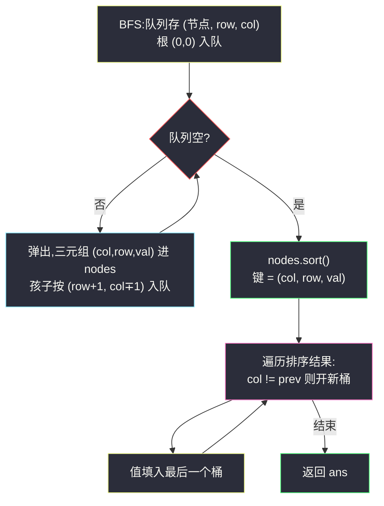
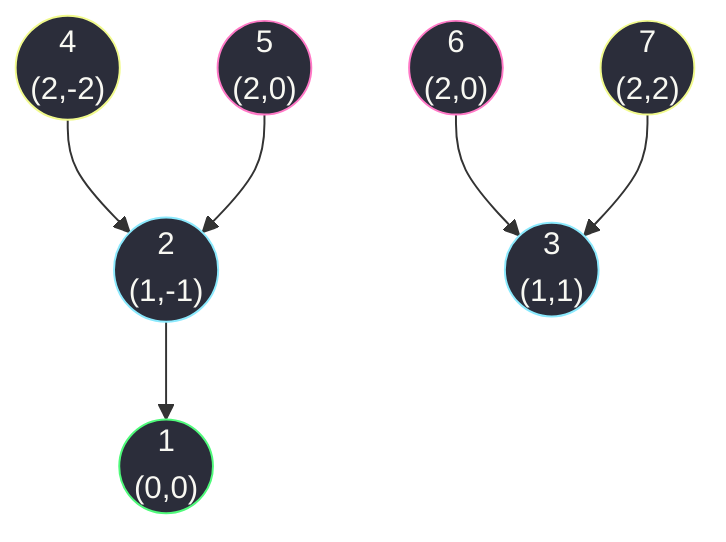

# 987. 二叉树的垂序遍历(Vertical Order Traversal of a Binary Tree)

> 🔗 LeetCode 987:https://leetcode.cn/problems/vertical-order-traversal-of-a-binary-tree/
>
> 📚 灵茶题单小节:§「坐标化遍历:行、列与排序键」练习

## 一、问题描述

给你二叉树的根节点 `root`,请你设计算法计算二叉树的**垂序遍历**序列。

对位于 `(row, col)` 的每个节点而言,其左右子节点分别位于 `(row + 1, col - 1)` 和 `(row + 1, col + 1)`。树的根节点位于 `(0, 0)`。

二叉树的垂序遍历从最左边的列开始直到最右边的列结束,按列索引每一列上的所有节点,形成一个按出现位置**从上到下**排序的有序列表。如果**同行同列**上有多个节点,则按节点的**值从小到大**排序。

返回二叉树的垂序遍历序列。

**示例 1**

```text
输入:root = [3,9,20,null,null,15,7]
输出:[[9],[3,15],[20],[7]]
解释:
列 -1:只有节点 9 在此列中。
列  0:只有节点 3 和 15 在此列中,按从上到下顺序。
列  1:只有节点 20 在此列中。
列  2:只有节点 7 在此列中。
```

**示例 2**

```text
输入:root = [1,2,3,4,5,6,7]
输出:[[4],[2],[1,5,6],[3],[7]]
解释:
列 -2:只有节点 4 在此列中。
列 -1:只有节点 2 在此列中。
列  0:节点 1、5 和 6 都在此列中。1 在上面,所以它出现在前面;
     5 和 6 位置都是 (2, 0),所以按值从小到大排序,5 在 6 的前面。
列  1:只有节点 3 在此列中。
列  2:只有节点 7 在此列中。
```

**示例 3**

```text
输入:root = [1,2,3,4,6,5,7]
输出:[[4],[2],[1,5,6],[3],[7]]
解释:这个示例实际上与示例 2 完全相同,只是节点 5 和 6 在树中的位置发生了交换。
因为 5 和 6 的位置仍然相同,所以答案保持不变,仍然按值从小到大排序。
```

> 数据范围:树中节点数目在范围 `[1, 1000]` 内;`0 <= Node.val <= 1000`。

```text
class TreeNode:
    def __init__(self, val=0, left=None, right=None):
        self.val = val          # 节点值
        self.left = left        # 左子:位于 (row+1, col-1)
        self.right = right      # 右子:位于 (row+1, col+1)
```

**直观理解**

把二叉树放进平面直角坐标系:根钉在原点,每往下一层 `row + 1`,走左孩子 `col - 1`,走右孩子 `col + 1`——左子树整体向左斜,右子树整体向右斜。垂序遍历就是**用竖直的扫描线从左往右扫**,每条扫描线扫到的节点自成一列;同一列里再按"谁高谁先"(row 升序),高度还打平就比节点值。

最反直觉的一点藏在示例 3:节点 5 和 6 在树里换了位置,输出却不变——因为**排序只认 `(row, col)` 坐标和值,不认你是谁家的孩子**。同一坐标撞车时,树的结构信息完全失效,只剩值的大小裁决。这与层序遍历"孩子列表顺序决定层内顺序"的规则形成了鲜明对比:

| 维度 | 层序(如 429) | 垂序(本题) |
|---|---|---|
| 分桶依据 | row(队列快照切层) | col(排序后切列) |
| 桶间顺序 | 队列时序天然有序 | 靠排序建立 |
| 桶内规则 | 孩子入队顺序 | 先行序,同行同列再值序 |
| 结构信息 | 直接决定输出 | 只生成坐标,不决定输出 |

层序的层内顺序由遍历过程决定,垂序的同列顺序由排序规则决定——一行表格装下两题的本质差异。

## 二、暴力解法

最直白的做法:先扫一遍树找出列号的最小值与最大值,然后**对每一列单独扫一遍全树**,收集落在该列的 `(row, val)`,排序后输出。

```python
class Solution:
    def verticalTraversal(self, root: Optional[TreeNode]) -> List[List[int]]:
        cols = set()                                  # 出现过的列号集合

        def scan(node: Optional[TreeNode], row: int, col: int) -> None:
            if node is None:
                return
            cols.add(col)
            scan(node.left, row + 1, col - 1)
            scan(node.right, row + 1, col + 1)

        scan(root, 0, 0)

        ans = []
        for c in range(min(cols), max(cols) + 1):     # 扫描线从左往右
            bucket = []

            def gather(node: Optional[TreeNode], row: int, col: int) -> None:
                if node is None:
                    return
                if col == c:                          # 命中当前列
                    bucket.append((row, node.val))
                gather(node.left, row + 1, col - 1)   # 树形结构剪不掉,整树重扫
                gather(node.right, row + 1, col + 1)

            gather(root, 0, 0)
            bucket.sort()                             # 行升序,同行按值
            if bucket:
                ans.append([v for _, v in bucket])
        return ans
```

### 复杂度

- 时间:`O(W × n + W × k log k)`,其中 `W = max(col) - min(col) + 1` 是列宽,`k` 为单列节点数。`n = 1000` 时列宽最坏接近 `n`(链形树每层左斜),总计 `O(n^2)` ≈ `10^6` 量级,能过但笨重;每列还要重扫一遍全树,绝大多数节点与当前列无关,纯属陪跑。
- 空间:`O(n)`(递归栈与桶)。

这个版本的价值在于语义完全照抄题面:"从最左列到最右列"、"每列从上到下"逐字翻译成代码,是对拍的最佳基准。但"一次遍历就能把所有节点的坐标拿全,却要按列反复扫树"——重复劳动一目了然。还有一个隐性坑:`range(min(cols), max(cols)+1)` 枚举的是**连续列区间**,若树只在列 −3 和列 5 有节点,中间列的 `gather` 照样全树扫一遍再发现空桶——`if bucket` 挡住了空输出,却挡不住白扫的时间。

## 三、优化探索

### 观察 1:一次遍历收齐三元组,排序键就是输出键

每个节点的 `(col, row, val)` 三元组在一次 DFS/BFS 中即可全部拿到。输出要求的次序——先列升序、列内行升序、同行再按值——**恰好就是三元组的字典序**:`(col, row, val)` 直接 `sort()`,一遍排序把三层规则全部编码进去。排序键与输出规则一字不差地同构,是本题最漂亮的洞察;但也有代价——**三层键任何一层写错顺序,答案全盘皆错**,而且小数据可能碰巧蒙对,后文第五章会用专门的对抗用例压测这一点。

### 观察 2:BFS 让 row 天然有序,但值序仍要排序

用队列 BFS 逐层遍历,三元组入列表时 `row` 已经单调不减——那是否可以只按 `(col, val)` 排序甚至不排?不行:同一行同一列的多个节点来自不同子树,BFS 的入队顺序由树结构决定(左子树的节点先入队),与值无关。示例 3 恰是反例——5 和 6 交换位置后输出不变,说明**结构序必须被值序覆盖**。所以排序省不掉,但 BFS 仍有两个附赠:一是 `row` 有序让排序更稳定直观,二是层序遍历的骨架([N 叉树的层序遍历](./n-ary-tree-level-order-traversal.md))可以整套复用,只多带一个 `col` 参数。

### 观察 3:排完序怎么分组——`prev` 一变就开新桶

排序后的序列按 `col` 连续成段。用一个 `prev` 记录上一元素的列号,遍历时一旦 `col != prev` 就 `append` 一个新空桶,再把值塞进"最后一个桶"。比起外层再套 `while` + 内层 `while` 找段尾的双指针写法,这种"开桶-填桶"的单循环更短,也避免了边界空段的处理。

### 观察 4:列宽与数组桶——负下标的平移技巧

`n ≤ 1000` 意味着列号落在 `[−999, 999]` 内。若想用数组下标做桶(避开字典),列号 `col` 加上偏移 `n` 平移到非负:`bucket[col + n]`,最后过滤空桶输出。这样做省掉了排序前的字典比较,但桶内仍要按 `(row, val)` 排序,总复杂度不变;且空桶过滤一步不能省,否则输出里混进空列表。两相比较:字典/元组排序法代码更短、无空桶问题;数组桶法在 C++ 等无内建字典序元组的语言里更顺手。Python 下主解选元组排序。



### 与"层序收集"的对照

层序遍历把节点按 `row` 分桶(`len(q)` 快照切层);垂序遍历把节点按 `col` 分桶(排序后 `prev` 变化切列)。前者桶间天然有序(队列时序),后者桶间靠排序建立序——这也解释了为什么垂序是 Hard 而层序是 Easy:多出的"值序裁决"一步,逼你把输出规则完整翻译成排序键,任何一层键写错顺序,答案全盘皆错。

## 四、代码实现

```python
class Solution:
    def verticalTraversal(self, root: Optional[TreeNode]) -> List[List[int]]:
        nodes = []                                    # (col, row, val) 三元组
        q = deque([(root, 0, 0)])                     # 根在原点
        while q:
            node, row, col = q.popleft()
            nodes.append((col, row, node.val))        # 列、行、值:字典序即输出序
            if node.left:
                q.append((node.left, row + 1, col - 1))
            if node.right:
                q.append((node.right, row + 1, col + 1))

        nodes.sort()                                  # 一条排序键编码全部三层规则

        ans = []
        prev = None                                   # 上一元素的列号
        for col, _, val in nodes:
            if prev != col:                           # 列号一变,开新桶
                ans.append([])
                prev = col
            ans[-1].append(val)                       # 填进最后一个桶
        return ans
```

**细节说明**

- **键序不可交换**:三元组必须是 `(col, row, val)`。若写成 `(row, col, val)` 就变成按行分组(层序的变体),与垂序完全不同;`(col, val, row)` 则会在同行同列时按值排但跨行乱序——三种排列三种题,排错必 WA。
- **`prev` 初始化为 `None`**:`col` 永远是非负整数吗?不,列号可以是负数(左子树),但绝不会是 `None`,首元素必开新桶,无需哨兵值。
- **树非空保证**:数据范围 `n ≥ 1`,无需判 `root is None`;若调用方可能传空树,加一行特判返回 `[]` 即可。
- **为什么 BFS 不判重**:树无环,每个节点只被父亲入队一次——与图 BFS 的本质差异,同 [层序遍历家族](./n-ary-tree-level-order-traversal.md) 的讨论。
- **负列号不影响排序**:Python 元组比较先比 `col`,负数照样升序;若用数组下标做桶,才需要 `col - min_col` 平移。
- **`deque` 存三元组**:比存裸节点再查坐标省一次哈希;队列元素带状态,是"遍历中携带坐标"的最小改动版。
- **`prev` 与桶同步更新**:开新桶与改 `prev` 必须同一条分支里完成——先开桶后改 `prev` 的顺序若颠倒,首个元素会进错桶;单分支内两条赋值,顺序无关但缺一不可。
- **空列天然跳过**:`prev` 只在遇到节点时更新,树中不存在的列号根本不会出现,输出不含空桶——这是它相对数组桶法(需手动过滤)的结构性优势。

## 五、例子演示

用**示例 2** `root = [1,2,3,4,5,6,7]` 端到端走一遍。这是棵满二叉树:1 的孩子 2、3;2 的孩子 4、5;3 的孩子 6、7。



注意 5 和 6 是不同子树的孩子,却挤在同一个坐标 `(2, 0)`——它们就是"同行同列按值排序"规则的靶子。

BFS 收集与排序全过程:

| 阶段 | 内容 |
|---|---|
| BFS 入队序 | `(1,0,0) → (2,1,-1) → (3,1,1) → (4,2,-2) → (5,2,0) → (6,2,0) → (7,2,2)` |
| 存入 nodes(重排为 col,row,val) | `(0,0,1) (−1,1,2) (1,1,3) (−2,2,4) (0,2,5) (0,2,6) (2,2,7)` |
| `sort()` 后 | `(−2,2,4) (−1,1,2) (0,0,1) (0,2,5) (0,2,6) (1,1,3) (2,2,7)` |
| 分桶(prev 切换处) | `−2→[4]`,`−1→[2]`,`0→[1]` 继而 `[1,5]` 再 `[1,5,6]`,`1→[3]`,`2→[7]` |
| 输出 | `[[4],[2],[1,5,6],[3],[7]]` ✅ |

看排序后中段的三连:`(0,0,1)` 在 `(0,2,5)` 前面——同列 0,行 0 的根 1 比行 2 的 5 高,先出现;`(0,2,5)` 紧贴 `(0,2,6)`——行也打平,5 < 6 由第三键裁决。三层规则在同一小段里全部亮相,这正是示例 2 成为经典的原因。

对照**示例 3** `root = [1,2,3,4,6,5,7]`:仅 5 与 6 交换了挂载位置(5 挂 3 下、6 挂 2 下),两者坐标仍是 `(2,0)`,排序结果与示例 2 逐字节相同——输出 `[[4],[2],[1,5,6],[3],[7]]` 不变。这提示一个实用结论:垂序遍历**不唯一决定树的结构**,两棵结构不同的树可以有相同输出;反过来,同一棵树的垂序输出永远唯一(排序键全序且确定)。

对照**示例 1** `root = [3,9,20,null,null,15,7]`:树是 3 的左子 9、右子 20,20 的左子 15、右子 7。BFS 逐轮推进:

| 轮次 | 弹出 (值,row,col) | 入队孩子 | nodes 追加 |
|---|---|---|---|
| 1 | (3,0,0) | (9,1,−1)、(20,1,1) | `(0,0,3)` |
| 2 | (9,1,−1) | 无(叶子) | `(−1,1,9)` |
| 3 | (20,1,1) | (15,2,0)、(7,2,2) | `(1,1,20)` |
| 4 | (15,2,0) | 无 | `(0,2,15)` |
| 5 | (7,2,2) | 无 | `(2,2,7)` |

排序后 `(−1,1,9) (0,0,3) (0,2,15) (1,1,20) (2,2,7)`,分桶输出 `[[9],[3,15],[20],[7]]`——列 0 中 3(行 0)与 15(行 2)不同行,值序没轮上,行序直接定胜负 ✅。注意 15 的坐标是 `(2,0)`:它挂在 20 下,20 在列 1,左孩子列减一回到 0——**列号在右子树里也会回摆**,不是单调向右的,这是坐标系的斜向投影在起作用。

### 常见错误清单

- **键序写错**:把三元组写成 `(row, col, val)` 或 `(col, val, row)`,输出形状对、内容错,且小样例可能碰巧过——必须用示例 2/3 这种"同行同列"用例压测。
- **分桶时比较值而非列号**:用 `val` 变化切桶,遇到相邻列同值直接粘连;切桶依据只能是 `col`。
- **DFS 版忘了排序 `row`**:DFS 先序收集时同列的行号乱序,不排序直接分组输出错误;BFS 版靠队列保证行序,但同行同列仍必须靠 `val` 键。
- **漏掉空列**:按列下标建桶(`cols = [[] for _ in range(...)]`)时,树中没出现的列会输出空列表;`prev` 切桶法天然跳过空列,这也是它优于数组桶的一个理由。
- **修改输入树**:本题不改动节点,但若贪图方便把 `val` 改存别的信息,对拍时基准树就被污染——独立构建输入是本站对拍铁律。

### 边界用例速查

| 用例 | 输入要点 | 期望 | 考点 |
|---|---|---|---|
| 单节点 | `root=[1]` | `[[1]]` | 首桶开启 |
| 全左链 | 每层只有左子 | 每列恰一节点 | 负列号连续递减 |
| 同坐标双子 | 示例 2 的 5、6 | 值小者在前 | 第三键裁决 |
| 左右混合链 | 之字形下行 | 列号回摆重叠 | 坐标投影而非单调 |
| 完满树 | n=1023 满二叉 | 中列最挤 | 桶内多层多值 |

### 自测三问

1. 把排序键写成 `(col, val, row)`,示例 2 的输出会变成什么?(答:`[[4],[2],[5,1,6],[3],[7]]`——同行同列的 5、6 仍有序,但列 0 内 1 被排到 5 后面,行序被值序覆盖。)
2. 树里同一坐标最多可能挤几个节点?(答:没有任何约束限制,只受树形与值域影响,构造上可让整棵树的节点全部重叠在同一坐标。)
3. 为什么分组不担心负列号?(答:`prev` 初始为 `None`,任何整数列号都与之不等,首桶必开;Python 整数比较与正负无关。)

## 六、复杂度分析

- 时间:`O(n log n)`。BFS 收集 `O(n)`;排序 `O(n log n)` 是主导项;分组线性扫一遍 `O(n)`。`n = 1000` 时排序开销微乎其微。
- 空间:`O(n)`。逐项拆解:

| 存储项 | 规模 | 说明 |
|---|---|---|
| 三元组列表 nodes | `n` | 主体,排序原地 |
| 队列峰值 | `O(w)`(最宽层) | 满二叉树最深层约 `n/2` |
| 输出 ans | `n` 个值分撒各桶 | 题目要求返回,不计辅助空间也可 |
| 递归/无 | — | 主解无递归,栈深恒定 |

两项合计(含输出)`O(n)`;若不计输出,辅助空间 `O(n)`(三元组列表不可避免)。

### 正确性问答

**问:排序键 `(col, row, val)` 与题面规则的对应关系如何论证?** 题面要求"列从左到右;列内从上到下;同行同列按值升序"——这是三级优先的排序规范,与元组字典序逐级对应:`col` 定桶间序,`row` 定桶内主序,`val` 仅在前两键打平时兜底。Python 元组比较恰好按分量依次进行,一级定不了看下一级,规范即键。

**问:BFS 与 DFS 收集,结果有差别吗?** 排序前有(入列表顺序不同),排序后无——排序键是全序,任何来源的同一批三元组排完序完全一致。选 BFS 只是让"行升序"在排序前就肉眼可见,讲解成本低。

**问:最坏情况下同一坐标能挤多少节点?** 无上限约束(值只要求 0 到 1000,可重复),极端构造下同一 `(row, col)` 可容纳多个节点,全部靠 `val` 键排——所以"值排序"不是边角料,而是正确性必需。

**问:能否做到 `O(n)` 不排序?** 列号范围 `[−999, 999]`,可用 2000 个桶按列直接落位;但桶内仍需按 `(row, val)` 排序,总复杂度回到 `O(n log n)`。真正的线性需要按列 DFS 时维护有序结构(平衡树/桶按行),得不偿失——`n log n` 已是该题的舒适区。

**问:排完序后分组,还能用什么写法?** 除了 `prev` 判桶,还有 `itertools.groupby`(按首元素分组,需先排序)、或外层 `while` + 内层推进找段尾。三种写法都是线性扫,`prev` 版胜在无嵌套、无 import,且与"开桶-填桶"的直觉对应最直白。

## 七、对比总结

| 解法 | 时间 | 空间 | 思路 | 备注 |
|---|---|---|---|---|
| 按列重扫(暴力) | `O(n^2)` | `O(n)` | 每列整树重扫收集 | 语义直译题面,对拍基准 |
| DFS + 排序 | `O(n log n)` | `O(n)` | 先序收集三元组,统一排序 | doocs 官方版,代码最短 |
| BFS + 排序(本文) | `O(n log n)` | `O(n)` | 层序收集,row 预有序 | 复用层序骨架,讲解直观 |
| 列数组桶 + 桶内排序 | `O(n log n)` | `O(n + W)` | col 平移后做下标 | 省一次全局排序,需处理空列 |

一句话:**把输出规则翻译成排序键,一次遍历加一次排序,垂序问题就结束了**。

从方法论上看,本题属于"坐标化 + 排序"家族:给每个节点算出一组键,输出规则即键的字典序。这个视角下"层序 (row)"、"垂序 (col,row,val)"、"按值序 (val)"都是同一模板的不同填空——树的结构只负责生成键,不再直接决定输出顺序。

### 常见问答

**问:答案的上界受什么制约?** 列数受树宽限制——链形树每列 1 个节点,列数 = n;满二叉树列宽也在 n 量级。输出永远是全部 n 个值的一次划分,不重不漏。

**问:为什么这题是 Hard?** 不是代码难——主解不到 20 行;难在"输出规则的精确翻译":三层优先级(列、行、值)必须一点不差地映射进排序键,而"同一坐标多个节点"的情形在随手进的小样例里几乎不出现,很多人 AC 后都没意识到自己的 `row` 键其实写反了。Hard 标签是对规范精读能力的定价。

**问:如果要求自右向左输出列呢?** 键取反(`col` 变 `-col`)或排完序后 `ans.reverse()`——分桶逻辑不变,只动序的方向;这再次印证"分桶"与"定序"是两个独立决策。

**问:同一棵树,垂序输出会因遍历方式不同而不同吗?** 不会。排序键是节点属性的全序,与收集顺序无关;DFS/BFS/任意顺序收集,排完序后完全一致——这是"键决定输出"与"过程决定输出"的分水岭,层序恰好站在后者一侧。

**问:两棵不同的树可能共享同一垂序输出吗?** 可能。示例 2 与示例 3 就是现成证据:5、6 交换挂载位置后坐标不变、输出不变。更进一步,只要两树全部节点的坐标多重集相同,输出就相同——垂序是"多对一"的投影,不能反过来唯一还原树。

## 八、举一反三

- [314. 二叉树的垂直遍历](https://leetcode.cn/problems/binary-tree-vertical-order-traversal/):垂序的简化版——同列不排序、只按从上到下,体会"去掉值序键"后模板如何瘦身。
- [102. 二叉树的层序遍历](https://leetcode.cn/problems/binary-tree-level-order-traversal/):按 row 分桶的原点,与垂序对照看"分桶依据"与"桶内规则"两个自由度。
- 本站延伸阅读:[N 叉树的层序遍历](./n-ary-tree-level-order-traversal.md)——同为"队列收集 + 分层输出",层序靠 `len(q)` 快照分层、垂序靠排序键分层,两篇合读正好覆盖"过程切层"与"结果切层"两条路线。
- [1305. 两棵二叉搜索树中的所有元素](https://leetcode.cn/problems/all-elements-in-two-binary-search-trees/):另一道"收集后排序/归并"的树题,合并两棵树的中序流,与垂序的"多列合并"互为镜像。
- [103. 二叉树的锯齿形层序遍历](https://leetcode.cn/problems/binary-tree-zigzag-level-order-traversal/):层序加"隔层反转"的变体,规则叠加时同样要理清"谁定桶、谁定序"。
- [144. 二叉树的前序遍历](https://leetcode.cn/problems/binary-tree-preorder-traversal/):结构序输出的极简对照——纯遍历序没有任何排序键介入,与垂序"键决定输出"恰成两极,适合放在一起体会"遍历即输出"与"遍历只收集"的分野。
