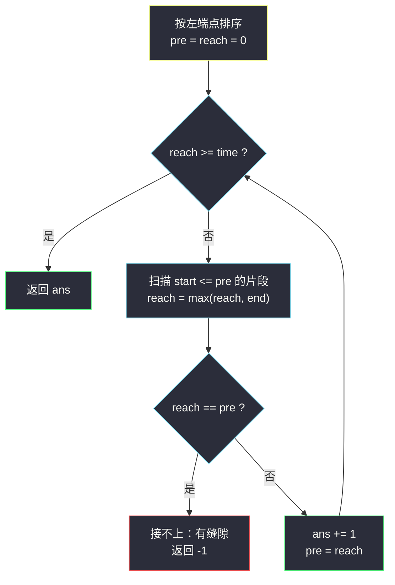
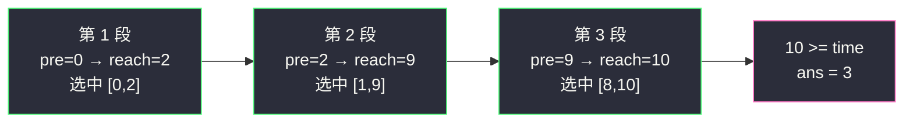

# 视频拼接（区间覆盖 · 跳到最远右端）

## 一、问题描述

你将会获得一系列视频片段 `clips`，以及一个当前需要拼接成的总时长 `time`。片段 `clips[i] = [start_i, end_i]` 表示从时刻 `start_i` 到 `end_i` 的片段（闭区间，可重叠）。

返回需要的**最少片段数**，使得将它们按顺序拼接后可以覆盖 `[0, time]`。若无法完成拼接，返回 `-1`。

> 🔗 LeetCode 1024：https://leetcode.cn/problems/video-stitching/
>
> 数据范围：`1 <= clips.length <= 100`，`0 <= start_i <= end_i <= 100`，`0 <= time <= 100`。

**示例 1**

```
输入：clips = [[0,2],[4,6],[8,10],[1,9],[1,5],[5,9]], time = 10
输出：3
解释：选 [0,2]、[1,9]、[8,10]，并按顺序拼接即覆盖 [0,10]。
```

**示例 2**

```
输入：clips = [[0,1],[1,2]], time = 5
输出：-1
解释：片段最远只到 2，永远盖不住 [0,5]。
```

**示例 3**

```
输入：clips = [[0,1],[6,8],[0,2],[5,6],[0,4],[0,3],[6,7],[1,3],[4,7],[1,4],[2,5],[2,6],[3,4],[4,5],[5,7],[6,9]], time = 9
输出：3
解释：选 [0,4]、[4,7]、[6,9]，覆盖 [0,9]。
```

**直观理解**

要「用最少片段盖满 `[0, time]`」，这是区间贪心家族（§2.1–§2.5）的第四课：**区间覆盖**。它同时是 [#45 跳跃游戏 II](https://leetcode.cn/problems/jump-game-ii/) 的换皮：把「跳跃能力」换成「片段」，「最少几步跳到终点」变成「最少几段铺满全程」。灵神模板一句话：**按左端点排序，每一轮在够得着的片段里把右端推到最远。**

---

## 二、暴力解法

数据范围很小（`n, time <= 100`），先上 DP：`dp[t]` = 覆盖 `[0, t]` 的最少片段数。转移思路：最后一个片段 `[s, e]` 要能接上，得先有方案覆盖到 `[0, s]`，再用这个片段把覆盖推过 `t`：

```python
class Solution:
    def videoStitching(self, clips: List[List[int]], time: int) -> int:
        INF = float('inf')
        dp = [0] + [INF] * time           # dp[t]：覆盖 [0,t] 的最少片段数
        for t in range(1, time + 1):
            for s, e in clips:
                if s < t <= e and dp[s] != INF:
                    dp[t] = min(dp[t], dp[s] + 1)  # 先盖 [0,s]，再用 [s,e] 补
        return dp[time] if dp[time] < INF else -1
```

正确性要点：`dp[t]` 取「至少覆盖」语义，随 `t` 单调不减；最优方案的最后一个片段 `[s, e]`（`e >= t`）前面的片段已覆盖 `[0, s]`，故 `dp[t] <= dp[s] + 1`，转移不漏最优。

### 复杂度

- **时间**：`O(n * T)`，`T = 100`，本题规模下轻松通过，但换到 `T = 10^5` 就崩。
- **空间**：`O(T)`。

### 🔴 瓶颈在哪里

DP 把「接龙位置」逐一枚举（`min(dp[s:e])`），而覆盖问题的最优结构其实只关心**能到达的最远位置**——中间过程是冗余的。把「每步可达的最远点」作为状态，就能把 DP 塌缩成跳跃式贪心。

---

## 三、优化探索（核心章节）

> 📚 本题在灵茶题单中属于 **§2.4 区间覆盖**（贪心② A 路 · 区间贪心）：按**左端点**排序，每一步跳到「当前够得着的片段中**最远的右端**」，跳不动了（且没到 `time`）就是 `-1`。它与 §2.3（按右端选点）恰好镜像：覆盖关心「能铺多远」，选点关心「死线多紧」。

### 3.1 观察特征

| 特征 | 说明 |
|------|------|
| 覆盖是「接力」结构 | 下一个片段必须从已覆盖区域内出发（`start <= 已覆盖最右点`） |
| 片段之间可重叠 | 接力时只要左端在覆盖内，右端越远越赚 |
| 排序后单调指针可复用 | 按左端排序，`start <= pre` 的片段在扫描中构成连续段 |

### 3.2 贪心策略：双边界接力

维护两个边界：

- `pre`：用当前已选的片段**确定覆盖到**的位置（上一轮跳到的右端）；
- `reach`：本轮扫描 `start <= pre` 的所有片段后，**能到达**的最远右端。

每一轮：`ans += 1`，`pre = reach`——「再花一个片段，最远能铺到哪」。循环直到 `reach >= time`。若某轮扫完 `reach == pre`（一个新片段都接不上），说明出现无法跨越的缝隙，返回 `-1`。



### 3.3 正确性：交换论证

设最优解用了 `t` 个片段，贪心用了 `g` 个。归纳证明贪心每一轮结束后 `reach` 不小于任何同片段数方案能覆盖的最远位置：

- 第 1 轮：能被 1 个片段覆盖的前提是 `start = 0`，贪心取这些片段右端的最大值，显然最远。
- 归纳步：设最优解前 `i` 个片段覆盖到 `x`，贪心 `i` 轮后 `reach >= x`。最优解第 `i+1` 个片段 `start <= x <= reach`，也会被贪心在**下一轮或更早的轮**扫描到（指针 `i` 单调前进，`start <= pre <= reach` 的片段都会参与取 max），所以贪心 `i+1` 轮后的 `reach' >=` 该片段的 `end`。

于是贪心的轮数（片段数）不会超过最优解：`g <= t`；又贪心本身是可行方案 `t <= g`，故 `g = t`。

### 3.4 与 #45 跳跃游戏 II 的同构

| | #45 | #1024 |
|--|-----|-------|
| 排序 | 天然有序（下标） | 按左端点排序 |
| 第 i 步可达范围 | `[i+1, i+nums[i]]` | 片段 `[s, e]`，`s <= pre` |
| 状态 | `curEnd / farthest` | `pre / reach` |
| 失败 | 到不了终点 | 缝隙（`reach == pre`） |

把「位置 `i` 的跳跃能力 `nums[i]`」换成「从 `s` 出发可铺到 `e` 的片段」，两份代码逐行对应。

### 3.5 一句话核心

> **左端排序排好队，每轮把 `pre` 以内够得着的片段右端取最大，一步跳过去；原地踏步就是断路。**

---

## 四、代码实现

### Python（主解：排序 + 接力贪心）

```python
class Solution:
    def videoStitching(self, clips: List[List[int]], time: int) -> int:
        clips.sort()                            # 按左端点排序
        n = len(clips)
        ans, pre, reach, i = 0, 0, 0, 0
        while reach < time:
            while i < n and clips[i][0] <= pre: # 够得着的片段都拿来推远
                reach = max(reach, clips[i][1])
                i += 1
            if reach == pre:                    # 原地踏步：有缝隙
                return -1
            ans += 1
            pre = reach                         # 跳过去
        return ans
```

**变体（跳跃游戏 II 同款双变量写法，等价）**

```python
class Solution:
    def videoStitching(self, clips: List[List[int]], time: int) -> int:
        clips.sort()
        ans = i = 0
        pre = reach = 0
        while i < len(clips) and reach < time:
            while i < len(clips) and clips[i][0] <= pre:
                reach = max(reach, clips[i][1])
                i += 1
            ans += 1
            pre = reach
            if reach < time and (i == len(clips) or clips[i][0] > reach):
                return -1                       # 下一轮无片段可接
        return ans if reach >= time else -1
```

**变量含义**

| 变量 | 含义 |
|------|------|
| `pre` | 已用 `ans` 个片段**确定覆盖**到的最右位置 |
| `reach` | 多花一个片段（`start <= pre` 的任选）能到的最远右端 |
| `i` | 排序数组上的单调指针，每个片段只被扫一次 |
| `ans` | 已选片段数 |

**循环不变式**：外层每轮开始时，`pre` 是「用 `ans` 个片段覆盖 `[0, pre]`」的最远保证；内层把一切 `start <= pre` 的片段纳入考虑后，`reach` 是「用 `ans + 1` 个片段」的最远可达。

### Java（最优解）

```java
class Solution {
    public int videoStitching(int[][] clips, int time) {
        Arrays.sort(clips, (a, b) -> a[0] - b[0]);   // 值域 <= 100，减法安全
        int ans = 0, pre = 0, reach = 0, i = 0, n = clips.length;
        while (reach < time) {
            while (i < n && clips[i][0] <= pre) {
                reach = Math.max(reach, clips[i][1]);
                i++;
            }
            if (reach == pre) return -1;             // 接不上
            ans++;
            pre = reach;
        }
        return ans;
    }
}
```

---

## 五、具体例子演示

以示例 1 `clips = [[0,2],[4,6],[8,10],[1,9],[1,5],[5,9]]`、`time = 10` 走主解。

**第一步：按左端点排序后的片段表**

| 序 | 片段 | start | end |
|----|------|-------|-----|
| 1 | [0,2] | 0 | 2 |
| 2 | [1,5] | 1 | 5 |
| 3 | [1,9] | 1 | 9 |
| 4 | [4,6] | 4 | 6 |
| 5 | [5,9] | 5 | 9 |
| 6 | [8,10] | 8 | 10 |

**第二步：逐轮接力（`ans` 从 0 开始，`pre = reach = 0`）**

| 轮 | pre（出发地） | 扫描的片段（start <= pre） | reach | 决策 | ans |
|----|---------------|-----------------------------|-------|------|-----|
| 1 | 0 | [0,2] → 2 | 2 | 跳：选「1 个片段最远到 2」 | 1 |
| 2 | 2 | [1,5] → 5、[1,9] → 9 | 9 | 跳：2 个片段最远到 9 | 2 |
| 3 | 9 | [4,6]、[5,9]、[8,10] → 10 | 10 | 跳：3 个片段到 10 | 3 |

`reach = 10 >= time`，返回 **3** ✓。具体选中方案即 `[0,2]`、`[1,9]`、`[8,10]`（与示例解释一致）。

**示例 2 的失败路径**：排序后 `[0,1],[1,2]`。轮 1：`pre=0` 扫 `[0,1]` → `reach=1`，ans=1；轮 2：`pre=1` 扫 `[1,2]` → `reach=2`，ans=2；轮 3：指针已到尾，`reach=2 == pre` → **-1** ✓。



---

## 六、复杂度分析

| 方法 | 时间 | 空间 | 说明 |
|------|------|------|------|
| DP 接龙 | `O(n log n + n * T)` | `O(T)` | 本题小数据可过，`T` 大时失效 |
| 排序 + 接力贪心（主解） | `O(n log n)` | `O(1)` | 排序主导；扫描指针单调，总扫 `O(n)` |

---

## 七、对比总结

| 维度 | 本题（覆盖） | #452（选点） | #2406（分组） |
|------|--------------|--------------|----------------|
| 排序键 | 左端点 | 右端点 | 左端点 |
| 每步贪心 | 跳到最远右端 | 箭打最小右端 | 复用最早结束的组 |
| 失败判定 | `reach` 停滞（缝隙） | 无（总能射完） | 无（大不了一组一个） |

**易错点**

1. **先排序再谈贪心**：不排序直接扫会把「够得着的片段」漏掉，`i` 指针的单调性完全依赖左端有序。
2. **`reach == pre` 的失败检测**必须在内层扫描之后判断，否则首轮（`pre = reach = 0`）会误报。
3. `time = 0` 时循环体一次都不进，直接返回 `0`——「零片段覆盖空区间」，边界天然正确。
4. 片段 `start > time` 或 `end == start`（零长度）不影响逻辑：前者永远不会被扫到，后者不推进 `reach`。
5. 别把 `pre` 更新成 `clips[i][1]`：`pre` 必须更新为**本轮最大**的 `reach`，逐片段更新会多计轮数。

**模板（左端排序 + 双边界接力，Python）**

```python
clips.sort()
ans, pre, reach, i = 0, 0, 0, 0
while reach < target:
    while i < len(clips) and clips[i][0] <= pre:
        reach = max(reach, clips[i][1])
        i += 1
    if reach == pre:
        return -1                 # 断路
    ans += 1
    pre = reach
```

---

## 八、举一反三

| 题目 | 关系 |
|------|------|
| [45. 跳跃游戏 II](https://leetcode.cn/problems/jump-game-ii/) | 完全同构的原型，把本题「片段」读成「跳跃能力」即可 |
| [55. 跳跃游戏](https://leetcode.cn/problems/jump-game/) | 本题的判定版（只问能不能到，不问几段） |
| [1326. 灌溉花园的最少水龙头数目](https://leetcode.cn/problems/minimum-number-of-taps-to-open-to-water-a-garden/) | 水龙头 = 片段，同一模板，值域更大更显贪心优势 |
| [452. 用最少数量的箭引爆气球](https://leetcode.cn/problems/minimum-number-of-arrows-to-burst-balloons/) | 同批 `minimum-number-of-arrows-to-burst-balloons.md`，§2.3 按右端选点（镜像对照） |
| [2406. 将区间分为最少组数](https://leetcode.cn/problems/divide-intervals-into-minimum-number-of-groups/) | 同批 `divide-intervals-into-minimum-number-of-groups.md`，§2.2 区间分组 |
| [2580. 统计将重叠区间合并成组的方案数](https://leetcode.cn/problems/count-ways-to-group-overlapping-ranges/) | 同批 `count-ways-to-group-overlapping-ranges.md`，§2.5 合并区间 |
| [3458. 选择 K 个互不重叠的特殊子字符串](https://leetcode.cn/problems/select-k-disjoint-special-substrings/) | 同批 `select-k-disjoint-special-substrings.md`，§2.1 不相交区间 |

**思想迁移**

- 「最少 XX 覆盖 / 到达」类问题，先问自己：**每一步的决策空间由什么界定**（本题 `start <= pre`），再在决策空间里取「推得最远」的——这是跳跃贪心的通用骨架。
- 排序键选左端还是右端：看你要的是「尽快出发铺远」（左端）还是「死线最紧先救」（右端）。
- 口诀：**「左端排队来，够得着的往远推；一轮一步走，原地踏步就是断。」**
