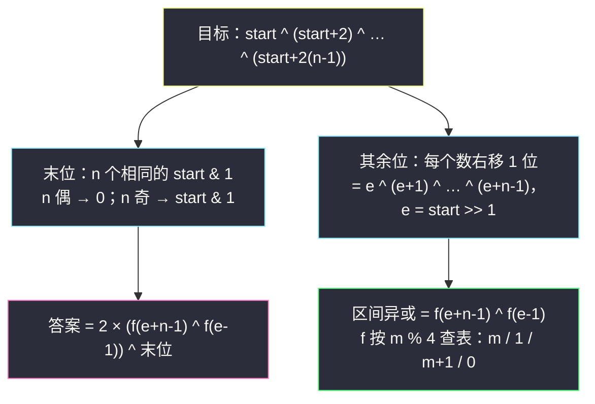

# 数组异或操作（连续整数异或的 `n % 4` 周期性）

## 一、问题描述

给定两个整数 `n` 和 `start`。数组 `nums` 定义为：`nums[i] = start + 2 * i`（下标从 0 开始，共 `n` 个数，即 `start, start+2, start+4, …`）。返回 `nums` 中**所有元素按位异或**的结果。

> 🔗 LeetCode 1486：https://leetcode.cn/problems/xor-operation-in-an-array/
>
> 数据范围：`1 <= n <= 1000`，`0 <= start <= 1000`，`nums[i] <= 2^31 - 1`。

**示例**

```
输入：n = 5, start = 0    输出：8
解释：nums = [0,2,4,6,8]，0 ^ 2 ^ 4 ^ 6 ^ 8 = 8。

输入：n = 4, start = 3    输出：8
解释：nums = [3,5,7,9]，3 ^ 5 ^ 7 ^ 9 = 8。

输入：n = 1, start = 7    输出：7
解释：nums = [7]，异或即 7 自身。
```

**直观理解**

模拟一遍是 `O(n)` 的签到题；它真正想教的是 **XOR 的性质**——尤其「`0 ^ 1 ^ … ^ m` 这个前缀异或随 `m % 4` 呈周期变化」。灵神题单把它放在 **位运算 · 二、异或（XOR）的性质**，是后续前缀异和、成对消去类题目的地基。

---

## 二、暴力解法

老老实实把数组造出来异或：

```python
class Solution:
    def xorOperation(self, n: int, start: int) -> int:
        ans = 0
        for i in range(n):
            ans ^= start + 2 * i      # nums[i] = start + 2i
        return ans
```

### 复杂度

- **时间**：`O(n)`。
- **空间**：`O(1)`（不落盘数组，边算边异或）。

### 🔴 瓶颈在哪里

`n` 至多 1000，模拟已经能过。但这串数有**极强的结构**：公差为 2 的等差数列、同奇偶、右移一位后就是**连续整数**。异或对这种结构有周期性配方，能把 `O(n)` 压成 `O(1)`——值得学，因为同样的周期性会出现在值域大得多的变体题里。

---

## 三、优化探索

> 📚 本题在灵茶题单中属于 **位运算 · 二、异或（XOR）的性质**。灵神模板要点：**连续异或的 n%4 周期性**——前缀异或 `f(m) = 0^1^…^m` 按 `m % 4` 取值 `m / 1 / m+1 / 0`；配合「末位单独看、其余位右移一位变成连续整数异或」两步，可得 `O(1)` 公式。

### 3.1 先备好 XOR 性质清单（后面全靠它们）

| 性质 | 写法 | 用途 |
|------|------|------|
| 自反 | `a ^ a = 0` | 成对出现即消去 |
| 单位元 | `a ^ 0 = a` | 边界/空区间兜底 |
| 交换律 + 结合律 | 任意重排 | 任意配对、任意分组 |
| 按位独立 | 每个二进制位各自异或 | 逐位分析 |
| 乘 2 即左移 | `2x ^ 2y = 2 * (x ^ y)` | 高位与低位解耦 |

最后一条是本题的钥匙：`2x` 与 `2y` 的最低位都是 0，异或后最低位仍 0；其余位正是 `x ^ y` 左移一位，即乘 2。

### 3.2 第一步：拆末位——n 个相同的末位按奇偶消去

`nums[i] = start + 2i`，所有数**奇偶相同**（都等于 `start` 的奇偶），末位（第 0 位）全是 `b = start & 1`。按位独立 + 自反：

- `n` 为偶数：`n` 个 `b` 两两配对消尽，末位结果是 `0`；
- `n` 为奇数：留下一个 `b`，末位结果是 `b`。

### 3.3 第二步：其余位右移一位——变成连续整数异或

把每个数右移一位：`nums[i] >> 1 = (start >> 1) + i`。记 `e = start >> 1`，剩下的异或就是连续整数：

```
e ^ (e+1) ^ (e+2) ^ … ^ (e+n-1)
```

由 3.1 的「乘 2 = 左移」性质，原始序列的异或 = 上面结果左移一位（× 2），再拼上 3.2 的末位。

### 3.4 第三步：前缀异或 f(m) 的 `n % 4` 周期

定义 `f(m) = 0 ^ 1 ^ 2 ^ … ^ m`（`m < 0` 时规定 `f(m) = 0`）。按 `m % 4` 查表：

| `m % 4` | `f(m)` |
|----------|--------|
| 0 | `m` |
| 1 | `1` |
| 2 | `m + 1` |
| 3 | `0` |

**为什么**：从 4 的倍数起，连续四个数 `4k, 4k+1, 4k+2, 4k+3` 的异或必为 0——低两位分别是 `00, 01, 10, 11`，`00^01^10^11 = 00`；高位是 4 份相同的 `4k`，两两抵消。于是 `f(4k) = f(4k-1) ^ 4k = 0 ^ 4k = 4k`，再逐个推出 `f(4k+1) = 4k^4k+1 = 1`（只差最后一位），`f(4k+2) = 1^4k+2 = 4k+3`，`f(4k+3) = f(4k+2) ^ (4k+3) = 0`。周期 4 循环往复。

区间异或用前缀差（结合律保证合法）：`e ^ … ^ (e+n-1) = f(e+n-1) ^ f(e-1)`。

### 3.5 合成 `O(1)` 公式



`O(1)`，一次除法两次查表两次位运算。

### 3.6 一句话核心

> **同奇偶的序列：末位看 n 的奇偶，其余位右移一位变连续整数；连续整数异或用 `f(m)` 的 `% 4` 周期查表，一步到 `O(1)`。**

---

## 四、代码实现

### Python（暴力对照：模拟）

```python
class Solution:
    def xorOperation(self, n: int, start: int) -> int:
        ans = 0
        for i in range(n):
            ans ^= start + 2 * i
        return ans
```

### Python（主解：数学 `O(1)`）

```python
class Solution:
    def xorOperation(self, n: int, start: int) -> int:
        def f(m: int) -> int:                 # 0 ^ 1 ^ … ^ m
            if m < 0:
                return 0                      # f(-1) = 0：空前缀
            return (m, 1, m + 1, 0)[m % 4]    # n % 4 周期表

        e = start >> 1                        # 右移一位后的连续整数起点
        ans = 2 * (f(e + n - 1) ^ f(e - 1))   # 其余位：区间异或再左移
        if n & 1:                             # 末位：奇数个才留下
            ans ^= start & 1
        return ans
```

**变量含义**

| 变量 | 含义 |
|------|------|
| `f(m)` | 前缀异或 `0 ^ 1 ^ … ^ m`，`m % 4` 周期 |
| `e` | `start >> 1`，右移后的连续整数起点 |
| `f(e+n-1) ^ f(e-1)` | 区间 `[e, e+n-1]` 的异或 |
| `2 * (...)` | 左移一位还原高位 |
| `n & 1` 时 `^ (start & 1)` | 奇数个相同末位留下一个 |

### Java（数学 `O(1)`）

```java
class Solution {
    public int xorOperation(int n, int start) {
        int e = start >> 1;
        int ans = 2 * (f(e + n - 1) ^ f(e - 1));
        if ((n & 1) == 1) {
            ans ^= start & 1;
        }
        return ans;
    }

    private int f(int m) {          // 0 ^ 1 ^ … ^ m
        if (m < 0) return 0;
        switch (m % 4) {
            case 0: return m;
            case 1: return 1;
            case 2: return m + 1;
            default: return 0;
        }
    }
}
```

---

## 五、具体例子演示

### 例 A：`n = 5, start = 0`（暴力逐步表，二进制逐位看）

| i | nums[i] | 二进制 | 累计异或（十进制） | 累计异或（二进制） |
|---|---------|--------|--------------------|--------------------|
| 0 | 0 | `0000` | 0 | `0000` |
| 1 | 2 | `0010` | 2 | `0010` |
| 2 | 4 | `0100` | 6 | `0110` |
| 3 | 6 | `0110` | 0 | `0000`（`6 ^ 6` 自反消去） |
| 4 | 8 | `1000` | 8 | `1000` |

→ **8** ✓。观察 `0 ^ 2 ^ 4 ^ 6` 恰好归零：偶数序列里隐藏的成对消去。

### 例 A（续）：`f(m)` 周期表（m = 0..7）

| m | 0 | 1 | 2 | 3 | 4 | 5 | 6 | 7 |
|---|---|---|---|---|---|---|---|---|
| f(m) | 0 | 1 | 3 | 0 | 4 | 1 | 7 | 0 |
| m % 4 | 0 | 1 | 2 | 3 | 0 | 1 | 2 | 3 |
| 规律 | m | 1 | m+1 | 0 | m | 1 | m+1 | 0 |

每 4 个一组归零：`f(3) = 0`、`f(7) = 0`，与 3.4 的证明吻合。

### 例 B：`n = 4, start = 3`（公式代入逐步表）

| 步骤 | 计算 | 结果 |
|------|------|------|
| e = start >> 1 | `3 >> 1` | 1 |
| b = start & 1 | `3 & 1` | 1 |
| 高位区间 | `[e, e+n-1] = [1, 4]` | — |
| f(4) | `4 % 4 = 0` → 取 `m` | 4 |
| f(e-1) = f(0) | `0 % 4 = 0` → 取 `m` | 0 |
| 高位异或 | `4 ^ 0` | 4 |
| 左移还原 | `2 × 4` | 8 |
| 末位 | n = 4 偶数 → 消尽 | 0 |
| **答案** | `8 ^ 0` | **8** ✓ |

### 例 C：`n = 1, start = 7`

| 步骤 | 计算 | 结果 |
|------|------|------|
| e = 7 >> 1 | | 3 |
| 高位区间 | `[3, 3]` | — |
| f(3) | `3 % 4 = 3` → 取 0 | 0 |
| f(2) | `2 % 4 = 2` → 取 m+1 | 3 |
| 高位异或 ×2 | `2 × (0 ^ 3)` | 6 |
| 末位 | n 奇 → `^ (7 & 1)` | 6 ^ 1 = **7** ✓ |

单元素数列也走通用公式——`f(3) ^ f(2)` 把「区间只剩一个 3」的异或原样吐出来。

---

## 六、复杂度分析

| 方法 | 时间 | 空间 |
|------|------|------|
| 模拟 | `O(n)` | `O(1)` |
| 数学周期 | `O(1)`（两次 `f` 查表 + 常数次位运算） | `O(1)` |

本题 `n ≤ 1000` 两种都瞬过；数学版的价值在迁移——当序列长度到 `10^9`（如「1 到 n 的异或」类问题）时，`O(n)` 模拟失效，周期公式是唯一解。

---

## 七、对比总结

**XOR 性质使用索引**（本题走过的路径）：

| 性质 | 在本题的落点 |
|------|--------------|
| 按位独立 | 末位与高位分开处理（3.2 / 3.3） |
| 自反 `a ^ a = 0` | 偶数个相同末位消尽；`f` 每 4 个归零 |
| 乘 2 = 左移 | 高位异或还原时整体 ×2 |
| 结合律 | 区间异或 = 前缀异或之差 `f(R) ^ f(L-1)` |

**与前缀异或家族的关系**：`f(m)` 就是「前缀异或」在 `0..m` 上的特例；把本题的思想推广到任意数组，就是前缀异和 `pre[i] = pre[i-1] ^ a[i]`、子数组异或 = 两前缀之差——见同目录 `count-the-number-of-beautiful-subarrays.md` 与 `find-kth-largest-xor-coordinate-value.md`。

**易错点**

1. `f` 周期表四项顺序记反：`0→m, 1→1, 2→m+1, 3→0`，用 `f(0)=0, f(1)=1, f(2)=3, f(3)=0` 手推一遍再写代码。
2. `f(e-1)` 当 `e = 0` 时是 `f(-1)`，必须返回 0，别让负数下标进入查表。
3. 末位只补 **n 为奇数**的情形；`2 * (…)` 之后低位必为 0，用 `^` 或 `|` 拼末位等价。
4. 序列是 `start, start+2, …`（公差 2），不是 `start, start+1, …`——右移一位才变成公差 1。

---

## 八、举一反三

| 题目 | 关系 |
|------|------|
| [1720. 解码异或后的数组](https://leetcode.cn/problems/decode-xored-array/) | XOR 自反性的直接应用：`arr[i+1] = enc[i] ^ arr[i]` |
| [1310. 子数组异或查询](https://leetcode.cn/problems/xor-queries-of-a-subarray/) | 前缀异或 + 区间差，本题 `f(R) ^ f(L-1)` 的通用版 |
| [1442. 形成两个异或相等数组的三元组数目](https://leetcode.cn/problems/count-triplets-that-can-form-two-arrays-of-equal-xor/) | 前缀异或相等 ⟹ 区间异或为 0，同族进阶 |
| [2588. 统计美丽子数组数目](https://leetcode.cn/problems/count-the-number-of-beautiful-subarrays/) | 前缀异或 + 哈希计数，见同目录 `count-the-number-of-beautiful-subarrays.md` |
| [1734. 解码异或后的排列](https://leetcode.cn/problems/decode-xored-permutation/) | XOR 性质 + 全排列技巧，难度再上一档 |

**思想迁移**

- 见到「一串数的异或」先找**结构**：等差、同奇偶、含偶数个重复——都能用性质坍缩。
- `n % 4` 周期是连续整数异或的指纹，`f(m)` 四行查表值得背下：面试遇到 `1 ^ 2 ^ … ^ n` 直接口算。
- 「按位独立」是位运算题的总开关：把最不规矩的一位单独处理，剩余部分往往变得规矩（本题末位 → 连续整数）。
- 口诀：**「同奇偶，拆末位；右移一步连整数；前缀异或四循环，两 f 相减区间值。」**
