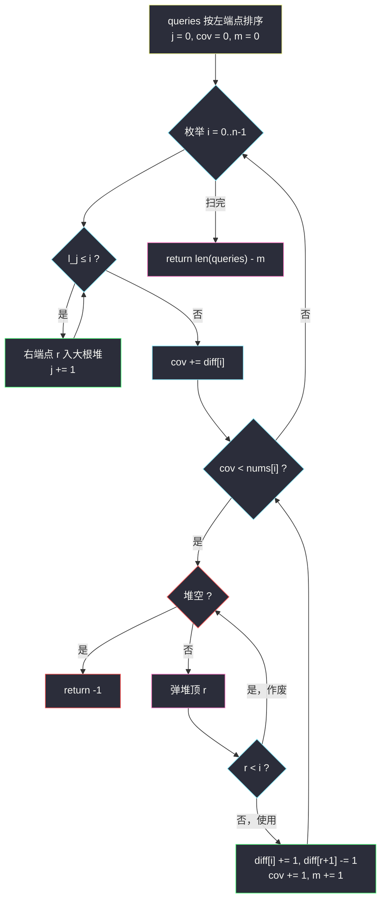

# 零数组变换 III（堆贪心 · 差分标记覆盖）

## 一、问题描述

给你一个长度为 `n` 的整数数组 `nums` 和一个二维数组 `queries`，其中 `queries[i] = [l_i, r_i]`。

每个 `queries[i]` 表示对 `nums` 的以下操作：

- 将 `nums` 中下标在范围 `[l_i, r_i]` 内的**每一个元素最多减少 1**；
- 范围内每个元素实际减少多少是**相互独立**的（每个元素可以选择不减）。

**零数组**指所有元素都等于 `0` 的数组。

请你返回**最多**可以从 `queries` 中删除多少个元素，使得剩下的 `queries` 仍能将 `nums` 变为零数组；如果无论如何都无法将 `nums` 变为零数组，返回 `-1`。

> 🔗 LeetCode 3362：https://leetcode.cn/problems/zero-array-transformation-iii/
>
> 数据范围：`1 <= n <= 10^5`，`0 <= nums[i] <= 10^5`，`1 <= queries.length <= 10^5`，`0 <= l_i <= r_i < n`。

**示例 1**

```
输入：nums = [2,0,2], queries = [[0,2],[0,2],[1,1]]
输出：1
解释：删除 queries[2] = [1,1]。剩下两个 [0,2] 各把 nums[0]、nums[2] 减 1。
```

**示例 2**

```
输入：nums = [1,1,1,1], queries = [[1,3],[0,2],[1,3],[1,2]]
输出：2
解释：删除 queries[2]、queries[3]，保留 [[1,3],[0,2]] 即可。
```

**示例 3**

```
输入：nums = [1,2,3,4], queries = [[0,3]]
输出：-1
解释：一个 query 每个位置至多减 1，nums[3] = 4 无法清零。
```

**直观理解**

"最多删除" = **总个数 − 最少保留**。于是问题转化：**最少用多少个 query，能让每个位置 i 至少被覆盖 `nums[i]` 次**（第 k 次覆盖对应第 k 次减 1）。query 是区间，覆盖可以随时"减半"使用，所以只需计数：位置 `i` 被使用中的区间覆盖的次数 ≥ `nums[i]`。这是灵茶题单 **§1.9 反悔贪心（堆贪心）** 的代表题：**从左到右扫描，缺多少补多少，每次补都从大根堆里取右端点最大的**——它对后续位置的"续航能力"最强，等价于把更短区间留给更挑剔的未来。

---

## 二、暴力解法

### 2.1 枚举 query 子集

从 `q = len(queries)` 个里选子集，检查每个位置的覆盖数是否达标：

```python
class Solution:
    def maxRemoval(self, nums: List[int], queries: List[List[int]]) -> int:
        from itertools import combinations
        n, q = len(nums), len(queries)
        for k in range(q, -1, -1):            # 从多删到少删：优先大子集
            for sub in combinations(queries, k):
                cover = [0] * n
                for l, r in sub:
                    for i in range(l, r + 1):
                        cover[i] += 1
                if all(cover[i] >= nums[i] for i in range(n)):
                    return q - k
        return -1
```

- **时间**：`O(2^q * n)`，`q = 10^5` 时完全不可行。
- **空间**：`O(n)`。

### 🔴 瓶颈在哪里

子集枚举的荒谬之处在于：**哪些 query 该用，其实由"最左边的缺口"逐位决定**。位置 `0` 缺口多大就必须留下多少个覆盖它的 query；这些 query 右端点有长有短，自然是"留长的、删短的"——问题有极强的局部结构，扫描 + 堆即可线性决策。

---

## 三、优化探索（核心章节）

> 📚 本题在灵茶题单中属于 **§1.9 反悔贪心**：从左到右扫描，**大根堆**维护可选 query 的右端点，缺口出现时取"影响最远"的；**差分数组**标记已用区间的覆盖，`O(1)` 结算每个位置的覆盖数。

### 3.1 第一步转化：最多删除 = 最少保留

设最少需要 `m` 个 query 才能覆盖达标，答案即 `len(queries) - m`；若达标不可能则 `-1`。此后只需求 `m`。

### 3.2 贪心框架：缺多少，补多少

从左到右枚举位置 `i`。维护：

- **大根堆**：所有"左端点 ≤ i"且尚未使用的 query 的右端点 `r`（它们都有资格覆盖 `i`）；
- **差分数组 `diff`**：已用 query 的覆盖标记，`cov = diff` 的前缀和即位置 `i` 当前被覆盖的次数。

若 `cov >= nums[i]`：无需动作。否则缺 `nums[i] - cov` 次，**每缺一次就从堆顶取右端点最大的 query 使用**（用差分标记 `[i, r]`），直到补齐；堆中途空了说明再也盖不住，返回 `-1`。

### 3.3 为什么取右端点最大的（交换论证）

设位置 `i` 出现缺口，堆中有 `q1 = [l1, r1]` 与 `q2 = [l2, r2]`（`l1, l2 <= i <= r1, r2`），且 `r1 > r2`。若某个最优解用了 `q2` 而没用 `q1`：把 `q2` 换成 `q1`——

- 位置 `i` 本身：两者都覆盖，覆盖数不变；
- 位置 `p ∈ (r2, r1]`：`q1` 覆盖而 `q2` 不覆盖，**后缀覆盖只增不减**；
- 位置 `p < i`：前缀的需求在扫描经过时早已满足（贪心与最优都合法），替换只影响"从 i 起的后半程"安排。

于是**每次补缺口选 `r` 最大者，后续所有位置的被覆盖能力不弱于任何其他选择，而消耗的 query 个数相同**。按 `i` 归纳：贪心在每个前缀上使用的 query 数 ≤ 最优解，最终 `m` 最小。这与"跳跃游戏 / 区间覆盖"一族贪心同源——**永远把射程最远的资源押在当前缺口上**。

### 3.4 细节一：右端点追不上的 query 作废

堆中的 query 满足 `l <= i`，但 `r` 可能 `< i`（完全落在当前位置左侧的短区间，入堆后一直没被用）。弹出时发现 `r < i`：它对 `i` 及其后任何位置都无用，直接丢弃（`continue`，不计数）。由于堆按 `r` 从大到小弹，一旦弹出的 `r < i`，堆里剩下的全都更短——接下来只会连续作废直到堆空触发 `-1`。

### 3.5 细节二：差分数组结算覆盖

使用 `[l, r]` 时置 `diff[l] += 1, diff[r+1] -= 1`。本题使用时刻的 `l` 就是当前 `i`，所以 `diff[i] += 1, diff[r+1] -= 1`。扫到位置 `i` 时累加 `cov += diff[i]`，`cov` 即"仍在生效中的已用 query 数"——生效区间跨过 `i` 的那些。

### 3.6 流程图



### 3.7 一句话核心

> **缺口在哪补在哪，补就补射程最远的；差分记账，堆里续命。**

---

## 四、代码实现

### Python（主解：排序 + 大根堆 + 差分）

```python
class Solution:
    def maxRemoval(self, nums: List[int], queries: List[List[int]]) -> int:
        n = len(queries)
        queries.sort(key=lambda q: q[0])            # ① 按左端点排序
        heap = []                                   # ② 大根堆（存负右端点）
        diff = [0] * (len(nums) + 1)                # ③ 差分标记已用区间
        cov = m = j = 0                             # 覆盖数 / 已用数 / queries 指针
        for i, need in enumerate(nums):
            while j < n and queries[j][0] <= i:     # 左端点已到：候选入堆
                heapq.heappush(heap, -queries[j][1])
                j += 1
            cov += diff[i]                          # 结算位置 i 的覆盖数
            while cov < need:                       # ④ 缺口：补！
                if not heap:
                    return -1
                r = -heapq.heappop(heap)
                if r < i:                           # 追不上当前位置：作废
                    continue
                diff[i] += 1                        # 使用 [i, r]
                diff[r + 1] -= 1
                cov += 1
                m += 1
        return len(queries) - m
```

**变量含义**

| 变量 | 含义 |
|------|------|
| `heap` | 左端点 ≤ 当前位置、尚未使用的 query 的右端点（大根堆） |
| `diff` / `cov` | 已用区间的差分标记 / 前缀和 = 当前位置被覆盖次数 |
| `m` | 最少保留（已使用）的 query 数 |
| `r < i` | 短区间已完全落在扫描线左侧，作废不计数 |

### Java（最优解同款写法）

```java
class Solution {
    public int maxRemoval(int[] nums, int[][] queries) {
        Arrays.sort(queries, (a, b) -> Integer.compare(a[0], b[0]));
        PriorityQueue<Integer> heap = new PriorityQueue<>((a, b) -> b - a); // 大根堆
        int n = nums.length;
        int[] diff = new int[n + 1];
        int cov = 0, m = 0;
        for (int i = 0, j = 0; i < n; i++) {
            while (j < queries.length && queries[j][0] <= i) {
                heap.offer(queries[j][1]);
                j++;
            }
            cov += diff[i];
            while (cov < nums[i]) {
                if (heap.isEmpty()) return -1;
                int r = heap.poll();
                if (r < i) continue;
                diff[i]++;
                diff[r + 1]--;
                cov++;
                m++;
            }
        }
        return queries.length - m;
    }
}
```

---

## 五、具体例子演示

### 示例 1：nums = [2,0,2], queries = [[0,2],[0,2],[1,1]]

排序后不变（左端点均为 0/1）。逐步跟踪（决策 = 使用哪个区间；状态表给出堆、`cov`、`m`）：

| i | need | 入堆动作 | 堆（右端点） | cov 结算 | 缺口决策 | m | 剩余 queries |
|---|------|----------|--------------|----------|----------|---|--------------|
| 0 | 2 | `[0,2]`、`[0,2]` 的 r=2 入堆 | `{2, 2}` | 0 | 补 2 次：两次弹 r=2，使用 `[0,2]`×2（`diff = [2,0,0,-2]`），cov=2 ✓ | 2 | `{[1,1]}` |
| 1 | 0 | `[1,1]` 的 r=1 入堆 | `{1}` | 2 | 无缺口 | 2 | `{}` |
| 2 | 2 | — | `{1}` | 2 | 无缺口（两次 `[0,2]` 仍生效） | 2 | `{}` |

结束 `m = 2`，答案 `3 - 2 = 1` ✓——被"删除"的正是从未入过决斗场的 `[1,1]`。

### 示例 2：nums = [1,1,1,1], queries 排序后 [[0,2],[1,3],[1,3],[1,2]]

| i | need | 入堆动作 | 堆 | cov | 缺口决策 | m |
|---|------|----------|-----|-----|----------|---|
| 0 | 1 | r=2 入堆 | `{2}` | 0 | 补 1 次：使用 `[0,2]`（`diff = [1,0,0,-1]`），cov=1 ✓ | 1 |
| 1 | 1 | r=3、r=3、r=2 入堆 | `{3,3,2}` | 1 | 无缺口 | 1 |
| 2 | 1 | — | `{3,3,2}` | 1 | 无缺口 | 1 |
| 3 | 1 | — | `{3,3,2}` | 0（`[0,2]` 到站失效） | 补 1 次：弹 r=3，使用 `[1,3]`（`diff[1]+=1, diff[4]-=1`），cov=1 ✓ | 2 |

答案 `4 - 2 = 2` ✓。注意 i=3 处 `[0,2]` 已经"到期"，`cov` 靠差分自动结算掉——这就是差分记账的意义；同时弹的是 r=3 而非 r=2，保住 `[1,2]` 和另一个 `[1,3]` 被删除。

### 示例 3：nums = [1,2,3,4], queries = [[0,3]]

| i | need | 堆 | cov | 决策 | m |
|---|------|-----|-----|------|---|
| 0 | 1 | `{3}` | 0 | 使用 `[0,3]`，cov=1 ✓ | 1 |
| 1 | 2 | `{}` | 1 | 缺 1，**堆空 → return -1** | — |

仅一个 query，每处至多贡献 1 次覆盖，`nums[3] = 4` 无解 ✓。

---

## 六、复杂度分析

| 方法 | 时间 | 空间 |
|------|------|------|
| 子集枚举 | `O(2^q * n)` | `O(n)` |
| **扫描 + 堆 + 差分** | **`O(n + q log q)`** | **`O(n + q)`** |

- **时间**：排序 `O(q log q)`；每个 query 至多入堆、出堆各一次，堆操作合计 `O(q log q)`；每个位置 `O(1)` 结算差分，共 `O(n)`。
- **空间**：堆 `O(q)` + 差分 `O(n)`（不计排序栈）。

---

## 七、对比总结

**方法演进**：枚举子集（指数）→ 扫描 + 大根堆 + 差分（`O(n + q log q)`）。核心是把"选哪些区间"的静态组合问题，改造成"沿扫描线逐位决策"的流式问题——堆负责候选集的动态进出，差分负责覆盖数的 `O(1)` 结算。

**易错点**

1. **忘写"最多删除"的转化**：直接求"最少使用数"再 `len(queries) - m`，别把 `m` 当答案返回。
2. **`r < i` 必须作废跳过**：短区间盖不到当前位置，若仍记 `m += 1` 会把无效 query 算进保留数，答案偏小。
3. **差分下标越界**：`diff[r + 1]` 在 `r = n - 1` 时用到 `diff[n]`，数组要开 `n + 1` 长。
4. **堆的方向**：Python 小根堆要存 `-r` 模拟大根堆；Java 用比较器 `(a, b) -> b - a`。
5. **排序键**：只按左端点排；右端点无序没关系（交给堆裁决）。
6. **无解的判定点在循环内**：堆空且仍有缺口立即 `return -1`，不要扫完再判。

**与同族题的共性**：「从左到右扫描 + 大根堆 + 差分/懒删除」是覆盖类贪心的标准三件套，同款骨架见 #1642（同目录 `furthest-building-you-can-reach.md`）。

---

## 八、举一反三

| 题目 | 关系 |
|------|------|
| [3355. 零数组变换 I](https://leetcode.cn/problems/zero-array-transformation-i/) | 同系列入门版：全部 query 都用上，纯差分判"每个位置覆盖数 ≥ nums[i]" |
| [3356. 零数组变换 II](https://leetcode.cn/problems/zero-array-transformation-ii/) | 同系列进阶版：按值排序后二分/贪心找最少前缀，与本题"最少保留"互为镜像 |
| [1642. 可以到达的最远建筑](https://leetcode.cn/problems/furthest-building-you-can-reach/) | 同款"扫描 + 大根堆"骨架（梯子与砖块的取舍），见同目录 `furthest-building-you-can-reach.md` |
| [1326. 灌溉花园的最少水龙头数目](https://leetcode.cn/problems/minimum-number-of-taps-to-open-to-water-a-garden/) | 区间覆盖的最少选取：同为"缺口在哪补在哪、补射程最远的"交换论证 |

**思想迁移**

- 见到"区间减 1 / 覆盖计数"先想**差分**；见到"最少用多少个资源满足逐点需求"先想**从左到右 + 堆**。
- 交换论证记住方向：两个候选都能满足当前缺口时，**牺牲射程短的、保全射程长的**——后缀支配性是这类贪心正确性的核心。
- 口诀：**"缺口逐位补，堆顶取最远；差分记覆盖，作废不长叹。"**
