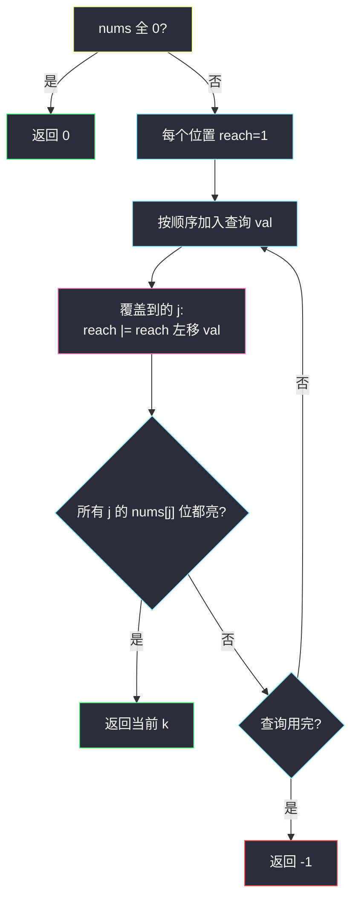

# 3489. 零数组变换 IV（Zero Array Transformation IV）

> 题目来源：[https://leetcode.cn/problems/zero-array-transformation-iv/](https://leetcode.cn/problems/zero-array-transformation-iv/)
>
> 灵茶题单小节定位：§3.3 多重背包（选做）

## 一、问题描述

给你长度为 `n` 的整数数组 `nums` 和二维数组 `queries`，其中 `queries[i] = [l_i, r_i, val_i]`。

第 `i` 次查询在 `nums` 上执行：从下标范围 `[l_i, r_i]` 里选一个**子集**（可空），把选中下标的值各减去**正好** `val_i`。

**零数组**指所有元素都等于 `0`。返回使「前 `k` 次查询按顺序执行后 `nums` 变成零数组」的最小非负 `k`；不存在则返回 `-1`。

**数据范围**：

- `1 <= nums.length <= 10`
- `0 <= nums[i] <= 1000`
- `1 <= queries.length <= 1000`
- `0 <= l_i <= r_i < n`，`1 <= val_i <= 10`

**示例 1**：

```text
输入：nums = [2,0,2], queries = [[0,2,1],[0,2,1],[1,1,3]]
输出：2
解释：查询 0 把下标 0、2 各减 1 → [1,0,1]；查询 1 再各减 1 → [0,0,0]。
```

**示例 2**：

```text
输入：nums = [4,3,2,1], queries = [[1,3,2],[0,2,1]]
输出：-1
解释：做完全部查询也无法把每个位置都减到恰好 0。
```

**示例 3**：

```text
输入：nums = [1,2,3,2,1], queries = [[0,1,1],[1,2,1],[2,3,2],[3,4,1],[4,4,1]]
输出：4
解释：按官方操作依次变为 [0,1,3,2,1] → [0,0,2,2,1] → [0,0,0,0,1] → [0,0,0,0,0]。
```

**示例 4**：

```text
输入：nums = [1,2,3,2,6], queries = [[0,1,1],[0,2,1],[1,4,2],[4,4,4],[3,4,1],[4,4,5]]
输出：4
```

**核心思考点**：一次查询对区间内各下标「减或不减」彼此独立，所以每个下标是独立的凑数问题。位置 `j` 只能用「覆盖 `j` 的那些 `val`」，每种查询至多选一次，凑出**恰好** `nums[j]`。`n ≤ 10` 很小，按查询增量更新可达集合即可。

## 二、暴力解法

### 思路

从小到大试 `k`。对每个位置把前 `k` 条里覆盖它的 `val` 收集出来，枚举子集看能否和为 `nums[j]`。与主解的位移 bitset 完全独立。

### 代码

```python
def minZeroArrayBrute(nums: list[int], queries: list[list[int]]) -> int:
    n, m = len(nums), len(queries)
    if all(x == 0 for x in nums):
        return 0

    def can(k: int) -> bool:
        for j in range(n):
            target = nums[j]
            if target == 0:
                continue
            items = [v for l, r, v in queries[:k] if l <= j <= r]
            ok = False
            c = len(items)
            for mask in range(1 << c):
                s = 0
                for t in range(c):
                    if mask >> t & 1:
                        s += items[t]
                        if s > target:
                            break
                if s == target:
                    ok = True
                    break
            if not ok:
                return False
        return True

    for k in range(1, m + 1):
        if can(k):
            return k
    return -1
```

### 复杂度

- 时间：`O(m · n · 2^{覆盖次数})`。覆盖次数一多立刻爆；对拍把 `m` 缩到 ≤ 8。
- 空间：`O(m)`。

## 三、优化探索

### 3.1 下标独立，目标是恰好凑出 ⭐

查询对区间子集操作，位置 `j` 不在乎别人减了多少。它需要的是：在覆盖自己的查询里选一个子集，和恰好等于 `nums[j]`。减多了不能退，所以是「恰好」而不是「至少」。

已经是 `0` 的位置无需任何查询。若一开始全 0，答案是 `0`。

### 3.2 物品是 0-1，相同 val 可看成多重背包 ⭐⭐

每条查询对每个下标最多用一次 → 标准 **0-1 背包**判定。覆盖 `j` 的若干条若 `val` 相同、出现 `c` 次，合并后就是「体积 `val`、件数 `c`」的**多重背包**——这正是 §3.3 的选做形态。`val ≤ 10`、容量 ≤ 1000，直接 0-1 扫一遍或二进制拆件都过。

判定「前 `k` 条是否够」对 `k` 单调，可以二分 `k`；也可以从左到右一条条加入，增量更新可达集合。后者少一个 `log`，实现更直。

### 3.3 可达集合用整数 bitset 位移 ⭐⭐

位置 `j` 维护整数 `reach`：第 `s` 位为 1 表示和 `s` 可达。初值 `reach = 1`（只达 0）。加入体积 `val`：

```text
reach = (reach | (reach << val)) & ((1 << (nums[j] + 1)) - 1)
```

只保留 `0..nums[j]` 这些位。全部位置的目标位都为 1 时，当前查询条数就是答案。



## 四、代码实现

### 主解：按查询增量更新 bitset

```python
class Solution:
    def minZeroArray(self, nums: list[int], queries: list[list[int]]) -> int:
        n = len(nums)
        if all(x == 0 for x in nums):
            return 0
        reach = [1] * n
        for k, (l, r, val) in enumerate(queries, 1):
            for j in range(l, r + 1):
                cap = nums[j]
                if cap == 0:
                    continue
                mask = (1 << (cap + 1)) - 1
                reach[j] = (reach[j] | (reach[j] << val)) & mask
            if all((reach[j] >> nums[j]) & 1 for j in range(n)):
                return k
        return -1
```

### 对照：二分 k + 0-1 背包

```python
class Solution:
    def minZeroArray(self, nums: list[int], queries: list[list[int]]) -> int:
        n, m = len(nums), len(queries)

        def ok(k: int) -> bool:
            for j, target in enumerate(nums):
                if target == 0:
                    continue
                f = [False] * (target + 1)
                f[0] = True
                for l, r, v in queries[:k]:
                    if l <= j <= r:
                        for s in range(target, v - 1, -1):
                            if f[s - v]:
                                f[s] = True
                if not f[target]:
                    return False
            return True

        if ok(0):
            return 0
        lo, hi, ans = 1, m, -1
        while lo <= hi:
            mid = (lo + hi) // 2
            if ok(mid):
                ans = mid
                hi = mid - 1
            else:
                lo = mid + 1
        return ans
```

### 细节说明

- **必须恰好**：`f[target]` 为假就不能提前宣称成功，哪怕总和已经 ≥ 目标。
- **bitset 要截断**：不 `& mask` 也能过（Python 整数任意长），但会把超过目标的和也留下来，浪费。
- **查询顺序不能重排**：`k` 是前缀长度，不是「任选 k 条」。
- **`n = 10` 才撑得住**按位置维护 bitset；同系列 I/II 的 `n = 10^5` 要用差分，模型不同。

## 五、例子演示

**示例 1：`nums = [2,0,2]`，两条 `val = 1` 都覆盖 `[0,2]`**

| k | 位置 0 的 reach 位 | 位置 2 的 reach 位 | 位置 1 | 全体就绪? |
|---|---|---|---|---|
| 0 | `{0}` | `{0}` | 已是 0 | 否（2 未达） |
| 1 | `{0,1}` | `{0,1}` | 0 | 否 |
| 2 | `{0,1,2}` | `{0,1,2}` | 0 | **是** → 返回 2 |

第三条 `[1,1,3]` 根本没用上。

**示例 2：`[4,3,2,1]` + `[[1,3,2],[0,2,1]]`**

- 位置 0：只被第二条覆盖，物品 `{1}`，凑不出 4。
- 位置 1：物品 `{2,1}`，子集和最大 3，等于 3，单独看可以；但位置 0 已经失败。
- 返回 `-1`。

**示例 3 逐步减**：官方给出的是一种可行选法，背包只关心「存在某子集」，不需要把选法构造出来。前 4 条对每个下标都凑得出，第 3 条结束时位置 4 仍是 1，所以最小 k 是 4。

**对拍**：缩小到 `n ≤ 4`、`nums[i] ≤ 16`、`m ≤ 8`，对每个位置枚举覆盖查询的子集和，与 bitset 主解对照 400 组（含全 0、单点、凑不出）。`k` 的单调性保证「最小前缀」与「逐条加入后第一次全体可达」一致。

## 六、复杂度分析

设 `n` 为数组长，`m` 为查询数，`A = 1000` 为 `nums[i]` 上限：

- **时间复杂度：`O(n · m · A / w)`**——每次位移在 Python 里按大整数位运算，`A` 很小；布尔数组版是 `O(n · m · A)`。
- **空间复杂度：`O(n · A / w)`** 存各位置 bitset。

二分 + 0-1 背包：`O(n · m · A · log m)`，对本范围同样宽松。

## 七、对比总结

| 维度 | 子集枚举 | 二分 + 0-1 背包 | 增量 bitset |
|---|---|---|---|
| 时间 | 指数 | `O(n m A log m)` | `O(n m A / w)` |
| 物品模型 | 显式子集 | 0-1 / 多重 | 同左，位移实现 |
| 单调性 | 线性试 k | 显式二分 | 扫一遍自然得到最小 k |

**套路归纳**：区间查询若对元素「可选可不选、选了就减固定值」，拆成 **n 个独立背包**。件数相同的体积合并即多重背包；判定可达优先 bitset。同系列「每个位置必须减够 `nums[i]` 次、每次最多 1」是差分/贪心，不要和本题的「恰好一次 val」搞混。

## 八、举一反三

1. **[3355. 零数组变换 I](https://leetcode.cn/problems/zero-array-transformation-i/)**：每次区间全体最多减 1，差分判断覆盖次数是否够。
2. **[3356. 零数组变换 II](https://leetcode.cn/problems/zero-array-transformation-ii/)**：在 I 的模型上二分最小前缀 k。
3. **[3362. 零数组变换 III](https://leetcode.cn/problems/zero-array-transformation-iii/)**：同目录 `zero-array-transformation-iii.md`，堆贪心删最多查询。
4. **[416. 分割等和子集](https://leetcode.cn/problems/partition-equal-subset-sum/)**：0-1 背包判定恰好凑出，bitset 写法与本题同一招。
5. **[2915. 和为目标值的最长子序列的长度](https://leetcode.cn/problems/length-of-the-longest-subsequence-that-sums-to-target/)**：同目录 `length-of-the-longest-subsequence-that-sums-to-target.md`，0-1 背包最大化长度。

**同族互引**：零数组四道的差别是「减 1 覆盖」还是「减 val 的子集和」；本题是后者，和 §3.1 / §3.3 背包同一套转移，只是外层多了「最小前缀 k」。
