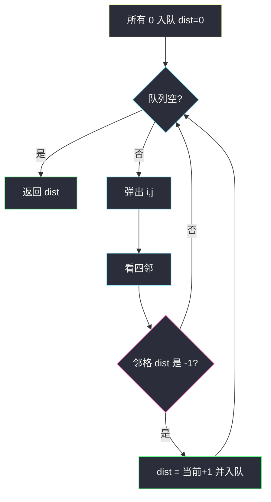
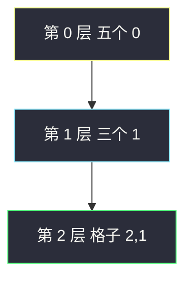

# 01 矩阵（多源 BFS · 到最近 0 的距离）

## 一、问题描述

`m × n` 的 0/1 矩阵 `mat`。对每个格子，求它到**最近的 0** 的曼哈顿距离（四连通，相邻距离为 1）。返回同样大小的距离矩阵。

保证至少有一个 0。

> 🔗 LeetCode 542：https://leetcode.cn/problems/01-matrix/
>
> 数据范围：`1 ≤ m, n ≤ 10^4` 且 `m * n ≤ 10^4`。
>
> 📚 灵茶题单：**二、网格图 BFS**。

**示例 1**

```
输入：mat = [[0,0,0],[0,1,0],[0,0,0]]
输出：[[0,0,0],[0,1,0],[0,0,0]]
唯一的 1 四邻都是 0，距离 1。
```

**示例 2**

```
输入：mat = [[0,0,0],[0,1,0],[1,1,1]]
输出：[[0,0,0],[0,1,0],[1,2,1]]

0 0 0        0 0 0
0 1 0   →    0 1 0
1 1 1        1 2 1
```

**直观理解**

每个 1 要问「最近的 0 有多远」。不要站在每个 1 上单独找 0——那是 `mn` 遍 BFS。把所有 0 看成同一场火的火源，同时向外烧：第一次烧到某个 1，走过的层数就是最近距离。

---

## 二、暴力解法

对每个值为 1 的格子单独 BFS，碰到 0 就停。

```python
from collections import deque

class Solution:
    def updateMatrix(self, mat: List[List[int]]) -> List[List[int]]:
        m, n = len(mat), len(mat[0])
        DIRS = ((0, 1), (0, -1), (1, 0), (-1, 0))
        ans = [[0] * n for _ in range(m)]

        def dist_from(si: int, sj: int) -> int:
            q = deque([(si, sj, 0)])
            seen = {(si, sj)}
            while q:
                i, j, d = q.popleft()
                if mat[i][j] == 0:
                    return d
                for di, dj in DIRS:
                    ni, nj = i + di, j + dj
                    if 0 <= ni < m and 0 <= nj < n and (ni, nj) not in seen:
                        seen.add((ni, nj))
                        q.append((ni, nj, d + 1))
            return 0

        for i in range(m):
            for j in range(n):
                if mat[i][j] == 1:
                    ans[i][j] = dist_from(i, j)
        return ans
```

最坏每个 1 扫全图，时间 `O((mn)²)`。`m * n` 到 10000 会超时。

### 🔴 瓶颈在哪里

「点到最近源点」是经典**多源 BFS**：所有源点（这里是 0）一起入队，距离 0；向外扩展时，**第一次**到达的格子，距离就是最短。图边权全是 1，BFS 层数 = 距离。

---

## 三、优化探索（核心章节）

> 📚 本题在灵茶题单中属于 **二、网格图 BFS**。模板：所有 0 入队；`dist` 初值 `-1` 表示未访问；第一次写入的值就是答案。

### 3.1 初始化

- `dist[i][j] = 0` 且入队，若 `mat[i][j] == 0`。
- 否则 `dist[i][j] = -1`（尚未被任何 0 碰到）。

### 3.2 扩展

弹出 `(i, j)`，看四邻。若邻格 `dist == -1`：

```
dist[ni][nj] = dist[i][j] + 1
入队
```

`-1` 既当「未访问」，又保证每个格子只入队一次。不要用 DFS 求最短路——非层序第一次到达不一定最近。



### 3.3 一句话核心

> **所有 0 同时出发；第一次碰到的 1，距离就是到最近 0 的格子数。**

---

## 四、代码实现

### Python（主解：多源 BFS）

```python
from collections import deque
from typing import List

class Solution:
    def updateMatrix(self, mat: List[List[int]]) -> List[List[int]]:
        m, n = len(mat), len(mat[0])
        DIRS = ((0, 1), (0, -1), (1, 0), (-1, 0))
        dist = [[-1] * n for _ in range(m)]
        q = deque()
        for i in range(m):
            for j in range(n):
                if mat[i][j] == 0:
                    dist[i][j] = 0
                    q.append((i, j))

        while q:
            i, j = q.popleft()
            for di, dj in DIRS:
                ni, nj = i + di, j + dj
                if 0 <= ni < m and 0 <= nj < n and dist[ni][nj] == -1:
                    dist[ni][nj] = dist[i][j] + 1
                    q.append((ni, nj))
        return dist
```

题目保证有 0，队列一开始非空。也可以原地把 1 改成一个大数再 DP 两遍（左上 + 右下），那是另一条路；网格 BFS 题单默写这一版。

**变量含义**

| 写法 | 含义 |
|------|------|
| `dist == 0` 且入队 | 源点，距离锁死 |
| `dist == -1` | 还没被任何 0 碰到 |
| 第一次写成 `d+1` | 到最近 0 的步数 |

### Java（可选）

```java
class Solution {
    private static final int[][] DIRS = {{0, 1}, {0, -1}, {1, 0}, {-1, 0}};

    public int[][] updateMatrix(int[][] mat) {
        int m = mat.length, n = mat[0].length;
        int[][] dist = new int[m][n];
        ArrayDeque<int[]> q = new ArrayDeque<>();
        for (int i = 0; i < m; i++) {
            Arrays.fill(dist[i], -1);
            for (int j = 0; j < n; j++) {
                if (mat[i][j] == 0) {
                    dist[i][j] = 0;
                    q.add(new int[]{i, j});
                }
            }
        }
        while (!q.isEmpty()) {
            int[] cur = q.poll();
            int i = cur[0], j = cur[1];
            for (int[] d : DIRS) {
                int ni = i + d[0], nj = j + d[1];
                if (ni >= 0 && ni < m && nj >= 0 && nj < n && dist[ni][nj] == -1) {
                    dist[ni][nj] = dist[i][j] + 1;
                    q.add(new int[]{ni, nj});
                }
            }
        }
        return dist;
    }
}
```

---

## 五、具体例子演示

示例 2，`DIRS` 右、左、下、上。按行优先把 0 入队。

**初始**（队列里全是源）

```
dist:                 队列:
0  0  0               (0,0) (0,1) (0,2) (1,0) (1,2)
0 -1  0
-1 -1 -1
```

**处理所有 dist=0 的点，新发现 dist=1**

| 弹出 | 新入队 |
|------|--------|
| (0,0) | 四邻都是已访问的 0 |
| (0,1) | **(1,1) ← 1** |
| (0,2) | 无新格 |
| (1,0) | **(2,0) ← 1**（(1,1) 已不是 -1） |
| (1,2) | **(2,2) ← 1** |

```
0 0 0          队列剩余：(1,1) (2,0) (2,2)
0 1 0
1 -1 1
```

**下一层，新发现 dist=2**

弹出 (1,1)：下邻 (2,1) 仍是 -1 → **(2,1) ← 2**。  
弹出 (2,0)、(2,2) 时 (2,1) 已访问。

```
0 0 0
0 1 0
1 2 1
```

之后队列只剩 (2,1)，四邻都有值，结束。



(2,1) 被三个 dist=1 的格子包围，谁先弹出都写入 2，不会出现 3——**先到先定**。

若误用 DFS：从 (2,0) 先往右再往右，可能按 1→2→3 的顺序摸到 (2,2)，把 (2,2) 写成 2 甚至更大，但 (2,2) 头顶就是 0，正确答案是 1。边权全 1 时只有队列层序能保证「第一次到达 = 最短」。

和 [1162. 地图分析](https://leetcode.cn/problems/as-far-from-land-as-possible/) 对照：542 从所有 **0** 出发，格子上写的是到 0 的最近距离；1162 从所有 **1（陆地）** 出发，最后在还是水的格子上取距离的 **max**（没有陆地则 -1）。队列写法几乎同一套，只换源点和最后聚合。

---

## 六、复杂度分析

| 方法 | 时间 | 空间 | 说明 |
|------|------|------|------|
| 每个 1 单独 BFS | `O((mn)²)` | `O(mn)` | `mn ≤ 10^4` 会 TLE |
| 多源 BFS（主解） | `O(mn)` | `O(mn)` 队列 + dist | 每格入队一次 |

---

## 七、对比总结

| 维度 | 单源多次 | 多源一次 |
|------|----------|----------|
| 起点 | 每个 1 | 所有 0 |
| 停 | 碰到 0 | 图走完 |
| 第一次到达 | 对该 1 最短 | 对全图都最短 |

**易错点**

1. **对每个 1 做 BFS**：复杂度平方，是本题最常见的 TLE。
2. **用 DFS 填距离**：非最短；同一格可能先被远路碰到。
3. **0 也去 BFS 更新**：源点距离必须锁成 0，不要再被邻格改成 1。
4. **`visited` 和 `dist` 两套**：`dist == -1` 已经够用。

---

## 八、举一反三

| 题目 | 关系 |
|------|------|
| [1162. 地图分析](https://leetcode.cn/problems/as-far-from-land-as-possible/) | 多源 BFS 从所有陆地出发，取水到陆地的**最大**距离 |
| [994. 腐烂的橘子](https://leetcode.cn/problems/rotting-oranges/) | 所有烂橙当源，层数 = 分钟 |
| [1765. 地图中的最高点](https://leetcode.cn/problems/map-of-highest-peak/) | 所有水域当源，高度 = 距离 |
| [286. 墙与门](https://leetcode.cn/problems/walls-and-gates/) | 所有门当源（会员题，思路同 542） |
| [695. 岛屿的最大面积](https://leetcode.cn/problems/max-area-of-island/) | 连通块 DFS，见 `max-area-of-island.md` |

**思想迁移**

- 「每个点到最近的某类格子」→ 那些格子全部入队，一次 BFS。
- 口诀：**「所有 0 入队；-1 表示没到过；第一次写入就是最短。」**
