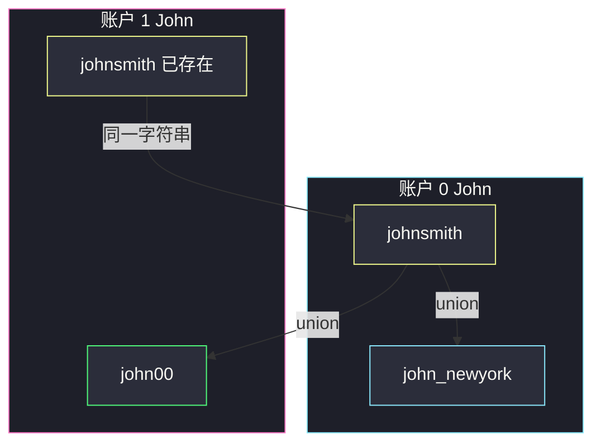
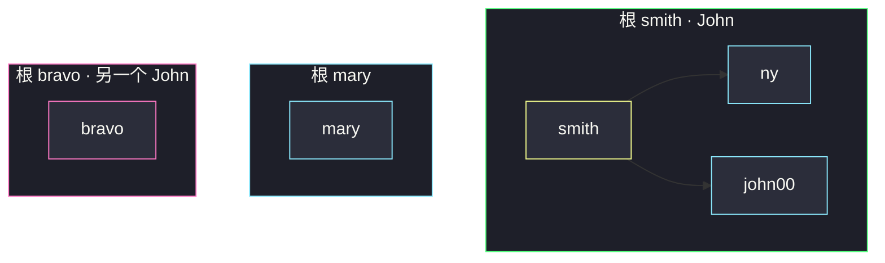

# 账户合并（并查集连通邮箱）

## 一、问题描述

给定一个账户列表 `accounts`，每个元素 `accounts[i]` 是一个字符串列表：第一个元素是姓名，其余是该账户的邮箱。两个账户若有**至少一个共同邮箱**，则属于同一个人，应合并：姓名取该人姓名（同一连通块里姓名相同），邮箱去重后按字典序排序。

**同名不一定是同一人**——必须靠邮箱连通。一个人也可以有多个互不重叠的账户，那些账户保持分开。

返回合并后的账户。顺序任意。

> 🔗 LeetCode 721：https://leetcode.cn/problems/accounts-merge/
>
> 数据范围：`1 <= accounts.length <= 1000`，`2 <= accounts[i].length <= 10`，邮箱、姓名长度 ≤ 30。

**示例 1**

```
输入：accounts = [
  ["John","johnsmith@mail.com","john_newyork@mail.com"],
  ["John","johnsmith@mail.com","john00@mail.com"],
  ["Mary","mary@mail.com"],
  ["John","johnnybravo@mail.com"]
]
输出：[
  ["John","john00@mail.com","john_newyork@mail.com","johnsmith@mail.com"],
  ["Mary","mary@mail.com"],
  ["John","johnnybravo@mail.com"]
]
解释：账户 0 和 1 共享 johnsmith@mail.com，合并成一人；另外两个 John 没有共同邮箱，不是同一人。
```

**直观理解**

邮箱是身份的边：同一账户内的邮箱两两相连；不同账户一旦共享一个邮箱，两边整团邮箱就属于同一人。这是图的连通分量，用并查集最直接。

---

## 二、暴力解法

把每个账户当成点，两账户邮箱有交则连边，再 DFS 找连通块。账户最多 1000，平方扫描勉强能过，但要比集合交集，也没体现「邮箱才是节点」。

```python
class Solution:
    def accountsMerge(self, accounts: List[List[str]]) -> List[List[str]]:
        n = len(accounts)
        sets = [set(acc[1:]) for acc in accounts]
        g = [[] for _ in range(n)]
        for i in range(n):
            for j in range(i + 1, n):
                if sets[i] & sets[j]:
                    g[i].append(j); g[j].append(i)
        vis, ans = [False] * n, []
        for i in range(n):
            if vis[i]:
                continue
            emails, st = set(), [i]
            vis[i] = True
            while st:
                u = st.pop()
                emails |= sets[u]
                for v in g[u]:
                    if not vis[v]:
                        vis[v] = True
                        st.append(v)
            ans.append([accounts[i][0]] + sorted(emails))
        return ans
```

### 复杂度

- **时间**：`O(n² · E)` 量级比邮箱集合，`E` 为单账户邮箱数。
- **空间**：`O(n · E)`。

### 🔴 瓶颈在哪里

真正该连边的是**邮箱**。同一账户里把邮箱 union 一次即可，不必账户两两比。并查集按邮箱（或「邮箱 → 账户下标」）做，线性扫完所有 `(账户, 邮箱)` 对。

---

## 三、优化探索（核心章节）

> 📚 本题在灵茶题单中属于 **并查集 · §7.1 基础**。节点是邮箱；同一列表内相邻（或全部挂到第一个邮箱上）做 union；再按根把邮箱收进同一人。

### 3.1 节点选谁

两种等价建模：

1. **邮箱为节点**：`parent[email] = email`，同一账户内 `union(emails[0], emails[k])`。
2. **账户下标为节点**：每个邮箱记住「第一次出现的账户」，再 `union` 这两个下标。

主解用邮箱节点，合并过程更好画：看见一条边就是两个字符串挂到同一个根。

姓名不参与 union。每个邮箱第一次出现时记下所属姓名；连通后从根对应任意邮箱取回姓名即可（同一人姓名相同）。

### 3.2 find / union

路径压缩的 `find`：沿父指针走到根，路上全部直接挂到根。`union`：两边根不同则令 `parent[ra] = rb`。本题规模很小，按秩合并可写可不写。



### 3.3 收集答案

扫一遍所有出现过的邮箱，`root = find(email)`，把邮箱丢进 `groups[root]`。每个组：`[name] + sorted(emails)`。

### 3.4 一句话核心

> **邮箱当点，同一账户内 union；共享邮箱会自动把两团人并成一个根；按根收集、排序、贴上姓名。**

---

## 四、代码实现

### Python（主解：邮箱并查集）

```python
class Solution:
    def accountsMerge(self, accounts: List[List[str]]) -> List[List[str]]:
        parent = {}
        email_name = {}

        def find(x: str) -> str:
            if parent[x] != x:
                parent[x] = find(parent[x])
            return parent[x]

        def union(a: str, b: str) -> None:
            ra, rb = find(a), find(b)
            if ra != rb:
                parent[ra] = rb

        for acc in accounts:
            name = acc[0]
            first = acc[1]
            for email in acc[1:]:
                if email not in parent:
                    parent[email] = email
                    email_name[email] = name
                union(first, email)

        groups = {}
        for email in parent:
            root = find(email)
            groups.setdefault(root, []).append(email)

        ans = []
        for root, emails in groups.items():
            ans.append([email_name[root]] + sorted(emails))
        return ans
```

`parent` / `email_name` 只在第一次见到某邮箱时写入；`first` 是当前账户的首个邮箱，其余都 `union` 上去。收集时必须 `find(email)` 取根，不能读未压缩的 `parent[email]`。

### Java（最优解同款）

```java
class Solution {
    private Map<String, String> parent = new HashMap<>();

    public List<List<String>> accountsMerge(List<List<String>> accounts) {
        Map<String, String> emailName = new HashMap<>();
        for (List<String> acc : accounts) {
            String name = acc.get(0), first = acc.get(1);
            for (int i = 1; i < acc.size(); i++) {
                String email = acc.get(i);
                parent.putIfAbsent(email, email);
                emailName.putIfAbsent(email, name);
                union(first, email);
            }
        }
        Map<String, List<String>> groups = new HashMap<>();
        for (String email : parent.keySet()) {
            groups.computeIfAbsent(find(email), k -> new ArrayList<>()).add(email);
        }
        List<List<String>> ans = new ArrayList<>();
        for (Map.Entry<String, List<String>> e : groups.entrySet()) {
            List<String> row = e.getValue();
            Collections.sort(row);
            row.add(0, emailName.get(e.getKey()));
            ans.add(row);
        }
        return ans;
    }

    private String find(String x) {
        if (!parent.get(x).equals(x))
            parent.put(x, find(parent.get(x)));
        return parent.get(x);
    }

    private void union(String a, String b) {
        String ra = find(a), rb = find(b);
        if (!ra.equals(rb)) parent.put(ra, rb);
    }
}
```

---

## 五、具体例子演示

以示例 1 四个账户，邮箱简写为 `smith`、`ny`、`john00`、`mary`、`bravo`。

**初始**：每个邮箱父指针指向自己。

**账户 0** `union(smith, ny)`：

```
ny 的根 ← smith 的根    ⇒    ny → smith
```

**账户 1** 里 `smith` 已存在，`union(smith, john00)`：

```
john00 → smith     （smith 已是 ny 的根，三人一团）
```

**账户 2** `mary` 单独成根。**账户 3** `bravo` 单独成根。

| 邮箱 | find 后的根 | 姓名 |
|------|-------------|------|
| smith | smith | John |
| ny | smith | John |
| john00 | smith | John |
| mary | mary | Mary |
| bravo | bravo | John |

收集：`smith` 组按字典序排出三个邮箱，另两组各一个。同名 John 只有共享邮箱的那两个合并。



若账户 3 也带上 `smith`，`bravo` 会并进同一根，三个 John 变成一份名单。

---

## 六、复杂度分析

| 方法 | 时间 | 空间 | 说明 |
|------|------|------|------|
| 账户两两求交 + DFS | `O(n² · E)` | `O(nE)` | n 个账户 |
| 邮箱并查集（主解） | `O(E · α + E log E)` | `O(E)` | α 为反阿克曼；log 来自排序 |

`E` 为邮箱出现次数总和（含重复）。路径压缩后几乎线性；每组邮箱排序占主导。

---

## 七、对比总结

| 维度 | 账户当点 | 邮箱当点 |
|------|----------|----------|
| 边的含义 | 两账户有交集 | 同一账户内的邮箱 |
| 同名不同人 | 靠「无交」自然分开 | 靠「无 union 路径」分开 |
| 实现 | 先建图再 DFS | find / union 一次扫完 |

**易错点**

1. **按姓名合并**：同名可能是路人。姓名只在输出时贴到连通块上。
2. **忘记初始化 `parent[email]=email`**：第一次见到才建节点。
3. **收集时用 `parent[email]` 当根**：必须 `find(email)`，路径压缩前父指针不一定是根。
4. **邮箱不排序**：题面要求字典序。
5. **union 写反把姓名当节点**：姓名会把不同人错误连在一起。

**模板（§7.1 字符串并查集）**

```python
def find(x):
    if parent[x] != x:
        parent[x] = find(parent[x])
    return parent[x]

def union(a, b):
    ra, rb = find(a), find(b)
    if ra != rb:
        parent[ra] = rb
```

---

## 八、举一反三

| 题目 | 关系 |
|------|------|
| [547. 省份数量](https://leetcode.cn/problems/number-of-provinces/) | §7.1 矩阵连通，find/union 骨架相同 |
| [990. 等式方程的可满足性](https://leetcode.cn/problems/satisfiability-of-equality-equations/) | 先把 `==` union，再检查 `!=` 是否同根 |
| [684. 冗余连接](https://leetcode.cn/problems/redundant-connection/) | 加边前若已同根则为多余边 |
| [1202. 交换字符串中的元素](https://leetcode.cn/problems/smallest-string-with-swaps/) | 下标并查集，连通块内字符可重排 |

**思想迁移**

- 「有共同钥匙就属同一把锁」类问题：把钥匙/邮箱当节点 union，人只是标签。
- 口诀：**「同账户邮箱先握手，共享邮箱把两团人拉进同一个根。」**
