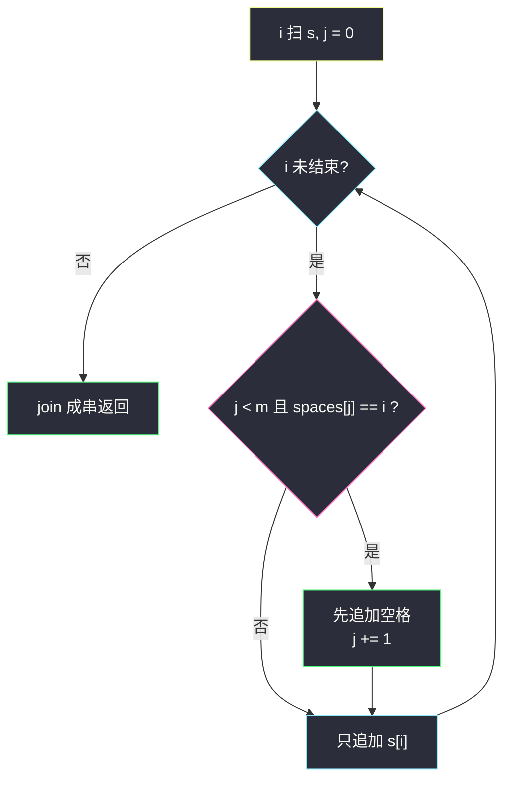

# 向字符串添加空格（双指针 · 两序列同步前进）

## 一、问题描述

给定字符串 `s` 和下标数组 `spaces`（**严格升序、互异**）。请在 `s` 的这些下标**前面**插入一个空格，返回新字符串。原下标以**未插入前**的 `s` 为准。

> 🔗 LeetCode 2109：https://leetcode.cn/problems/adding-spaces-to-a-string/
>
> 数据范围：`1 <= s.length, spaces.length <= 3 * 10^5`，`0 <= spaces[i] <= s.length - 1`，`spaces` 严格递增且无重复；`s` 只含大小写英文字母。

**示例 1**

```
输入：s = "LeetcodeHelpsMeLearn", spaces = [8,13,15]
输出："Leetcode Helps Me Learn"
解释：在下标 8、13、15 前各插一个空格。
```

**示例 2**

```
输入：s = "icodeinpython", spaces = [1,5,7,9]
输出："i code in py thon"
```

**示例 3**

```
输入：s = "spacing", spaces = [0,1,2,3,4,5,6]
输出：" s p a c i n g"
解释：每个字符前都插空格，开头也会有空格。
```

**直观理解**

`s` 和 `spaces` 都是从左到右的有序序列：一边扫字符下标 `i`，一边扫「下一个该插空格的位置」`spaces[j]`。当 `i` 撞上 `spaces[j]`，先输出空格再输出字符，并让 `j` 前进。这是灵神 **§4.1 双指针** 的两序列匹配：谁该动谁动，每个元素只看一次。

---

## 二、暴力解法

对 `s` 的每个下标 `i`，都去 `spaces` 里线性查找「有没有 `i`」。每次查找 `O(m)`，总时间 `O(n * m)`。`n, m` 到 `3 * 10^5`，大约 `10^11` 次运算，必超时。

```python
class Solution:
    def addSpaces(self, s: str, spaces: List[int]) -> str:
        ans = []
        for i, ch in enumerate(s):
            for p in spaces:              # 每次从头扫 spaces
                if p == i:
                    ans.append(' ')
                    break
            ans.append(ch)
        return ''.join(ans)
```

另一种「看起来聪明」的暴力：把 `s` 转成列表，从左往右 `insert(p, ' ')`。每插一次后面元素都后移，下标还要补偿，总时间仍是 `O((n+m) * m)`，同样过不了。

### 复杂度

- **时间**：`O(n * m)`。
- **空间**：`O(n + m)` 构造答案（不可避免）。

### 🔴 瓶颈在哪里

`spaces` 已排序，对 `i = 0, 1, 2, …` 的查询本身也是单调的：一旦 `spaces[j]` 被用过，后面的 `i` 只可能匹配 `spaces[j], spaces[j+1], …`。不必每次从 `spaces[0]` 重找——`j` 只会前进。这正是 §4.1「两个序列各自前进」。

---

## 三、优化探索（核心章节）

> 📚 本题在灵茶题单中属于 **§4.1 双指针**（滑窗① A 路）：两个有序序列同步扫描。指针 `i` 走 `s` 的下标，指针 `j` 走 `spaces`；`i` 追上 `spaces[j]` 时先插入空格并让 `j += 1`，然后照常输出 `s[i]`。

### 3.1 观察特征

| 特征 | 说明 |
|------|------|
| `spaces` 严格递增 | `j` 单调，不会回头 |
| 插入位置按原下标 | 边建新串边插，不受已插入空格影响 |
| 每个位置最多一个空格 | `spaces` 无重复，`j` 每次最多匹配一次 |
| 不会插在串尾之后 | `spaces[i] <= n-1`，空格只出现在某个原字符前面 |

### 3.2 双指针匹配

维护：

- `i`：正在输出的原串下标（`for` 扫 `s` 即可）；
- `j`：`spaces` 中「下一个待消耗的插入点」。

对每个 `i`：

1. 若 `j < m` 且 `spaces[j] == i`：先追加 `' '`，`j += 1`；
2. 再追加 `s[i]`。

因为 `spaces` 升序且 `i` 也升序，相等关系只会发生在「当前 `j`」这一处，不会漏、不会跳。



### 3.3 正确性

对任意插入点 `p = spaces[j]`，当 `i` 从 0 增到 `p` 时 `j` 还没被更大的下标消耗（更小的插入点已经在更早的 `i` 用掉），因此恰好在输出 `s[p]` 之前插入空格。所有非插入下标走「只追加字符」分支。`j` 最终等于 `m`，每个空格用一次。

用哈希集合存 `spaces` 也能 `O(n)` 判断，但多了 `O(m)` 哈希空间与常数；双指针直接吃有序性，更贴 §4.1。

### 3.4 另一种观察：归并视角

把 `spaces` 看成第二条「事件流」，关键字就是原串下标。这和归并两个有序数组同构：

- 流 A：字符事件 `(i, s[i])`，`i = 0..n-1`；
- 流 B：空格事件 `(spaces[j], ' ')`，`j = 0..m-1`。

按关键字升序输出。关键字相等时**空格在前**（题意是「下标前插入」）。主解没有真的把字符流物化成数组，而是用 `for i` 隐式生成 A，用 `j` 消费 B——相等才取 B，然后无论如何都取 A。

### 3.5 一句话核心

> **`i` 走字符、`j` 走插入点，撞上就先空格后字符，两个指针都只向前。**

---

## 四、代码实现

### Python（主解：双指针）

```python
class Solution:
    def addSpaces(self, s: str, spaces: List[int]) -> str:
        ans = []
        j, m = 0, len(spaces)
        for i, ch in enumerate(s):
            if j < m and spaces[j] == i:       # 当前下标需要空格
                ans.append(' ')
                j += 1
            ans.append(ch)
        return ''.join(ans)
```

字符串在 Python 里不可变，逐次 `+` 是 `O(n²)`；用列表收集再 `join` 才是线性。

**变量含义**

| 变量 | 含义 |
|------|------|
| `i` | 读指针，原串下标 |
| `j` | `spaces` 上的读指针，下一个插入点 |
| `ans` | 新串的字符缓冲 |

**循环不变式**：进入下标 `i` 时，`spaces[0..j)` 的空格都已写在对应原字符前面；本轮若 `spaces[j] == i` 则先补空格。`j` 与 `i` 都单调不减。

### Java（最优解）

```java
class Solution {
    public String addSpaces(String s, int[] spaces) {
        StringBuilder ans = new StringBuilder(s.length() + spaces.length);
        int j = 0, m = spaces.length;
        for (int i = 0; i < s.length(); i++) {
            if (j < m && spaces[j] == i) {
                ans.append(' ');
                j++;
            }
            ans.append(s.charAt(i));
        }
        return ans.toString();
    }
}
```

`StringBuilder` 预分配 `n + m`，避免扩容；不要用 `String` 的 `+`。

答案长度恒为 `n + m`：每个原字符保留一次，每个插入点贡献一个空格，没有删除、也没有重复插入。

---

## 五、具体例子演示

以示例 1 `s = "LeetcodeHelpsMeLearn"`、`spaces = [8,13,15]` 逐步跟踪。`m = 3`，`j` 从 0 起。

原串下标：

```
L e e t c o d e H e l p s M e L e a r n
0 1 2 3 4 5 6 7 8 9 …          13  15
```

| i | s[i] | j | spaces[j] | 是否插空格 | 本轮追加 | 缓冲末尾 |
|---|------|---|-----------|------------|----------|----------|
| 0–7 | L…e | 0 | 8 | 否 | 各字符 | `Leetcode` |
| 8 | H | 0 | 8 | **是**，j→1 | `' '` + H | `Leetcode H` |
| 9–12 | e…s | 1 | 13 | 否 | 各字符 | `Leetcode Helps` |
| 13 | M | 1 | 13 | **是**，j→2 | `' '` + M | `Leetcode Helps M` |
| 14 | e | 2 | 15 | 否 | e | `Leetcode Helps Me` |
| 15 | L | 2 | 15 | **是**，j→3 | `' '` + L | `Leetcode Helps Me L` |
| 16–19 | e…n | 3 | （越界） | 否 | 各字符 | `Leetcode Helps Me Learn` |

`j == 3 == m`，空格全部用完，返回 `"Leetcode Helps Me Learn"` ✓。

**示例 3** `"spacing"`、`spaces = [0,1,2,3,4,5,6]`：每个 `i` 都命中，先空格后字符，得到 `" s p a c i n g"`。注意 `spaces[0] = 0` 会在**串首**产生空格。

**示例 2** `s = "icodeinpython"`、`spaces = [1,5,7,9]` 全表：

| i | s[i] | j | spaces[j] | 两指针动作 | 追加 |
|---|------|---|-----------|------------|------|
| 0 | i | 0 | 1 | i 小，只出字符 | `i` |
| 1 | c | 0 | 1 | 相等，j→1 | `' '` + c |
| 2–4 | o,d,e | 1 | 5 | i 小 | 各字符 |
| 5 | i | 1 | 5 | 相等，j→2 | `' '` + i |
| 6 | n | 2 | 7 | i 小 | n |
| 7 | p | 2 | 7 | 相等，j→3 | `' '` + p |
| 8 | y | 3 | 9 | i 小 | y |
| 9 | t | 3 | 9 | 相等，j→4 | `' '` + t |
| 10–12 | h,o,n | 4 | （完） | 只出字符 | hon |

拼起来 `"i code in py thon"` ✓。每一行都能看出：**谁小谁动；相等则 `j` 先动（出空格），再输出当前字符。**


---

## 六、复杂度分析

| 方法 | 时间 | 空间 | 说明 |
|------|------|------|------|
| 每下标线性搜 spaces | `O(n * m)` | `O(n + m)` | `3*10^5` 超时 |
| 列表中途 insert | `O(n * m)` | `O(n + m)` | 每次插入搬移后缀 |
| 双指针（主解） | `O(n + m)` | `O(n + m)` | `i` 走 `n` 步、`j` 走 `m` 步；空间用于答案串 |

---

## 七、对比总结

| 维度 | 本题插空格 | #88 合并有序数组 | #1768 交替合并 |
|------|------------|------------------|----------------|
| 两序列 | `s` 的下标 vs `spaces` | 两个有序数组 | 两个字符串 |
| 谁先动 | `i` 撞上 `spaces[j]` 时 `j` 动一下 | 谁小谁写入 | 严格轮流 |
| 输出 | 新串（原字符 + 空格） | 合并进 `nums1` | 交错字符 |

**易错点**

1. **用插入后的下标去对 `spaces`**：`spaces` 是原串下标。边扫边建新串时，比较的必须是原 `i`，不是 `len(ans)`。
2. Python 里 `ans += ' '` 反复拼接新字符串，最坏 `O(n²)`。必须 `list` + `join`，或等效的一次性分配。
3. 漏掉 `j < m`：`spaces` 用完后还访问 `spaces[j]` 会越界。
4. `spaces[0] = 0` 时结果以空格开头，这是题意，不要特判删掉。
5. 从右往左插可以避免下标偏移，但每次 `insert` 仍慢；双指针从左建新串更干净。

**模板（有序下标插入）**

```python
j, m = 0, len(spaces)
for i, ch in enumerate(s):
    if j < m and spaces[j] == i:
        ans.append(' ')
        j += 1
    ans.append(ch)
```

---

## 八、举一反三

| 题目 | 关系 |
|------|------|
| [88. 合并两个有序数组](https://leetcode.cn/problems/merge-sorted-array/) | §4.1 原型：两个有序序列，谁小谁写入 |
| [1768. 交替合并字符串](https://leetcode.cn/problems/merge-strings-alternately/) | 两指针严格轮流取字符 |
| [986. 区间列表的交集](https://leetcode.cn/problems/interval-list-intersections/) | 两个有序区间列表，谁的右端小谁前进 |
| [977. 有序数组的平方](https://leetcode.cn/problems/squares-of-a-sorted-array/) | 有序数组两端双指针，谁平方大谁写入 |
| [165. 比较版本号](https://leetcode.cn/problems/compare-version-numbers/) | 两个序列按 `.` 分段，双指针对齐修订号 |
| [2810. 故障键盘](https://leetcode.cn/problems/faulty-keyboard/) | 扫串构造新串，遇到特殊字符改写入方向 |

**思想迁移**

- 两个已经按同一关键字排好序的序列要「对齐事件」（插入、合并、求交），就各放一个指针，按题意让**当前更小（或刚好相等）的那边动**。
- 口诀：**「一指针走字符，一指针走空位；下标撞上先空格，两个指针不回头。」**
