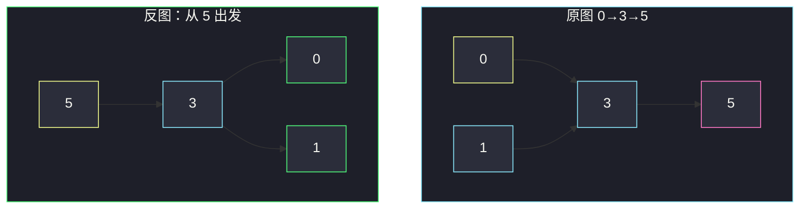
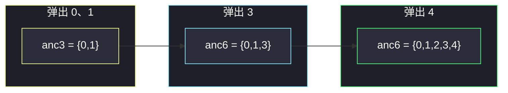

# 有向无环图中一个节点的所有祖先（反图 DFS / 拓扑合并）

## 一、问题描述

`n` 个点编号 `0 .. n-1`，边 `edges[i] = [from, to]` 表示有向边 `from → to`。图保证是 **DAG**。节点 `u` 是 `v` 的祖先，当且仅当存在一条从 `u` 走到 `v` 的有向路径。对每个点返回其全部祖先，**升序**。

> 🔗 LeetCode 2192：https://leetcode.cn/problems/all-ancestors-of-a-node-in-a-directed-acyclic-graph/
>
> 数据范围：`n ≤ 1000`，边数 `≤ min(2000, n(n-1)/2)`，无重边、无自环、有向无环。
>
> 📚 灵茶题单：**图论 · §1.1 DFS**（1788 分）。

**示例 1**

```
输入：n = 8
edges = [[0,3],[0,4],[1,3],[2,4],[2,7],[3,5],[3,6],[3,7],[4,6]]
输出：[[],[],[],[0,1],[0,2],[0,1,3],[0,1,2,3,4],[0,1,2,3]]
0、1、2 入度为 0，没有祖先。
3 可由 0、1 到达；6 可由 0、1、2、3、4 到达。
```

**示例 2**

```
输入：n = 5
edges = [[0,1],[0,2],[0,3],[0,4],[1,2],[1,3],[1,4],[2,3],[2,4],[3,4]]
输出：[[],[0],[0,1],[0,1,2],[0,1,2,3]]
一条链上叠了很多前缀边：点 i 的祖先恰好是 0 .. i-1。
```

**直观理解**

「谁能走到我」= 把所有边反过来，变成「我能走到谁」。原图上 `u → … → v`，反图上 `v → … → u`。于是：**从 `v` 在反图上能走到的点，就是 `v` 的祖先。**

---

## 二、暴力解法

对每个点 `v`，在原图上从所有 `u ≠ v` 各做一次 DFS/BFS，看能不能到达 `v`。一共 `n²` 次遍历。

```python
# 伪代码：对每个 v，枚举每个 u，在原图 DFS(u) 是否碰到 v
# n=1000 时约 1e6 次全图扫描，最坏 O(n² (n+m))，会 TLE
```

### 复杂度

- **时间**：`O(n² (n+m))`。
- **空间**：邻接表 `O(n+m)`。

### 🔴 瓶颈在哪里

每次只问「一个 u 能不能到 v」，大量重复走同一条路径。把边反过来，一次 DFS 就能收集 v 的全部祖先。

---

## 三、优化探索（核心章节）

> 📚 本题在灵茶题单中属于 **§1.1 DFS**。DAG 上求祖先：建反图，从每个点出发 DFS；或按拓扑序把祖先集合向后合并。主解选反图 DFS，更直观。

### 3.1 反图 DFS

边 `from → to` 加到 `rev[to].append(from)`。对每个起点 `i`：

1. 准备本轮 `vis`（DAG 也可能有菱形汇合，必须去重）。
2. 从 `i` 沿 `rev` DFS/BFS。
3. 除 `i` 自己外，访问到的点全部写入 `ans[i]`。
4. 最后 `sort`。

`n ≤ 1000`、`m ≤ 2000`，`O(n(n+m))` 约 3e6，稳过。



从 5 沿反图走到 3、0、1，祖先就是 `{0,1,3}`。

### 3.2 拓扑 + 集合合并

若 `u → v`，则 `v` 的祖先 = `{u}` ∪ `u` 的祖先 ∪ 其它入边带来的祖先。按拓扑序处理：入度清零后再把当前集合并给后继，菱形汇合时用 `set` 去重。

正确性：DAG 有拓扑序；处理 `v` 时所有能到达 `v` 的点都已处理完，集合是最终答案。

### 3.3 一句话核心

> **祖先 = 反图可达点；每个起点单独 vis 去重，最后排序。**

---

## 四、代码实现

### Python（主解：反图 DFS）

```python
class Solution:
    def getAncestors(self, n: int, edges: list[list[int]]) -> list[list[int]]:
        rev = [[] for _ in range(n)]
        for frm, to in edges:
            rev[to].append(frm)

        ans = [[] for _ in range(n)]

        def dfs(u: int, start: int, vis: list[bool]) -> None:
            vis[u] = True
            if u != start:
                ans[start].append(u)
            for v in rev[u]:
                if not vis[v]:
                    dfs(v, start, vis)

        for i in range(n):
            vis = [False] * n
            dfs(i, i, vis)
            ans[i].sort()
        return ans
```

**变量含义**

| 变量 | 含义 |
|------|------|
| `rev` | 反图邻接表：`to → from` |
| `vis` | 本轮从 `i` 出发已访问，挡住菱形重复 |
| `ans[i]` | 点 `i` 的祖先（后排序） |

`u != start` 避免把起点算进自己的祖先。

### Python（拓扑集合合并，可选）

```python
from collections import deque

class Solution:
    def getAncestors(self, n: int, edges: list[list[int]]) -> list[list[int]]:
        g = [[] for _ in range(n)]
        indeg = [0] * n
        anc = [set() for _ in range(n)]
        for frm, to in edges:
            g[frm].append(to)
            indeg[to] += 1
            anc[to].add(frm)

        q = deque(i for i in range(n) if indeg[i] == 0)
        while q:
            u = q.popleft()
            for v in g[u]:
                anc[v] |= anc[u]
                indeg[v] -= 1
                if indeg[v] == 0:
                    q.append(v)
        return [sorted(s) for s in anc]
```

边 `u → v` 先把 `u` 放进 `anc[v]`，拓扑展开时再并上 `anc[u]`。

### Java（可选）

```java
class Solution {
    public List<List<Integer>> getAncestors(int n, int[][] edges) {
        List<Integer>[] rev = new ArrayList[n];
        for (int i = 0; i < n; i++) rev[i] = new ArrayList<>();
        for (int[] e : edges) rev[e[1]].add(e[0]);
        List<List<Integer>> ans = new ArrayList<>();
        for (int i = 0; i < n; i++) {
            boolean[] vis = new boolean[n];
            List<Integer> cur = new ArrayList<>();
            dfs(i, i, rev, vis, cur);
            Collections.sort(cur);
            ans.add(cur);
        }
        return ans;
    }
    void dfs(int u, int start, List<Integer>[] rev, boolean[] vis, List<Integer> cur) {
        vis[u] = true;
        if (u != start) cur.add(u);
        for (int v : rev[u]) if (!vis[v]) dfs(v, start, rev, vis, cur);
    }
}
```

---

## 五、具体例子演示

示例 1 缩一角：边 `0→3`、`1→3`、`3→5`、`0→4`、`4→6`、`3→6`。

### 反图 DFS（点 6）

反图邻居：`6 → 3, 4`；`3 → 0, 1`；`4 → 0`。

| 步骤 | 当前 | 新访问 | 累计祖先 |
|------|------|--------|----------|
| 1 | 6 | — | {} |
| 2 | 3 | 3 | {3} |
| 3 | 0 | 0 | {0,3} |
| 4 | 1 | 1 | {0,1,3} |
| 5 | 4 | 4 | {0,1,3,4} |
| 6 | 0 | 已 vis | 跳过 |

再补原图里 `2→4`，从 4 还能走到 2，祖先变成 `{0,1,2,3,4}`。菱形 `0` 只记一次。

### 拓扑集合合并（同图）

入度为 0：`0,1,2`。按序弹出并合并：

| 弹出 | 边 | 后继祖先集合 |
|------|----|----------------|
| 0 | 0→3, 0→4 | `anc[3]={0}`，`anc[4]={0}` |
| 1 | 1→3 | `anc[3]={0,1}` |
| 2 | 2→4 | `anc[4]={0,2}` |
| 3 | 3→5, 3→6 | `anc[5]={0,1,3}`，`anc[6]={0,1,3}` |
| 4 | 4→6 | `anc[6] |= {0,2,4}` → `{0,1,2,3,4}` |



两种走法得到同一份升序列表。

---

## 六、复杂度分析

| 方法 | 时间 | 空间 | 说明 |
|------|------|------|------|
| 枚举 u、v 各搜一次 | `O(n² (n+m))` | `O(n+m)` | 超时 |
| 反图 DFS（主解） | `O(n(n+m))` | `O(n+m)` 邻接表 + 每轮 vis | 每点一遍反图 |
| 拓扑 + set 合并 | `O(n m)` 量级（集合按点数计） | `O(n²)` 最坏祖先集合 | 去重更省心 |

答案本身最坏每点 `n` 个祖先，空间下界 `O(n²)`。

---

## 七、对比总结

| 维度 | 反图 DFS | 拓扑合并 |
|------|----------|----------|
| 直觉 | 「谁能走到我」改成「我能走到谁」 | 先处理完所有前驱再并集合 |
| 去重 | 每轮 `vis` | `set` / bitset |
| 默写 | 更短 | 要入度队列 |

**易错点**

1. **忘了建反图**：在原图从 `i` 往下走得到的是子孙，不是祖先。
2. **菱形不 vis**：`0→1→3` 与 `0→2→3` 会把 0 加两次。
3. **把自己写进祖先**：起点不要入 `ans`。
4. **忘排序**：题目要求升序。
5. **跨起点复用 vis 却不重置**：每个 `i` 必须新开标记。
6. 拓扑写法漏了「直接前驱」：只并 `anc[u]` 却没 `add(u)`。

---

## 八、举一反三

| 题目 | 关系 |
|------|------|
| [797. 所有可能的路径](https://leetcode.cn/problems/all-paths-from-source-to-target/) | 同是 DAG DFS，问的是路径而不是祖先集合 |
| [207. 课程表](https://leetcode.cn/problems/course-schedule/) | 拓扑序模板，合并祖先时要用 |
| [210. 课程表 II](https://leetcode.cn/problems/course-schedule-ii/) | 输出拓扑序 |
| [851. 喧闹和富有](https://leetcode.cn/problems/loud-and-rich/) | DAG 上沿边做 DFS 记最安静祖先 |
| [329. 矩阵中的最长递增路径](https://leetcode.cn/problems/longest-increasing-path-in-a-matrix/) | DAG 记忆化 DFS |

同目录建模 BFS 见 [打开转盘锁](open-the-lock.md)（数字当点）；约束染色见 [判断二分图](is-graph-bipartite.md)。

**思想迁移**

- DAG 上「所有能到达我的点」优先反图；「所有我能到达的点」走原图。
- 口诀：**「边一反，祖先变可达；一轮 vis 去菱形，出来再 sort。」**
