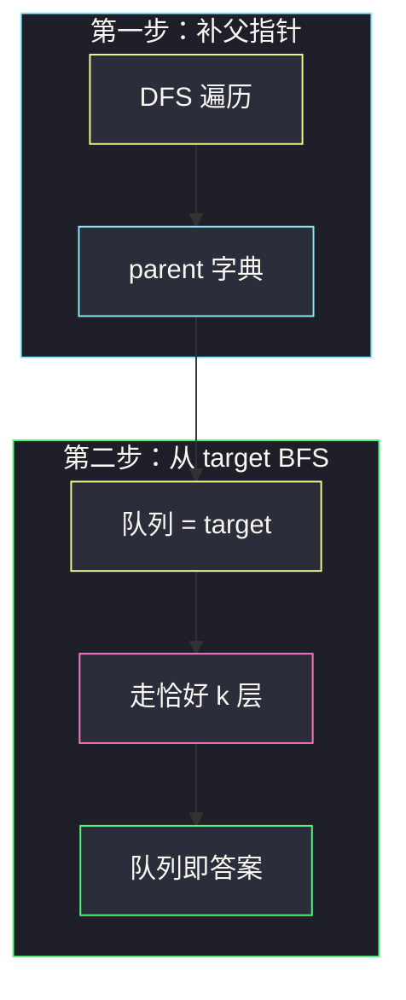
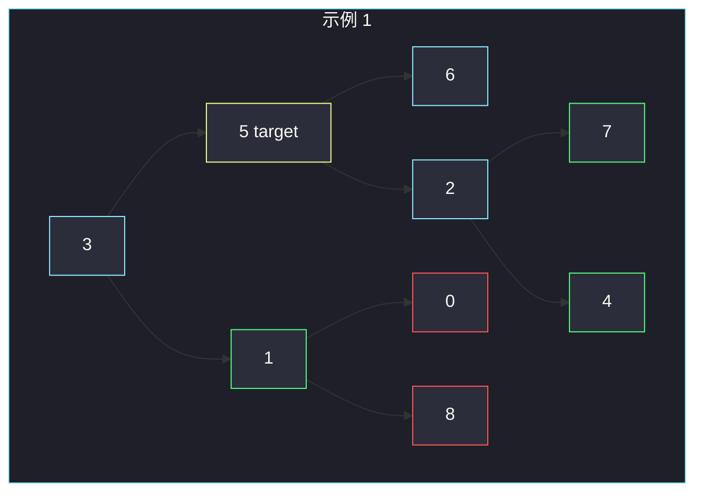

# 二叉树中所有距离为 K 的结点（建父指针 + 从 target BFS）

## 一、问题描述

给定一棵二叉树的根 `root`、一个节点 `target` 和整数 `k`，返回所有与 `target` 距离为 `k` 的结点的值。答案可以按任意顺序返回。

树是**有向**的：每个结点只认识左右孩子，不认识父亲。距离却是**无向**的——既可以往下走，也可以往上走。题目保证结点值互不相同。

> 🔗 LeetCode 863：https://leetcode.cn/problems/all-nodes-distance-k-in-binary-tree/
>
> 📚 灵神题单：**二叉树 · §2.13 二叉树 BFS**
>
> 数据范围：结点数 `n ∈ [1, 500]`，`0 ≤ Node.val ≤ 500`，值互异；`target` 一定在树中；`0 ≤ k ≤ 1000`。

**示例 1**

```
输入：root = [3,5,1,6,2,0,8,null,null,7,4]，target = 5，k = 2
输出：[7,4,1]
解释：与 5 距离 2 的结点是 7、4（往下）和 1（先上到 3 再下）。
```

```
        3
       / \
      5   1
     / \ / \
    6  2 0  8
      / \
     7   4
```

**示例 2**

```
输入：root = [1]，target = 1，k = 3
输出：[]
解释：单结点树走不出距离 3。
```

**直观理解**

把树临时当成无向图：每个点的邻居是「左、右、父」。从 `target` 做 BFS，走恰好 `k` 步，队列里剩下的就是答案。缺的那条「父」边，先 DFS 扫一遍补上即可。

---

## 二、暴力解法

对每个结点算到 `target` 的距离：先找 LCA，再把两边深度相加。每个查询 `O(n)`，一共 `n` 个点，`O(n²)`。`n = 500` 能过，但完全没必要——距离 `k` 是从**同一个源点**辐射出去的，一遍 BFS 就够。

```python
# 思路示意：对每个结点 u 求 dist(u, target)，等于 k 则收进答案
# dist 要 LCA + 深度，每个点都扫一遍树 → O(n²)
```

### 复杂度

- **时间**：`O(n²)`。
- **空间**：`O(n)`（递归栈 / 父指针）。

### 🔴 瓶颈在哪里

「所有距离为 k 的点」是单源最短路，不是 n 次点对距离。补上父指针后，图是树（`n-1` 条无向边），BFS 一次 `O(n)`。

---

## 三、优化探索（核心章节）

> 📚 对齐灵神 **§2.13 二叉树 BFS**：层序的本质是「按距离分层」。本题只是多了向上走这一维，用父指针把树变成三度无向图。

### 3.1 先补父指针

DFS（或 BFS）遍历整棵树，`parent[node] = 它的父亲`。根的父亲记 `None`。这一步 `O(n)`。

也可以建邻接表 `g[u] = [左, 右, 父]`，之后 BFS 更统一；面试默写用「字典存父 + 访问时拼三个邻居」就够。

### 3.2 从 target 走 k 层

队列初始放 `target`，`visited` 先标记它（防止立刻走回自己）。每一轮把**当前层全部弹出**，把未访问的邻居入队——这就是标准的「按层 BFS」。循环恰好 `k` 次后，队列里的点距离都是 `k`。

`visited` 一定要有：树变成无向图后有回头边，不标记会在父子之间来回抖，距离会算错，甚至死循环。



`k = 0` 时循环 0 次，答案就是 `[target.val]`，不必特判。

### 3.3 一句话核心

> **先 DFS 记下每个点的父亲，再把树当无向图，从 target 做 k 层 BFS；visited 防回头。**

---

## 四、代码实现

### Python（主解：父指针 + 按层 BFS）

```python
from collections import deque

class Solution:
    def distanceK(self, root: TreeNode, target: TreeNode, k: int) -> List[int]:
        parent = {}

        def bind(node: TreeNode, p: TreeNode) -> None:
            if not node:
                return
            parent[node] = p
            bind(node.left, node)
            bind(node.right, node)

        bind(root, None)

        q = deque([target])
        seen = {target}
        for _ in range(k):
            for _ in range(len(q)):
                cur = q.popleft()
                for nxt in (cur.left, cur.right, parent[cur]):
                    if nxt and nxt not in seen:
                        seen.add(nxt)
                        q.append(nxt)
        return [node.val for node in q]
```

**变量含义**

| 变量 | 含义 |
|------|------|
| `parent` | 结点 → 父亲，根对应 `None` |
| `q` | 当前距离层的结点 |
| `seen` | 已经入过队的结点，防父子回头 |
| 外层 `for _ in range(k)` | 向外扩恰好 k 圈 |

邻居写成三元组 `(left, right, parent)`，`if nxt` 顺手滤掉空孩子和根的空父。用结点对象当 `seen` 的 key（值互异时用 `val` 也行）。

---

## 五、具体例子演示

示例 1：`target = 5`，`k = 2`。父指针补完后，5 的三个邻居是 6、2、3。

**第 0 层（距离 0）**

| 队列 | visited |
|------|---------|
| `[5]` | `{5}` |

**扩第 1 圈**

弹出 5。邻居 6、2（孩子）和 3（父）都未访问：

| 队列（距离 1） | 新标记 |
|----------------|--------|
| `[6, 2, 3]` | 6、2、3 |

**扩第 2 圈**

| 弹出 | 候选邻居 | 入队（未访问） |
|------|----------|----------------|
| 6 | 父 5（已访问），无孩子 | — |
| 2 | 7、4、父 5 | **7、4** |
| 3 | 左 5（已访问）、右 1、父 None | **1** |

| 队列（距离 2） |
|----------------|
| `[7, 4, 1]` |

循环结束，返 `[7, 4, 1]`。1 的孩子 0、8 是距离 3，还没入队，正好。



黄是起点，青是距离 1，绿是答案（距离 2），红是更远的点。

---

## 六、复杂度分析

| 方法 | 时间 | 空间 | 说明 |
|------|------|------|------|
| 每个点求 LCA 距离 | `O(n²)` | `O(n)` | 重复走树 |
| 父指针 + BFS（主解） | `O(n)` | `O(n)` | DFS 建父 + 至多访问全部结点 |

`k` 再大也最多走完 `n` 个点；队列空了就自然停在 `[]`。

---

## 七、对比总结

| 维度 | 当有向树 DFS | 补父后当无向图 BFS |
|------|--------------|-------------------|
| 向上走 | 要特殊处理祖先链 | 父亲就是第三个邻居 |
| 距离分层 | 不自然 | 正好 k 层队列 |
| 实现量 | LCA / 分类讨论 | 两段：bind + BFS |

**易错点**

1. **忘了 visited**：父子互为邻居，不标记会振荡。
2. **用值当 target 却没先找到结点**：题面给的是 `TreeNode`，直接从它开 BFS。
3. **k = 0**：不要写成「没有邻居」；答案就是 target 自己。
4. **根没有父亲**：`parent[root] is None`，邻居循环里 `if nxt` 挡住即可。
5. **一次弹一个而不是按层**：外层必须 `for _ in range(k)`，内层 `for _ in range(len(q))`，否则距离对不上。

**模板（§2.13 树转无向图后 BFS）**

```python
# 1) parent[node] = p
# 2) q = deque([start]); seen = {start}
# 3) 按层扩展；邻居 = left / right / parent
```

---

## 八、举一反三

| 题目 | 关系 |
|------|------|
| [102. 二叉树的层序遍历](https://leetcode.cn/problems/binary-tree-level-order-traversal/) | §2.13 只往下走的按层 BFS |
| [2385. 感染二叉树需要的总时间](https://leetcode.cn/problems/amount-of-time-for-binary-tree-to-be-infected/) | 同一套「建父 + 从起点 BFS」，求最远距离 |
| [236. 二叉树的最近公共祖先](https://leetcode.cn/problems/lowest-common-ancestor-of-a-binary-tree/) | 点对距离 = 深度和 − 2×LCA 深度；暴力做法的组件 |
| [863 对照 · 本题](https://leetcode.cn/problems/all-nodes-distance-k-in-binary-tree/) | 固定距离 k，不是最远 |
| [310. 最小高度树](https://leetcode.cn/problems/minimum-height-trees/) | 无向树 + 剥叶子 BFS，同样把树当图 |

**思想迁移**

- 树上既要下也要上时，先把父指针补齐，后面全是图上的 BFS/DFS。
- 口诀：**「先认爹，再从 target 向外扩 k 圈；走过的点不再回头。」**
