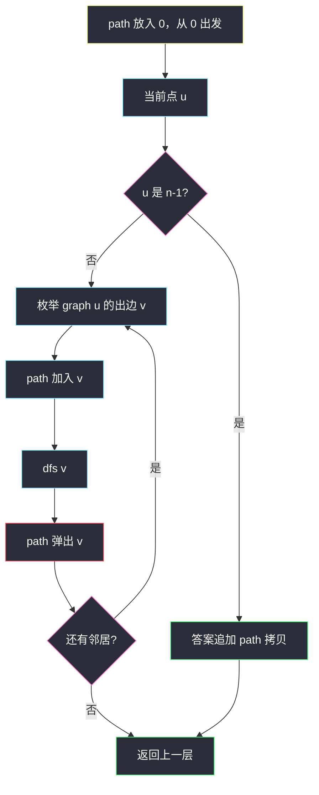
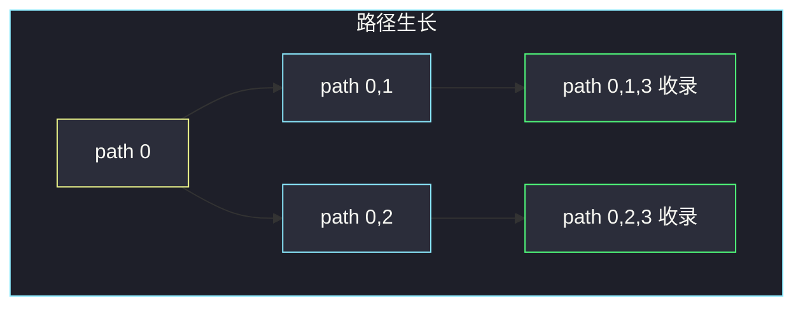

# 所有可能的路径（DAG 回溯 · 枚举 0 到 n-1）

## 一、问题描述

有向无环图（DAG）有 `n` 个节点，编号 `0 .. n-1`。`graph[i]` 是节点 `i` 的全部出边。求从 **0 到 n-1** 的所有路径（顺序任意）。

> 🔗 LeetCode 797：https://leetcode.cn/problems/all-paths-from-source-to-target/
>
> 数据范围：`2 ≤ n ≤ 15`，无自环，同一对出边不重复，输入保证是 DAG。
>
> 📚 灵茶题单：**图论 · §1.1 深度优先搜索（DFS）**（1383 分）。

**示例 1**

```
输入：graph = [[1,2],[3],[3],[]]
输出：[[0,1,3],[0,2,3]]

0 → 1 → 3
0 → 2 → 3
```

**示例 2**

```
输入：graph = [[4,3,1],[3,2,4],[3],[4],[]]
输出：[[0,4],[0,3,4],[0,1,3,4],[0,1,2,3,4],[0,1,4]]
五条从 0 走到 4 的路，顺序不唯一。
```

**直观理解**

邻接表已经给好了。从 0 出发沿着出边往下走，每走到 `n-1` 就记一条路径。DAG 没有环，不会在图里转圈；要枚举的是**全部**路径，不是最短的一条，所以用回溯 DFS，而不是 BFS。

---

## 二、暴力解法

先 BFS/DFS 只找一条路，或按「路径集合」做子集枚举：生成 `0` 到 `n-1` 的全部排列再检查是否每步都有边。`n ≤ 15` 时排列是 `15!`，直接炸。

```python
class Solution:
    def allPathsSourceTarget(self, graph: list[list[int]]) -> list[list[int]]:
        n = len(graph)
        # 假想：枚举 1..n-2 的所有排列插入 0 与 n-1 之间再验边——不可行
        raise NotImplementedError
```

不必真写排列。瓶颈已经清楚：路径条数本身可以到 `2^{n-2}`（每个中间点选或不选），必须按图的出边搜，而不是按点集排列。

### 🔴 瓶颈在哪里

「所有路径」= 树上的回溯：当前路径末尾扩一个邻居，递归；返回时弹出。DAG 保证递归会结束。`n ≤ 15` 专门为指数级输出留了余量。

---

## 三、优化探索（核心章节）

> 📚 本题在灵茶题单中属于 **图论 · §1.1 DFS**。在 DAG 上从源点 DFS，路径数组加入当前点 → 递归邻居 → 弹出。无环，不必 `vis`；若用 `vis` 必须回溯时撤销，否则共享节点的多条路径会被砍掉。

### 3.1 回溯骨架

```
path = [0]
dfs(u):
    若 u == n-1：把 path 拷进答案，返回
    对每个出边 v：
        path.append(v)
        dfs(v)
        path.pop()
```

到达终点就**收集一份拷贝**。直接 `ans.append(path)` 会在后续 `pop` 时把答案改坏。

### 3.2 为什么可以不 vis

有环图上不标记会无限递归。本题是 DAG：沿出边走节点编号不必递增，但保证不会回到祖先，递归深度 ≤ `n`。

示例 2 里节点 `3`、`4` 出现在多条路上。如果 `vis[3]=True` 走完 `0-3-4` 之后**不撤销**，后面的 `0-1-3-4` 进不了 3，漏路径。所以：要么完全不用 `vis`，要么进入时标记、返回时擦掉。



### 3.3 搜索树长什么样

示例 1 的递归树就是两叉，叶子都是终点：



### 3.4 为什么不用 BFS 枚举

BFS 适合「一条最短」。要全部路径，队列里就得带着整条 `path` 走，空间仍是指数，还丢失了回溯那种「共享前缀、弹出复用」的写法。DAG 上若**只数条数**，应改成 `f(u) = Σ f(v)`、终点为 1，那是另一题。本题要列表，回溯最干净。

### 3.5 一句话核心

> **DAG 上从 0 回溯：path 加入 → 递归出边 → 弹出；走到 n-1 拷贝一份。无环不用 vis，用了必须撤销。**

---

## 四、代码实现

### Python（主解：回溯 DFS）

```python
class Solution:
    def allPathsSourceTarget(self, graph: list[list[int]]) -> list[list[int]]:
        n = len(graph)
        ans: list[list[int]] = []
        path = [0]

        def dfs(u: int) -> None:
            if u == n - 1:
                ans.append(path[:])
                return
            for v in graph[u]:
                path.append(v)
                dfs(v)
                path.pop()

        dfs(0)
        return ans
```

**变量含义**

| 变量 | 含义 |
|------|------|
| `path` | 当前从 0 走到 `u` 的节点序列 |
| `ans` | 所有到达 `n-1` 的路径拷贝 |
| `graph[u]` | 题目直接给出的出边表，不用再建图 |

起点已经放进 `path`，`dfs` 的参数是当前末尾节点。也可以写成「先 `append(u)` 再判断终点」，两种都行，弹出时配对即可。

`n ≤ 15`，递归深度最大 `n`，Python 默认栈足够。最坏路径条数约 `2^{n-2}`（每个中间点可选或不选且边齐）：`n=15` 时约 8192 条，每条拷贝 `O(n)`，正好卡在可提交范围。若改成「有环图上枚举简单路径」，必须加 `vis` 并回溯撤销，复杂度仍指数，但不再保证 DAG 那句「不用 vis」。

### Java（可选）

```java
class Solution {
    public List<List<Integer>> allPathsSourceTarget(int[][] graph) {
        List<List<Integer>> ans = new ArrayList<>();
        List<Integer> path = new ArrayList<>();
        path.add(0);
        dfs(graph, 0, path, ans);
        return ans;
    }

    private void dfs(int[][] graph, int u, List<Integer> path, List<List<Integer>> ans) {
        if (u == graph.length - 1) {
            ans.add(new ArrayList<>(path));
            return;
        }
        for (int v : graph[u]) {
            path.add(v);
            dfs(graph, v, path, ans);
            path.remove(path.size() - 1);
        }
    }
}
```

---

## 五、具体例子演示

示例 1：`graph = [[1,2],[3],[3],[]]`，`n-1 = 3`。逐步跟踪 `path` 和答案。

| 步 | 调用 | path | 动作 | ans |
|----|------|------|------|-----|
| 1 | `dfs(0)` | `[0]` | 未到终点，邻居 1、2 | `[]` |
| 2 | 加入 1，`dfs(1)` | `[0,1]` | 邻居 3 | `[]` |
| 3 | 加入 3，`dfs(3)` | `[0,1,3]` | `u==3`，拷贝进 ans | `[[0,1,3]]` |
| 4 | 弹出 3，弹出 1 | `[0]` | 回到 0，处理邻居 2 | 同上 |
| 5 | 加入 2，`dfs(2)` | `[0,2]` | 邻居 3 | 同上 |
| 6 | 加入 3，`dfs(3)` | `[0,2,3]` | 再拷贝 | `[[0,1,3],[0,2,3]]` |
| 7 | 一路弹出 | `[0]` | 0 的邻居扫完，结束 | 两条路径 |

示例 2 只列最终收录顺序（按出边 `4,3,1` 再展开）：

```
dfs(0)
  → 4  收录 [0,4]
  → 3 → 4  收录 [0,3,4]
  → 1 → 3 → 4  收录 [0,1,3,4]
      → 2 → 3 → 4  收录 [0,1,2,3,4]
      → 4  收录 [0,1,4]
```

节点 3 被走了两次（`0-3-4` 与 `0-1-3-4`）。若 `vis[3]` 不撤销，第二条会消失。

把示例 2 的 `path` 涨落再摊开一次（只写关键帧）：

| 步 | path | 事件 |
|----|------|------|
| A | `[0]` | 出边顺序 4, 3, 1 |
| B | `[0,4]` | 4 是终点，收录 |
| C | `[0]` | 弹出 4 |
| D | `[0,3]` | 3 的出边只有 4 |
| E | `[0,3,4]` | 收录，连弹回 `[0]` |
| F | `[0,1]` | 1 的出边 3, 2, 4 |
| G | `[0,1,3,4]` | 收录 |
| H | `[0,1,2,3,4]` | 经 2 再收录 |
| I | `[0,1,4]` | 1 直达终点，收录 |

五条路径与官方样例一致，顺序随 `graph[i]` 的给出顺序变化，题目允许任意排列。

---

## 六、复杂度分析

| 方法 | 时间 | 空间 | 说明 |
|------|------|------|------|
| 排列再验边 | `O(n! · n)` | `O(n)` | 不可用 |
| 回溯 DFS（主解） | `O(2^n · n)` | `O(n)` 递归 + 输出 | 路径最多 `2^{n-2}` 条，每条长 `O(n)` |

输出本身可能到指数级，这是题目要求，不是实现问题。`n ≤ 15` 专门卡在可承受范围。

空间上：递归栈 `O(n)`，当前 `path` 为 `O(n)`；答案列表在最坏情况下占 `O(2^n · n)`，这是输出规模，不计入「额外」优化空间。面试时时间报 `O(2^n · n)`、额外空间报 `O(n)`（不含答案）即可。

---

## 七、对比总结

| 维度 | 最短路 BFS | 回溯枚举全部路径 |
|------|------------|------------------|
| 目标 | 一条最优 | 每一条都要 |
| 标记 | 点只进队一次 | DAG 不用 vis；用了必须撤销 |
| 数据结构 | 队列 | `path` 栈式数组 |

**易错点**

1. **`ans.append(path)` 不拷贝**：Python 里 `path` 是同一列表，后面 `pop` 会把答案掏空。
2. **`vis` 不回溯**：共享中间点的路径漏计（示例 2 的 3、4）。
3. **有环图套这模板**：会无限递归。本题保证 DAG。
4. **忘记从 0 开始已在 path 里**：重复 `append(0)` 或漏掉起点。
6. **答案顺序纠结**：题目不要求字典序。不要为排序再扫一遍，徒增代码。
7. **把 `graph` 理解成无向**：只沿 `graph[i]` 给出的方向走，没有回边就不要自己补。

Java 里必须 `new ArrayList<>(path)`，与 Python 的 `path[:]` 同一坑：共享引用会被后续回溯改掉。

---

## 八、举一反三

| 题目 | 关系 |
|------|------|
| [39. 组合总和](https://leetcode.cn/problems/combination-sum/) | 同一套「选→递归→撤销」，对象从节点换成数字 |
| [200. 岛屿数量](https://leetcode.cn/problems/number-of-islands/) | DFS 遍历；本题要的是路径列表而不是连通块计数 |
| [1976. 到达目的地的方案数](https://leetcode.cn/problems/number-of-ways-to-arrive-at-destination/) | 只要条数且带权最短，改 Dijkstra + DP，不能枚举路径 |
| [797 的计数版直觉](https://leetcode.cn/problems/all-paths-from-source-to-target/) | DAG 上若只求条数：`f(u) = Σ f(v)`，终点为 1 |
| [1462. 课程表 IV](https://leetcode.cn/problems/course-schedule-iv/) | DAG 上问可达性，Floyd 或按拓扑 DFS 预处理祖先 |

同目录回溯：[39. 组合总和](https://leetcode.cn/problems/combination-sum/) 的 `path` 纪律与本题完全相同，只是分支从「出边」换成「选数」。

**思想迁移**

- 枚举路径：一个共享的 `path`，进递归前 push、返回后 pop，收集时拷贝。
- 口诀：**「DAG 从 0 走到 n-1；加入、递归、弹出；终点拷贝；vis 能不用就不用。」**
