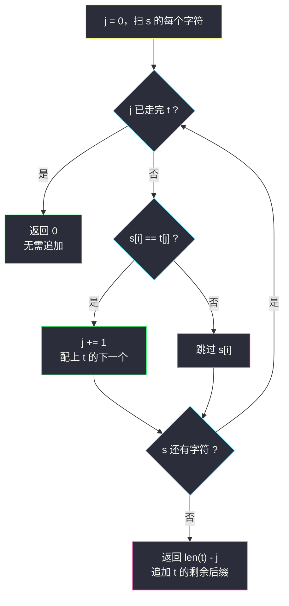

# 追加字符以获得子序列（判断子序列 · 最长可匹配前缀）

## 一、问题描述

给你两个只含小写字母的字符串 `s` 和 `t`。你只能往 **`s` 的末尾**追加字符（每次追加一个），使得 `t` 成为 `s` 的**子序列**。返回需要追加的**最少**字符个数。子序列不要求连续，但相对顺序必须保持。

> 🔗 LeetCode 2486：https://leetcode.cn/problems/append-characters-to-string-to-make-subsequence/
>
> 数据范围：`1 <= s.length, t.length <= 10^5`，`s`、`t` 由小写字母组成。

**示例 1**

```
输入：s = "coaching", t = "coding"
输出：4
解释：s 里按顺序只能配上 t 的前缀 "co"，剩下 "ding" 只能追加到末尾。
```

**示例 2**

```
输入：s = "abcde", t = "a"
输出：0
解释：t 已经是 s 的子序列，不用追加。
```

**示例 3**

```
输入：s = "z", t = "abcde"
输出：5
解释：s 一个字符都配不上 t[0]，五个字母全得追加。
```

**直观理解**

追加只能发生在 `s` 的尾巴上。一旦开始追加，原串里剩下的字符都在「追加段」的**左边**，再也帮不上忙。所以最优策略一定是：在原 `s` 里尽可能多地匹配 `t` 的**某个前缀**，匹配不动了就把 `t` 的剩余后缀整段接到末尾。最少追加数 = `|t| - 原串里能配上的最长前缀长度`。而这正是 §4.2 判断子序列：在 `s` 上从左到右找 `t` 的下一个字符。

---

## 二、暴力解法

对每个可能的前缀长度 `p = 0 .. |t|`，用双指针检查 `t[:p]` 是否为 `s` 的子序列，取最大可行 `p`：

```python
class Solution:
    def appendCharacters(self, s: str, t: str) -> int:
        def is_sub(prefix: str) -> bool:
            j = 0
            for ch in s:
                if j < len(prefix) and ch == prefix[j]:
                    j += 1
            return j == len(prefix)

        best = 0
        for p in range(len(t) + 1):
            if is_sub(t[:p]):
                best = p
        return len(t) - best
```

### 复杂度

- **时间**：`O(|t| · |s|)`。每个前缀都把 `s` 扫一遍。`10^5 × 10^5` 超时。
- **空间**：`O(1)` 额外（切片在 Python 里会再花 `O(p)`，可改成传长度避免）。

### 🔴 瓶颈在哪里

`t[:p]` 能配上 ⇒ `t[:p-1]` 更能配上，答案关于 `p` 单调。更关键的是：贪心地在 `s` 里**尽早**匹配 `t[0], t[1], …`，一次扫描就能得到最大的 `p`——后面那些重复扫描完全是浪费。§4.2 的标准双指针正是这一次扫描。

---

## 三、优化探索（核心章节）

> 📚 本题在灵茶题单中属于 **§4.2 判断子序列**：双指针，`s` 上找 `t` 的下一个字符。能配上一个是一个；`s` 走完后，`t` 还没走完的那截就是要追加的。

### 3.1 为什么只能匹配前缀

设最优方案追加了字符串 `u`，完成后的串是 `s + u`，且 `t` 是它的子序列。把 `t` 的匹配位置分成两类：落在原 `s` 里的，与落在 `u` 里的。因为 `u` 全部在 `s` 右侧，**一旦某个 `t[j]` 匹配到了 `u`，其后所有 `t[j+1 ..]` 也只能匹配 `u`**（原 `s` 已经用完了）。因此存在一个切分点 `p`：`t[:p]` 是原 `s` 的子序列，`t[p:]` 等于（或被）追加段覆盖。追加长度至少 `|t| - p`，要最少就应让 `p` 最大。

切分可以画成：

```
s:  [........已用掉匹配 t[:p]........]
u:  [ t[p] t[p+1] ... t[n-1] ]     ← 只能接在这里
t:  [----前缀 p----][----要追加----]
```

`p` 再大 1 都配不上，所以 `n - p` 就是下界，双指针会取到这个下界。

### 3.2 一次扫描求最大 p

`j` 指向 `t` 中「下一个要找的字符」。从左到右扫 `s`：

- 若 `s[i] == t[j]`：配上了，`j += 1`；
- 否则 `s[i]` 用不上，只动 `i`。

`s` 扫完后 `j` 就是最大 `p`。答案 `len(t) - j`。若中途 `j == len(t)`，已经整串匹配，可提前返回 0。

贪心不亏：`t[j]` 匹配 `s` 中**当前最靠前**的可行位置，把更靠后的位置留给 `t[j+1]`，后续选择只会更宽裕。若某次把匹配推迟，可交换回更早的位置，不会变差——与 [#392 判断子序列](https://leetcode.cn/problems/is-subsequence/) 同一论证。



### 3.3 不能在中间插入，也不能拿 LCS

如果允许往 `s` 任意位置插入，题会变成「最短公共超序列」一类，答案可能更小。本题限制死在末尾，所以**不能**跳过 `t` 的某个前缀字符指望后面补——跳过的那个字符只能追加，而一追加，后面原串就作废，通常更亏。双指针从不跳过 `t` 的字符：配不上就等 `s` 后面的字符，实在没有才计入追加。

一个专门用来打脸 LCS 的小例子：`s = "ag"`，`t = "coding"`。

- LCS 能配上末尾的 `g`，`|t| - LCS = 6 - 1 = 5`，看起来好像只追加 5 个；
- 但 `g` 落在 `s` 末尾，要用它匹配 `t` 的最后一个 `g`，前面的 `codin` 必须全部出现在 `g` **之前**。原串在 `g` 前只有一个 `a`，配不上 `c`。真要接尾巴，`a` 也帮不上 `c`，五个字母外加这个用不上的 `g`，得追加整段 `"coding"`，答案是 **6**。

LCS 把「任意位置保留」算进去了；本题保留位置必须构成 `t` 的**前缀**，所以用判断子序列，不用 LCS。

### 3.4 交换论证（贪心最早匹配）

设某次匹配把 `t[j]` 配到了 `s[x]`，而更早还有 `s[y] = t[j]`（`y < x`）。把这次匹配改到 `y`：`t[j+1]` 原来可用的区间是 `s[x+1 ..]`，现在变成 `s[y+1 ..]`，是原区间的超集，后续只会更容易。因此任何可行匹配都可以改成「每次取最早位置」，而双指针构造的就是这个方案。最大前缀长度不会比最优更短。

### 3.5 循环不变式

扫完 `s[0..i]`（含）之后：`t[0..j-1]` 已被匹配为这段前缀的子序列，且这是在 `s[0..i]` 内能配到的最长 `t` 前缀（贪心最早匹配）。`j` 单调不减，每个指针最多走自己的长度。

### 3.6 一句话核心

> **只能接尾巴 ⇒ 原串负责 t 的最长前缀。双指针在 s 上找 t 的下一个字符，配了几个就少追加几个。**

---

## 四、代码实现

### Python（主解：双指针判断子序列）

```python
class Solution:
    def appendCharacters(self, s: str, t: str) -> int:
        n = len(t)
        j = 0                                   # t 中下一个要找的字符
        for ch in s:                            # i 隐式扫 s
            if j < n and ch == t[j]:
                j += 1                          # 配上，找 t 的下一个
            if j == n:                          # 整串已是子序列
                return 0
        return n - j                            # 追加 t[j:] 的长度
```

**变量含义**

| 变量 | 含义 |
|------|------|
| `j` | `t` 上的指针：`t[:j]` 已在 `s` 里按顺序配上 |
| `ch` | `s` 当前字符（`i` 指针） |
| `n - j` | `t` 尚未匹配的后缀长度 = 最少追加数 |

**循环不变式**：见 3.5。`j` 只增不减；`s` 每个字符至多让 `j` 加 1。

### Java（最优解同款）

```java
class Solution {
    public int appendCharacters(String s, String t) {
        int n = t.length(), j = 0;
        for (int i = 0; i < s.length() && j < n; i++) {
            if (s.charAt(i) == t.charAt(j)) {
                j++;                            // s 上找到 t 的下一个字符
            }
        }
        return n - j;
    }
}
```

Java 把 `j < n` 写进 `for` 条件，匹配完即可停止扫 `s`。两份代码都是「`s` 上找 `t` 的下一个字符」，只是提前退出的写法不同：Python 在循环体里 `return 0`，Java 用循环条件截断。

---

## 五、具体例子演示

以示例 1 `s = "coaching"`，`t = "coding"`。逐步跟踪**每轮两个指针**：

| i | s[i] | j（匹配前） | t[j] | 是否配上 | j（匹配后） | 已配前缀 |
|---|------|-------------|------|----------|-------------|----------|
| 0 | c | 0 | c | 是 | 1 | `c` |
| 1 | o | 1 | o | 是 | 2 | `co` |
| 2 | a | 2 | d | 否 | 2 | `co` |
| 3 | c | 2 | d | 否 | 2 | `co` |
| 4 | h | 2 | d | 否 | 2 | `co` |
| 5 | i | 2 | d | 否 | 2 | `co` |
| 6 | n | 2 | d | 否 | 2 | `co` |
| 7 | g | 2 | d | 否 | 2 | `co` |

`s` 走完，`j = 2`，`n - j = 6 - 2 = 4`，追加 `"ding"` ✓。注意 `s` 末尾的 `g` 不能拿去配 `t` 的最后一个 `g`：因为中间的 `d`、`i`、`n` 还没着落，而追加只能接在尾巴，一旦为了 `d` 开始追加，原来的 `g` 已经在追加段左边，用不上。双指针不会「跳过 d 去抢 g」，这正是正确性。

示例 2：`s = "abcde"`，`t = "a"`。`i = 0` 配上，`j = 1 == n`，返回 **0** ✓。

示例 3 逐步跟踪（`s = "z"`，`t = "abcde"`，`n = 5`）：

| i | s[i] | j | t[j] | 配上？ | j' |
|---|------|---|------|--------|----|
| 0 | z | 0 | a | 否 | 0 |

`s` 只有一个字符且对不上 `t[0]`，`j` 停在 0，返回 `5 - 0 = 5`，追加整串 `"abcde"` ✓。

再看「`t` 已是子序列」的提前退出：`s = "abcde"`，`t = "ace"`。`a` 配 `j=1`，`c` 配 `j=2`，`e` 配 `j=3 == n`，循环中即可返回 0，不必把 `s` 扫完。


---

## 六、复杂度分析

| 方法 | 时间 | 空间 | 说明 |
|------|------|------|------|
| 枚举前缀再判定 | `O(\|t\| · \|s\|)` | `O(1)` | 每个前缀重扫 s |
| 双指针一次扫描（主解） | `O(\|s\| + \|t\|)` | `O(1)` | 两指针各走一遍 |

实际主解是 `O(|s|)`：`t` 的指针只在匹配时前进，总步数不超过 `|s| + |t|`。两指针都单调，没有回头，因此也是 `O(1)` 额外空间。

---

## 七、对比总结

| 维度 | #392 判断子序列 | 本题 |
|------|-----------------|------|
| 问什么 | t 是否已是 s 的子序列 | 差几个字符才成为 |
| 指针 | 同样在 s 上找 t 的下一个 | 完全同一模板 |
| 返回值 | 布尔（`j == \|t\|`） | `\|t\| - j` |
| 额外限制 | 无 | 只能往 s **末尾**追加（故只能用前缀） |

**易错点**

1. **想用 LCS**：`|t| - LCS(s, t)` 在「可在任意位置插入」时才对；本题插入点被钉在末尾，LCS 会高估能保留的字符（3.3 的 `s="ag"` / `t="coding"`）。
2. **匹配不必连续**：`coaching` 里 `c` 与 `o` 相邻只是巧合；中间可以隔任意字符。
3. **`j` 越界**：比较前先判断 `j < n`，或像 Java 那样匹配完就停。
4. **追加的是后缀不是任意字符**：答案长度等于没配上的那截，字符内容就是 `t[j:]`，不用真的构造字符串再返回长度。
5. **从 t 扫 s 写反**：必须 `i` 走长串 `s`、`j` 走待匹配的 `t`。反过来会把「s 是否为 t 的子序列」当成题意。
6. **贪心改成「最晚匹配」**：最晚匹配会让前面的 `t[j]` 抢光后面的字符，前缀更短、追加更多，不是最优。
7. 空串：约束 `length ≥ 1`，但模板对空 `t` 会返回 0，仍然合理。

**模板（§4.2 在 s 上找 t 的下一个字符）**

```python
j, n = 0, len(t)
for ch in s:
    if j < n and ch == t[j]:
        j += 1
return n - j          # 判断子序列则 return j == n
```

---

## 八、举一反三

| 题目 | 关系 |
|------|------|
| [392. 判断子序列](https://leetcode.cn/problems/is-subsequence/) | 本模板的布尔版：返回 `j == len(t)` |
| [1055. 形成字符串的最短路径](https://leetcode.cn/problems/shortest-way-to-form-string/) | 反复用 source 去匹配 target，次数即「扫几遍 s」 |
| [792. 匹配子序列的单词数](https://leetcode.cn/problems/number-of-matching-subsequences/) | 对多个 t 做判断子序列，需预处理下一出现位置 |
| [524. 通过删除字母匹配到字典里最长单词](https://leetcode.cn/problems/longest-word-in-dictionary-through-deleting/) | 字典里每个词对 s 做一次子序列判定 |
| [1023. 驼峰式匹配](https://leetcode.cn/problems/camelcase-matching/) | 带「大写必须匹配」约束的子序列 |
| [2825. 循环递增使字符串变成子序列](https://leetcode.cn/problems/make-string-a-subsequence-using-cyclic-increments/) | 匹配时允许 `+1` 模 26 |
| [522. 最长特殊序列 II](https://leetcode.cn/problems/longest-uncommon-subsequence-ii/) | 用同一套 `is_subseq` 做「是否被别人包含」 |

**思想迁移**

- 「只能在末尾补」把问题收成**最长可匹配前缀**；「可任意插」才轮到 LCS / SCS。
- 双指针贪心最早匹配是判断子序列的默认正确策略，几乎所有 §4.2 题都从这里长出来。
- 若题目改成「可以在任意位置插入」，答案变成 `|t| - LCS(s, t)`，模板整段作废，先确认插入位置再选武器。
- 多个 `t` 对同一个 `s` 做判定时（#792），把「下一出现位置」预处理成 26 条链表，单次匹配从 `O(|s|)` 降到 `O(|t|)`。
- 判定失败时不要回头改已经配上的前缀——`j` 只增不减，这是线性的代价。
- 口诀：**「s 上找 t 的下一个；配了多长前缀，就少追加多少。」**
