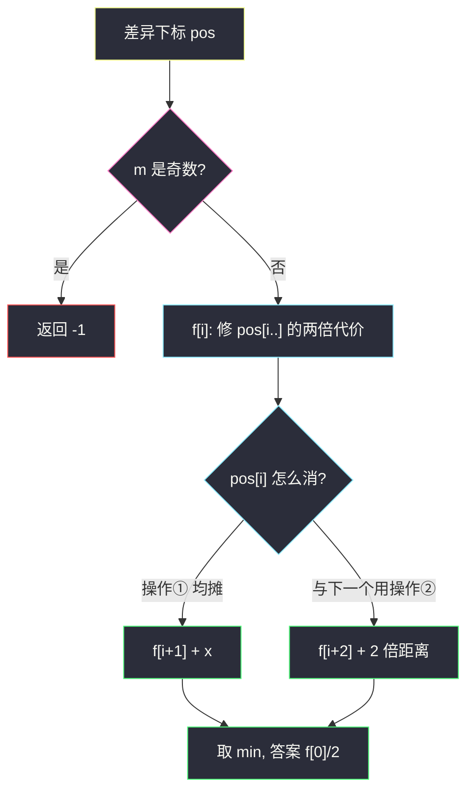
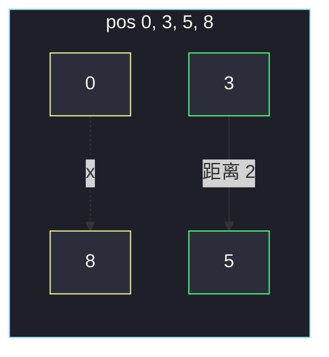

# 执行操作使两个字符串相等（差异下标一维 DP）

## 一、问题描述

两个等长二进制串 `s1`、`s2`，以及正整数 `x`。只改 `s1`，两种操作：

1. 选两个下标 `i, j`，把 `s1[i]` 和 `s1[j]` 都翻转，代价 `x`；
2. 选 `i`（`i < n-1`），翻转 `s1[i]` 与 `s1[i+1]`，代价 `1`。

求使两串相等的最小代价；不可能则 `-1`。

> 🔗 LeetCode 2896：https://leetcode.cn/problems/apply-operations-to-make-two-strings-equal/
>
> 数据范围：`1 ≤ n, x ≤ 500`。
>
> 📚 灵茶题单：**§7.1 一维 DP**。只需处理 `s1[i] != s2[i]` 的下标列表 `pos`。奇数个差异无法消掉。相邻两个差异可以用操作②「一路翻过去」，代价是距离 `pos[i+1]-pos[i]`（**不是** `2*(距离)`）；任意两个也可以付 `x`。从左到右决定每个差异走「付一半的 x」还是「和下一个用距离消掉」。

**示例 1**

```
输入：s1 = "1100011000", s2 = "0101001010", x = 2
输出：4
解释：操作② 用在 i=3 与 i=4（代价 1+1），再操作① 翻转下标 0 和 8（代价 2）。
```

**示例 2**

```
输入：s1 = "10110", s2 = "00011", x = 4
输出：-1
解释：差异个数为奇数，两种操作每次都翻 2 位，奇偶性改不了。
```

**直观理解**

相同的位不用动。差异位必须被翻转奇数次，相同位必须被翻转偶数次。操作②沿着一段区间翻：两端各奇数次、中间各偶数次——恰好一次性修掉区间两端的两个差异，代价等于区间长度（翻了多少对相邻位）。

---

## 二、暴力解法

收集差异下标。奇数个直接 `-1`。偶数个则枚举完美匹配：一对用 `min(x, 距离)`，但「交叉配对」和「中间两两用距离、两端用 x」会对答案有影响，朴素枚举匹配是指数级。

`n ≤ 500` 不能指数。下面用区间记忆化把配对方式搜完，作为对照（`O(m²)`，`m ≤ 500` 可过，但不是本节的一维写法）。

```python
from functools import cache

class Solution:
    def minOperations(self, s1: str, s2: str, x: int) -> int:
        pos = [i for i, (a, b) in enumerate(zip(s1, s2)) if a != b]
        m = len(pos)
        if m % 2:
            return -1

        @cache
        def dfs(l: int, r: int) -> int:
            if l > r:
                return 0
            # 两端用操作①；或左两个用距离；或右两个用距离
            a = dfs(l + 1, r - 1) + x
            b = dfs(l + 2, r) + pos[l + 1] - pos[l]
            c = dfs(l, r - 2) + pos[r] - pos[r - 1]
            return min(a, b, c)

        return dfs(0, m - 1)
```

官方两例都能过。区间 DP 状态 `O(m²)`。本节压缩成一维。

### 🔴 瓶颈在哪里

操作① 配对任意两个代价都是同一个 `x`，不依赖是哪一对。真正要选择的只是：**哪些相邻差异用操作② 消掉**，剩下的全部用操作① 两两配对。这是一条链上的一维决策。

---

## 三、优化探索（核心章节）

> 📚 本题在灵茶题单中属于 **§7.1 一维 DP**。从左到右扫差异列表：当前这个差异，要么留给操作①（和某个更远的差异凑一对，均摊代价 `x/2`），要么立刻和下一个差异用操作② 消掉（代价 = 下标差）。

### 3.1 操作② 的代价是距离，不是两倍距离

要把位置 `i` 和 `j`（`i < j`）两个差异修掉：依次做操作② 于 `i, i+1, …, j-1`。

- 位置 `i`、`j` 各被翻 1 次；
- 中间每个位置被翻 2 次，抵消。

一共 `j-i` 次操作，代价 `j-i`。若把差异当成「石子搬到对面再搬回来」，会写成 `2*(j-i)`，那是错的——翻转是 XOR，不用原路返回。

### 3.2 为什么奇数个差异必败

每次操作翻转 2 个位置。差异个数的奇偶性不变。奇数个永远消不完。

### 3.3 状态（一维，代价乘 2 避免小数）

`pos[0..m)` 为差异下标，`m` 为偶数（否则已返回）。

`f[i]` = **两倍**的「修掉 `pos[i..]` 的最小代价」。乘 2 是为了把「均摊的 `x/2`」写成整数 `x`。

- `f[m] = 0`
- 若还剩 1 个：必须靠操作① 与某个更早的「待配对」凑，均摊 `x/2`，故 `f[m-1] = x`
- `f[i] = min( f[i+1] + x , f[i+2] + 2 * (pos[i+1]-pos[i]) )`
  - 第一项：`pos[i]` 走操作①，把 `x/2` 记到它头上；
  - 第二项：`pos[i]` 与 `pos[i+1]` 用操作②，真实代价 `d`，存 `2d`。

答案 `f[0] / 2`。`m` 为偶数时 `f[0]` 一定是偶数。

这能覆盖「中间两个用距离、两端用 x」：两端各自走第一项（两个 `x/2` 合成一个 `x`），中间走第二项。



### 3.4 一句话核心

> **只看差异下标；奇数个无解；相邻用距离、任意一对用 x；一维从左扫。**

---

## 四、代码实现

### Python（主解：一维 DP）

```python
class Solution:
    def minOperations(self, s1: str, s2: str, x: int) -> int:
        pos = [i for i, (a, b) in enumerate(zip(s1, s2)) if a != b]
        m = len(pos)
        if m % 2:
            return -1
        # f[i] = 修掉 pos[i..] 的最小代价的两倍
        f = [0] * (m + 1)
        if m:
            f[m - 1] = x
        for i in range(m - 2, -1, -1):
            f[i] = min(f[i + 1] + x, f[i + 2] + 2 * (pos[i + 1] - pos[i]))
        return f[0] // 2
```

**变量含义**

| 写法 | 含义 |
|------|------|
| `pos` | `s1` 与 `s2` 不同的下标 |
| `f[i] + x` | `pos[i]` 走操作①，记入一个 `x/2` |
| `2 * (pos[i+1]-pos[i])` | 与下一个用操作②，真实代价再乘 2 |
| `f[0] // 2` | 还原真实最小代价 |

无差异时 `m=0`，`f[0]=0`，返回 0。

### Java（最优解）

```java
import java.util.*;

class Solution {
    public int minOperations(String s1, String s2, int x) {
        int n = s1.length();
        List<Integer> pos = new ArrayList<>();
        for (int i = 0; i < n; i++) {
            if (s1.charAt(i) != s2.charAt(i)) {
                pos.add(i);
            }
        }
        int m = pos.size();
        if (m % 2 != 0) {
            return -1;
        }
        int[] f = new int[m + 1];
        if (m > 0) {
            f[m - 1] = x;
        }
        for (int i = m - 2; i >= 0; i--) {
            f[i] = Math.min(f[i + 1] + x, f[i + 2] + 2 * (pos.get(i + 1) - pos.get(i)));
        }
        return f[0] / 2;
    }
}
```

---

## 五、具体例子演示

### 5.1 官方示例 1：`x=2` → 4

```
下标  0 1 2 3 4 5 6 7 8 9
s1    1 1 0 0 0 1 1 0 0 0
s2    0 1 0 1 0 0 1 0 1 0
差异  ^     ^   ^     ^
```

`pos = [0, 3, 5, 8]`，`m=4`，`x=2`。从右往左填 `f`（存的是两倍代价）：

| i | pos[i] | 走操作①：f[i+1]+2 | 与下一个用②：f[i+2]+2·距离 | f[i] |
|---|--------|-------------------|------------------------------|------|
| 4 | — | — | — | 0 |
| 3 | 8 | 只剩一个，f=2 | — | 2 |
| 2 | 5 | 2+2=4 | 0+2·(8-5)=6 | **4** |
| 1 | 3 | 4+2=6 | 2+2·(5-3)=6 | 6 |
| 0 | 0 | 6+2=8 | 4+2·(3-0)=10 | **8** |

`8/2=4`。对拍官方。

对应一种最优：`pos[0]` 与 `pos[3]` 走操作①（代价 2，两个 `x/2`），`pos[1]` 与 `pos[2]` 走操作②（距离 `5-3=2`）。这正是题解里「先把 3 翻到 5，再远程翻 0 和 8」。

只两两相邻用距离：`(3-0)+(8-5)=6` 更差；四位置全用操作①：`2+2=4`，并列最优。



### 5.2 官方示例 2：奇数 → -1

```
s1 = 1 0 1 1 0
s2 = 0 0 0 1 1
差异  ^   ^   ^
```

三个差异，直接 `-1`。对拍官方。不必看 `x`。

### 5.3 中间配对比两两相邻更优

差异在 `0, 100, 101, 200`，`x=5`。

- 相邻配对：`min(100,5)+min(99,5)=10`
- 中间 `100` 与 `101` 用距离 1，两端用一次 `x`：`1+5=6`

一维 DP 会走到 6：两端走「均摊 x」，中间走距离。若只允许「列表里相邻的两两配对」，会错过这种方案。

---

## 六、复杂度分析

| 方法 | 时间 | 空间 | 说明 |
|------|------|------|------|
| 区间记忆化（第二节） | `O(m²)` | `O(m²)` | `m ≤ n ≤ 500` 可过 |
| 一维 DP（主解） | `O(n)` | `O(m)` | 扫一遍差异列表 |

---

## 七、对比总结

| 维度 | 区间 DP | 一维 DP |
|------|---------|---------|
| 状态 | 子段 `[l,r]` | 后缀 `i..` |
| 操作① | 配对两端 | 均摊 `x/2` 记在单点上 |
| 操作② | 消左两个或右两个 | 只消「当前与下一个」 |

**易错点**

1. **距离写成 `2*(j-i)`**：XOR 中间抵消，代价就是 `j-i`。
2. **奇数个差异还去 DP**：先判奇偶。
3. **只两两相邻配对**：会漏「中间用距离、两端用 x」。`x/2` 写法就是为这个。
4. **去改 `s1==s2` 的位当辅助**：最优方案里不必制造新差异再修，状态只留真正的差异下标。
5. **`m=0` 返回 -1**：已经相等，答案 0。

---

## 八、举一反三

| 题目 | 关系 |
|------|------|
| [1526. 形成目标数组的最少操作次数](https://leetcode.cn/problems/minimum-number-of-increments-on-subarrays-to-form-a-target-array/) | 区间加减与差分数组，另一种「一段操作改两端」 |
| [3229. 使数组等于目标数组所需的最少操作](https://leetcode.cn/problems/minimum-operations-to-make-array-equal-to-target/) | 差分数组 + 正负段 |
| [2337. 移动片段得到字符串](https://leetcode.cn/problems/move-pieces-to-obtain-a-string/) | 只关心目标形态下的下标对齐 |
| [777. 在 LR 字符串中交换相邻字符](https://leetcode.cn/problems/swap-adjacent-in-lr-string/) | 相邻交换能把差异「挪」到对应位置 |
| [198. 打家劫舍](https://leetcode.cn/problems/house-robber/) | 同一节一维：当前选或不选（本题是当前用 x 还是和下一个绑定） |

**思想迁移**

- 每次改两个位置 → 先看奇偶；能把一次操作看成「配对」时，在配对点序列上做一维 DP。
- 口诀：**「奇数无解；相邻走距离；任意一对付 x；x/2 均摊写成一维。」**
