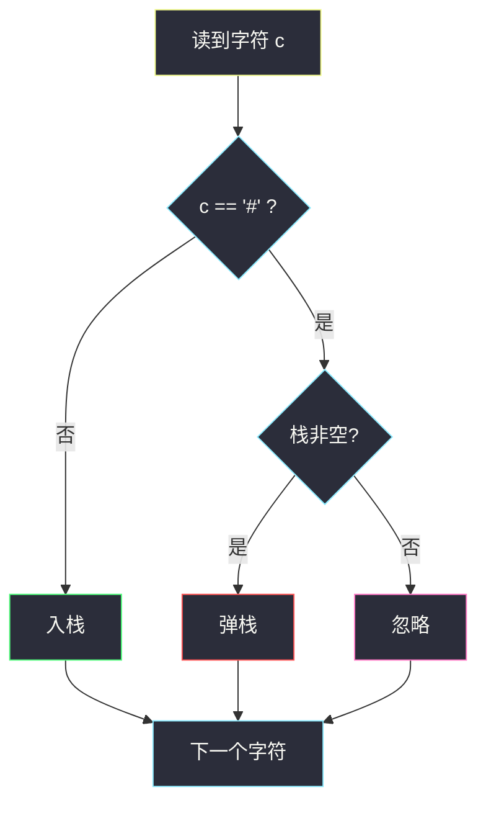

# 比较含退格的字符串

## 一、问题描述

给定字符串 `s` 和 `t`，字符 `'#'` 表示退格：删掉它前面那个还没被删的字符。两个 `'#'` 连着就连续删两个。请判断退格处理完之后，`s` 和 `t` 是否相等。

> 🔗 LeetCode 844：https://leetcode.cn/problems/backspace-string-compare/
>
> 数据范围：`1 <= s.length, t.length <= 200`，只含小写字母和 `'#'`。

**示例 1**

```
输入：s = "ab#c", t = "ad#c"
输出：true
解释：两边退格后都是 "ac"。
```

**示例 2**

```
输入：s = "ab##", t = "c#d#"
输出：true
解释：两边退格后都是空串。
```

**示例 3**

```
输入：s = "a#c", t = "b"
输出：false
解释：s 变成 "c"，t 仍是 "b"。
```

**直观理解**

把文本编辑器里按退格键模拟一遍：字母入栈，遇到 `'#'` 就弹栈（栈空则忽略）。两串各自模拟完，栈里剩下的序列相同则相等。

---

## 二、暴力解法

用字符串拼接模拟：字母就 `+ c`，`'#'` 就切掉最后一个字符。Python 每次拼接都可能拷整串：

```python
class Solution:
    def backspaceCompare(self, s: str, t: str) -> bool:
        def build(x: str) -> str:
            res = ""
            for c in x:
                if c == "#":
                    res = res[:-1]
                else:
                    res += c
            return res
        return build(s) == build(t)
```

### 复杂度

- **时间**：最坏 `O(n²)`（每次 `+` / 切片拷贝前缀）。
- **空间**：`O(n)`。

### 🔴 瓶颈在哪里

规则本身是栈：末尾增删。换成真正的栈（或数组），每次操作 `O(1)`，总时间掉到 `O(n)`。

---

## 三、优化探索（核心章节）

> 📚 本题在灵茶题单中属于 **栈 · §3.1 基础**。`'#'` 删的是「最近还活着的字符」——后进先出，栈是第一反应。

### 3.1 栈模拟

对每个字符串：

- 字母：`append`
- `'#'`：栈非空则 `pop`，空则什么都不做

最后比较两个栈（或 `''.join` 后比字符串）。



### 3.2 双指针 `O(1)` 额外空间（可选）

从右往左扫：用 `skip` 记下还要跳过几个字符。遇到 `'#'` 则 `skip += 1`；遇到字母且 `skip > 0` 则消耗一次跳过；否则这就是「最终还在的字符」。`s`、`t` 同步找出下一位有效字符再比较。主解仍写栈，面试够用；空间卡死再上双指针。

### 3.3 一句话核心

> **字母进栈，`#` 弹栈（空栈忽略）；两串栈序列相同则相等。**

---

## 四、代码实现

### Python（主解：栈模拟）

```python
class Solution:
    def backspaceCompare(self, s: str, t: str) -> bool:
        def build(x: str) -> list:
            st = []
            for c in x:
                if c == "#":
                    if st:
                        st.pop()
                else:
                    st.append(c)
            return st

        return build(s) == build(t)
```

**变量含义**

| 变量 | 含义 |
|------|------|
| `st` | 当前已输入、尚未被退格删掉的字符 |
| `c == "#"` | 退格：弹栈顶 |

比较两个 `list` 即可，不必再 `join`。

从右往左也能 `O(1)` 额外空间：用 `skip` 记还要跳过几个字符，`'#'` 则 `skip += 1`，字母且 `skip > 0` 则消耗一次。主解仍用栈。

---

## 五、具体例子演示

以示例 1：`s = "ab#c"`，`t = "ad#c"`。逐步跟踪**栈内容**。

**s = "ab#c"**

| 步 | 读入 | 动作 | 栈 |
|----|------|------|-----|
| 1 | `a` | 入栈 | `['a']` |
| 2 | `b` | 入栈 | `['a', 'b']` |
| 3 | `#` | 弹栈 | `['a']` |
| 4 | `c` | 入栈 | `['a', 'c']` |

**t = "ad#c"**

| 步 | 读入 | 动作 | 栈 |
|----|------|------|-----|
| 1 | `a` | 入栈 | `['a']` |
| 2 | `d` | 入栈 | `['a', 'd']` |
| 3 | `#` | 弹栈 | `['a']` |
| 4 | `c` | 入栈 | `['a', 'c']` |

两边最终都是 `['a', 'c']`，返回 **true**。

再看示例 2：`s = "ab##"`。`a` → `['a']`；`b` → `['a','b']`；`#` → `['a']`；`#` → `[]`。空栈后再来 `'#'` 保持空。`t = "c#d#"` 同样两次弹空，相等。

---

## 六、复杂度分析

| 方法 | 时间 | 空间 | 说明 |
|------|------|------|------|
| 字符串拼接 | `O(n²)` | `O(n)` | 每次拷贝前缀 |
| 栈模拟（主解） | `O(n)` | `O(n)` | 各建一个栈 |
| 双指针从右往左 | `O(n)` | `O(1)` 额外 | 每个下标最多走一次 |

---

## 七、对比总结

| 维度 | 拼字符串 | 栈 | 双指针 |
|------|----------|-----|--------|
| 直观 | 像文本框 | 最贴合退格 | 要维护 skip |
| 空间 | `O(n)` | `O(n)` | `O(1)` |
| 默写 | 切片易写错 | 面试首选 | 细节多 |

**易错点**

1. **空栈再退格**：必须判空，不能 `pop` 空列表。
2. **先比原串再模拟**：原串长得不一样完全可能退格后相同（示例 2）。
3. **双指针漏 skip**：连续 `'#'` 要累加，不是只跳一个。
4. **有效字符个数不同**：一边先走完、另一边还有字母，应判不相等。

**模板（§3.1 栈）**

```python
st = []
for c in s:
    if c == "#":
        if st:
            st.pop()
    else:
        st.append(c)
```

---

## 八、举一反三

| 题目 | 关系 |
|------|------|
| [1047. 删除字符串中的所有相邻重复项](https://leetcode.cn/problems/remove-all-adjacent-duplicates-in-string/) | 同样栈：相邻相等就弹 |
| [1209. 删除字符串中的所有相邻重复项 II](https://leetcode.cn/problems/remove-all-adjacent-duplicates-in-string-ii/) | 栈里记 (字符, 连续次数) |
| [394. 字符串解码](https://leetcode.cn/problems/decode-string/) | §3.1 进阶：括号嵌套用栈 |
| [71. 简化路径](https://leetcode.cn/problems/simplify-path/) | `..` 相当于路径退格 |
| [682. 棒球比赛](https://leetcode.cn/problems/baseball-game/) | 按规则对栈顶做运算 |

**思想迁移**

- 见到「删除最近一个 / 撤销上一步」，先画栈内容逐步跟踪。
- 口诀：**「字母入，井号弹；空栈井号当没看见。」**
