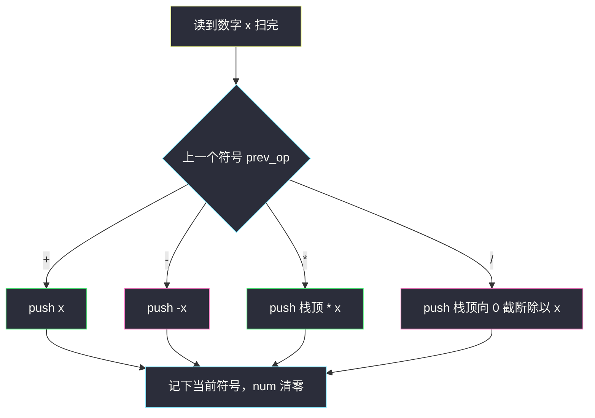
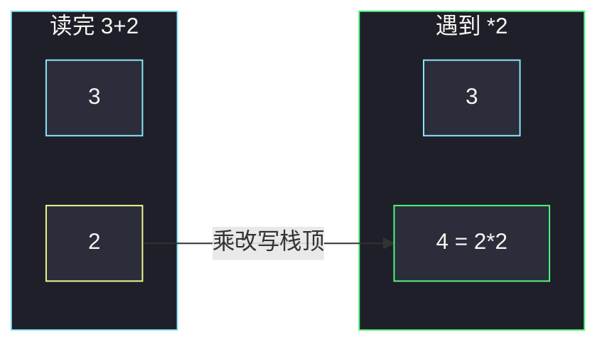

# 基本计算器 II（单栈求值）

## 一、问题描述

给你一个字符串 `s`，表示一个表达式。请实现一个基本计算器来计算并返回它的值。

表达式只含非负整数、`+`、`-`、`*`、`/`（整数除法向 0 截断）和空格，**没有括号**。保证表达式合法、除数不为 0。

> 🔗 LeetCode 227：https://leetcode.cn/problems/basic-calculator-ii/
>
> 数据范围：`1 <= s.length <= 3·10^5`。`s` 由整数和运算符组成，整数范围 `[0, 2^31 - 1]`。

**示例 1**

```
输入：s = "3+2*2"
输出：7
解释：先算 2*2=4，再 3+4=7。
```

**示例 2**

```
输入：s = " 3/2 "
输出：1
解释：3/2 向 0 截断得 1。空格忽略。
```

**示例 3**

```
输入：s = " 3+5 / 2 "
输出：5
解释：5/2=2，再 3+2=5。
```

**直观理解**

`*` `/` 优先于 `+` `-`，又没有括号。不必建语法树：用一个栈把「当前这一项」按**上一个符号**折算成带符号的整数入栈，最后把栈里所有项加起来。

---

## 二、暴力解法

先去掉空格，再两遍扫描：第一遍从左到右消化所有 `*` `/`（遇到就立刻和左边的数运算），第二遍做 `+` `-`。要用列表存「还没乘除完的项」，写法啰嗦且容易在截断除法、负数项上出错。

也可以直接 `eval`，面试不可用，且 Python 的 `//` 是向负无穷取整，和题目「向 0 截断」不一致（例如 `-3/2` 应为 `-1` 而不是 `-2`）。

```python
class Solution:
    def calculate(self, s: str) -> int:
        s = s.replace(" ", "")
        nums, ops = [], []
        i, n = 0, len(s)
        while i < n:
            if s[i].isdigit():
                x = 0
                while i < n and s[i].isdigit():
                    x = x * 10 + int(s[i])
                    i += 1
                if ops and ops[-1] in "*/":
                    op = ops.pop()
                    a = nums.pop()
                    nums.append(a * x if op == "*" else int(a / x))
                else:
                    nums.append(x)
            else:
                ops.append(s[i])
                i += 1
        ans, sign = nums[0], 1
        for i, op in enumerate(ops):
            sign = 1 if op == "+" else -1
            ans += sign * nums[i + 1]
        return ans
```

### 复杂度

- **时间**：`O(n)`，但要拆成「先乘除、后加减」两套逻辑。
- **空间**：`O(n)` 存中间数和符号。

### 🔴 瓶颈在哪里

正确性可以，但状态分散在 `nums` 和 `ops` 两个数组里。其实「上一个符号」就决定当前数字该怎么进栈，一个栈 + 一个 `prev_op` 就够。

---

## 三、优化探索（核心章节）

> 📚 本题在灵茶题单中属于 **表达式解析 · §3.5**。没有括号，优先级只有两档：乘除立刻和栈顶合并，加减作为带符号的新项入栈。

### 3.1 栈里到底存什么

把表达式看成若干「项」的代数和。`+` `-` 开启一项，`*` `/` 改写**当前项**：

| 上一个符号 | 遇到数字 `x` 时做什么 |
|------------|----------------------|
| `+` | 把 `+x` 入栈 |
| `-` | 把 `-x` 入栈 |
| `*` | 弹出栈顶 `t`，压入 `t * x` |
| `/` | 弹出栈顶 `t`，压入「`t / x` 向 0 截断」 |

扫完后栈里全是已经乘除完的项，求和就是答案。



### 3.2 为什么「上一个符号」而不是当前符号

扫描到 `+` 时，它左边的数字才刚拼完，这个数字该归属的是**它前面那个运算符**。当前这个 `+` 要留给下一个数字。所以：

1. 数字：累加 `num = num * 10 + d`
2. 运算符（或字符串结束）：用 `prev_op` 处理 `num`，再把 `prev_op` 更新成当前符号，`num = 0`
3. 空格：跳过
4. `prev_op` 初值为 `+`：相当于表达式前面有一个看不见的 `+`，第一个数字按正数入栈

### 3.3 向 0 截断

Python 的 `//` 对负数是向负无穷。栈里可能有负数（来自 `-`），除法必须写成 `int(t / x)`（先真除法再转 int）。Java 整数 `/` 本身向 0 截断。

### 3.4 一句话核心

> **一个栈存「已经定型的项」；数字跟在上一个符号后面：加减就带符号入栈，乘除就改写栈顶；最后求和。**

---

## 四、代码实现

### Python（主解：单栈）

```python
class Solution:
    def calculate(self, s: str) -> int:
        stack = []
        num = 0
        prev_op = "+"
        s += "+"                              # 哨兵：逼最后一项入栈
        for c in s:
            if c == " ":
                continue
            if c.isdigit():
                num = num * 10 + ord(c) - 48
                continue
            if prev_op == "+":
                stack.append(num)
            elif prev_op == "-":
                stack.append(-num)
            elif prev_op == "*":
                stack.append(stack.pop() * num)
            else:                             # /
                stack.append(int(stack.pop() / num))
            prev_op = c
            num = 0
        return sum(stack)
```

末尾加一个 `+` 哨兵，就不必在循环外再单独处理最后一项。`s` 本身不含括号，哨兵不会和真实符号冲突。

**变量含义**

| 变量 | 含义 |
|------|------|
| `num` | 正在拼的当前整数 |
| `prev_op` | 当前数字左边的运算符 |
| `stack` | 已按优先级折算好的各项 |

### Java（最优解同款）

```java
class Solution {
    public int calculate(String s) {
        Deque<Integer> stack = new ArrayDeque<>();
        int num = 0;
        char prev = '+';
        s = s + "+";
        for (int i = 0; i < s.length(); i++) {
            char c = s.charAt(i);
            if (c == ' ') continue;
            if (Character.isDigit(c)) {
                num = num * 10 + (c - '0');
                continue;
            }
            if (prev == '+') stack.push(num);
            else if (prev == '-') stack.push(-num);
            else if (prev == '*') stack.push(stack.pop() * num);
            else stack.push(stack.pop() / num);   // Java 向 0 截断
            prev = c;
            num = 0;
        }
        int ans = 0;
        for (int x : stack) ans += x;
        return ans;
    }
}
```

---

## 五、具体例子演示

### 5.1 `"3+2*2"`

`prev_op` 初值 `+`，末尾哨兵 `+`。

| 读到 | num | prev_op | 动作 | 栈 |
|------|-----|---------|------|----|
| `3` | 3 | `+` | 拼数 | `[]` |
| `+` | 0 | `+`→`+` | 按旧 `+` 压入 3 | `[3]` |
| `2` | 2 | `+` | 拼数 | `[3]` |
| `*` | 0 | `+`→`*` | 按旧 `+` 压入 2 | `[3, 2]` |
| `2` | 2 | `*` | 拼数 | `[3, 2]` |
| 哨兵 `+` | 0 | `*`→`+` | 弹出 2，压入 `2*2=4` | `[3, 4]` |

`sum = 7` ✓。`*` 发生时 2 已经作为「加项」在栈里，乘直接改写栈顶，相当于把 `+2` 变成 `+4`。



### 5.2 `" 3/2 "`

空格全部跳过，有效字符 `3` `/` `2`。

| 读到 | num | prev_op | 动作 | 栈 |
|------|-----|---------|------|----|
| 空格 | 0 | `+` | 跳过 | `[]` |
| `3` | 3 | `+` | 拼数 | `[]` |
| `/` | 0 | `+`→`/` | 按旧 `+` 压入 3 | `[3]` |
| `2` | 2 | `/` | 拼数 | `[3]` |
| 空格 | 2 | `/` | 跳过 | `[3]` |
| 哨兵 `+` | 0 | `/`→`+` | 弹出 3，`int(3/2)=1` | `[1]` |

`sum = 1` ✓。

再看带负项的除法：`"14-3/2"`。`-` 把 3 变成 `-3` 入栈，随后 `/2` 把栈顶改成 `int(-3/2)= -1`（向 0），总和 `14 + (-1) = 13`。若误用 Python `//` 会得到 `-2`，答案错成 12。

---

## 六、复杂度分析

| 方法 | 时间 | 空间 | 说明 |
|------|------|------|------|
| 两遍：先 `*` `/` 再 `+` `-` | `O(n)` | `O(n)` | 逻辑分叉多 |
| 单栈 + `prev_op`（主解） | `O(n)` | `O(n)` | 最坏全是加减，栈长 `n` |

---

## 七、对比总结

| 维度 | 两遍扫描 | 单栈 |
|------|----------|------|
| 优先级 | 显式分两轮 | 乘除当场合并栈顶 |
| 状态 | 数栈 + 符栈 | 一个数栈 + 一个 `prev_op` |
| 除法 | 同样要向 0 截断 | 同样；Python 用 `int(a/b)` |

**易错点**

1. **空格**：夹在数字中间不会出现（题保证合法），但运算符前后有空格，必须跳过，不能当「结束一项」的信号却忘了保留 `num`。
2. **多位数**：`num = num * 10 + d`，不要只读一位。
3. **Python `//`**：负数向负无穷；必须 `int(t / x)`。
4. **最后一项**：循环在最后一个数字处不会碰到新运算符，要用哨兵或循环后再处理一次。
5. **`prev_op` 初值**：不设成 `+`，第一个数字没有归属。

**模板（§3.5 无括号四则）**

```python
prev_op, num, stack = "+", 0, []
# 读完一个数遇到新符号时：
# +x / -x 入栈；* / 改写栈顶
```

---

## 八、举一反三

| 题目 | 关系 |
|------|------|
| [224. 基本计算器](https://leetcode.cn/problems/basic-calculator/) | 有括号、只有加减：再加一个符号栈或递归下降 |
| [772. 基本计算器 III](https://leetcode.cn/problems/basic-calculator-iii/) | 四则 + 括号，本题栈作「无括号内核」 |
| [150. 逆波兰表达式求值](https://leetcode.cn/problems/evaluate-reverse-polish-notation/) | 后缀表达式，栈模型更直白 |
| [241. 为运算表达式设计优先级](https://leetcode.cn/problems/different-ways-to-add-parentheses/) | 枚举划分点，和「按优先级折叠」对照 |
| [394. 字符串解码](https://leetcode.cn/problems/decode-string/) | 同样是扫一遍 + 栈处理嵌套 |

**思想迁移**

- 见到「运算符有优先级、从左到右」，先问：低优先级的项能不能先以带符号整数的形式躺在栈里，高优先级当场合并。
- 口诀：**「数字跟旧符号走：加减新开一项，乘除打补丁改栈顶。」**
