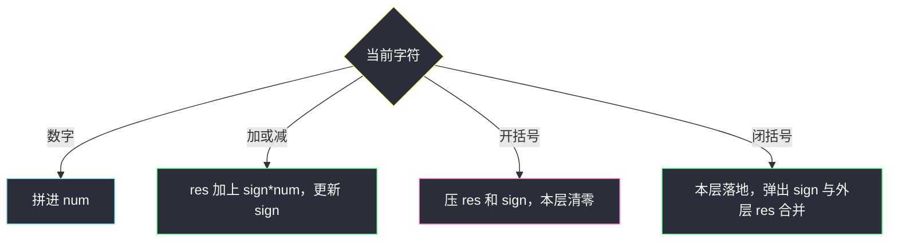
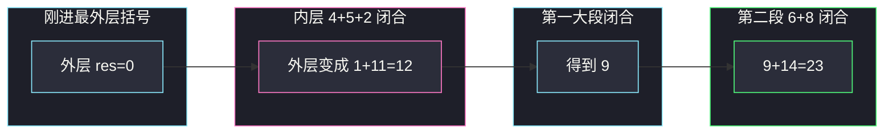

# 基本计算器（符号栈处理括号）

## 一、问题描述

给你一个字符串表达式 `s`，实现一个基本计算器来计算并返回它的值。

表达式只含非负整数、`'+'`、`'-'`、`'('`、`')'` 和空格，**没有乘除**。题目保证表达式合法，且中间结果和答案都在 32 位有符号整数范围内。

> 🔗 LeetCode 224：https://leetcode.cn/problems/basic-calculator/
>
> 数据范围：`1 <= s.length <= 3·10^5`。整数可以有前导零。
>
> 📚 灵茶题单：**表达式解析 · §3.5**。无括号、有乘除的是 [227. 基本计算器 II](https://leetcode.cn/problems/basic-calculator-ii/)，见本目录 `basic-calculator-ii.md`。本题反过来：只有加减，但有括号嵌套。

**示例 1**

```
输入：s = "1 + 1"
输出：2
```

**示例 2**

```
输入：s = " 2-1 + 2 "
输出：3
```

**示例 3**

```
输入：s = "(1+(4+5+2)-3)+(6+8)"
输出：23
```

**直观理解**

没有 `*` `/`，优先级只剩一层：括号改变「当前这一段加减」的归属。每一对括号里都是一个独立的小表达式，算完后乘上括号前面的符号，再加回外层已经算好的部分。栈用来暂存「走进括号之前的外层结果」和「括号前的那个 `+` / `-`」。

227 用栈存**已经定型的项**（乘除当场改栈顶）；本题用栈存**外层现场**，当前层只用 `res` 和 `sign` 两个变量。两者都是 §3.5，状态含义不同。

---

## 二、暴力解法

反复找最内层括号：取出 `( … )` 中间不含括号的片段，按加减求值，用结果替换整对括号，直到没有括号，再算一遍。

```python
class Solution:
    def calculate(self, s: str) -> int:
        def eval_no_paren(t: str) -> int:
            t += "+"
            num, sign, res = 0, 1, 0
            for c in t:
                if c == " ":
                    continue
                if c.isdigit():
                    num = num * 10 + int(c)
                else:
                    res += sign * num
                    num = 0
                    sign = 1 if c == "+" else -1
            return res

        while "(" in s:
            r = s.index(")")
            l = s.rfind("(", 0, r)
            inner = eval_no_paren(s[l + 1:r])
            s = s[:l] + str(inner) + s[r + 1:]
        return eval_no_paren(s)
```

正确，但每层括号都切片拼新串。嵌套很深时反复拷贝，`n = 3·10^5` 会慢，也难处理 `"1-(-2)"` 这种替换后出现的符号粘连（要把内层结果带符号嵌回去）。面试应一遍扫描。

### 复杂度

- **时间**：最坏 `O(n²)`（一层层拷贝）。
- **空间**：`O(n)`。

### 🔴 瓶颈在哪里

「最内层先算」其实就是最后一次还没匹配的 `'('`。不必真的改字符串：遇到 `'('` 把外层 `res`、`sign` 压栈，内层从 0 重新加；遇到 `')'` 弹出，做 `外层 + 括号前符号 × 内层结果`。

---

## 三、优化探索（核心章节）

> 📚 本题在灵茶题单中属于 **§3.5 表达式解析**。227 的核心是「上一个符号决定当前数字怎么入栈」；224 没有乘除，数字读完立刻按当前 `sign` 加进 `res`，括号则把 `(res, sign)` 整份现场压进去。

### 3.1 没有括号时只要两个变量

表达式是若干带符号整数的和。维护：

| 变量 | 含义 |
|------|------|
| `num` | 正在拼的当前非负整数 |
| `sign` | **当前这个数前面的符号**，`+1` 或 `-1` |
| `res` | 本层已经加完的部分 |

规则（先忽略括号）：

- 数字：`num = num * 10 + d`
- `+` / `-`：先把上一笔落地 `res += sign * num`，再令 `sign = ±1`，`num = 0`
- 空格：跳过
- 串结束：再落地一次最后一笔

`sign` 初值为 `+1`，相当于表达式最前面有一个看不见的 `+`。这和 227 里 `prev_op` 初值 `'+'` 是同一件事。

### 3.2 括号：把「本层现场」压栈

`'('` 开始一段新的、要从零算起的内层表达式，但外层还没算完，而且括号前面可能是 `-`。所以压栈两样东西：

1. **外层已经得到的 `res`**
2. **括号前面的 `sign`**（这个符号属于「整段括号」，不是内层第一个数）

然后重置：`res = 0`，`sign = +1`，内层当一个独立的「无括号加减」来算。`num` 此时一定是 0（合法表达式里 `'('` 只出现在开头或运算符之后）。

`')'` 时内层结束：

1. 先把内层最后一笔数字落地：`res += sign * num`，此时 `res` 就是括号里的值
2. 弹出括号前符号 `op`，弹出外层结果 `outer`
3. `res = outer + op * res`

内层的正负已经在它自己的 `sign` 里处理过了（例如 `1-(     -2)` 内层是 `-2`），再乘括号前的 `-` 得到 `1 + (-1)*(-2)`。



### 3.3 和 227 对照：栈里到底是什么

| | 227 基本计算器 II | 224 本题 |
|--|-------------------|----------|
| 运算符 | `+ - * /`，无括号 | `+ - ( )`，无乘除 |
| 栈 | 已经按优先级折好的**项** | 进入括号前的 **`res` + `sign`** |
| 数字归属 | 跟**上一个**运算符走 | 跟当前 `sign` 走，读完运算符立即落地 |
| 哨兵 | 末尾加 `'+'` 逼最后一项入栈 | 循环后再 `res += sign * num`，或同样加哨兵 |

把 227 的「项栈」套到本题也行（括号时把当前层的项先求和再当一个数），但状态更碎。只有加减时，当前层压缩成一个 `res` 就够。

### 3.4 一元负号

题目整数是非负的，但允许 `1-( -2 )` 这种「运算符后紧跟负号」：第二个 `-` 被当成**内层第一个数的符号**，不是一元运算符的新语法。扫描到这个 `-` 时 `num` 仍为 0，先执行 `res += sign * 0`（无影响），再把 `sign` 设成 `-1`，后面的 `2` 就会按负数落地。不必单独写「一元 `-`」分支。

### 3.5 一句话核心

> **当前层用 `res` 和 `sign` 做加减；遇 `'('` 把外层 `res`、括号前 `sign` 压栈并清零；遇 `')'` 先落地再 `外层 + 符号 × 内层`。**

---

## 四、代码实现

### Python（主解：res / sign / 栈）

```python
class Solution:
    def calculate(self, s: str) -> int:
        stack = []          # 成对：…, outer_res, sign_before_paren
        res, num, sign = 0, 0, 1
        for c in s:
            if c == " ":
                continue
            if c.isdigit():
                num = num * 10 + ord(c) - 48
            elif c in "+-":
                res += sign * num
                num = 0
                sign = 1 if c == "+" else -1
            elif c == "(":
                stack.append(res)
                stack.append(sign)
                res, sign = 0, 1
            else:  # )
                res += sign * num
                num = 0
                res *= stack.pop()    # 括号前符号
                res += stack.pop()    # 外层 res
        return res + sign * num
```

循环结束后必须再加一次：最后一项右边没有运算符，`num` 还在手里。若与 227 一样给 `s` 末尾加 `'+'` 哨兵，循环内就能落地，但 `'('` `')'` 与哨兵的交互要更小心，不如循环外一行清楚。

**变量含义**

| 变量 | 含义 |
|------|------|
| `num` | 正在拼的非负整数 |
| `sign` | 当前 `num`（或即将开始的内层）前面的 ±1 |
| `res` | 当前括号层已经累加的和 |
| `stack[-2], stack[-1]` | 外层 `res`，括号前 `sign`（先压 res 再压 sign，弹出相反） |

压栈顺序必须固定：先 `res` 后 `sign`，弹出才能先符号后外层。也可以压一个元组 `(res, sign)`。

### Java（最优解同款）

```java
class Solution {
    public int calculate(String s) {
        Deque<Integer> stack = new ArrayDeque<>();
        int res = 0, num = 0, sign = 1;
        for (int i = 0; i < s.length(); i++) {
            char c = s.charAt(i);
            if (c == ' ') {
                continue;
            }
            if (Character.isDigit(c)) {
                num = num * 10 + (c - '0');
            } else if (c == '+' || c == '-') {
                res += sign * num;
                num = 0;
                sign = c == '+' ? 1 : -1;
            } else if (c == '(') {
                stack.push(res);
                stack.push(sign);
                res = 0;
                sign = 1;
            } else {
                res += sign * num;
                num = 0;
                res *= stack.pop();
                res += stack.pop();
            }
        }
        return res + sign * num;
    }
}
```

Java 的 `ArrayDeque.push` 是栈顶，`pop` 顺序与 Python `append` / `pop` 一致：后压的 `sign` 先出来。

---

## 五、具体例子演示

### 5.1 官方表达式 `"(1+(4+5+2)-3)+(6+8)"`

期望 23。空格没有，逐步看 `res / sign / num / 栈`（栈底在左，栈顶在右；每一对是 `res, sign`）。

| 读到 | num | 动作 | res | sign | 栈 |
|------|-----|------|-----|------|----|
| 开始 | 0 | | 0 | +1 | `[]` |
| `(` | 0 | 压 0, +1，本层清零 | 0 | +1 | `[0, +1]` |
| `1` | 1 | 拼数 | 0 | +1 | `[0, +1]` |
| `+` | 0 | 落地 `0+1*1=1`，sign=+ | 1 | +1 | `[0, +1]` |
| `(` | 0 | 压 1, +1，清零 | 0 | +1 | `[0, +1, 1, +1]` |
| `4` | 4 | 拼数 | 0 | +1 | 同上 |
| `+` | 0 | 落地 `0+1*4=4` | 4 | +1 | 同上 |
| `5` | 5 | 拼数 | 4 | +1 | 同上 |
| `+` | 0 | 落地 `4+5=9` | 9 | +1 | 同上 |
| `2` | 2 | 拼数 | 9 | +1 | 同上 |
| `)` | 0 | 内层落地 `9+2=11`；×(+1)+1 → **12** | 12 | +1 | `[0, +1]` |
| `-` | 0 | 落地 `12+1*0`，sign=- | 12 | -1 | `[0, +1]` |
| `3` | 3 | 拼数 | 12 | -1 | `[0, +1]` |
| `)` | 0 | 落地 `12+(-1)*3=9`；×(+1)+0 → **9** | 9 | +1 | `[]` |
| `+` | 0 | 落地 `9+1*0`，sign=+ | 9 | +1 | `[]` |
| `(` | 0 | 压 9, +1，清零 | 0 | +1 | `[9, +1]` |
| `6` | 6 | 拼数 | 0 | +1 | `[9, +1]` |
| `+` | 0 | 落地 `0+6=6` | 6 | +1 | `[9, +1]` |
| `8` | 8 | 拼数 | 6 | +1 | `[9, +1]` |
| `)` | 0 | 落地 `6+8=14`；×(+1)+9 → **23** | 23 | +1 | `[]` |

循环结束 `num=0`，答案 23 ✓。

第一对括号算完得到 9，即 `1+(4+5+2)-3`；第二对得到 14，即 `6+8`；中间的 `+` 把它们加成 23。关键一步是内层 `(4+5+2)=11` 弹栈：外层当时已经有 `1`，括号前是 `+`，所以 `1 + 11 = 12`，不是把 11 覆盖掉 1。



### 5.2 `" 2-1 + 2 "`（空格 + 无括号）

栈始终为空，完全是 3.1 的两变量模型。

| 读到 | num | 动作 | res | sign |
|------|-----|------|-----|------|
| 空格 | 0 | 跳过 | 0 | +1 |
| `2` | 2 | 拼数 | 0 | +1 |
| `-` | 0 | `res=0+1*2=2`，sign=- | 2 | -1 |
| `1` | 1 | 拼数 | 2 | -1 |
| 空格 | 1 | 跳过，**num 保留** | 2 | -1 |
| `+` | 0 | `res=2+(-1)*1=1`，sign=+ | 1 | +1 |
| `2` | 2 | 拼数 | 1 | +1 |
| 结束 | | `1 + 1*2 = 3` | 3 | |

空格不是「结束一项」的信号，只有运算符和括号才会落地。若在空格处误把 `num` 清零，`2-1` 会丢。

### 5.3 `"1-(     -2)"` —— 括号前的减号 × 内层负号

| 读到 | num | 动作 | res | sign | 栈 |
|------|-----|------|-----|------|----|
| `1` | 1 | 拼数 | 0 | +1 | `[]` |
| `-` | 0 | `res=1`，sign=- | 1 | -1 | `[]` |
| `(` | 0 | 压 res=1、sign=-1，内层重置 | 0 | +1 | `[1, -1]` |
| `-` | 0 | 内层落地 `0+1*0`，sign=- | 0 | -1 | `[1, -1]` |
| `2` | 2 | 拼数 | 0 | -1 | `[1, -1]` |
| `)` | 0 | 内层 `0+(-1)*2=-2`；×(-1)+1 → **3** | 3 | | `[]` |

内层算出 `-2`，括号前符号是 `-`，`-(-2)=+2`，再加外层的 `1` 得 3。两个 `-` 职责不同：第一个是括号前符号（躺在栈里），第二个是内层 `sign`。

### 5.4 `"2-(5-6)"`

内层 `5-6 = -1`，括号前 `-`，`2 + (-1)*(-1) = 3`。逐步：

- `2` 然后 `-`：`res=2, sign=-1`
- `'('`：栈 `[2, -1]`，内层 `res=0, sign=+1`
- `5` `'-'`：`res=5, sign=-1`
- `6` `')'`：内层 `5+(-1)*6=-1`；`-1 * (-1) + 2 = 3`

若错误地在 `'('` 时不压 `sign`，内层的 `-1` 会直接替代 2，答案变成 -1。

---

## 六、复杂度分析

| 方法 | 时间 | 空间 | 说明 |
|------|------|------|------|
| 反复替换最内层括号 | `O(n²)` | `O(n)` | 大 `n` 不稳 |
| 单遍 `res/sign` + 栈（主解） | `O(n)` | `O(n)` | 最坏括号嵌套 `n/2` 层 |

每个字符进循环一次；数字按位累加仍是 `O(n)`。

---

## 七、对比总结

| 维度 | 227（见 `basic-calculator-ii.md`） | 224 本题 |
|------|-----------------------------------|----------|
| 优先级 | 乘除改栈顶，加减新开项 | 只有加减，当前层一个 `res` |
| 括号 | 无 | 栈存外层现场 |
| 落地时机 | 读到**下一个**运算符，用 `prev_op` 处理 `num` | 读到 `+` `-` `)` 或结束 |
| 末尾 | 常用 `'+'` 哨兵 | 循环外 `res + sign*num` |

**易错点**

1. **多位数**：`num = num * 10 + d`，不要只读一位。
2. **空格**：跳过时不要清 `num`、不要改 `sign`。
3. **压栈顺序**：先 `res` 后 `sign`；`'('` 后必须 `res=0, sign=+1`，否则内层会继承外层符号。
4. **`')'` 忘记先落地**：内层最后一个数字还在 `num` 里，会丢。
5. **循环结束不加最后一项**：`"1+1"` 的第二个 1 右边没有运算符。
6. **用 Python 列表当栈时 `pop` 错层**：一次 `')'` 必须弹两次（或弹一个元组）。
7. **把本题写成 227 的项栈却忘了括号**：没有 `*` `/` 时项栈能做，但每进一层还要再开一个栈或递归，不如 `res/sign` 干净。

**模板（§3.5 有括号只有加减）**

```python
res, num, sign, stack = 0, 0, 1, []
# 数字拼 num；+/- 先 res += sign*num 再改 sign
# '(' 压 res, sign，清零；')' 落地后 res = 栈sign*res + 栈res
```

递归下降也是同一结构：`expr` 里调用 `expr` 处理括号。栈把递归的「返回地址」显式写出来，适合 `n` 很大、不想爆调用栈的场合。

---

## 八、举一反三

| 题目 | 关系 |
|------|------|
| [227. 基本计算器 II](https://leetcode.cn/problems/basic-calculator-ii/) | 无括号有乘除，项栈 + `prev_op`；见 `basic-calculator-ii.md` |
| [772. 基本计算器 III](https://leetcode.cn/problems/basic-calculator-iii/) | 四则 + 括号：227 的内核套上本题的括号栈（或递归） |
| [150. 逆波兰表达式求值](https://leetcode.cn/problems/evaluate-reverse-polish-notation/) | 后缀表达式，栈模型更直白 |
| [394. 字符串解码](https://leetcode.cn/problems/decode-string/) | 同样「`'['` 压现场，`']'` 弹出拼接」 |
| [1190. 反转每对括号间的子串](https://leetcode.cn/problems/reverse-substrings-between-each-pair-of-parentheses/) | 括号分层，加工动作换成反转 |
| [241. 为运算表达式设计优先级](https://leetcode.cn/problems/different-ways-to-add-parentheses/) | 枚举划分点，和「按括号结构求值」对照 |

**思想迁移**

- 见到「表达式 + 括号」，先问当前层能否压缩成一个数。能的话，`'('` 只保存外层两个数（结果和符号），不要保存整段字符串。
- 口诀：**「数字跟当前符号走；加号减号先落地；开括号压现场，闭括号乘符号加回去。」**
