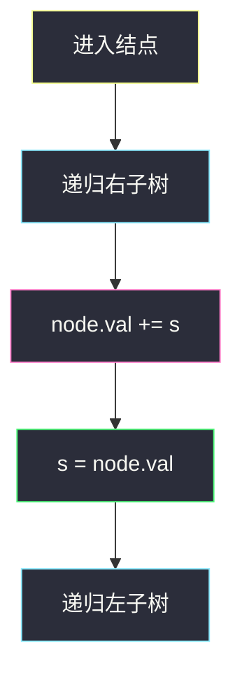

# 从二叉搜索树到更大和树（反中序累加）

## 一、问题描述

给定二叉搜索树（BST）的根，把每个结点改成：**原值 + 所有比它大的结点值之和**（即「大于等于自己的所有值的和」）。返回改完后的根（原地修改即可）。

> 🔗 LeetCode 1038：https://leetcode.cn/problems/binary-search-tree-to-greater-sum-tree/
>
> 📚 灵神题单：**二叉树 · §2.5 有递有归**
>
> 数据范围：结点数 `n ∈ [1, 100]`，`0 ≤ Node.val ≤ 100`，值互异，输入保证是 BST。
>
> 与 [#538 把二叉搜索树转换为累加树](https://leetcode.cn/problems/convert-bst-to-greater-tree/) **是同一题**（题解见 `convert-bst-to-greater-tree.md`）。

**示例 1**

```
输入：root = [4,1,6,0,2,5,7,null,null,null,3,null,null,null,8]
输出：[30,36,21,36,35,26,15,null,null,null,33,null,null,null,8]
```

```
原树（中序升序 0,1,2,3,4,5,6,7,8）
        4
       / \
      1   6
     / \ / \
    0  2 5  7
        \    \
         3    8
```

**示例 2**

```
输入：root = [0,null,1]
输出：[1,null,1]
解释：0 变成 0+1=1，1 右边没有更大的，仍是 1。
```

**直观理解**

BST 的中序是升序。若从大到小扫一遍（**右 → 根 → 左**），扫到某个点时，所有比它大的都已经路过。用一个累加器 `s` 记下「目前见过的值的和」，当前结点先加上 `s`，再把自身新值写回 `s`。

---

## 二、暴力解法

对每个结点，再遍历整棵树，把所有 `> node.val` 的值加到它头上。`O(n²)`。`n = 100` 能过，但没用 BST。

```python
class Solution:
    def bstToGst(self, root: TreeNode) -> TreeNode:
        vals = []
        def collect(n):
            if n:
                collect(n.left); vals.append(n.val); collect(n.right)
        collect(root)
        # 后缀和：比 v 大的之和
        suf = {}
        s = 0
        for v in reversed(vals):
            suf[v] = s
            s += v
        def apply(n):
            if n:
                n.val += suf[n.val]
                apply(n.left); apply(n.right)
        apply(root)
        return root
```

先中序拿出有序数组，再做后缀和，最后写回——正确，但走了三遍，还占额外数组。

### 复杂度

- **时间**：朴素每个点扫树 `O(n²)`；中序 + 后缀和 `O(n)` 但多两次遍历。
- **空间**：`O(n)` 数组，或递归 `O(h)`。

### 🔴 瓶颈在哪里

「比我大的和」在反中序过程中**边走边有**。不必先存数组：递归右子树（大的先处理）→ 更新当前 → 再递归左子树。一遍完成，只靠一个外部累加器 `s`。这正是 §2.5「有递有归」：递的时候往右走，归的时候带着已经累好的 `s`。

---

## 三、优化探索（核心章节）

> 📚 对齐灵神 **§2.5 有递有归**：中序是左-根-右（从小到大）；反过来右-根-左就是从大到小。递先进入右子树，归时 `s` 已经包含所有更大值。

### 3.1 反中序与累加器

维护 `s` =「已经访问过的结点的**新值之和**」，初始 0（还没见过任何人）。

访问顺序：8 → 7 → 6 → 5 → 4 → 3 → 2 → 1 → 0。

对当前结点：

1. 先递归右子（所有更大的先改完，`s` 已是它们的原值和，也等于它们的新值和里「只含更大」的那部分）
2. `node.val += s`（加上所有更大的）
3. `s = node.val`（现在 `s` 含本结点，供更小的结点使用）
4. 再递归左子

步骤 2、3 等价于 `s += 原值; node.val = s`。



### 3.2 为什么 BST 必不可少

反中序「从大到小」依赖中序是排序。普通二叉树中序不是有序的，不能这么加。若只是「改成右侧结点和」，那是另一题，要按树形而不是按值。

### 3.3 一句话核心

> **BST 反中序（右-根-左）从大到小走；路过时 `s` 已是所有更大值的和，`node.val += s`，再 `s = node.val`。**

---

## 四、代码实现

### Python（主解：反中序一遍改）

```python
class Solution:
    def bstToGst(self, root: TreeNode) -> TreeNode:
        s = 0

        def dfs(node: TreeNode) -> None:
            nonlocal s
            if not node:
                return
            dfs(node.right)          # 先走更大的
            node.val += s
            s = node.val
            dfs(node.left)

        dfs(root)
        return root
```

**变量含义**

| 变量 | 含义 |
|------|------|
| `s` | 已处理（值更大）的结点原值之和；更新后等于当前结点的新值 |
| `dfs` | 右-根-左 |

面试默写就这一段：闭包里 `nonlocal s`，或把 `s` 做成列表 `s = [0]` 避免 nonlocal。不要先收集数组再写回。

Morris 反中序能做到 `O(1)` 额外空间，现场没必要写。

---

## 五、具体例子演示

示例 1，只跟踪「访问顺序」和累加器 `s`（初值 0）。

| 步 | 访问结点（原值） | 操作 | 新值 | `s` 更新后 |
|----|------------------|------|------|------------|
| 1 | 8 | `8 += 0` | 8 | 8 |
| 2 | 7 | `7 += 8` | 15 | 15 |
| 3 | 6 | `6 += 15` | 21 | 21 |
| 4 | 5 | `5 += 21` | 26 | 26 |
| 5 | 4 | `4 += 26` | 30 | 30 |
| 6 | 3 | `3 += 30` | 33 | 33 |
| 7 | 2 | `2 += 33` | 35 | 35 |
| 8 | 1 | `1 += 35` | 36 | 36 |
| 9 | 0 | `0 += 36` | 36 | 36 |

根 4 变成 30；最左 0 变成 36（全树之和）；最右 8 仍是 8。与官方输出一致。

示例 2 逐步：先走 1，`1 += 0 → 1`，`s = 1`；再走 0，`0 += 1 → 1`。

```mermaid
flowchart TD
    subgraph Order["反中序访问"]
        a8["8  s:0→8"]
        a7["7  s:8→15"]
        a6["6  s:15→21"]
        a5["5  s:21→26"]
        a4["4  s:26→30"]
        a3["3  s:30→33"]
        a2["2  s:33→35"]
        a1["1  s:35→36"]
        a0["0  s:36→36"]
        a8 --> a7 --> a6 --> a5 --> a4 --> a3 --> a2 --> a1 --> a0
    end

    style Order fill:#1e1f29,stroke:#8be9fd,color:#f8f8f2
    style a8 fill:#2b2d3a,stroke:#f1fa8c,color:#f8f8f2
    style a7 fill:#2b2d3a,stroke:#8be9fd,color:#f8f8f2
    style a6 fill:#2b2d3a,stroke:#8be9fd,color:#f8f8f2
    style a5 fill:#2b2d3a,stroke:#8be9fd,color:#f8f8f2
    style a4 fill:#2b2d3a,stroke:#ff79c6,color:#f8f8f2
    style a3 fill:#2b2d3a,stroke:#8be9fd,color:#f8f8f2
    style a2 fill:#2b2d3a,stroke:#8be9fd,color:#f8f8f2
    style a1 fill:#2b2d3a,stroke:#8be9fd,color:#f8f8f2
    style a0 fill:#2b2d3a,stroke:#50fa7b,color:#f8f8f2
```



粉是原来的根；绿是最小结点（吃掉全树之和）。

---

## 六、复杂度分析

| 方法 | 时间 | 空间 | 说明 |
|------|------|------|------|
| 每点再扫一遍树 | `O(n²)` | `O(h)` | 没用有序性 |
| 中序数组 + 后缀和 | `O(n)` | `O(n)` | 多存一份序列 |
| 反中序累加（主解） | `O(n)` | `O(h)` | `h` 为树高，最坏 `n` |

每个结点进出递归各一次；额外内存只有一个整数 `s` 和栈。

---

## 七、对比总结

| 维度 | 普通中序 | 反中序（本题） |
|------|----------|----------------|
| 顺序 | 升序 | 降序 |
| 累加器含义 | 比我**小**的和 | 比我**大**的和 |
| 典型题 | 第 k 小 / 校验 BST | 累加树 / GST |

**易错点**

1. **写成左-根-右**：那是从小到大，会加成「更小的和」，题意反了。
2. **先改 `s` 再加到结点**：必须先 `node.val += s`（`s` 还不含自己），再 `s = node.val`。写成 `s += node.val` 再赋值也可以，但不要 `node.val = s` 却忘了加自己。
3. **返回 None**：要返回原根，调用方还拿着它。
4. **把「右子树的和」当成「所有更大值」**：左子树里也可能有比当前根大的吗？BST 里没有。但当前根的右子之外，祖先右侧还有更大值——所以必须靠全局 `s`，不能只加 `node.right` 那一棵。
5. **与 538 当两题背**：接口名不同（`bstToGst` / `convertBST`），代码可一字不差。

**模板（§2.5 反中序）**

```python
def dfs(node):
    if not node:
        return
    dfs(node.right)
    # 在这里用 s 更新 node
    dfs(node.left)
```

---

## 八、举一反三

| 题目 | 关系 |
|------|------|
| [538. 把二叉搜索树转换为累加树](https://leetcode.cn/problems/convert-bst-to-greater-tree/) | **同一题**；站点题解 `convert-bst-to-greater-tree.md` |
| [94. 二叉树的中序遍历](https://leetcode.cn/problems/binary-tree-inorder-traversal/) | 把左-根-右改成右-根-左即本题骨架 |
| [230. 二叉搜索树中第 K 小的元素](https://leetcode.cn/problems/kth-smallest-element-in-a-bst/) | 正中序走到第 k 个；对称地用「有递有归」 |
| [938. 二叉搜索树的范围和](https://leetcode.cn/problems/range-sum-of-bst/) | 仍利用 BST 序剪枝，按值区间累加 |
| [98. 验证二叉搜索树](https://leetcode.cn/problems/validate-binary-search-tree/) | 正中序必须严格递增，对照「顺序一旦用错就全错」 |

**思想迁移**

- 需要「所有更大 / 更小」时，先问能不能按 BST 中序变成一次扫描。
- 口诀：**「右根左，从大到小；先加旧 s，再把新值写回 s。」**
