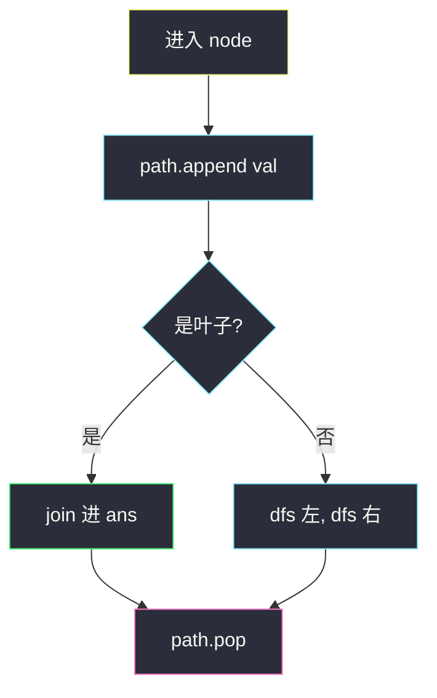
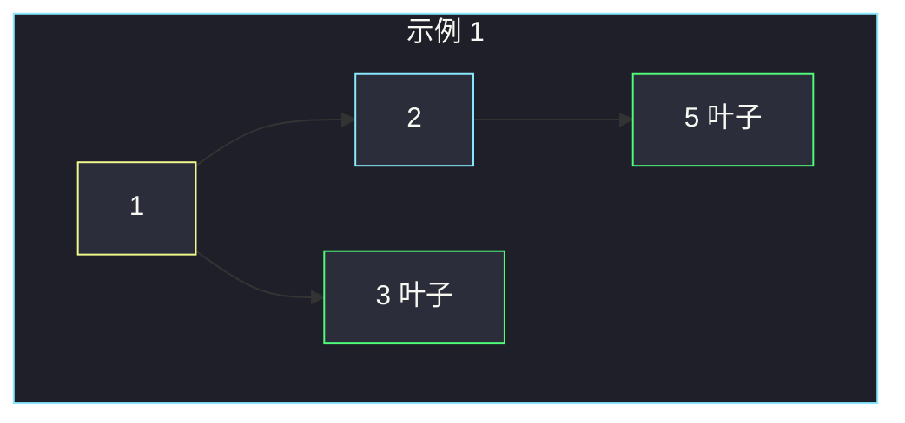

# 二叉树的所有路径（DFS 回溯 · 叶子 join）

## 一、问题描述

给你二叉树的根节点 `root`，返回**所有从根到叶子**的路径，格式为 `"1->2->5"` 这样的字符串。叶子 = 没有左右孩子。

> 🔗 LeetCode 257：https://leetcode.cn/problems/binary-tree-paths/
>
> 数据范围：节点数 `[1, 100]`，`-100 <= Node.val <= 100`。
>
> 📚 灵神题单 **§2.7 回溯**。

**示例 1**

```
输入：root = [1,2,3,null,5]
输出：["1->2->5","1->3"]
树形：
      1
     / \
    2   3
     \
      5
```

**示例 2**

```
输入：root = [1]
输出：["1"]
解释：根自己就是叶子，路径只有一个数。
```

**直观理解**

从根往下走，边走边记下经过的节点；走到叶子时，把路上的数字用 `"->"` 拼成一句，放进答案。走完一条要**退回去**再试另一边——这就是回溯：`append → 递归 → pop`。

---

## 二、暴力解法

每走到一个节点就**复制一份**当前路径字符串往下传（`path + "->" + val`）。到叶子直接加入答案。不用显式 `pop`，因为每条递归分支拿的是自己的新字符串。

```python
class Solution:
    def binaryTreePaths(self, root: Optional[TreeNode]) -> List[str]:
        ans = []

        def dfs(node: TreeNode, path: str) -> None:
            if not node.left and not node.right:
                ans.append(path)
                return
            if node.left:
                dfs(node.left, path + "->" + str(node.left.val))
            if node.right:
                dfs(node.right, path + "->" + str(node.right.val))

        dfs(root, str(root.val))
        return ans
```

正确，但每步都新拼字符串，最坏每条路径 `O(h)` 拷贝，总时间容易到 `O(n·h)`。回溯用一份列表原地改，才是 §2.7 要练的肌肉。

### 🔴 瓶颈在哪里

路径是「走下去加、回来减」的栈。复制字符串把栈的语义藏进不可变对象里了；面试要的是看得见的 `append` / `pop`。

---

## 三、优化探索（核心章节）

> 📚 灵神 **§2.7 回溯**：选择 → 进入 → 撤销。二叉树上「选择」就是走进左/右孩子。

### 3.1 路径列表当栈

`path` 存根到当前节点的值（字符串形式，方便最后 `join`）：

1. `path.append(str(node.val))`
2. 若是叶子：`ans.append("->".join(path))`
3. 否则递归左右（空孩子不进）
4. `path.pop()` —— 无论叶子还是内部，离开本节点都要撤销



### 3.2 为什么必须 pop

同一份 `path` 被所有递归共享。不 pop，左子树走完后右子树还会看到左边的节点。叶子处只**读** `path` 做 join，不要在叶子里额外 pop 两次。

### 3.3 一句话核心

> **先把自己放进路径；叶子就收藏一句；离开时一定弹出。**

---

## 四、代码实现

### Python（主解：回溯默写）

```python
class Solution:
    def binaryTreePaths(self, root: Optional[TreeNode]) -> List[str]:
        ans, path = [], []

        def dfs(node: Optional[TreeNode]) -> None:
            if not node:
                return
            path.append(str(node.val))
            if not node.left and not node.right:
                ans.append("->".join(path))
            else:
                dfs(node.left)
                dfs(node.right)
            path.pop()

        dfs(root)
        return ans
```

`dfs(None)` 直接 return，所以内部节点可以无脑左右都调。叶子走 `else` 的对立面，不会对空孩子 `append`。

题目保证 `root` 非空；若要兼容空树，开头 `if not root: return []` 即可。

---

## 五、具体例子演示

示例 1，跟踪 `path` 栈：

```
      1
     / \
    2   3
     \
      5
```

| 动作 | path | ans |
|------|------|-----|
| 进入 1 | `[1]` | |
| 进入 2 | `[1,2]` | |
| 进入 5（叶子） | `[1,2,5]` | `["1->2->5"]` |
| pop 5，pop 2 | `[1]` | |
| 进入 3（叶子） | `[1,3]` | `["1->2->5","1->3"]` |
| pop 3，pop 1 | `[]` | 结束 |



单节点 `[1]`：append `"1"` → 叶子 → join 得 `"1"`（没有 `->`）→ pop。

---

## 六、复杂度分析

| 方法 | 时间 | 空间 | 说明 |
|------|------|------|------|
| 字符串拷贝往下传 | `O(n·h)` | `O(h)` 栈 + 答案 | 每次拼接拷路径 |
| 回溯列表（主解） | `O(n·h)` | `O(h)` 栈 + `path` | join 仍按路径长度；答案本身 `O(n·h)` |

`h` 最坏 = `n`。答案里每个节点在各条路径上各出现一次，输出规模下界就是这个量级。

---

## 七、对比总结

| 题 | 叶子做什么 | 要不要撤销 |
|--|-----------|-----------|
| #112 路径总和 | 判断剩余是否为 0 | 加完要减回来（或参数传递） |
| #257 所有路径 | 把 path join 进答案 | **必须 pop** |
| #129 根到叶数字 | 累加 `sum*10+val` | 参数传递则不必 pop |

**易错点**

1. 忘记 `pop`：右子路径前面粘着左子的尾巴。
2. 叶子也去 `dfs(left)`：空节点被 `append`，或要在 `if node` 里防。
3. 根叶子漏了：路径应是 `"1"` 不是 `"1->"`。
4. 只在叶子 `append`、却在进入时没 `append` 当前节点——路径缺根或缺最后一层。

---

## 八、举一反三

| 题目 | 关系 |
|------|------|
| [112. 路径总和](https://leetcode.cn/problems/path-sum/) | 同一 DFS，叶子改成判断和 |
| [113. 路径总和 II](https://leetcode.cn/problems/path-sum-ii/) | 收藏路径数字列表，回溯骨架相同 |
| [129. 求根节点到叶节点数字之和](https://leetcode.cn/problems/sum-root-to-leaf-numbers/) | 路径当十进制数，不必物化字符串 |
| [988. 从叶结点开始的最小字符串](https://leetcode.cn/problems/smallest-string-starting-from-leaf/) | 叶子到根反着拼，仍是 DFS |
| [111. 二叉树的最小深度](https://leetcode.cn/problems/minimum-depth-of-binary-tree/) | 同批：只关心最近一片叶子，见 `minimum-depth-of-binary-tree.md` |

**思想迁移**

- 口诀：**「进栈记节点，叶子拼成句，回来一定弹。」**
