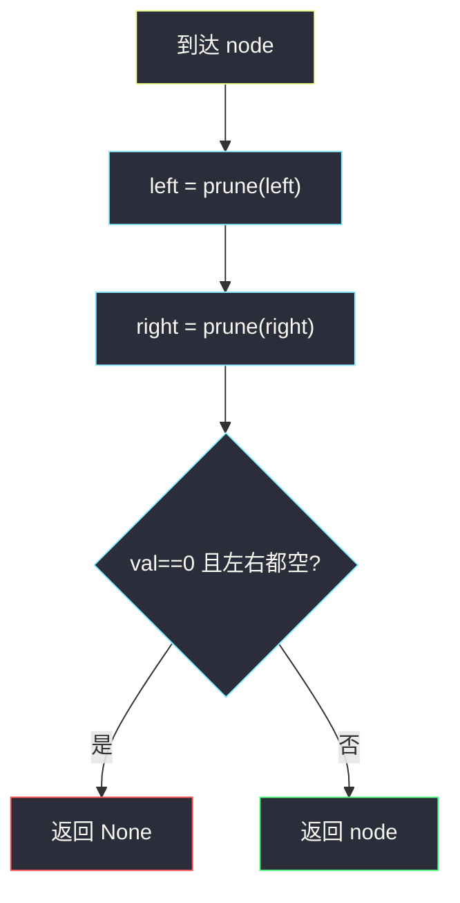
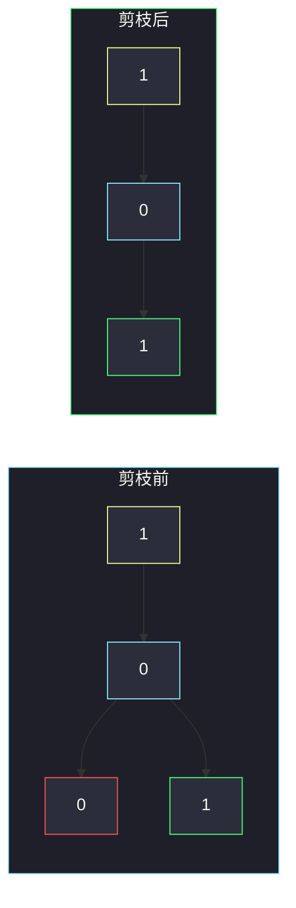

# 二叉树剪枝（自底向上 · 删不含 1 的子树）

## 一、问题描述

给定二叉树根 `root`，节点值只有 0 或 1。删掉所有**不含 1** 的子树，返回剪完后的根。子树 = 该节点加上它的全部后代。

整棵树都是 0 时，返回空树。

> 🔗 LeetCode 814：https://leetcode.cn/problems/binary-tree-pruning/
>
> 数据范围：节点数 `[1, 200]`，`Node.val` 为 0 或 1。
>
> 📚 灵茶题单：**二叉树 · §2.4 自底向上 DFS：删点**（1380 分）。

**示例 1**

```
输入：root = [1,null,0,0,1]
输出：[1,null,0,null,1]
剪枝前：          剪枝后：
    1                 1
     \                 \
      0                 0
     / \                 \
    0   1                 1
左边那个 0 是纯 0 叶子，整棵子树不含 1，删掉。
```

**示例 2**

```
输入：root = [1,0,1,0,0,0,1]
输出：[1,null,1,null,1]
剪枝前：              剪枝后：
        1                 1
       / \                 \
      0   1                 1
     / \ / \                 \
    0  0 0  1                 1
根的左子树全是 0，整块剪掉。
```

**直观理解**

一个节点能不能留，取决于「自己是不是 1」以及「左右剪完之后还剩不剩孩子」。左右必须先剪完，再决定自己——默认**子树已经处理好**。这是后序删点，§2.4。

---

## 二、暴力解法

另写一个「子树里有没有 1」的函数，对每个节点先检查再决定删不删，没 1 就把整棵子树摘掉：

```python
class Solution:
    def pruneTree(self, root: Optional[TreeNode]) -> Optional[TreeNode]:
        def contains_one(node: Optional[TreeNode]) -> bool:
            if node is None:
                return False
            return node.val == 1 or contains_one(node.left) or contains_one(node.right)

        def dfs(node: Optional[TreeNode]) -> Optional[TreeNode]:
            if node is None or not contains_one(node):
                return None
            node.left = dfs(node.left)
            node.right = dfs(node.right)
            return node

        return dfs(root)
```

`contains_one` 在每个点都把子树扫一遍，重复访问。

### 复杂度

- **时间**：每个点触发一次子树扫描，最坏 `O(n²)`。
- **空间**：`O(h)` 递归栈。

`n = 200` 能过，但同一棵子树被问了很多次。

### 🔴 瓶颈在哪里

后序递归时，左右返回值已经告诉你「这边还剩没有」。当前点只看：自己是 0、且左右都空 → 整棵子树不含 1。信息从孩子归上来，一遍就够。

---

## 三、优化探索（核心章节）

> 📚 本题在灵茶题单中属于 **二叉树 · §2.4 自底向上 DFS：删点**。先递归左右（子树已剪完），再决定当前节点是留下还是变成 `None`。

### 3.1 什么时候删自己

当前节点该变成 `None`，当且仅当：

- `node.val == 0`，并且
- 左孩子剪完后是空，右孩子剪完后也是空

换句话说：这棵子树里一个 1 都没有。`val == 1` 的叶子必须留——它自己就是 1。

### 3.2 后序骨架

```
node.left  = prune(node.left)    # 子树已经处理好
node.right = prune(node.right)
if 自己是 0 且左右都空:
    return None                  # 把自己删了
return node
```

必须把返回值接回 `left` / `right`。只 `return None` 而不改父节点的指针，那块 0 还挂在树上。



### 3.3 一句话核心

> **先剪左右；0 且两边都空就返回 None，否则留下自己。**

---

## 四、代码实现

### Python（主解：后序删点）

```python
class Solution:
    def pruneTree(self, root: Optional[TreeNode]) -> Optional[TreeNode]:
        if root is None:
            return None
        root.left = self.pruneTree(root.left)
        root.right = self.pruneTree(root.right)
        if root.val == 0 and root.left is None and root.right is None:
            return None
        return root
```

**变量含义**

| 写法 | 含义 |
|------|------|
| `root.left = prune(...)` | 左子剪完后可能变成空，必须接回来 |
| 三个条件同时成立 | 当前子树不含 1，删掉本节点 |

空节点返回 `None`。根若被删，函数返回 `None`。

不必单独判断叶子：叶子的左右本来就是 `None`，`val==0` 会删、`val==1` 会留。

### Java（可选）

```java
class Solution {
    public TreeNode pruneTree(TreeNode root) {
        if (root == null) return null;
        root.left = pruneTree(root.left);
        root.right = pruneTree(root.right);
        if (root.val == 0 && root.left == null && root.right == null) {
            return null;
        }
        return root;
    }
}
```

---

## 五、具体例子演示

**示例 1**：后序，先处理下面的点。

```
剪枝前：                剪枝后：
    1                     1
     \                     \
      0                     0
     / \                     \
    0   1                     1
```

| 访问（后序） | 节点 | 左右剪完后 | 决策 |
|--------------|------|------------|------|
| 1 | 左 0 | 左右皆空，val=0 | **返回 None** |
| 2 | 右 1 | 左右皆空，val=1 | 留下 |
| 3 | 中间 0 | 左空、右是 1 | 留下（右边还有 1） |
| 4 | 根 1 | 左空、右是 0 | 留下 |



红节点是被剪掉的纯 0 叶子。中间那个 0 因为右边还有 1，必须留着当桥。

**示例 2** 后序把左子树从叶子往上剪：

```
剪枝前：                  剪枝后：
        1                     1
       / \                     \
      0   1                     1
     / \ / \                     \
    0  0 0  1                     1
```

| 区域 | 后序结果 |
|------|----------|
| 左子树四个 0 | 两片 0 叶子先变 `None`，它们的父 0 左右皆空，也变 `None`；根的 `left` 接回空 |
| 右子树 `1 / 0 / 1` | 左 0 叶子删掉；父 1 留下；最右 1 留下 |

0 只是桥的时候不能删：示例 1 中间那个 0 右边还有 1，必须留着。示例 2 左边的 0 剪完后两边都空，整块消失。

---

## 六、复杂度分析

| 方法 | 时间 | 空间 | 说明 |
|------|------|------|------|
| 每点再扫「有没有 1」 | `O(n²)` | `O(h)` | 重复访问 |
| 后序一遍（主解） | `O(n)` | `O(h)` 递归栈 | 每点进出一次；`n ≤ 200`，`h ≤ n` |

---

## 七、对比总结

| 维度 | 自顶向下 #1448 | 本题自底向上删点 |
|------|----------------|------------------|
| 信息方向 | 祖先参数往下 | 孩子返回值往上 |
| 默认假设 | 路上最大值已知 | **子树已经处理好** |
| 删不删 | 不删点 | 归上来再决定自己在不在 |

**易错点**

1. **先看自己再递归**：左右还没剪，不能根据「此刻孩子非空」判断子树有没有 1。必须后序。
2. **返回值没接回去**：`prune(root.left)` 的结果要赋给 `root.left`。
3. **`val==1` 的叶子被误删**：删除条件必须带 `val==0`。
4. **中间的 0 当桥**：只要左右剪完后还有一边非空，0 也要留。
5. 整棵树全 0：根也会被删，返回 `None`，不是返回一个 0 节点。

---

## 八、举一反三

| 题目 | 关系 |
|------|------|
| [1325. 删除给定值的叶子节点](https://leetcode.cn/problems/delete-leaves-with-a-given-value/) | 同节后序删点；删完可能露出新叶子，继续判 |
| [669. 修剪二叉搜索树](https://leetcode.cn/problems/trim-a-binary-search-tree/) | 后序 + BST 范围，整段子树可直接丢掉 |
| [1110. 删点成林](https://leetcode.cn/problems/delete-nodes-and-return-forest/) | 后序删点，被删节点的孩子成为新树根 |
| [450. 删除二叉搜索树中的节点](https://leetcode.cn/problems/delete-node-in-a-bst/) | 删一个点后要接上后继，比「整棵子树丢掉」复杂 |
| [1080. 根到叶路径上的不足节点](https://leetcode.cn/problems/insufficient-nodes-in-root-to-leaf-paths/) | 自底向上：子树最大路径和不够就删 |

**思想迁移**

- 删不删取决于子树内部 → 后序；默认子树已处理完，再问自己留不留。
- 口诀：**「先剪左右；0 且两边空则返回空。」**
