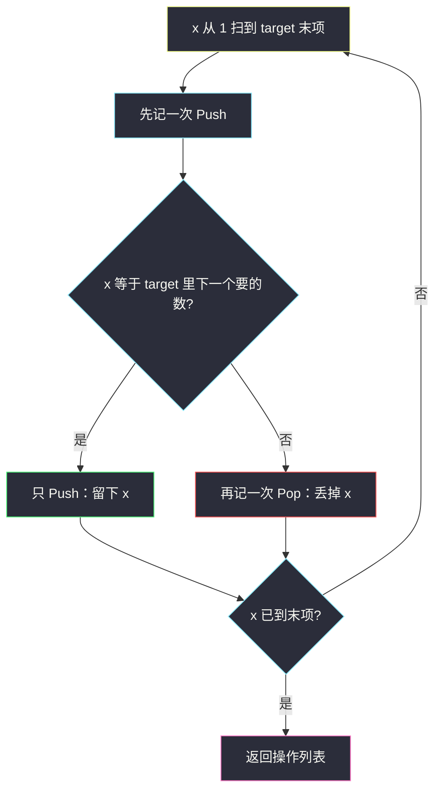
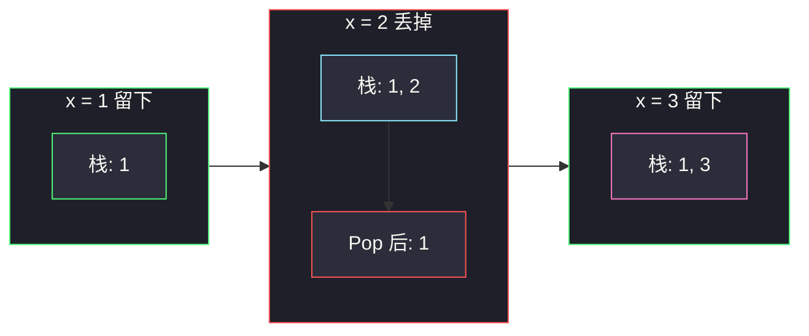

# 用栈操作构建数组（模拟栈：该留就 Push，不该留就 Push+Pop）

## 一、问题描述

给你一个严格递增的整数数组 `target` 和一个整数 `n`。从空栈出发，数字流按 `1, 2, …, n` 依次到来。每次只能做两种操作：

- `"Push"`：把流中下一个数压入栈顶；
- `"Pop"`：弹出栈顶。

请返回一组操作序列，使得**某时刻栈底到栈顶恰好等于 `target`**。一旦达成就立刻停，不再读后续数字。多解返回任意一组即可。`target` 保证是 `1..n` 的子集且严格递增。

> 🔗 LeetCode 1441：https://leetcode.cn/problems/build-an-array-with-stack-operations/
>
> 数据范围：`1 <= target.length <= 100`，`1 <= n <= 100`，`1 <= target[i] <= n`，`target` 严格递增。
>
> 📚 本题出自灵茶题单 **§3.1 基础**（栈）。同节姊妹题见 [#2390 从字符串中移除星号](https://leetcode.cn/problems/removing-stars-from-a-string/)（`removing-stars-from-a-string.md`）：那边用栈消字符，这边用栈「构造目标序列」。

**示例 1**

```
输入：target = [1,3], n = 3
输出：["Push","Push","Pop","Push"]
解释：流 1→Push 栈 [1]；流 2→Push 栈 [1,2]；Pop 栈 [1]；流 3→Push 栈 [1,3]。达成。
```

**示例 2**

```
输入：target = [1,2,3], n = 3
输出：["Push","Push","Push"]
解释：三个数都要留下，只 Push 不 Pop。
```

**示例 3**

```
输入：target = [1,2], n = 4
输出：["Push","Push"]
解释：栈已是 [1,2]，不必再读 3、4。多余的数根本不用 Push。
```

**直观理解**

流是 `1..n` 的固定顺序，栈只能在顶上 Push / Pop。`target` 又是严格递增子集，所以「该不该留下当前数 x」一眼能看出来：x 在 `target` 里就只 Push，不在就 Push 再立刻 Pop（等于跳过）。读到 `target` 的最后一个数就可以停——后面更大的数不可能出现在 `target` 里。

---

## 二、暴力解法

真的用一个栈模拟：从 1 扫到 n，每个数先 Push；若栈顶不该留在 `target` 里就立刻 Pop。用指针 `j` 指向 `target` 里下一个该匹配的值：

```python
class Solution:
    def buildArray(self, target: List[int], n: int) -> List[str]:
        ans, st, j = [], [], 0
        for x in range(1, n + 1):
            if j == len(target):                 # 已经构完，提前停
                break
            st.append(x)
            ans.append("Push")
            if x == target[j]:
                j += 1                           # 留下
            else:
                st.pop()
                ans.append("Pop")                # 丢掉
        return ans
```

### 复杂度

- **时间**：`O(n)`。每个数最多 Push + Pop 各一次。
- **空间**：`O(n)`（答案列表；真栈也占 `O(|target|)`）。

### 🔴 瓶颈在哪里

时间已经线性，没必要再抠。真正的浪费是两处：

1. **扫到 n 是多余的**：`target` 最大值是 `target[-1]`，流里更大的数永远进不了答案，连 Push 都不用做。
2. **物理栈是多余的**：留下的数按递增顺序进栈且再也不弹，栈内容始终等于 `target[0..j)`，不必真的维护。

---

## 三、优化探索（核心章节）

> 📚 灵茶题单 **§3.1 基础**。栈题的第一课往往不是「写出一个栈类」，而是**看出操作序列的结构**：本题每个数对答案的贡献是确定的——要就 `"Push"`，不要就 `"Push","Pop"`，互不干扰。

### 3.1 为什么每个数独立决策

`target` 严格递增，流也是 `1, 2, 3, …`。因此：

- 比当前 `x` 小的数，要么已经作为 `target` 的前缀留在栈底，要么已经被 Pop 丢掉；
- `x` 自己只会待在栈顶一瞬间：要么留下（成为新的栈顶，对应 `target` 的下一个值），要么立刻弹掉。

不会出现「先留下、后面再弹掉」——一旦 `x ∈ target`，它就必须活到最终序列里。所以决策是局部的。

### 3.2 遍历到 `target[-1]` 即可

`target` 是 `1..n` 的子集，最大值就是最后一个元素。流中 `target[-1] + 1 .. n` 这些数：

- 若 Push 进去，最终还得全部 Pop 掉，否则栈顶会对不上；
- 题目允许「达成 `target` 后立刻停」，所以这些操作根本不必产生。

循环上界写成 `target[-1]`，复杂度从 `O(n)` 收紧到 `O(target[-1])`，最坏仍是 `O(n)`。

边界也清楚：`target = [n]` 时，前面 `1..n-1` 全是 Push+Pop，最后一次只 Push；`target = [1,2,…,k]` 且 `k < n` 时，一次 Pop 都没有，读到 `k` 就停。这两种都不必把流走到 `n`。



### 3.3 用指针代替集合

`target` 有序，不必 `x in set(target)`。维护指针 `j`：当前该匹配的是 `target[j]`。`x == target[j]` 则 `j += 1` 且只 Push；否则 Push+Pop。不变式：循环开始时，已经正确构造了 `target[0..j)`。

### 3.4 一句话核心

> **从 1 扫到 `target` 末项：在 target 里的数只 Push，不在的 Push 再 Pop；后面更大的数看都不用看。**

---

## 四、代码实现

### Python（主解：指针扫描，不真开栈）

```python
class Solution:
    def buildArray(self, target: List[int], n: int) -> List[str]:
        ans = []
        j = 0                                   # 下一个该留下的是 target[j]
        for x in range(1, target[-1] + 1):
            ans.append("Push")
            if x == target[j]:
                j += 1                          # 留下
            else:
                ans.append("Pop")               # 丢掉
        return ans
```

`n` 在题面里出现，但循环上界用 `target[-1]` 就够；参数仍保留以匹配题签。答案长度最多是「留下的 |target| 次 Push + 丢掉的 (target[-1] - |target|) 次 Push+Pop」，即 `2 * target[-1] - len(target)`，线性。

**变量含义**

| 变量 | 含义 |
|------|------|
| `x` | 数字流当前值，从 1 增到 `target[-1]` |
| `j` | `target` 中下一个尚未构造的位置 |
| `ans` | 操作序列 |

### Java（最优解同款）

```java
class Solution {
    public List<String> buildArray(int[] target, int n) {
        List<String> ans = new ArrayList<>();
        int j = 0;
        for (int x = 1; x <= target[target.length - 1]; x++) {
            ans.add("Push");
            if (x == target[j]) j++;
            else ans.add("Pop");
        }
        return ans;
    }
}
```

---

## 五、具体例子演示

以示例 1：`target = [1,3]`，`n = 3`。循环 `x = 1..3`，`j` 初值 0。逐步跟踪**逻辑栈**（虽代码里没开栈，语义上栈底→栈顶如下）。

| 步 | x | target[j] | 操作 | 逻辑栈 | j | 说明 |
|----|---|-----------|------|--------|---|------|
| 1 | 1 | 1 | Push | `[1]` | 1 | 命中，留下 |
| 2 | 2 | 3 | Push, Pop | `[1]` | 1 | 2 不在 target，扔掉 |
| 3 | 3 | 3 | Push | `[1, 3]` | 2 | 命中末项，停 |

操作列表 `["Push","Push","Pop","Push"]`，栈恰好是 `[1,3]` ✓。

示例 2 `target = [1,2,3]`，`n = 3`：三个 x 都命中，`j` 依次变成 1、2、3，操作全是 Push，逻辑栈逐步 `[1]` → `[1,2]` → `[1,2,3]`。

示例 3 `target = [1,2]`，`n = 4`：只扫到 2，两次 Push，3 和 4 从未入栈。

再看 `target = [2]`、`n = 3`（合法子集）：`x=1` 不在 target，Push+Pop，逻辑栈空；`x=2` 命中，Push，栈 `[2]`。操作 `["Push","Pop","Push"]`，流中的 3 仍不用读。

**边界速查**

| 输入 | 输出要点 |
|------|----------|
| `[1], n=1` | `["Push"]`，最小规模 |
| `[n], n=n` | 前 n-1 个 Push+Pop，最后 Push |
| `[1,2,…,n], n=n` | n 次 Push，零次 Pop |
| `[2,3], n=4` | 1 丢掉，2、3 留下，4 不读 |



---

## 六、复杂度分析

| 方法 | 时间 | 空间 | 说明 |
|------|------|------|------|
| 真栈模拟扫到 n | `O(n)` | `O(n)` | 含答案；物理栈 `O(\|target\|)` |
| 指针扫到 `target[-1]`（主解） | `O(n)` | `O(n)` 答案 | 额外 `O(1)`；上界 ≤ n |

最坏 `target[-1] = n`，与扫完全流同阶。`n ≤ 100`，常数可忽略。

---

## 七、对比总结

| 维度 | 真栈扫到 n | 指针扫到末项 |
|------|------------|--------------|
| 决策 | 看栈顶是否等于 `target[j]` | 直接看 `x == target[j]` |
| 停机 | 要专门判断 `j == len(target)` | 循环上界自然停 |
| 多余流 | 可能空转 | 根本不读 |

**易错点**

1. **循环写成 `1..n` 且不提前停**：对 `target = [1,2], n = 4` 会多出 3、4 的 Push+Pop，虽然栈最终也对，但题意是「达成后不要再操作」。
2. **把 `target` 当无序集合每次 `in`**：能过，但浪费；有序指针是 `O(1)` 判断。
3. **先 Pop 再 Push**：流的规则是「先读入再决定留不留」，顺序必须 Push 在前。
4. **以为要从栈底弹**：本题 Pop 只动栈顶；因为递增，留下的数永远沉在下面，不会被后来的 Pop 误伤——这是 `target` 严格递增保证的。
5. **`n` 比 `target[-1]` 小**：题目保证 `target[i] <= n`，末项不会超过 n；代码仍写 `target[-1]` 作上界即可。
6. **返回空列表**：`target` 至少有一个元素，至少会 Push 一次。

对拍直觉：真栈版扫到 n、指针版扫到末项，在「达成后立刻停」的语义下操作序列应完全一致。可随机生成 `1..n` 的严格递增子集当 `target`，比较两份 `ops`。

另一份对拍：把返回的操作拿到空栈上重放，流从 1 开始，断言某一步栈序列等于 `target`，且之后不再有操作。

**模板（§3.1：流上的「留 / 丢」）**

```python
j = 0
for x in range(1, target[-1] + 1):
    ans.append("Push")
    if x == target[j]:
        j += 1
    else:
        ans.append("Pop")
```

---

## 八、举一反三

| 题目 | 关系 |
|------|------|
| [2390. 从字符串中移除星号](https://leetcode.cn/problems/removing-stars-from-a-string/) | 同批 §3.1，见 `removing-stars-from-a-string.md`：栈上「遇星弹顶」，本题是「遇垃圾 Push+Pop」 |
| [946. 验证栈序列](https://leetcode.cn/problems/validate-stack-sequences/) | 给定入栈/出栈序列判能否实现，把「模拟」从构造改成判定 |
| [20. 有效的括号](https://leetcode.cn/problems/valid-parentheses/) | 栈匹配的入门，Pop 条件换成「括号配对」 |
| [844. 比较含退格的字符串](https://leetcode.cn/problems/backspace-string-compare/) | `#` 就是本题的 Pop |
| [1047. 删除字符串中的所有相邻重复项](https://leetcode.cn/problems/remove-all-adjacent-duplicates-in-string/) | 栈顶相等则双弹，仍是线性模拟 |
| [71. 简化路径](https://leetcode.cn/problems/simplify-path/) | Unix 路径里 `..` 当 Pop，`.` 当跳过 |

**思想迁移**

- 见到「用 Push/Pop 构造或还原一个序列」，先问：**每个元素对答案的贡献是否局部确定？** 确定就可以扫一遍直接写操作，不必真维护栈。
- `target` 严格递增是本题能「指针代替栈」的关键；若允许乱序，就必须老老实实模拟。
- 流的上界不是 n，而是「答案里真正会出现的最大元素」——多读的部分只会制造再被扔掉的垃圾。
- 口诀：**「要的只 Push，不要的 Push 完立刻 Pop；扫到 target 最大值就收工。」**
