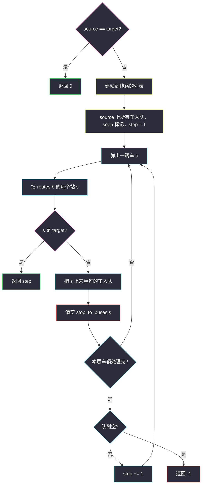
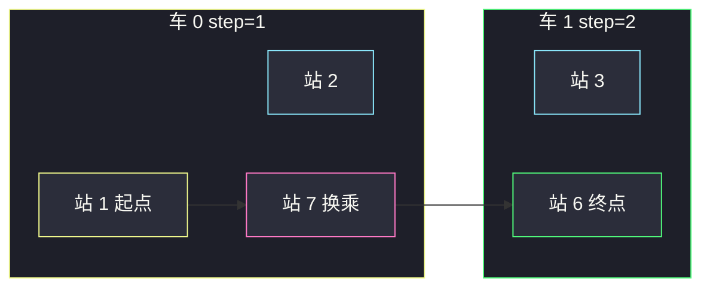

# 公交路线（线路当点 · BFS 最少乘坐次数）

## 一、问题描述

`routes[i]` 是第 `i` 辆公交车的循环停靠站列表：坐上这辆车后，可以到达列表里 **任意一个站**（循环线路，不在乎站间顺序）。从 `source` 站到 `target` 站，求 **最少要坐几辆公交**（不是经过几站）。到不了返回 `-1`。

> 🔗 LeetCode 815：https://leetcode.cn/problems/bus-routes/
>
> 数据范围：`1 ≤ routes.length ≤ 500`（车辆数），`1 ≤ routes[i].length`，**所有线路长度之和 ≤ 10^5**。站编号 `0 ≤ routes[i][j] < 10^6`。同一辆车的站互不相同。
>
> 📚 灵茶题单：**图论 · §1.2 BFS**（1964 分）。最少乘坐次数 = 边权为 1 的最短路；关键是 **节点选线路，不要选车站**。

**示例 1（官方小数据）**

```
输入：routes = [[1,2,7],[3,6,7]], source = 1, target = 6
输出：2

公交车 0 停 1,2,7；公交车 1 停 3,6,7。
在 1 号站上车 0，到换乘站 7，再改乘车 1 到 6。坐了 2 辆。
```

**示例 2**

```
输入：routes = [[7,12],[4,5,15],[6],[15,19],[9,12,13]], source = 15, target = 12
输出：-1
15 所在的车到不了 12 所在的车，两团线路不连通。
```

**示例 3**

```
输入：source == target（任意 routes）
输出：0
已经在终点，一辆都不用坐。
```

**直观理解**

代价的单位是 **「换一辆车」**，不是「走一站」。同一辆车上的所有站，代价都是 1 次乘坐。因此图的节点不该是 1e6 个站号，而该是最多 500 条 **线路**：「第一次坐上某辆车」是一次 BFS 扩展，步数 +1，这辆车能到的站全部解锁。

---

## 二、暴力解法

把每个出现过的车站当点。同一辆车的站点两两连边（完全图），边权 1 表示「坐这辆车从 A 到 B」。再在车站图上 BFS。

问题：一辆车 `L` 个站会连 `L(L-1)/2` 条边。`L` 到 1e5、只有一辆车时边数直接爆炸。即便改成「沿线相邻站连边」，BFS 的节点仍是站，一层对应「走一站」而不是「坐一辆车」，还得额外记录当前坐的是哪辆——状态变成 `(站, 车)`，最坏 `站数 × 500`，站编号又稀疏到 1e6，又容易 TLE / MLE。

```python
# 错误方向：
# 对每辆车把所有站两两连边 → 边数 O(L²)
# 或 BFS 状态 (stop, bus_id) → 状态过多
# 或对 1e6 个站号开 vis 数组沿环走 → 同一辆车被反复走
```

### 复杂度

- **时间 / 空间**：完全图建边最坏 `O(L²)`，不可用。

### 🔴 瓶颈在哪里

「坐一辆车」已经覆盖该线路全部站。继续按站扩，会在同一辆车的站之间来回。正确的一次扩展是：**选一辆还没坐过的车，步数 +1，把它的所有站标成可达。**

---

## 三、优化探索（核心章节）

> 📚 本题在灵茶题单中属于 **§1.2 BFS**。先建「站 → 经过它的线路列表」；BFS 的队列里放 **线路编号**；坐过的线路不再入队；每入队一辆新车，乘坐次数 +1。

### 3.1 建反向索引

```
stop_to_buses[s] = 所有停靠 s 的车辆编号
```

`source` 能直接坐的车，就是 `stop_to_buses[source]`。这些车构成 BFS 第 1 层，步数从 1 开始。

站号最大 1e6，但真正出现的站 ≤ 长度之和 1e5，用 `dict` 即可，不要开 `10^6` 的邻接表硬下标（能过但浪费）。

### 3.2 BFS 节点 = 线路

队列存 `bus_id`。弹出车辆 `b` 时：

1. 扫 `routes[b]` 里每个站 `s`。
2. 若 `s == target`，当前步数就是答案（已经坐在能到终点的这辆车上）。
3. 否则，看 `stop_to_buses[s]` 里还没坐过的车，全部入队（换乘），并标已坐。
4. **清空 `stop_to_buses[s]`**：这个站能提供的换乘已经全部入队，以后别的车再停靠同一站，不必重复扫一遍列表。

第 4 步是剪枝，正确性：第一次处理站 `s` 时，所有经过 `s` 的车要么已经坐过、要么刚被入队；更晚到达 `s` 只可能乘坐次数更多，不会更优。



### 3.3 为什么「按站走」会错

设想还是示例 1，却把每个站当 BFS 节点、相邻站连边、步数按站加：

`1 → 2 → 7 → 6` 会得到 3，但正确答案是 **2 辆车**。`1 → 7` 在车 0 上其实一步到达（同一辆车的任意两站代价相同）。

若改成「同一辆车的站两两连边」：车 0 三个站还好，若某辆车有 `1e5` 个站，完全图有约 `5·10^9` 条边，直接爆。

所以：边权必须加在 **「换一辆车」** 上。人一旦上车，这条线路上所有站同时变成「已花这么多车到达」。

### 3.4 另一种等价写法：按站分层

队列里放 **站**。每一层的含义是：当前这些站都是「刚坐完同一趟车数」到达的。从这些站出发，把所有 **还没坐过的车** 坐一遍，车上新站进入下一层，`step += 1`。

和「队列放线路」同构：一层 = 多坐一辆车。线路版更贴题面「节点是车」；站版更好想象人在站台上。两种都要 `seen_bus`，否则同一辆车会从它的每一个站被重复扫。

```python
# 按站分层的骨架（与主解同复杂度）：
# q 初始只有 source；每一层：对队列里每个站，坐遍未坐过的车，
# 车上每个新站入下一层；命中 target 返回当前 step。
```

### 3.5 正确性

- 每坐一辆新车代价 +1，边权恒 1，BFS 第一次到达含 `target` 的线路就是最少乘坐。
- 每辆车最多入队一次：`seen_bus` 大小 ≤ 500。
- `source == target` 单独返回 0：否则会错误地去坐一辆经过该站的车再「到达」，得到 1。
- 若 `source` 上某辆车已经包含 `target`（同一条环线），第 1 层弹出这辆车时扫到 `target`，返回 1。正确。

### 3.6 规模为什么必须按线路

车辆 ≤ 500，长度之和 ≤ 1e5。按线路 BFS：每辆车的站列表被扫描常数次（弹出时一次 + 各站换乘列表一次，清空后不再扫），总时间 `O(Σ |routes[i]|)`。

若按 1e6 个站号裸 BFS，还在同一辆车上滑站，最坏会把一条长环反复走，直接 TLE。这是本题和普通网格 BFS 最大的差别。

### 3.7 一句话核心

> **站映射到经过它的车；BFS 坐的是车不是站；每辆车只坐一次，车上所有站同时到达；source 等于 target 返回 0。**

---

## 四、代码实现

### Python（主解：线路 BFS）

```python
from collections import defaultdict, deque

class Solution:
    def numBusesToDestination(self, routes: list[list[int]], source: int, target: int) -> int:
        if source == target:
            return 0

        stop_to_buses = defaultdict(list)
        for i, stops in enumerate(routes):
            for s in stops:
                stop_to_buses[s].append(i)

        q = deque()
        seen_bus = [False] * len(routes)
        for b in stop_to_buses[source]:
            q.append(b)
            seen_bus[b] = True

        step = 1
        while q:
            for _ in range(len(q)):
                b = q.popleft()
                for s in routes[b]:
                    if s == target:
                        return step
                    for nb in stop_to_buses[s]:
                        if not seen_bus[nb]:
                            seen_bus[nb] = True
                            q.append(nb)
                    stop_to_buses[s] = []
            step += 1
        return -1
```

**变量含义**

| 变量 | 含义 |
|------|------|
| `stop_to_buses` | 车站 → 停靠该站的车辆 |
| `q` | 待处理的车辆（一层 = 同一步数） |
| `seen_bus` | 这辆车是否已经坐过 / 已入队 |
| `step` | 已经坐了几辆 |

`stop_to_buses[s] = []` 必须在扫完该站的换乘之后写。清空的是「站上的车辆列表」，不是 `routes` 本身。

### Java

```java
class Solution {
    public int numBusesToDestination(int[][] routes, int source, int target) {
        if (source == target) return 0;
        int m = routes.length;
        Map<Integer, List<Integer>> stopToBuses = new HashMap<>();
        for (int i = 0; i < m; i++) {
            for (int s : routes[i]) {
                stopToBuses.computeIfAbsent(s, k -> new ArrayList<>()).add(i);
            }
        }
        ArrayDeque<Integer> q = new ArrayDeque<>();
        boolean[] seenBus = new boolean[m];
        List<Integer> start = stopToBuses.getOrDefault(source, List.of());
        for (int b : start) {
            q.add(b);
            seenBus[b] = true;
        }
        int step = 1;
        while (!q.isEmpty()) {
            int sz = q.size();
            for (int t = 0; t < sz; t++) {
                int b = q.poll();
                for (int s : routes[b]) {
                    if (s == target) return step;
                    List<Integer> buses = stopToBuses.get(s);
                    if (buses == null || buses.isEmpty()) continue;
                    for (int nb : buses) {
                        if (!seenBus[nb]) {
                            seenBus[nb] = true;
                            q.add(nb);
                        }
                    }
                    buses.clear();
                }
            }
            step++;
        }
        return -1;
    }
}
```

Java 里对 `buses.clear()` 要在遍历结束之后，上面先 `for (int nb : buses)` 再 `clear`，不要一边遍历一边清。

---

## 五、具体例子演示

示例 1：`routes = [[1,2,7],[3,6,7]]`，`source = 1`，`target = 6`。

反向索引：

| 站 | 车辆 |
|----|------|
| 1 | 0 |
| 2 | 0 |
| 7 | 0, 1 |
| 3 | 1 |
| 6 | 1 |

`source != target`。从站 1 能坐的车只有 **车 0**，入队，`step = 1`。



**step = 1，队列：`[车0]`**

弹出车 0，扫站 `{1,2,7}`：

- `1`、`2` 不是终点。站 1、2 上只有车 0，已 seen。清空这两站的列表。
- `7` 不是终点。站 7 上还有 **车 1**，未坐过 → 入队，标记 seen。清空站 7 的列表。

本层结束，队列变成 `[车1]`，`step = 2`。

**step = 2，队列：`[车1]`**

弹出车 1，扫站 `{3,6,7}`：

- `3` 不是终点。
- **`6 == target`，返回 2。**

人实际坐过的车：`0 然后 1`。没有「先坐车 1」的路径，因为起点 1 根本停靠不了车 1。

若把 `target` 改成 `2`：车 0 扫站时立刻命中，返回 1。同一辆车内部怎么绕圈都不加步数。

示例 2 从 15 出发能坐车 1（`[4,5,15]`）和车 3（`[15,19]`）。这两辆车能到的站是 `{4,5,15,19}`，上面没有通往 12 的新车（12 在车 0 和车 4 上）。队列耗尽，返回 `-1`。

`source == target`：函数第一行返回 0，哪怕这个站没有公交。

再补一条「三辆车换乘」把层数看清楚。

```
routes = [[1, 10], [10, 20], [20, 30]], source = 1, target = 30
```

| 层 step | 队列里的车 | 这辆车覆盖的站 | 新解锁的车 |
|---------|------------|----------------|------------|
| 1 | 车 0 | 1, 10 | 车 1（在 10 换乘） |
| 2 | 车 1 | 10, 20 | 车 2（在 20 换乘） |
| 3 | 车 2 | 20, 30 | 扫到 30，返回 3 |

不能在 step 1 就走到 30：车 0 到不了 30。每一层刚好对应「再上一辆还没坐过的车」。若错误地按站 `1-10-20-30` 计 3 步，本题碰巧数字一样；把中间改成 `[[1,10,11,12],[12,20],[20,30]]`，按站会变成 5，按车仍是 3。

---

## 六、复杂度分析

`M` = 车辆数 ≤ 500，`P` = `Σ |routes[i]|` ≤ 1e5。

| 方法 | 时间 | 空间 | 说明 |
|------|------|------|------|
| 车站完全图 + BFS | `O(P²)` 建边 | `O(P²)` | 不可用 |
| 状态 `(站, 车)` | 过大 | 过大 | 站号到 1e6 |
| 线路 BFS（主解） | `O(P)` | `O(P)` | 每站、每车常数次 |

空间：哈希表存站→车、`routes` 本身、队列 ≤ `M`。

---

## 七、对比总结

| 维度 | 按站裸 BFS | 按线路 BFS |
|------|------------|------------|
| 一层的含义 | 走一站 / 含糊 | 多坐一辆车 |
| 节点规模 | 站号 1e6 | 车 500 |
| 同一辆车 | 容易反复走 | `seen_bus` 只坐一次 |

和 [打开转盘锁](./open-the-lock.md) 一样是无权最短路，但转盘锁的节点是密码状态；本题如果把站当状态会扩爆，必须升一级把 **整条线路** 当状态。

**易错点**

1. **`source == target` 返回了 1 或 -1**：应返回 0。
2. **BFS 按站走、步数按站加**：题要的是车辆数。
3. **同一辆车不标记**：一条长线路会从每个站被重新扫，退回 `O(P²)`。
4. **没建反向索引**：从当前站找不到「还能换哪些车」。
5. **清空 `routes[b]` 而不是 `stop_to_buses[s]`**：把线路本身删了，后面无法扫站判断终点。
6. 站编号当数组下标开 1e6 可以，但空站不要拿去 BFS。
7. 返回值是 `-1` 不是 `0`（到不了时）；和单词接龙的 0 不要记混。

---

## 八、举一反三

| 题目 | 关系 |
|------|------|
| [127. 单词接龙](https://leetcode.cn/problems/word-ladder/) | 单词当点；本题线路当点。题解：[word-ladder.md](./word-ladder.md) |
| [752. 打开转盘锁](https://leetcode.cn/problems/open-the-lock/) | 隐式状态 BFS。题解：[open-the-lock.md](./open-the-lock.md) |
| [433. 最小基因变化](https://leetcode.cn/problems/minimum-genetic-mutation/) | 合法邻居来自集合。题解：[minimum-genetic-mutation.md](./minimum-genetic-mutation.md) |
| [773. 滑动谜题](https://leetcode.cn/problems/sliding-puzzle/) | 棋盘当状态，同样最少步 BFS |
| [1345. 跳跃游戏 IV](https://leetcode.cn/problems/jump-game-iv/) | 「一类点一次性入队再清空」的剪枝和本题清空站列表同类 |

**思想迁移**

- 代价定义在哪一层，BFS 的节点就选哪一层。本题代价在「乘车」，节点就是车。
- 看见「一批点共享同一次操作」，先建反向索引，再对操作 BFS，不要对点建完全图。
- 口诀：**「少坐几辆车，队列里放线路；一辆车覆盖全线站，坐过的车不再坐；起点等于终点直接 0。」**
