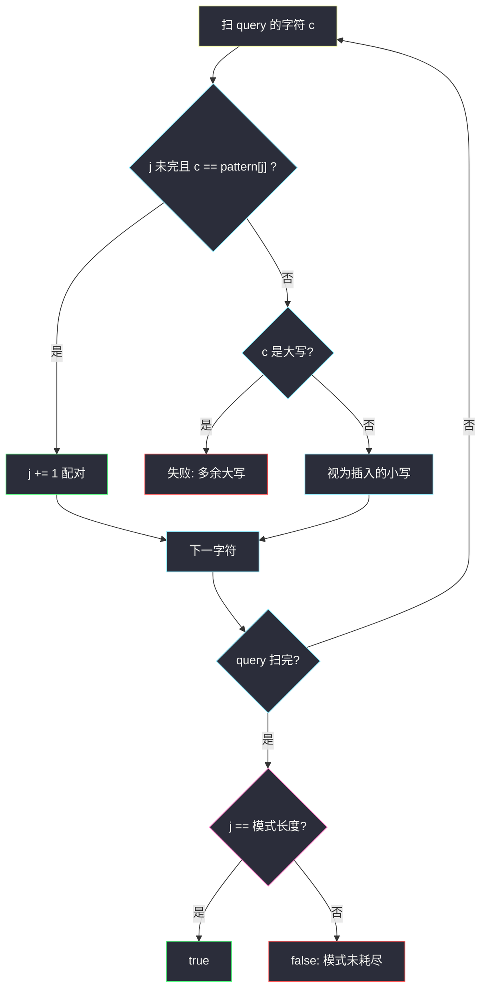
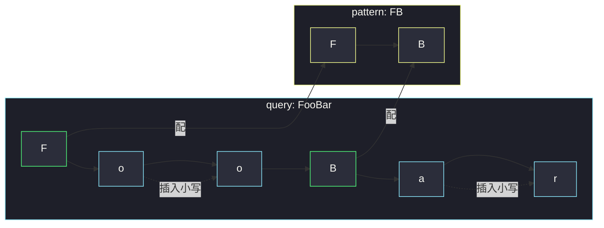

# 驼峰式匹配（双指针 · 判断子序列）

## 一、问题描述

给你字符串数组 `queries` 和模式串 `pattern`。`queries[i]` 能否由 `pattern` **插入若干小写字母**得到？已有的大写字母必须与 `pattern` 里的大写**按顺序一一对应**，不能多插大写，也不能丢掉 `pattern` 里的字符。返回与 `queries` 等长的布尔数组。

> 🔗 LeetCode 1023：https://leetcode.cn/problems/camelcase-matching/
>
> 数据范围：`1 <= queries.length <= 100`，`1 <= queries[i].length, pattern.length <= 100`，只含大小写英文字母；`pattern` 中的大写字母个数不超过 `queries[i]` 中的大写字母个数。

**示例 1**

```
输入：queries = ["FooBar","FooBarTest","FootBall","FrameBuffer","ForceFeedBack"], pattern = "FB"
输出：[true,false,true,true,false]
解释：FooBar / FootBall / FrameBuffer 可由 FB 插入小写得到；
      FooBarTest 多了大写 T；ForceFeedBack 多了大写 F。
```

**示例 2**

```
输入：queries = ["FooBar","FooBarTest","FootBall","FrameBuffer","ForceFeedBack"], pattern = "FoBa"
输出：[true,false,true,false,false]
解释：FooBar、FootBall 能配上 FoBa；FrameBuffer 缺小写 o 且 Buffer 的 B 对不上 a。
```

**示例 3**

```
输入：queries = ["FooBar","FooBarTest","FootBall","FrameBuffer","ForceFeedBack"], pattern = "FoBaT"
输出：[false,true,false,false,false]
解释：只有 FooBarTest 含 T，能配上 FoBaT。
```

**直观理解**

插入小写 = `pattern` 必须是 `query` 的**子序列**，并且 `query` 里**没被配对**的字符必须全是小写（多出来的大写无处安放）。这是灵神 **§4.2 判断子序列**：`query` 当「长串」，`pattern` 当「短串」，多一步「落空字符若为大写则失败」。

---

## 二、暴力解法

对每个 `query`，枚举它的所有子序列，看是否等于 `pattern`，再检查剩余字符是否全小写。子序列有 `2^|q|` 个，长度 100 不可接受。退一步：先判子序列，再扫一遍未匹配位置——仍要把「哪些位置被匹配」记下来，本质已接近最优。下面用「枚举 pattern 的对齐起点」写一版平方检查，便于看出重复扫描：

```python
class Solution:
    def camelMatch(self, queries: List[str], pattern: str) -> List[bool]:
        def ok(q: str) -> bool:
            m = len(pattern)
            for start in range(len(q)):
                j = 0
                extra_upper = False
                for i, c in enumerate(q):
                    if j < m and c == pattern[j]:
                        j += 1
                    elif c.isupper():
                        extra_upper = True
                if j == m and not extra_upper:
                    return True
            return m == 0 and all(c.islower() for c in q)

        return [ok(q) for q in queries]
```

外层 `start` 完全没用：子序列匹配从左往右贪心即可，重复扫 `query` 是浪费。`n ≤ 100` 这题能过，但不是该写的做法。

### 复杂度

- **时间**：上面还带无用循环，最坏 `O(Σ |q|²)`。
- **空间**：`O(1)` 额外（不计答案）。

### 🔴 瓶颈在哪里

判断「`p` 是否为 `s` 的子序列」只需要一次双指针：在 `s` 上从左到右找 `p` 的下一个字符，能配上就 `j++`。本题额外约束「没配上的必须是小写」，同一个循环里顺手检查即可。

---

## 三、优化探索（核心章节）

> 📚 本题在灵茶题单中属于 **04-双指针 · §4.2 判断子序列**（1537 分）。长串 `query` 上找短串 `pattern` 的下一个字符；**匹配失败的字符若是大写，直接否决**；走完后 `pattern` 必须耗尽。

### 3.1 三条规则合成一次扫描

对 `query` 的每个字符 `c`，当前要配的是 `pattern[j]`（若已配完则 `j = |pattern|`）：

| 情况 | 动作 |
|------|------|
| `j` 未走完且 `c == pattern[j]` | 配对成功，`j += 1` |
| 否则 `c` 是小写 | 视为插入的小写，合法，跳过 |
| 否则 `c` 是大写 | 多出来的大写，失败 |

扫完若 `j == |pattern|`，短串全部配上，成功；否则 `pattern` 里还有没在 `query` 里出现的字符，失败。

这同时覆盖：

- `pattern` 中的小写也必须在 `query` 里按序出现（子序列本来就要求）；
- `query` 不能多大写（第三行）；
- `query` 可以在任意缝隙插小写（第二行）。

### 3.2 为什么贪心配对不会漏

§4.2 的经典结论：若 `pattern` 是 `query` 的子序列，则**每次都配最早出现的那个字符**一定能配完。证明直觉：若某次该配 `pattern[j]` 时你跳过了一个可用的 `c`，把这个 `c` 留给后面，只会使后面更难配，不会更容易。大写约束不改变这点——跳过一个本可配对的大写，那个大写会变成「落空大写」直接失败，更糟。



### 3.3 另一种说法：大写序列必须相等

把 `query` 与 `pattern` 各自抽出大写字母，两串必须**完全相等**（不能多、不能少、顺序不能乱），同时整个 `pattern`（含小写）是 `query` 的子序列。双指针一次扫描同时保证这两件事，不必真的抽出大写。

### 3.4 一句话核心

> **pattern 当短串在 query 里从左到右配；配不上的字符必须是小写；配完还要求短串走尽。**

---

## 四、代码实现

### Python（主解：双指针判子序列）

```python
class Solution:
    def camelMatch(self, queries: List[str], pattern: str) -> List[bool]:
        def match(q: str) -> bool:
            j = 0
            m = len(pattern)
            for c in q:
                if j < m and c == pattern[j]:
                    j += 1
                elif c.isupper():
                    return False
            return j == m

        return [match(q) for q in queries]
```

**变量含义**

| 变量 | 含义 |
|------|------|
| `j` | `pattern` 中下一个待匹配下标 |
| `c` | 当前扫描的 `query` 字符 |

**循环不变式**：已扫描的 `query` 前缀里，按贪心配对用掉了 `pattern[:j]`，且该前缀中所有未配对字符都是小写。

### Java（最优解同款）

```java
class Solution {
    public List<Boolean> camelMatch(String[] queries, String pattern) {
        List<Boolean> ans = new ArrayList<>();
        for (String q : queries) {
            ans.add(match(q, pattern));
        }
        return ans;
    }

    private boolean match(String q, String pattern) {
        int j = 0, m = pattern.length();
        for (int i = 0; i < q.length(); i++) {
            char c = q.charAt(i);
            if (j < m && c == pattern.charAt(j)) {
                j++;
            } else if (Character.isUpperCase(c)) {
                return false;
            }
        }
        return j == m;
    }
}
```

---

## 五、具体例子演示

`pattern = "FB"`，逐个 query 跟踪指针 `j`（要配的目标写在括号里）：

**FooBar**（应 true）

| 扫描 | c | 动作 | j |
|------|---|------|---|
| 0 | F | 配上 pattern[0] | 1 |
| 1 | o | 小写，插入 | 1 |
| 2 | o | 小写，插入 | 1 |
| 3 | B | 配上 pattern[1] | 2 |
| 4 | a | 小写，插入 | 2 |
| 5 | r | 小写，插入 | 2 |

`j == 2`，true ✓。

**FooBarTest**（应 false）

前面与 FooBar 相同配完 `FB`，`j = 2`。接着 `T` 是大写且 pattern 已耗尽 → 多余大写，false ✓。

**ForceFeedBack**（应 false）

| 扫描 | c | 动作 | j |
|------|---|------|---|
| 0 | F | 配上 F | 1 |
| 1–4 | o,r,c,e | 小写 | 1 |
| 5 | F | **要配 B，对不上；F 是大写** | 失败 |

第一个 F 被贪心配给 `pattern[0]`，第二个 F 成了落空大写。即使有人想把第一个 F 留给后面，`pattern` 的 F 只有一个，多出来的 F 无论如何非法。

**FootBall + pattern = "FoBa"**（应 true）

F 配 F，o 配 o，o 插入，t 插入，B 配 B，a 配 a，l,l 插入。`j` 走完 ✓。



---

## 六、复杂度分析

| 方法 | 时间 | 空间 | 说明 |
|------|------|------|------|
| 枚举子序列 | `O(Σ 2^|q|)` | `O(|q|)` 递归 | 不可用 |
| 双指针一次扫描（主解） | `O(Σ |q|)` | `O(1)` 额外 | 每个 query 扫一遍 |

`pattern` 长度进不了复杂度的乘积：每个 `query` 字符只看一次 `pattern[j]`。

---

## 七、对比总结

| 维度 | 本题 | #392 判断子序列 | #2486 追加字符 |
|------|------|-----------------|----------------|
| 短串 | pattern | s | t |
| 长串 | query | t | s |
| 额外 | 落空字符必须小写 | 无 | 未配完的长度即答案 |
| 失败点 | 多大写 / 短串未完 | 短串未完 | 不失败，返回差值 |

**易错点**

1. **只检查大写、忘记 pattern 里的小写也要按序出现**：`pattern = "FoBa"`、`query = "FBa"` 应 false（缺 o）。子序列指针会拦住。
2. **pattern 配完后仍允许大写**：`FooBarTest` vs `FB` 是反例。配完之后任何大写都非法。
3. **用正则 `F[a-z]*B[a-z]*` 却忘了 query 里其它大写**：对 `FB` 碰巧能写对，一旦 pattern 含小写，手写正则容易漏。双指针更稳。
4. **大小写用错 API**：Python `c.isupper()`，不要 `c == c.upper()` 对非字母（本题没有）。
5. 最后漏掉 `j == m`：query 是 pattern 的真前缀时应 false。

**模板（§4.2 + 落空必须小写）**

```python
j = 0
for c in query:
    if j < m and c == pattern[j]:
        j += 1
    elif c.isupper():
        return False
return j == m
```

---

## 八、举一反三

| 题目 | 关系 |
|------|------|
| [392. 判断子序列](https://leetcode.cn/problems/is-subsequence/) | §4.2 原型，无大小写约束 |
| [2486. 追加字符以获得子序列](https://leetcode.cn/problems/append-characters-to-string-to-make-subsequence/) | 同目录 `append-characters-to-string-to-make-subsequence.md`：配不完就数剩下的长度 |
| [2825. 循环递增使字符串变成子序列](https://leetcode.cn/problems/make-string-a-subsequence-using-cyclic-increments/) | 同目录 `make-string-a-subsequence-using-cyclic-increments.md`：配对条件放宽成「相等或 +1 循环」 |
| [792. 匹配子序列的单词数](https://leetcode.cn/problems/number-of-matching-subsequences/) | 多短串对一长串，桶 + 指针加速 |
| [524. 通过删除字母匹配到字典里最长单词](https://leetcode.cn/problems/longest-word-in-dictionary-through-deleting/) | 删除 = 子序列，再取最长字典序最小 |

**思想迁移**

- 子序列匹配永远是长串扫描、短串指针前进；额外约束写在「没配对的那条分支」上。
- 驼峰规则 = 子序列 + 「未匹配字符的字母表受限」。换受限集合就是新题。
- 口诀：**「短串当针在长串里穿；扎空了只许小写，针必须扎完。」**
