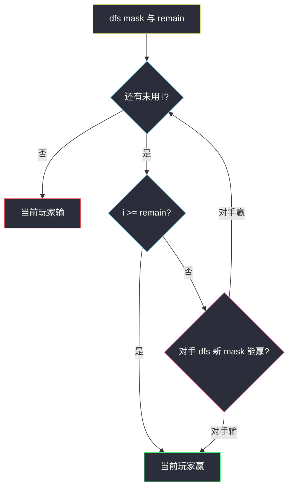
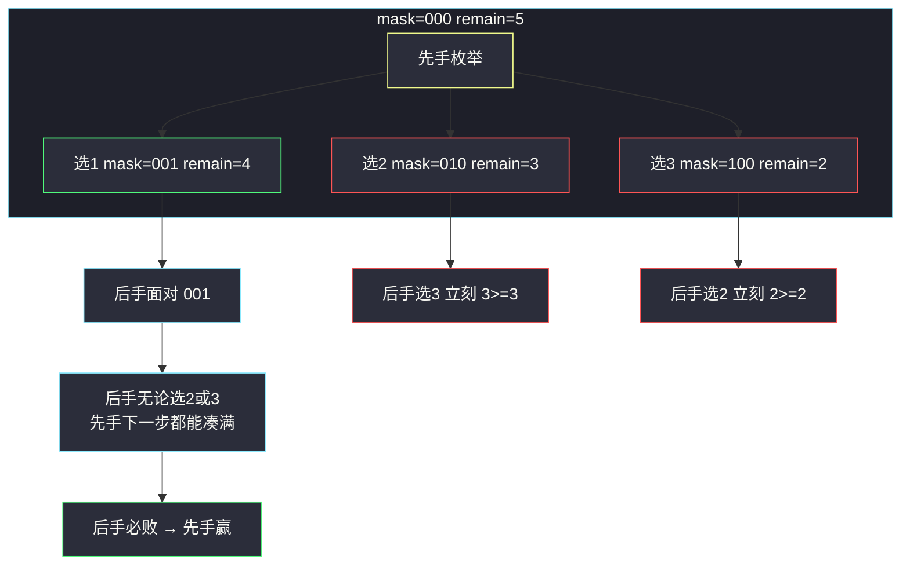

# 我能赢吗（状压博弈 · 当前玩家必胜）

## 一、问题描述

数字池里放着 `1, 2, …, maxChoosableInteger`，两人不放回地轮流取一个数加进累计和。谁让累计和 **≥ `desiredTotal`** 谁就赢。双方都按最优策略，问**先手能否必胜**。

> 🔗 LeetCode 464：https://leetcode.cn/problems/can-i-win/
>
> 数据范围：`1 ≤ maxChoosableInteger ≤ 20`，`0 ≤ desiredTotal ≤ 300`。
>
> 📚 灵茶题单：**§9.7 其他状压 DP**。数字最多 20 个，用 bitmask 记「哪些已经拿走」。博弈题的记忆化对象是「轮到当前玩家时，这个局面能否赢」，不是「先手/后手」两套函数。

`desiredTotal = 0` 时累计和已经达标，先手直接赢（官方返回 `true`）。池子总和都凑不够 `desiredTotal`，谁都赢不了，返回 `false`。

**示例 1**

```
输入：maxChoosableInteger = 10, desiredTotal = 11
输出：false
解释：先手无论选 1..10 中哪一个，后手都能立刻拿出「11 − 先手所选」，凑满 11。
```

**示例 2**

```
输入：maxChoosableInteger = 10, desiredTotal = 0
输出：true
解释：开始时已经 ≥ 0，先手获胜。
```

**示例 3**

```
输入：maxChoosableInteger = 10, desiredTotal = 1
输出：true
解释：先手选 1 立刻达标。
```

**直观理解**

这不是「把数字分成两堆比大小」，因为**谁先凑满谁赢**，中途就结束。先手想的是：有没有一步，让自己立刻赢，或把后手逼进必败局面。`n ≤ 20` 提示把已用集合压进一个整数。

---

## 二、暴力解法

每一回合枚举还没被拿走的数，递归问对手会不会赢。对手赢不了，自己就赢了。

```python
class Solution:
    def canIWin(self, maxChoosableInteger: int, desiredTotal: int) -> bool:
        if desiredTotal <= 0:
            return True
        nums = list(range(1, maxChoosableInteger + 1))

        def dfs(used: list[bool], remain: int) -> bool:
            for i, x in enumerate(nums):
                if used[i]:
                    continue
                if x >= remain:
                    return True
                used[i] = True
                opp_win = dfs(used, remain - x)
                used[i] = False
                if not opp_win:
                    return True
            return False

        return dfs([False] * maxChoosableInteger, desiredTotal)
```

官方三例都能过。但同一组 `used` 会被不同走法重复搜到，复杂度接近 `O(n!)`，`n = 20` 直接爆。

### 🔴 瓶颈在哪里

局面只取决于「哪些数用过了」以及「还差多少」。还差多少可以由已用数字唯一确定，所以真正的状态只有 `2^n` 个。必须记忆化。

---

## 三、优化探索（核心章节）

> 📚 灵茶 **§9.7 其他状压 DP** 模板：集合当整数 `mask`，第 `i` 位为 1 表示数字 `i+1` 已用。`dfs(mask)` = 面对这个已用集合时，**当前玩家**能否必胜。存在一个未用数字 `x`，使得 `x ≥ remain`（自己立刻赢）或 `dfs(mask | bit) == False`（对手必败），当前玩家就必胜。

### 3.1 先剪两刀

1. `desiredTotal <= 0`：已经达标，先手赢。
2. `1+2+…+n = n(n+1)/2 < desiredTotal`：总和不够，先手输。

剪完之后，游戏一定有人能凑满，不会「两人把数拿光还没达标」。

### 3.2 状态

`dfs(mask, remain)`：已用集合是 `mask`，距离目标还差 `remain`，**轮到的那个人**能否必胜。

转移：枚举 `i = 1..n`，`bit = 1<<(i-1)`，若 `mask & bit == 0`：

- `i >= remain` → 当前玩家赢；
- 否则把 `i` 交给对手：`not dfs(mask | bit, remain - i)` 为真 → 当前玩家赢。

全部试完都赢不了 → 当前玩家输。

`remain` 其实可由 `mask` 推出来（`remain = desiredTotal − 已用数字之和`），记忆化只按 `mask` 存即可。下面代码里两个参数一起 `@cache`，读起来更直。



### 3.3 为什么是「当前玩家」不是「先手」

博弈记忆化的标准写法：函数永远站在**马上要下棋的人**的视角。先手第一次调用 `dfs(0, desiredTotal)`；之后每次递归，视角对调。这样不用在状态里塞「轮到谁」。

### 3.4 一句话核心

> **mask 记已用数字；当前玩家能赢 ⇔ 存在一步立刻达标，或把对手逼进必败态。**

---

## 四、代码实现

### Python（主解：状压 + 记忆化）

```python
from functools import cache

class Solution:
    def canIWin(self, maxChoosableInteger: int, desiredTotal: int) -> bool:
        if desiredTotal <= 0:
            return True
        n = maxChoosableInteger
        if n * (n + 1) // 2 < desiredTotal:
            return False

        @cache
        def dfs(mask: int, remain: int) -> bool:
            # dfs(mask, remain): 已用 mask、还差 remain，当前玩家能否必胜
            for i in range(1, n + 1):
                bit = 1 << (i - 1)
                if mask & bit:
                    continue
                if i >= remain or not dfs(mask | bit, remain - i):
                    return True
            return False

        return dfs(0, desiredTotal)
```

**变量含义**

| 写法 | 含义 |
|------|------|
| `bit = 1 << (i-1)` | 数字 `i` 对应的那一位 |
| `mask & bit` | 该数字是否已用 |
| `i >= remain` | 当前这一步直接赢 |
| `not dfs(...)` | 对手面对新局面必败，自己必胜 |

### Java（最优解）

```java
class Solution {
    public boolean canIWin(int maxChoosableInteger, int desiredTotal) {
        if (desiredTotal <= 0) {
            return true;
        }
        int n = maxChoosableInteger;
        if (n * (n + 1) / 2 < desiredTotal) {
            return false;
        }
        Boolean[] memo = new Boolean[1 << n];
        return dfs(0, desiredTotal, n, memo);
    }

    // dfs: 已用 mask，还差 remain，当前玩家能否必胜
    private boolean dfs(int mask, int remain, int n, Boolean[] memo) {
        if (memo[mask] != null) {
            return memo[mask];
        }
        for (int i = 1; i <= n; i++) {
            int bit = 1 << (i - 1);
            if ((mask & bit) != 0) {
                continue;
            }
            if (i >= remain || !dfs(mask | bit, remain - i, n, memo)) {
                return memo[mask] = true;
            }
        }
        return memo[mask] = false;
    }
}
```

只按 `mask` 记忆合法：同一个 `mask` 对应的已用和唯一，因而 `remain` 唯一。

---

## 五、具体例子演示

### 5.1 官方示例 1：后手总能一击

`n = 10`，`desiredTotal = 11`。总和 `55 ≥ 11`，要真正搜。但每一步都极短：

| 先手选 x | mask 新位 | remain | 后手 |
|----------|-----------|--------|------|
| 1 | bit0 | 10 | 选 10，`10 ≥ 10` 后手赢 |
| 2 | bit1 | 9 | 选 9 |
| … | … | … | 选 `11-x`（一定还在池里） |
| 10 | bit9 | 1 | 选 1 |

`11-x` 与 `x` 不相等（`x` 是整数），所以后手要的那张牌一定还在。先手每一步都把对手送进「立刻赢」，`dfs(0, 11) = false`。对拍官方。

### 5.2 官方示例 2、3：边界

- `desiredTotal = 0`：函数开头直接 `true`，不会去状压。对拍官方。
- `desiredTotal = 1`：先手选 1，`1 ≥ 1`，`true`。对拍官方。

### 5.3 小例子逐步跟 mask：`n=3, desiredTotal=5`

数字 `1,2,3`（bit0/bit1/bit2），总和 6 ≥ 5。从 `mask=0, remain=5` 开始。



逐步：

1. `dfs(000, 5)` 试选 1。进入 `dfs(001, 4)`（后手）。
2. 后手试选 2：`dfs(011, 2)`，先手拿 3，`3 ≥ 2`，先手赢 ⇒ 后手这步失败。
3. 后手试选 3：`dfs(101, 1)`，先手拿 2，`2 ≥ 1`，先手赢 ⇒ 后手这步也失败。
4. `dfs(001, 4) = false`（后手必败）。所以先手选 1 就能赢，`dfs(000, 5) = true`。

先手选 2 或 3 都会让后手立刻凑满，那两步是差的；**只要存在一步好棋就够了**。

对照必败小例子 `n=2, desiredTotal=3`：先手选 1 后手选 2，先手选 2 后手选 1，两步都送对手立刻赢，答案 `false`。

---

## 六、复杂度分析

| 方法 | 时间 | 空间 | 说明 |
|------|------|------|------|
| 无记忆化递归 | `O(n!)` | `O(n)` 栈 | `n=20` 不可用 |
| 状压记忆化（主解） | `O(2^n · n)` | `O(2^n)` | 每个 mask 枚举 n 个数 |

`n ≤ 20`，`2^20 × 20 ≈ 2×10^7`，可以通过。

---

## 七、对比总结

| 维度 | 普通 DP | 本题 |
|------|---------|------|
| 状态 | 下标 / 容量 | **已用数字的集合** |
| 决策目标 | min/max 数值 | 布尔：当前玩家能否逼赢 |
| 对手 | 没有 | `not dfs(新 mask)` |

**易错点**

1. **忘了 `desiredTotal <= 0`**：官方明确 `0 → true`，不要一上来算总和。
2. **总和不够仍去搜**：应直接 `false`，否则「拿光了还没人达标」会被判成当前玩家输，语义碰巧对，但属于误打误撞。
3. **状态里硬塞先手/后手**：视角固定为当前玩家即可。
4. **数字从 1 开始、bit 从 0 开始**：`i` 对应 `1<<(i-1)`，别写成 `1<<i`。
5. **以为是「选一个子集当先手」**：取数过程有先后，中途达到就停，不是把集合一次分完。

---

## 八、举一反三

| 题目 | 关系 |
|------|------|
| [486. 预测赢家](https://leetcode.cn/problems/predict-the-winner/) | 同批博弈；区间两端取数，见同目录 `predict-the-winner.md` |
| [877. 石子游戏](https://leetcode.cn/problems/stone-game/) | #486 的偶数堆特化，先手恒胜 |
| [375. 猜数字大小 II](https://leetcode.cn/problems/guess-number-higher-or-lower-ii/) | 区间博弈，付费猜数字 |
| [294. 翻转游戏 II](https://leetcode.cn/problems/flip-game-ii/) | 同样「当前玩家能否赢」+ 记忆化 |
| [1406. 石子游戏 III](https://leetcode.cn/problems/stone-game-iii/) | 从一端取 1/2/3 堆，净胜分 DP |
| [464. 我能赢吗](https://leetcode.cn/problems/can-i-win/) | 本题 |

**思想迁移**

- `n ≤ 20` 且关心「用过哪些」→ 状压；博弈再套一层「存在一步使对手必败」。
- 口诀：**「mask 记已用；能秒杀或把对手打进 false，自己就 true。」**
