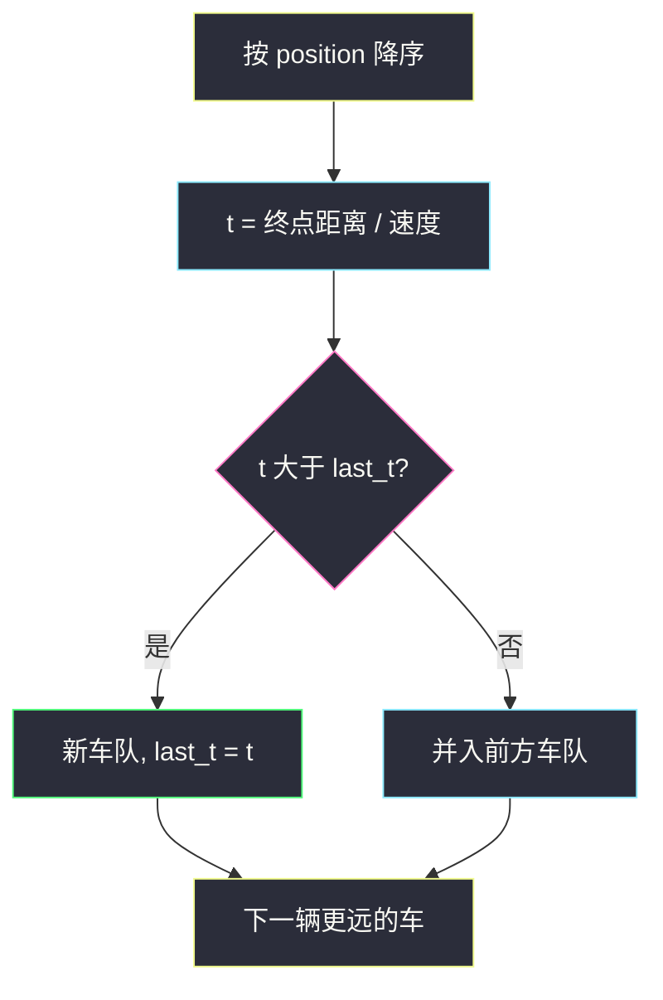
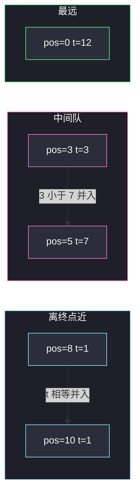

# 车队（按位置从近到远 · 到达时间单调栈）

## 一、问题描述

`n` 辆车在一条单车道上驶向共同终点 `target`。第 `i` 辆的位置是 `position[i]`，速度是 `speed[i]`（同向、单位距离/单位时间）。

规则：

- 车不能超车。即使自己更快，追上前面一辆后必须降到与前车相同速度，从此**成队**，一直开到终点。
- 两车在**同一时刻到达终点**也算追上（算同一队）。

问最后有多少个车队。

> 🔗 LeetCode 853：https://leetcode.cn/problems/car-fleet/
>
> 数据范围：`n ∈ [1, 10^5]`，`target ∈ [1, 10^6]`，`0 <= position[i] < target` 且位置互不相同，`1 <= speed[i] <= 10^6`。
>
> 📚 灵茶题单：**单调栈 · §1.1 基础**。关键量是到达时间 `t = (target - pos) / speed`；后面的车只有 `t` 不超过前方车队，才能并入。

**示例 1**

```
输入：target = 12, position = [10,8,0,5,3], speed = [2,4,1,1,3]
输出：3
解释：
(10,2) 与 (8,4) 在 t=1 同时到终点，一队；
(5,1) 与 (3,3) 并成一队，t=7 到；
(0,1) 单独，t=12。
```

**示例 2**

```
输入：target = 10, position = [3], speed = [3]
输出：1
```

**示例 3**

```
输入：target = 100, position = [0,2,4], speed = [4,2,1]
输出：1
解释：后面两辆都会追上最前面那辆慢车，三车一队。
```

**直观理解**

把车按「离终点从近到远」排好。最前面那辆谁也挡不了，它的到达时间就是一个车队的「队头时间」。后面一辆若独自开还更快（或一样快），会被这队头卡住，并进去，队头时间不变；若更慢，它永远追不上，自己当新队头。从近扫到远，看到达时间是否被前方压住。

---

## 二、暴力解法

对每辆车模拟前进，直到所有车到终点。时间连续，只能按「下一对相遇时刻」事件推进，最坏 `O(n²)` 次相遇，`n = 10^5` 超时。更粗暴的按离散时间步进也不现实：路程和速度到 `10^6`。

下面用「每辆车看它前面是否有更慢的」作 `O(n²)` 对照（仍偏慢）：

```python
class Solution:
    def carFleet(self, target: int, position: List[int], speed: List[int]) -> int:
        cars = sorted(zip(position, speed), reverse=True)
        n = len(cars)
        t = [(target - p) / s for p, s in cars]
        used = [False] * n
        fleets = 0
        for i in range(n):
            if used[i]:
                continue
            fleets += 1
            used[i] = True
            for j in range(i + 1, n):
                if t[j] <= t[i]:
                    used[j] = True
                else:
                    break   # 更远且更慢的挡住后面，不能隔空并入 i
        return fleets
```

这段已经用了「被更慢的挡住就不能隔队合并」——其实就是线性扫描的雏形，只是写成了标记数组。

### 复杂度

- **时间**：朴素模拟最坏 `O(n²)`，`n = 10^5` 超时。
- **空间**：`O(n)`。

### 🔴 瓶颈在哪里

真正要用的信息只有每个位置的到达时间，以及「前方最近一个还没被并掉的队头时间」。排好序后从近到远扫一遍：当前 `t` 大于前方队头时间就开新队，否则并入。不必两两比。

---

## 三、优化探索（核心章节）

> 📚 对齐灵神 **§1.1 基础**。单调栈里存的是**车队到达时间**（从近到远非严格递增）。也可以不显式用栈，只留一个 `last_t`。

### 3.1 为什么必须按位置排序，不能按速度

超车被禁止，所以空间顺序永远不变：位置大的永远在前面。时间轴上谁快谁慢只决定「会不会贴上去」，不改变左右关系。所以先按 `position` **降序**（离 `target` 近的在前）。

### 3.2 到达时间

`t[i] = (target - position[i]) / speed[i]`

这是「假如前面没人挡」的到达时刻。一旦被挡，实际到达时刻等于前方车队的到达时刻（更大）。

并入条件：当前车的自由 `t` **小于等于** 前方车队的到达时间。小于等于就表示它能在终点前或终点处贴上。

### 3.3 扫描 / 栈

维护「目前最靠近自己的、还没被并掉的队头时间」`last_t`，初值 `0`（比任何正的到达时间都小，第一辆一定开新队）。

从近到远：

- 若 `t > last_t`：追不上，`fleets += 1`，`last_t = t`。
- 若 `t ≤ last_t`：并入，什么都不改（队头仍是前面那辆更慢的）。

等价写法：栈里存放已经确定的车队到达时间。栈从底到顶对应从近到远，时间递增。当前 `t` 小于等于栈顶就丢掉（并入）；大于就压栈（新队）。



### 3.4 浮点

`n` 大、除法用 IEEE 754 double，一般能过；极端情况下两个非常接近的 `t` 可能比错。更稳的是交叉相乘（Python int 无溢出，Java 用 `long`）：

`(target - p1) / s1 ≤ (target - p2) / s2`
等价于
`(target - p1) * s2 ≤ (target - p2) * s1`

两边都是非负整数，乘积最大约 `10^6 · 10^6 = 10^12`，`long` 装得下。主解为了好读仍用除法；对拍或卡精度时换成乘法。

### 3.5 不变式

扫完「离终点最近的 k 辆」之后：

- `fleets` 是这 k 辆形成的车队数；
- `last_t` 是其中最远那一支队头的到达时间（也是这 k 辆里实际最晚到的那支的时间）；
- 更远的车只可能并入这支队头，或自己开新队，不会穿过它去并更前面的队。

### 3.6 一句话核心

> **按位置从近到远扫，自由到达时间不超过前方队头就并入，否则新开一队。**

---

## 四、代码实现

### Python（主解：排序 + 一个 last_t）

```python
class Solution:
    def carFleet(self, target: int, position: List[int], speed: List[int]) -> int:
        cars = sorted(zip(position, speed), reverse=True)
        fleets = 0
        last_t = 0.0
        for p, s in cars:
            t = (target - p) / s
            if t > last_t:
                fleets += 1
                last_t = t
        return fleets
```

### Python（单调栈存到达时间）

```python
class Solution:
    def carFleet(self, target: int, position: List[int], speed: List[int]) -> int:
        stack = []
        for p, s in sorted(zip(position, speed), reverse=True):
            t = (target - p) / s
            if not stack or t > stack[-1]:
                stack.append(t)
        return len(stack)
```

栈里时间从底到顶递增：只有「更慢、开新队」才会入栈。并入时不 push，相当于被栈顶压住。

### Java（同款 last_t）

```java
class Solution {
    public int carFleet(int target, int[] position, int[] speed) {
        int n = position.length;
        Integer[] idx = new Integer[n];
        for (int i = 0; i < n; i++) {
            idx[i] = i;
        }
        Arrays.sort(idx, (a, b) -> Integer.compare(position[b], position[a]));
        int fleets = 0;
        double lastT = 0;
        for (int i : idx) {
            double t = (double) (target - position[i]) / speed[i];
            if (t > lastT) {
                fleets++;
                lastT = t;
            }
        }
        return fleets;
    }
}
```

---

## 五、具体例子演示

### 5.1 官方示例 —— 三队

`target = 12`，车按位置降序：

| 位置 | 速度 | 自由 t | 与 last_t 比 | 动作 | last_t | fleets |
|------|------|--------|--------------|------|--------|--------|
| 10 | 2 | `(12-10)/2 = 1` | `1 > 0` | 新队 | 1 | 1 |
| 8 | 4 | `(12-8)/4 = 1` | `1 ≤ 1` | 并入 | 1 | 1 |
| 5 | 1 | `(12-5)/1 = 7` | `7 > 1` | 新队 | 7 | 2 |
| 3 | 3 | `(12-3)/3 = 3` | `3 ≤ 7` | 并入 | 7 | 2 |
| 0 | 1 | `(12-0)/1 = 12` | `12 > 7` | 新队 | 12 | 3 |

位置 8 的车更快，但 `t` 恰好等于前面的 1，在终点贴上，算同一队。位置 3 的车自由 t 只有 3，可是前面 5 号车要跑到 7，它会在半路贴上去，实际也 7 才到。



### 5.2 示例 3 —— 全并成一队

`target = 100`，`position = [0,2,4]`，`speed = [4,2,1]`。

降序：`(4,1) t=96`，`(2,2) t=49`，`(0,4) t=25`。

| 车 | t | 比较 | last_t | fleets |
|----|---|------|--------|--------|
| pos 4 | 96 | 新队 | 96 | 1 |
| pos 2 | 49 ≤ 96 | 并入 | 96 | 1 |
| pos 0 | 25 ≤ 96 | 并入 | 96 | 1 |

最前面那辆最慢，后面两辆自由时间都更短，全被卡住，一队。栈版：只 push 了 96，长度为 1。

### 5.3 单车与「刚好在终点追上」

`target = 10, position = [3], speed = [3]`：只有一行，`t = 7/3`，`fleets = 1`。

再造一个刚好相等：`target = 10`，`(8,1)` 的 `t=2`，`(6,2)` 的 `t=2`。第二辆 `2 ≤ 2`，并入，答案 1。若把第二辆速度改成 1，`t=4 > 2`，两队。等号必须并入，漏掉会多算车队。

### 5.4 栈内到达时间逐步

接 5.1，栈左为底：

| 步 | t | 栈 |
|----|---|-----|
| 开始 | | `[]` |
| 1 | 1 | `[1]` |
| 1 | 1 | `[1]`（不 push） |
| 7 | 7 | `[1, 7]` |
| 3 | 3 | `[1, 7]`（不 push） |
| 12 | 12 | `[1, 7, 12]` |

栈长 3。时间严格递增，对应三支不会互相追上的队头。

---

## 六、复杂度分析

| 方法 | 时间 | 空间 | 说明 |
|------|------|------|------|
| 事件模拟 / 两两追 | `O(n²)` | `O(n)` | `n = 10^5` 超时 |
| 排序 + last_t（主解） | `O(n log n)` | `O(n)` | 瓶颈在排序 |
| 单调栈存 t | `O(n log n)` | `O(n)` | 与主解同一复杂度 |

---

## 七、对比总结

| 维度 | last_t 计数 | 单调栈 |
|------|-------------|--------|
| 存什么 | 一个队头时间 | 所有队头时间 |
| 并入 | `t ≤ last_t` 不更新 | `t ≤ 栈顶` 不 push |
| 答案 | 计数器 | `len(stack)` |

两种写法是同一件事，面试写 `last_t` 更短。

**易错点**

1. **按速度排序**：空间顺序才是挡板，必须按位置。
2. **从远扫到近却用错比较**：从远到近时，栈要存「后面还没被挡的时间」，比较方向容易反。统一从近到远最稳。
3. **严格小于才并入**：题目规定同一时刻到达也成队，必须 `≤`。
4. **整数除法**：Java 里 `(target-p)/speed` 若两边都是 `int` 会截断，先转 `double`。
5. **以为并入要改队头时间**：队头是前面更慢的那辆，并入后到达时间仍是队头的 `t`，不要改成后面那辆更快的 `t`。

**模板（§1.1 车队）**

```python
# 按 pos 降序
# t = (target-pos)/speed
# t > last_t → 新队，last_t = t
```

---

## 八、举一反三

| 题目 | 关系 |
|------|------|
| [1776. 车队 II](https://leetcode.cn/problems/car-fleet-ii/) | 求每辆车第一次撞上前车的时间，单调栈存「可能被撞的前车」 |
| [853 的变形：能否全部成一队](https://leetcode.cn/problems/car-fleet/) | 看最慢的前方车是否把后面全挡住，即本题答案是否为 1 |
| [316. 去除重复字母](https://leetcode.cn/problems/remove-duplicate-letters/) | 同样「栈顶要不要留」：那边看后面还有没有，这边看时间能不能追上 |
| [84. 柱状图中最大的矩形](https://leetcode.cn/problems/largest-rectangle-in-histogram/) | 单调栈存下标，弹栈结算 |
| [85. 最大矩形](https://leetcode.cn/problems/maximal-rectangle/) | 直方图栈的二维扩展 |

**思想迁移**

- 见到「不能超越、追上就黏在一起」，先按空间排序，再用时间比较是否被前方卡住。
- 口诀：**「近的先定队头；更慢才开新队，更快只能并入。」**
