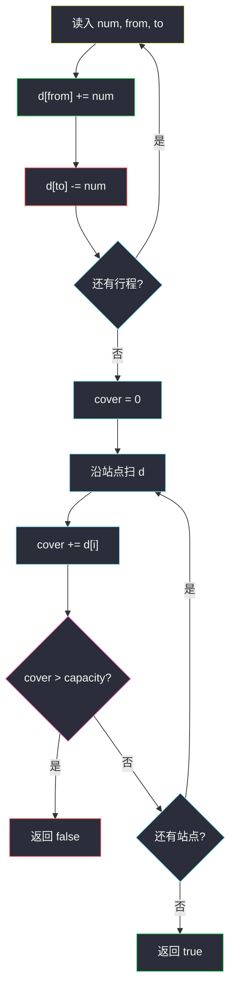
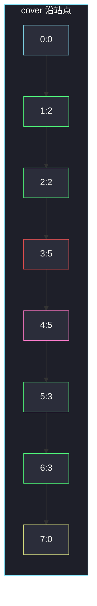

# 拼车

## 一、问题描述

车上有 `capacity` 个空座位，只能往一个方向开。`trips[i] = [num, from, to]` 表示 `num` 名乘客在站点 `from` **上车**、在站点 `to` **下车**（行驶区间是半开的 `[from, to)`：到了 `to` 人已经下去）。所有行程都能在容量内完成则返回 `true`，否则 `false`。

> 🔗 LeetCode 1094：https://leetcode.cn/problems/car-pooling/
>
> 数据范围：行程数 ≤ 1000，`0 ≤ from < to ≤ 1000`，`1 ≤ num ≤ 100`，`1 ≤ capacity ≤ 10^5`。

**示例 1**

```
输入：trips = [[2,1,5],[3,3,7]]，capacity = 4
输出：false
解释：站点 3 到 4：先上车的 2 人还在，又上来 3 人，共 5 > 4。
```

**示例 2**

```
输入：trips = [[2,1,5],[3,3,7]]，capacity = 5
输出：true
解释：峰值恰好 5，没超。
```

**直观理解**

数轴上每个站点有一个「车上人数」。一次行程让 `[from, to)` 上每个点 +num。问还原后有没有位置超过 `capacity`。区间加减正是一维差分。

---

## 二、暴力解法

开一个 `1001` 长的计数数组，每段行程把沿途每个站点 +num：

```python
class Solution:
    def carPooling(self, trips: List[List[int]], capacity: int) -> bool:
        cover = [0] * 1001
        for num, f, t in trips:
            for x in range(f, t):          # [from, to)
                cover[x] += num
        return max(cover) <= capacity
```

本题站点 ≤ 1000，这样能过。行程再多、坐标再大就会慢。

### 复杂度

- **时间**：`O(n · MAX)`，`MAX=1000`。
- **空间**：`O(MAX)`。

### 🔴 瓶颈在哪里

同一段连续 +num 被逐点改。差分只在端点各改一次：`d[from] += num`，`d[to] -= num`，再扫一遍前缀和还原车上人数。

---

## 三、优化探索（核心章节）

> 📚 本题在灵茶题单中属于 **差分数组 · §2.1 一维差分**。和「与车相交的点」同一骨架：端点打标记，前缀和还原覆盖量。这里还原的是车上人数，任一位置 `> capacity` 就失败。

### 3.1 半开区间怎么打差分

乘客占用 `[from, to)`，等价于闭区间 `[from, to-1]`：

```
d[from]     += num
d[to]       -= num      # 闭区间写法的 (to-1)+1
```

**不要**写成 `d[to+1] -= num`——那会把站点 `to` 也算进去，人已经下车了。

同一站点既有人下又有人上：两个变化都写在 `d[to]` / `d[from]` 上，前缀和先把它们加在一起再比较容量。下的人先腾座、上的人再用，正好是拼车站点的语义。



### 3.2 数组要开多长

`to` 最大 1000，只写 `d[to] -= num`，开 `d[0..1000]` 共 1001 格就够。闭区间题才需要 `R+1` 那一格。

### 3.3 一句话核心

> **上车 `d[from]+=num`，下车 `d[to]-=num`；前缀和一旦超过座位就 false。**

---

## 四、代码实现

### Python（主解：一维差分）

```python
class Solution:
    def carPooling(self, trips: List[List[int]], capacity: int) -> bool:
        d = [0] * 1001                     # 下标 0..1000
        for num, f, t in trips:
            d[f] += num
            d[t] -= num
        cover = 0
        for x in d:
            cover += x
            if cover > capacity:
                return False
        return True
```

**变量含义**

| 变量 | 含义 |
|------|------|
| `d[i]` | 刚到达站点 `i` 时车上人数的变化量 |
| `cover` | 扫到当前站时车上实际人数 |
| `capacity` | 座位数上限 |

坐标若到 `10^9`，不能开数组，要改成把所有上下车事件排序后扫。本题范围小，直接开数组最清楚。

---

## 五、具体例子演示

以示例 1：`trips = [[2,1,5],[3,3,7]]`，`capacity = 4`。初始 `d` 全 0。

**逐步改差分数组**（只写非零）

| 行程 | 操作 | d 非零项 |
|------|------|----------|
| `[2,1,5]` | `d[1]+=2`，`d[5]-=2` | `d[1]=2, d[5]=-2` |
| `[3,3,7]` | `d[3]+=3`，`d[7]-=3` | `d[1]=2, d[3]=3, d[5]=-2, d[7]=-3` |

**前缀和还原车上人数**

| i | d[i] | cover | 与容量 4 比 |
|---|------|-------|-------------|
| 0 | 0 | 0 | ≤ |
| 1 | 2 | 2 | ≤ |
| 2 | 0 | 2 | ≤ |
| 3 | 3 | 5 | **> 4，失败** |

到站点 3 已经不必再往下扫。答案 **false**。

把容量改成 5（示例 2），同一张表继续：

| i | d[i] | cover | 与容量 5 比 |
|---|------|-------|-------------|
| 3 | 3 | 5 | ≤ |
| 4 | 0 | 5 | ≤ |
| 5 | -2 | 3 | ≤ （第一拨下车） |
| 6 | 0 | 3 | ≤ |
| 7 | -3 | 0 | ≤ （第二拨下车） |

全程没超，答案 **true**。



红的站点 3 是峰值 5。容量 4 在这里炸掉；容量 5 刚好过。站点 5 的 −2 对应第一拨人下车，车上从 5 掉到 3。

---

## 六、复杂度分析

| 方法 | 时间 | 空间 | 说明 |
|------|------|------|------|
| 逐站点累加 | `O(n · MAX)` | `O(MAX)` | MAX=1000 能过 |
| 一维差分（主解） | `O(n + MAX)` | `O(MAX)` | 只改端点，再扫一遍轴 |

---

## 七、对比总结

| 维度 | 逐点加 | 差分 |
|------|--------|------|
| 一次行程 | 改 `to-from` 个格子 | 改 2 个端点 |
| 能回答什么 | 最后的人数数组 | 同样能还原，还能中途提前 false |
| 大坐标 | 不行 | 事件排序 / 离散化 |

**易错点**

1. **当成闭区间**：`d[to+1] -= num` 会让人在 `to` 还占座。题意是到站即下，减在 `to`。
2. **先比较再加 `d[i]`**：要先 `cover += d[i]` 再判断，否则漏掉本站上车。
3. **只看行程人数之和**：两段不重叠时可以复用座位，不能拿 `sum(num)` 和容量比。
4. **数组开到 1000 而不是 1001**：下标 1000 合法，长度要 1001。

**模板（§2.1 一维差分，半开区间）**

```python
d[L] += val
d[R] -= val          # 占用 [L, R)
# 再前缀和
cover += d[i]
if cover > limit: ...
```

闭区间 `[L, R]` 则是 `d[R+1] -= val`，见 [2848. 与车相交的点](https://leetcode.cn/problems/points-that-intersect-with-cars/)。

---

## 八、举一反三

| 题目 | 关系 |
|------|------|
| [2848. 与车相交的点](https://leetcode.cn/problems/points-that-intersect-with-cars/) | 同骨架；闭区间、问覆盖点数 |
| [1109. 航班预订统计](https://leetcode.cn/problems/corporate-flight-bookings/) | `[L,R]` 上 +val，最后还原整条轴 |
| [370. 区间加法](https://leetcode.cn/problems/range-addition/) | 差分题原型 |
| [253. 会议室 II](https://leetcode.cn/problems/meeting-rooms-ii/) | 上下车事件扫描，求峰值房间数 |
| [1893. 检查是否区域内所有整数都被覆盖](https://leetcode.cn/problems/check-if-all-the-integers-in-a-range-are-covered/) | 覆盖次数是否全程 > 0 |

**思想迁移**

- 见到「多个区间在轴上加减，再问某点/峰值」，先写差分再前缀和。
- 口诀：**「上车加点，下车减点；前缀和一超座就 false。」**
