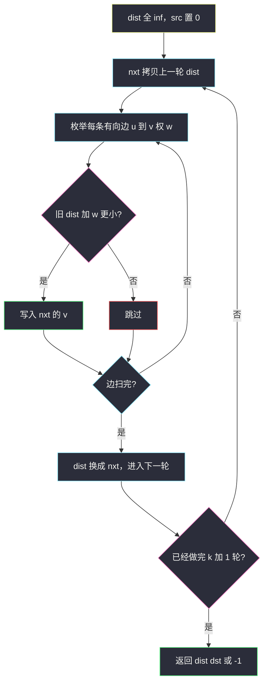

# K 站中转内最便宜的航班（带约束最短路 · Bellman-Ford）

## 一、问题描述

`n` 座城市，若干有向航班 `flights[i] = [from, to, price]`。给定起点 `src`、终点 `dst` 和整数 `k`，求从 `src` 到 `dst` **最多中转 `k` 次**（即路上最多经过 `k` 个中间城市、最多飞 `k+1` 段）的最便宜价格。走不到返回 `-1`。

> 🔗 LeetCode 787：https://leetcode.cn/problems/cheapest-flights-within-k-stops/
>
> 数据范围：`2 ≤ n ≤ 100`，航班无重边、无自环，`0 ≤ k < n`，`src != dst`，票价为正。
>
> 📚 灵茶题单：**图论 · §3.1 单源最短路：Dijkstra 算法**（1928 分）。本题是「边数受限」的单源最短路，不能直接套裸 Dijkstra。

**示例 1**

```
输入：n = 4, flights = [[0,1,100],[1,2,100],[2,0,100],[1,3,600],[2,3,200]],
      src = 0, dst = 3, k = 1
输出：700
0 → 1 → 3 费用 700，中转 1 次，合法。
0 → 1 → 2 → 3 费用 400，中转 2 次，k=1 非法。
```

**示例 2**

```
输入：n = 3, flights = [[0,1,100],[1,2,100],[0,2,500]], src = 0, dst = 2, k = 1
输出：200
0 → 1 → 2 费用 200（1 次中转）；直飞 500 更贵。
同图 k = 0 时只能直飞，答案 500（示例 3）。
```

**直观理解**

普通最短路只比费用。这里多了一条硬约束：**边数 ≤ k+1**。费用小但中转超标的路作废；费用大但边数够用的路可能才是答案。状态要同时记住「到了哪座城」和「已经飞了几段」。

---

## 二、暴力解法

DFS 从 `src` 往外搜，参数带上当前花费和已用边数。到达 `dst` 就更新答案；边数用尽或花费已经不优就剪枝。图上可以有环（示例 1 的 `0 → 1 → 2 → 0`），必须靠「边数上限」刹车，不能只靠 `visited`：同一座城允许用更少的边再来一次。

```python
class Solution:
    def findCheapestPrice(self, n, flights, src, dst, k):
        g = [[] for _ in range(n)]
        for u, v, w in flights:
            g[u].append((v, w))
        ans = 10**18

        def dfs(u: int, used: int, cost: int) -> None:
            nonlocal ans
            if cost >= ans:
                return
            if u == dst:
                ans = cost
                return
            if used == k + 1:
                return
            for v, w in g[u]:
                dfs(v, used + 1, cost + w)

        dfs(src, 0, 0)
        return -1 if ans == 10**18 else ans
```

`n ≤ 100` 时出度不小，搜索树按边数指数膨胀，容易超时。

### 🔴 瓶颈在哪里

无约束最短路用 Dijkstra / Bellman-Ford 即可。有「最多 k 次中转」后，**不能只维护每个点一个最小费用**：便宜但边数花光的路径，会挡住「更贵、边数更少、后面能接到更优终点」的路径。要把「边数」写进状态，或干脆做恰好 `k+1` 轮松弛。

---

## 三、优化探索（核心章节）

> 📚 本题在灵茶题单中属于 **图论 · §3.1 单源最短路**。带边数上限的单源最短路：Bellman-Ford 做 `k+1` 轮（每轮只用上一轮的 `dist`），或 Dijkstra 的状态改成 `(城市, 已用边数)`。

### 3.1 中转次数怎么数

中转 `k` 次 = 中间经过 `k` 座城 = **最多 `k+1` 条边**。`k = 0` 只允许直飞。

### 3.2 为什么裸 Dijkstra 会错

只按费用弹出、每个点只定一次标号时，先被确定的往往是「便宜但边数多」的点。它会把邻居的费用压得很低；那些低费用路径边数可能已经超标。同时，另一条「贵一点、边数更省」的进点方式被费用比较直接丢掉，后面再也走不到合法终点。

反例：`n = 4`，`flights = [[0,1,1],[0,2,5],[1,2,1],[2,3,1]]`，`src = 0`，`dst = 3`，`k = 1`。


合法路径只有 `0 → 2 → 3`，费用 **6**（1 次中转）。`0 → 1 → 2 → 3` 费用 3，但是 2 次中转，非法。裸 Dijkstra 会先把 2 号城标成费用 2（走了 `0-1-2`），再得到终点 3，错答 3。

### 3.3 Bellman-Ford：恰好松弛 k+1 轮

第 `t` 轮结束后，`dist[x]` 表示用 **最多 `t` 条边** 从 `src` 到 `x` 的最小费用。做 `k+1` 轮即满足中转限制。

**必须拷贝上一轮数组。** 若在同一轮里用刚更新的 `dist[v]` 再去松弛别人，等于这一轮走了超过 1 条边。官方示例 1 若边序是 `0→1, 1→2, 2→3`，不拷贝会在第 2 轮直接得到 `0-1-2-3 = 400`，而 `k = 1` 时正确答案是 700。



松弛只用 `dist[u]`（旧值）写 `nxt[v]`（新值）：一轮最多新增 1 条边。

### 3.4 分层 Dijkstra（等价写法）

状态 `(费用, 城市, 已用边数)`。同一座城、不同边数视为不同点。也可用 `dist[u][e]` 表示到 `u` 恰好用 `e` 条边的最小费用。堆弹出后若边数已达 `k+1` 就不再扩展。费用非负，正确；常数比 BF 大，但和 §3.1 的 Dijkstra 模板更近。

### 3.5 一句话核心

> **最多 k 次中转 = 最多 k+1 条边。Bellman-Ford 做 k+1 轮，每轮必须基于上一轮 dist 的拷贝松弛；不要用「每个点一个费用」的裸 Dijkstra。**

---

## 四、代码实现

### Python（主解：BF，拷贝上一轮 dist）

```python
class Solution:
    def findCheapestPrice(
        self, n: int, flights: list[list[int]], src: int, dst: int, k: int
    ) -> int:
        inf = 10**18
        dist = [inf] * n
        dist[src] = 0
        for _ in range(k + 1):
            nxt = dist[:]
            for u, v, w in flights:
                if dist[u] + w < nxt[v]:
                    nxt[v] = dist[u] + w
            dist = nxt
        return -1 if dist[dst] == inf else dist[dst]
```

**变量含义**

| 变量 | 含义 |
|------|------|
| `dist` | 上一轮结束时，最多若干条边到达各城的最小费用 |
| `nxt` | 本轮正在写的新数组，多允许 1 条边 |
| `k + 1` | 循环轮数 = 允许的最大边数 |

入队/松弛时**不要**在同一数组上原地更新。`inf` 用 `10**18`，避免 `dist[u] + w` 溢出成负数。

分层 Dijkstra 与 BF 对拍同一组样例。状态第三维是已用边数，弹出后若已用 `k+1` 条边就不再扩：

```python
import heapq

class Solution:
    def findCheapestPrice(self, n, flights, src, dst, k):
        g = [[] for _ in range(n)]
        for u, v, w in flights:
            g[u].append((v, w))
        inf = 10**18
        best = [[inf] * (k + 2) for _ in range(n)]
        best[src][0] = 0
        h = [(0, src, 0)]  # 费用, 城, 已用边
        while h:
            cost, u, e = heapq.heappop(h)
            if cost > best[u][e]:
                continue
            if u == dst:
                return cost
            if e == k + 1:
                continue
            for v, w in g[u]:
                nc = cost + w
                if nc < best[v][e + 1]:
                    best[v][e + 1] = nc
                    heapq.heappush(h, (nc, v, e + 1))
        return -1
```

面试默写优先 BF；若现场更熟堆，用这一版，记得 **城市 + 边数** 一起当状态，不要只按城市定标。

### Java（可选）

```java
class Solution {
    public int findCheapestPrice(int n, int[][] flights, int src, int dst, int k) {
        final int INF = Integer.MAX_VALUE / 2;
        int[] dist = new int[n];
        Arrays.fill(dist, INF);
        dist[src] = 0;
        for (int round = 0; round <= k; round++) {
            int[] nxt = dist.clone();
            for (int[] e : flights) {
                int u = e[0], v = e[1], w = e[2];
                if (dist[u] + w < nxt[v]) {
                    nxt[v] = dist[u] + w;
                }
            }
            dist = nxt;
        }
        return dist[dst] >= INF ? -1 : dist[dst];
    }
}
```

---

## 五、具体例子演示

以示例 1 跟踪 Bellman-Ford。`src = 0`，`k = 1`，做 **2** 轮。`inf` 记为 `∞`。

边：`0→1:100`，`1→2:100`，`2→0:100`，`1→3:600`，`2→3:200`。

| 轮 | 使用的 dist（旧） | 本轮松弛成功 | 结束后 dist |
|----|-------------------|--------------|-------------|
| 初 | — | `dist[0]=0` | `[0, ∞, ∞, ∞]` |
| 1 | `[0, ∞, ∞, ∞]` | `0→1` 得 100 | `[0, 100, ∞, ∞]` |
| 2 | `[0, 100, ∞, ∞]` | `0→1` 仍 100；`1→2` 得 200；`1→3` 得 700 | `[0, 100, 200, 700]` |

第 2 轮里 `dist[2]` 仍是 `∞`（旧数组），所以 **`2→3` 本轮不会写成 400**。`k = 1` 到此结束，`dst = 3` 答案 **700**。

若再做第 3 轮（相当于 `k = 2`），才会用新的 `dist[2]=200` 松弛出 `2→3 = 400`。那正是「中转 2 次」的非法路径在 `k = 1` 时被挡掉的原因。

示例 2 边：`0→1:100`，`1→2:100`，`0→2:500`。`k = 1` 做 2 轮：

| 轮 | 旧 dist | 本轮写入 | 新 dist |
|----|---------|----------|---------|
| 初 | — | `src=0` | `[0, ∞, ∞]` |
| 1 | `[0, ∞, ∞]` | `0→1=100`，`0→2=500` | `[0, 100, 500]` |
| 2 | `[0, 100, 500]` | `1→2=200` 优于 500 | `[0, 100, 200]` |

`k = 0` 停在第 1 轮，答案 500。反例 `k = 1` 两轮后 `dist[3] = 6`，不会出现非法的 3。

---

## 六、复杂度分析

| 方法 | 时间 | 空间 | 说明 |
|------|------|------|------|
| DFS 爆搜 | 指数级 | `O(k)` 栈 | `n=100` 易 TLE |
| BF 拷贝（主解） | `O(k · m)` | `O(n)` | `m` 为航班数，最多约 `n²/2` |
| 分层 Dijkstra | `O(k m log(k n))` | `O(n k)` | 状态带边数，适合正权 |

---

## 七、对比总结

| 维度 | 裸 Dijkstra（一点一费用） | BF k+1 轮拷贝 | 分层 Dijkstra |
|------|---------------------------|---------------|---------------|
| 边数约束 | 无法表达，会错 | 轮数就是边数 | 状态第三维 |
| 实现 | 短，但不正确 | 最短、好默写 | 与堆模板一致 |
| 负权 | 本题票价为正 | 正权即可 | 要求非负 |

**易错点**

1. **`k` 次中转当成 `k` 条边**：少做一轮，直飞还在，经 1 站的最优会丢。
2. **原地松弛不拷贝**：一轮走多条边，官方示例 1 会得到错误的 400。
3. **用 `visited` 把城市锁死**：带约束最短路允许同一城以不同边数多次进入。
4. **`inf + w` 溢出**：Java 用 `Integer.MAX_VALUE / 2`。
5. **到不了写成 0**：应返回 `-1`。

---

## 八、举一反三

| 题目 | 关系 |
|------|------|
| [743. 网络延迟时间](https://leetcode.cn/problems/network-delay-time/) | 无边数限制的正权单源最短路，裸 Dijkstra 即可 |
| [1514. 概率最大的路径](https://leetcode.cn/problems/path-with-maximum-probability/) | Dijkstra，松弛改成乘概率、取最大 |
| [1293. 网格中的最短路径](https://leetcode.cn/problems/shortest-path-in-a-grid-with-obstacles-elimination/) | 同样「次数受限」：状态 `(格, 剩余消除次数)`，网格 BFS |
| [1928. 规定时间内到达终点的最小花费](https://leetcode.cn/problems/minimum-cost-to-reach-destination-in-time/) | 约束从边数换成时间，思路同分层最短路 |
| [787 同系列思考](https://leetcode.cn/problems/cheapest-flights-within-k-stops/) | 把 k 去掉就退化成普通最短路，可对照 743 |

**思想迁移**

- 最短路上多一个「次数 / 时间 / 障碍」限制，就把该限制塞进状态，或让 BF 的轮数等于上限。
- 口诀：**「k 次中转等于 k+1 条边；BF 拷贝旧 dist 松弛；裸 Dijkstra 只比费用会把超停点的便宜路定死。」**
