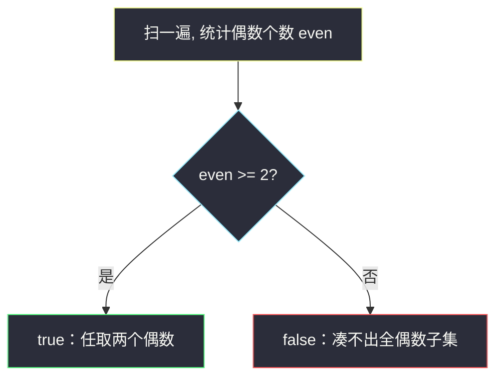
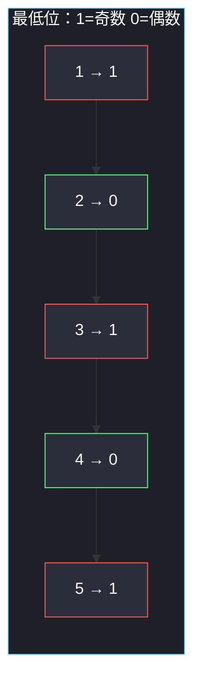

# 检查按位或是否存在尾随零（偶数个数 ≥ 2）

## 一、问题描述

给你一个正整数数组 `nums`。请判断能否选出**至少两个**数，使它们的按位或（OR）的二进制表示里**至少有一个尾随零**。

尾随零 = 最低位是 0 = 这个 OR 结果是**偶数**。

> 🔗 LeetCode 2980：https://leetcode.cn/problems/check-if-bitwise-or-has-trailing-zeros/
>
> 数据范围：`2 ≤ nums.length ≤ 100`，`1 ≤ nums[i] ≤ 100`。
>
> 📚 灵茶题单：**三、与或（AND/OR）的性质**（1234 分）。OR 的某一位为 0，当且仅当所有参与数在这一位都是 0。落到最低位：OR 为偶数 ⇔ 被选的数**全是偶数**。

**示例 1**

```
输入：nums = [1, 2, 3, 4, 5]
输出：true
解释：选 2 和 4。2 | 4 = 6 = 110₂，末尾有一个 0。
```

**示例 2**

```
输入：nums = [2, 4, 8, 16]
输出：true
解释：任意两个偶数的 OR 仍是偶数，例如 2 | 4 = 6。
```

**示例 3**

```
输入：nums = [1, 3, 5, 7, 9]
输出：false
解释：全是奇数，任意子集的 OR 最低位都是 1。
```

**直观理解**

「末尾有 0」只看最低位。OR 在最低位是 0，要求选出的每一个数最低位都是 0，也就是都是偶数。至少选两个，所以问题退化成：**数组里偶数够不够两个**。

---

## 二、暴力解法

枚举所有大小 ≥ 2 的子集，算 OR，看是否偶数。`n ≤ 100` 子集有 `2^n` 个，会超时。退一步：只枚举所有二元对（题目只要存在，两个就够——见下一章）。

```python
class Solution:
    def hasTrailingZeros(self, nums: list[int]) -> bool:
        n = len(nums)
        for i in range(n):
            for j in range(i + 1, n):
                if (nums[i] | nums[j]) % 2 == 0:
                    return True
        return False
```

`n ≤ 100`，`O(n²)` 能过。但双重循环没有用到 OR 的位性质。

### 🔴 瓶颈在哪里

容易误写成「整个数组的 OR 是不是偶数」。反例：`[1, 2, 4]`。全体 OR 是 `1|2|4 = 7`（奇数、无尾随零），但 `2|4 = 6` 合法。必须**丢掉奇数**再 OR，等价于只在偶数里选。

---

## 三、优化探索（核心章节）

> 📚 本题在灵茶题单中属于 **三、与或（AND/OR）的性质**。OR 是「按位取并」：某一位上，只要有一个 1，结果就是 1。

### 3.1 OR 与尾随零

一个数有尾随零 ⇔ `x & 1 == 0` ⇔ `x` 偶数。

若干个数的 OR 有尾随零 ⇔ `(a|b|…) & 1 == 0` ⇔ 每一个数的最低位都是 0 ⇔ **全是偶数**。

选一个偶数不够（题目要求 ≥ 2 个数）。因此：

- 偶数个数 ≥ 2 → 任取两个，OR 仍偶数 → `true`
- 偶数个数 ≤ 1 → 任何大小 ≥ 2 的子集里至少有一个奇数 → OR 最低位为 1 → `false`

奇数帮不上忙：把它并进 OR 只会把最低位钉死成 1。OR 只会把 0 变成 1，不会把已经出现的 1 清掉——这是本节「与或性质」的另一面。



### 3.2 为什么「两个就够」

若存在更大的全偶数子集，它的任意两个元素已经构成合法答案。不必真的去 OR 多个数，更不必追求「尾随零越多越好」——题目只问存在性。

官方提示也是这层意思：OR 不会把已经置上的 1 清掉；若有解，必有一对解。

于是可以枚举二元对，也可以直接数偶数。两种写法等价，计数更短。

多一个尾随零（能被 4、8 整除）是更强的条件，本题**不要求**。`6 = 110₂` 只有一个尾随零，已经算成功。

### 3.3 一句话核心

> **OR 为偶数 ⇔ 选出的全是偶数；至少两个 ⇒ 偶数个数 ≥ 2。不要对整个数组做 OR。**

---

## 四、代码实现

### Python（主解：数偶数）

```python
class Solution:
    def hasTrailingZeros(self, nums: list[int]) -> bool:
        even = 0
        for x in nums:
            if x % 2 == 0:
                even += 1
                if even >= 2:
                    return True
        return False
```

`x % 2 == 0` 也可写成 `x & 1 == 0`。提前返回：扫到第二个偶数即可。

**变量含义**

| 写法 | 含义 |
|------|------|
| `even` | 目前见到的偶数个数 |
| `x & 1 == 0` | 最低位为 0，即有至少一个二进制尾随零 |

---

## 五、具体例子演示

**示例 1**：`nums = [1, 2, 3, 4, 5]`。看最低位（`x & 1`）和偶数计数：

| i | nums[i] | 二进制 | 最低位 | 偶数? | even |
|---|---------|--------|--------|-------|------|
| 0 | 1 | `0001` | 1 | 否 | 0 |
| 1 | 2 | `0010` | 0 | 是 | 1 |
| 2 | 3 | `0011` | 1 | 否 | 1 |
| 3 | 4 | `0100` | 0 | 是 | **2 → true** |

`2 | 4 = 6 = 0110₂`，尾随一个 0。后面的 5 不用看。

若误对全体做 OR：`1|2|3|4|5 = 7 = 0111₂`，会得出错误的 `false`。



绿节点是偶数，已经有两个，答案 `true`。

**示例 3**：`[1, 3, 5, 7, 9]` 最低位全是 1，`even` 始终 0，返回 `false`。

**边界**：`[1, 2]` → 只有一个偶数 → `false`；`[2, 4]` → `true`；`[8, 8]` 两个相同偶数也行，`8|8 = 8 = 1000₂` 有三个尾随零。长度为 2 的下限刚好卡在「必须选两个」上：`[1, 3]` 两个奇数 → `false`。

---

## 六、复杂度分析

| 方法 | 时间 | 空间 | 说明 |
|------|------|------|------|
| 枚举所有子集 | `O(2^n · n)` | `O(1)` | `n=100` 不可行 |
| 枚举所有二元对 | `O(n²)` | `O(1)` | 能过，没吃到位性质 |
| 数偶数（主解） | `O(n)` | `O(1)` | 遇到第二个偶数即可停 |

---

## 七、对比总结

| 维度 | 全体 OR | 枚举二元对 | 数偶数 |
|------|---------|-----------|--------|
| 问的是 | 「所有数」 | 「某两个」 | 「偶数够不够两个」 |
| 会不会误判 | 会（奇数污染最低位） | 不会 | 不会 |
| 用到的性质 | 无 | OR 的结果 | OR 最低位 = 各位最低位的 OR |

**易错点**

1. **对整个数组做 OR**：奇数把最低位钉成 1，合法的偶对被掩盖。
2. **要求「尽量多的尾随零」**：题目只问至少一个 0。
3. **漏掉「至少两个」**：一个偶数自己有尾随零，但不能单选。
4. **把 AND 和 OR 搞反**：AND 更容易出 0；本题是 OR，更「不容易」出尾随零。
5. **用 `nums[i] | nums[j] == 偶数` 却写成检查 XOR**：XOR 两个奇数也是偶数，但题目要的是 OR。

---

## 八、举一反三

| 题目 | 关系 |
|------|------|
| [231. 2 的幂](https://leetcode.cn/problems/power-of-two/) | 只有一个 1、其余全是尾随/前导零：`n & (n-1) == 0` |
| [191. 位 1 的个数](https://leetcode.cn/problems/number-of-1-bits/) | popcount；本题只看最低那一位 |
| [338. 比特位计数](https://leetcode.cn/problems/counting-bits/) | 每个数的 1 的个数，和「最低位是不是 0」同一套位视角 |
| [2680. 最大或值](https://leetcode.cn/problems/maximum-or/) | OR 的另一面：某位一旦被 1 占据就再也清不掉 |
| [1318. 或运算的最小翻转次数](https://leetcode.cn/problems/minimum-flips-to-make-a-or-b-equal-to-c/) | 按位看 OR 要变成目标，每位独立决策 |

**思想迁移**

- OR 某位为 0 ⇔ 所有数该位都是 0；AND 某位为 1 ⇔ 所有数该位都是 1。
- 口诀：**「OR 要末尾 0，就得全是偶数；两个偶数就够。」**
