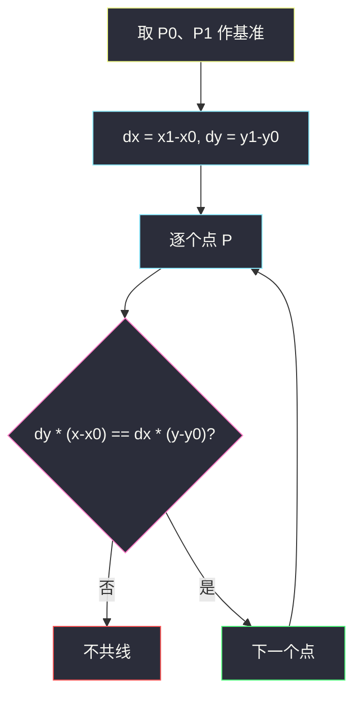
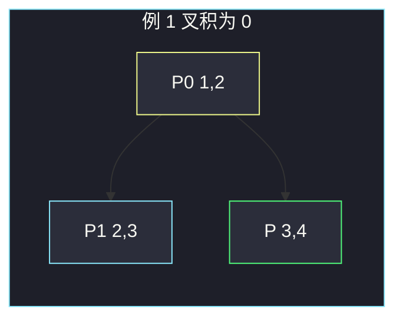

# 缀点成线（向量叉积判共线）

## 一、问题描述

给定平面上若干点 `coordinates`，判断这些点是否**都在同一条直线上**。

> 🔗 LeetCode 1232：https://leetcode.cn/problems/check-if-it-is-a-straight-line/
>
> 数据范围：`2 ≤ coordinates.length ≤ 1000`，`-10^4 ≤ coordinates[i][j] ≤ 10^4`，点互不相同。
>
> 📚 灵茶题单：**§5.1 点、线**（1247 分）。用向量叉积 `(y1-y0)*(x-x0) == (y-y0)*(x1-x0)` 判共线，避免除法斜率；竖直线同样适用。

**示例 1**

```
输入：coordinates = [[1,2],[2,3],[3,4],[4,5],[5,6],[6,7]]
输出：true
解释：点在直线 y = x + 1 上。
```

**示例 2**

```
输入：coordinates = [[1,1],[2,2],[3,4],[4,5],[5,6],[7,7]]
输出：false
解释：[3,4] 已经偏离前两点所在直线。
```

**直观理解**

两点确定一条直线。从第三点起，每个点只要「不偏离」这条直线即可。偏离与否看两个向量是否平行：取基准向量 `P0→P1`，再看 `P0→Pi`。平行则叉积为 0（平行四边形面积为 0），点在直线上。

---

## 二、暴力解法

用斜率：`k = (y1-y0)/(x1-x0)`，再检查每个点是否满足同一斜率。

```python
class Solution:
    def checkStraightLine(self, coordinates: list[list[int]]) -> bool:
        x0, y0 = coordinates[0]
        x1, y1 = coordinates[1]
        if x1 == x0:
            return all(x == x0 for x, _ in coordinates)
        k = (y1 - y0) / (x1 - x0)
        for x, y in coordinates[2:]:
            if x == x0:
                return False
            if (y - y0) / (x - x0) != k:
                return False
        return True
```

竖直线要单独分支；浮点除法在整数坐标上可能被精度咬一口。`n ≤ 1000` 次数不多，但写法脆。

### 🔴 瓶颈在哪里

除法做了两件不该在几何判定里做的事：竖直线要特判；相等变成「两个 float 是否碰巧相等」。叉积把「斜率相等」改写成交叉相乘，全程整数，竖直线自动成立。

---

## 三、优化探索（核心章节）

> 📚 本题在灵茶题单中属于 **§5.1 点、线**。平面向量 `u=(ux,uy)`、`v=(vx,vy)` 的叉积（二维，结果是标量）是 `ux*vy - uy*vx`。为 0 表示共线 / 平行。

### 3.1 斜率相等改写成乘法

三点 `P0, P1, P` 共线，当且仅当 `P0→P1` 与 `P0→P` 平行：

`(y1 - y0) / (x1 - x0) == (y - y0) / (x - x0)`

分母可能为 0。交叉相乘（两边同乘两个分母，方向一致则不等号不变；这里是相等）：

`(y1 - y0) * (x - x0) == (y - y0) * (x1 - x0)`

这就是二维叉积为 0：`dx1 * dy2 - dy1 * dx2 = 0`。

竖直线：`x1=x0`，等式左边 `(y1-y0)*(x-x0)`，右边 `(y-y0)*0=0`。要成立必须 `x=x0`（或 `y1=y0` 但点不重合，两点不可能既同 x 又同 y）。所以竖直线**不用特判**。

水平线同理：`y1=y0` 时要求每个 `y=y0`。



### 3.2 溢出

坐标绝对值 ≤ `10^4`，差 ≤ `2·10^4`，乘积 ≤ `4·10^8`，Python int 任意精度，Java `int` 也够。若坐标到 `10^9`，Java 应升 `long`。

### 3.3 一句话核心

> **两点定直线；其余点用叉积为 0 判定，乘法代替斜率，竖直线不用特判。**

---

## 四、代码实现

### Python（主解：叉积）

```python
class Solution:
    def checkStraightLine(self, coordinates: list[list[int]]) -> bool:
        x0, y0 = coordinates[0]
        x1, y1 = coordinates[1]
        dx, dy = x1 - x0, y1 - y0
        for x, y in coordinates[2:]:
            if dy * (x - x0) != dx * (y - y0):
                return False
        return True
```

`n=2` 时循环不执行，两点必共线，直接 true。

**变量含义**

| 写法 | 含义 |
|------|------|
| `dx, dy` | 基准向量 `P0→P1` |
| `x-x0, y-y0` | 向量 `P0→P` |
| `dy*(x-x0) != dx*(y-y0)` | 叉积非 0，不共线 |

---

## 五、具体例子演示

**示例 1**：`[[1,2],[2,3],[3,4],[4,5],[5,6],[6,7]]`。

`P0=(1,2)`，`P1=(2,3)`，`dx=1`，`dy=1`。判定式：`1*(x-1) == 1*(y-2)`，即 `x-1 == y-2`，也就是 `y = x+1`。

| 点 | (x-x0, y-y0) | dy·(x-x0) | dx·(y-y0) | 相等? |
|----|----------------|-----------|-----------|-------|
| (3,4) | (2, 2) | 2 | 2 | 是 |
| (4,5) | (3, 3) | 3 | 3 | 是 |
| (5,6) | (4, 4) | 4 | 4 | 是 |
| (6,7) | (5, 5) | 5 | 5 | 是 |

全部通过，true。对拍官方。

**示例 2**：`[[1,1],[2,2],[3,4],[4,5],[5,6],[7,7]]`。

`P0=(1,1)`，`P1=(2,2)`，`dx=1`，`dy=1`。应满足 `x-1 == y-1`，即 `y=x`。

| 点 | 叉积两边 | 结果 |
|----|----------|------|
| (3,4) | `1*(3-1)=2` vs `1*(4-1)=3` | **2 ≠ 3，立刻 false** |

后面的点不必看。对拍官方 false。

**竖直线**：`[[3,1],[3,5],[3,9]]`。`dx=0`，`dy=4`。判定 `4*(x-3)==0*(y-1)` → `4(x-3)==0` → `x==3`。三点 x 都是 3，true。斜率写法这里会除以 0。

**水平线**：`[[1,7],[4,7],[9,7]]`。`dx=3`，`dy=0`。判定 `0*(x-1)==3*(y-7)` → `y==7`。true。



向量 `(1,1)` 与 `(2,2)` 平行，平行四边形退化成线段。

**边界**：恰好两点 → true；三点折线 → 第三个点叉积非 0。题目保证点互不相同，不会出现零向量基准；即使出现，`dx=dy=0` 时等式变成 `0==0`，会把所有点判共线，那是脏数据。

---

## 六、复杂度分析

| 方法 | 时间 | 空间 | 说明 |
|------|------|------|------|
| 斜率 + 浮点 | `O(n)` | `O(1)` | 竖直线 / 精度 |
| 叉积乘法（主解） | `O(n)` | `O(1)` | 每个点一次乘加 |

---

## 七、对比总结

| 维度 | 斜率 | 叉积（主解） | 直线方程 ax+by+c=0 |
|------|------|--------------|---------------------|
| 竖直线 | 要分支 | 自动 | 自动 |
| 精度 | 浮点 | 整数乘法 | 整数 |
| 代码量 | 更长 | 四五行 | 要先求 a,b,c |

**易错点**

1. **用除法比斜率**：竖直线崩溃，或 `1/3` 与 `2/6` 的 float 对不齐。
2. **基准选成后两点再回头**：可以，但必须固定同一条直线；不要每对相邻点比一次斜率却允许「折线每段斜率碰巧一样的错觉」——相邻斜率都相等才共线，其实也对，但实现更容易写错基准。固定 `P0,P1` 最干净。
3. **叉积写反仍用 `!=`**：两边同时交换只是交换等式两侧，不影响相等。写减法形式时符号要一致。
4. **Java 用 `int` 乘 `10^9` 级坐标**：本题够用；更大范围用 `long`。
5. **把「点在线段上」和「共线」搞混**：本题是无限直线，点可以在 `P0P1` 延长线上。

---

## 八、举一反三

| 题目 | 关系 |
|------|------|
| [1037. 有效的回旋镖](https://leetcode.cn/problems/valid-boomerang/) | 三点**不**共线；叉积非 0 |
| [149. 直线上最多的点数](https://leetcode.cn/problems/max-points-on-a-line/) | §5.1 进阶：过定点的斜率分组 |
| [2280. 表示一个折线图的最少直线数](https://leetcode.cn/problems/minimum-lines-to-represent-a-line-chart/) | 相邻段是否共线，仍然叉积 |
| [1232. 本题](https://leetcode.cn/problems/check-if-it-is-a-straight-line/) | 全体共线的入门判定 |
| [963. 最小面积矩形 II](https://leetcode.cn/problems/minimum-area-rectangle-ii/) | 向量点积 / 叉积处理垂直与平行 |

**思想迁移**

- 几何题能乘法就不要除法；共线、平行、转向（左/右）都看叉积符号。
- 口诀：**「两点定线，其余点叉积为 0；交叉相乘，躲开竖直线。」**
