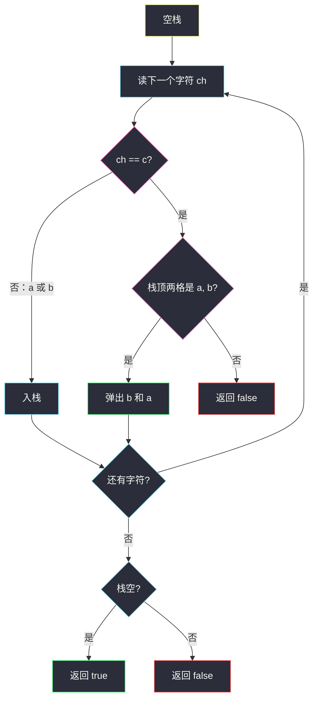
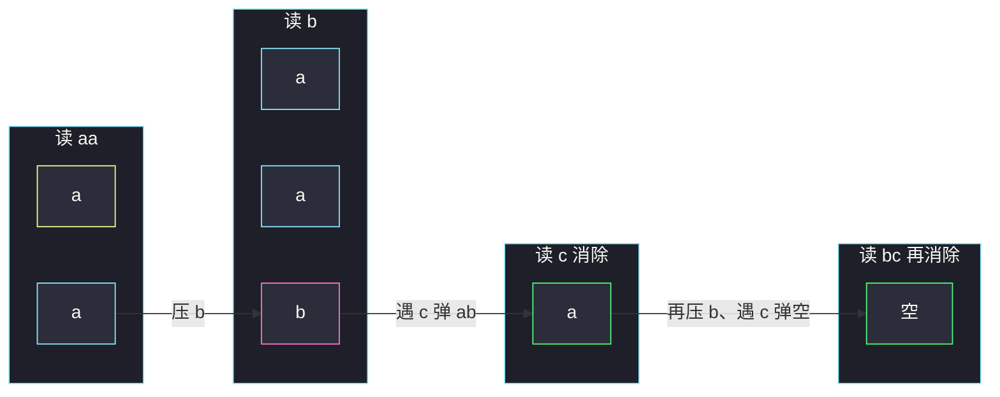

# 检查替换后的词是否有效（栈：三元邻项消除）

## 一、问题描述

给你只含 `a`、`b`、`c` 的字符串 `s`。从空串 `t = ""` 出发，可以任意次把 `"abc"` **插入**到 `t` 的任意位置。问能否得到 `s`。

> 🔗 LeetCode 1003：https://leetcode.cn/problems/check-if-word-is-valid-after-substitutions/
>
> 数据范围：`1 <= s.length <= 2·10^4`，`s` 只含 `'a'`、`'b'`、`'c'`。

**示例 1**

```
输入：s = "aabcbc"
输出：true
解释："" → "abc" → "aabcbc"（在第一个 a 后面插入 abc）。
```

**示例 2**

```
输入：s = "abcabcababcc"
输出：true
解释：连续插入三次 abc 得到 "abcabcabc"，再在倒数第二段里插入，变成 "abcabcababcc"。
```

**示例 3**

```
输入：s = "abccba"
输出：false
解释：消掉开头的 abc 后剩下 "cba"，无法再消。
```

**直观理解**

插入 `"abc"` 的逆过程是：在串里找到一段相邻的 `"abc"` 并删掉，两侧拼起来，可能又拼出新的 `"abc"`。能消到空串 ⇔ 可以由空串插出来。这是括号匹配的**三元版**：`a` 像左括号，`c` 像右括号，中间必须卡一个 `b`。用栈做邻项消除。

---

## 二、暴力解法

反复把子串 `"abc"` 替换成空，直到不能再换。

```python
class Solution:
    def isValid(self, s: str) -> bool:
        prev = None
        while prev != s:
            prev = s
            s = s.replace("abc", "")
        return s == ""
```

### 复杂度

- **时间**：最坏 `O(n²)`。每次 `replace` 扫整串，大约消 `n/3` 轮。`n = 2·10^4` 勉强或超时。
- **空间**：`O(n)`。

### 🔴 瓶颈在哪里

中间删除导致整串搬移。栈从左到右扫一遍：当前后缀一旦凑齐 `"abc"` 立刻弹掉，每个字符进栈、出栈各至多一次，变成 `O(n)`。

---

## 三、优化探索（核心章节）

> 📚 本题在灵茶题单中属于 **栈 · §3.3 邻项消除**。模板：从左到右，能消就消；消完两侧自动相邻，可能继续消。`"abc"` 是长度为 3 的固定模式，相当于括号匹配多了一个必须成对出现的中间符。

### 3.1 为什么消到空 ⇔ 能插出来

插入是在某位置塞进 `"abc"`。逆过来，合法串里一定存在至少一段相邻 `"abc"`（最后一次插入的那一段），删掉它得到更短的合法串。一直删到空。非法串删不干净。

所以不必真的枚举插入位置，只做消除。

### 3.2 栈模拟

从左到右：

- 遇到 `a` 或 `b`：入栈；
- 遇到 `c`：栈顶必须刚好是 `…ab`，弹出 `b` 和 `a`；否则这个 `c` 永远配不平，直接 `false`。

扫完栈必须为空（没有未闭合的 `a`/`ab` 前缀）。



等价写法：每个字符都入栈，若末尾三位是 `a,b,c` 就弹掉三位。提前在 `c` 处检查，可以少压一次非法的 `c`。

### 3.3 计数不够用

括号只有一种时，用「左括号计数 ≥ 右括号」能判合法性。本题若只维护 `cnt_a ≥ cnt_b ≥ cnt_c`，**`"aabbcc"` 会误判为合法**：数量对，但顺序是两对 `a` 粘在一起，栈在遇到第一个 `c` 时顶上是 `bb` 不是 `ab`。必须用栈记住顺序。

### 3.4 一句话核心

> **合法串 = 反复消除相邻 "abc" 能消到空；遇 c 时栈顶必须是 ab，否则非法；结束栈空。**

---

## 四、代码实现

### Python（主解）

```python
class Solution:
    def isValid(self, s: str) -> bool:
        st = []
        for ch in s:
            if ch == "c":
                if len(st) < 2 or st[-1] != "b" or st[-2] != "a":
                    return False
                st.pop()                         # 弹 b
                st.pop()                         # 弹 a
            else:
                st.append(ch)
        return not st
```

**变量含义**

| 变量 | 含义 |
|------|------|
| `st` | 还没被 `"abc"` 消掉的前缀，只可能含 `a`、`b` |
| 遇 `c` | 用当前栈顶配对出一段 `"abc"` 并消去 |

另一种等价写法（先压再消三位），和 §3.3 通用「删固定子串」模板更像：

```python
st = []
for ch in s:
    st.append(ch)
    if st[-3:] == ["a", "b", "c"]:
        del st[-3:]
return not st
```

非法的 `c` 会留在栈里，最后栈非空。主解提前返回更干净。

### Java（最优解同款）

```java
class Solution {
    public boolean isValid(String s) {
        StringBuilder st = new StringBuilder();
        for (int i = 0; i < s.length(); i++) {
            char ch = s.charAt(i);
            if (ch == 'c') {
                int n = st.length();
                if (n < 2 || st.charAt(n - 1) != 'b' || st.charAt(n - 2) != 'a') {
                    return false;
                }
                st.delete(n - 2, n);
            } else {
                st.append(ch);
            }
        }
        return st.length() == 0;
    }
}
```

---

## 五、具体例子演示

### 5.1 `s = "aabcbc"` → true

| 读入 | 动作 | 栈 |
|------|------|-----|
| `a` | 入栈 | `[a]` |
| `a` | 入栈 | `[a, a]` |
| `b` | 入栈 | `[a, a, b]` |
| `c` | 顶是 `ab`，弹出 | `[a]` |
| `b` | 入栈 | `[a, b]` |
| `c` | 顶是 `ab`，弹出 | `[]` |

栈空，**true** ✓。第一次消掉的是下标 1..3 的 `abc`，剩下 `a` 与后面的 `bc` 拼成新的 `abc`，再消掉——正好对应「先插一个 abc，再在中间插一个」。



### 5.2 `s = "abcabcababcc"` → true

| 读入 | 栈变化（只记关键） |
|------|-------------------|
| `abc` | 空 → `[a]` → `[a,b]` → 空 |
| `abc` | 同样消空 |
| `ababcc` | `[a]` → `[a,b]` → `[a,b,a]` → `[a,b,a,b]` → 遇 `c` 弹成 `[a,b]` → 再遇 `c` 弹空 |

### 5.3 `s = "abccba"` → false

`abc` 消空后下一个是 `c`，栈空，没有 `ab` 可配，立即 **false**。后面的 `ba` 不必看。

### 5.4 陷阱 `"aabbcc"` → false

数量上 `a=b=c=2`，但栈是：

| 读入 | 栈 |
|------|-----|
| `a,a,b,b` | `[a, a, b, b]` |
| `c` | 顶是 `bb`，不是 `ab` → **false** |

对拍：随机由插入生成的串，栈与反复 `replace("abc","")` 均为 true；手工打乱如 `cba`、`aabbcc` 均为 false。

---

## 六、复杂度分析

| 方法 | 时间 | 空间 | 说明 |
|------|------|------|------|
| 反复 replace | `O(n²)` | `O(n)` | n=2e4 危险 |
| 栈邻项消除（主解） | `O(n)` | `O(n)` | 每字符进出栈一次 |

---

## 七、对比总结

| 维度 | 反复替换 | 栈 |
|------|----------|-----|
| 消 `"abc"` | 真的改字符串 | 栈顶三位（或遇 c 弹 ab） |
| 级联 | 下一轮再扫 | 弹完两侧已经相邻，继续扫即可 |
| 非法 `c` | 留在串里，多轮后仍非空 | 立刻 false |

**易错点**

1. **只比计数**：`aabbcc` 会错。
2. **遇 `c` 只弹一个**：必须成对弹出 `b` 和 `a`。
3. **允许栈里出现 `c`**：主解里 `c` 只负责触发消除，不应入栈。
4. **结束不判空**：`abcab` 消一次剩 `ab`，是未闭合前缀，应 false。
5. **当成两种括号 `a`/`c` 而忽略 `b` 的位置**：`acb` 不是合法插入结果。

**模板（§3.3 固定子串邻项消除）**

```python
st = []
for ch in s:
    if ch == "c":
        if len(st) < 2 or st[-2:] != ["a", "b"]:
            return False
        st.pop(); st.pop()
    else:
        st.append(ch)
return not st
```

---

## 八、举一反三

| 题目 | 关系 |
|------|------|
| [20. 有效的括号](https://leetcode.cn/problems/valid-parentheses/) | 二元版：遇右括号弹栈顶左括号 |
| [1047. 删除字符串中的所有相邻重复项](https://leetcode.cn/problems/remove-all-adjacent-duplicates-in-string/) | §3.3 入门：相邻相同就消 |
| [2390. 从字符串中移除星号](https://leetcode.cn/problems/removing-stars-from-a-string/) | 同目录 `removing-stars-from-a-string.md`：字母入栈，星号弹顶 |
| [1910. 删除一个字符串中所有出现的给定子字符串](https://leetcode.cn/problems/remove-all-occurrences-of-a-substring/) | 把 `"abc"` 换成任意 `part`，同样栈消后缀 |
| [1544. 整理字符串](https://leetcode.cn/problems/make-the-string-great/) | 相邻大小写配对消除，仍是单栈 |

**思想迁移**

- 「插入某块 / 删除某块能还原」→ 逆过程就是邻项消除，栈维护当前未消后缀。
- 口诀：**「abc 是三元括号：遇 c 必须弹掉 ab，扫完栈空才算有效。」**
