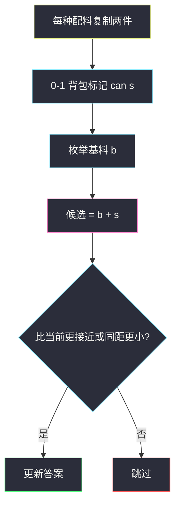

# 最接近目标价格的甜点成本（DFS / 0-1 背包）

## 一、问题描述

做一份甜点：

- **基料必须恰好选 1 种**，成本在 `baseCosts` 里。
- 有若干配料 `toppingCosts[j]`，每种可以放 **0、1 或 2** 份。
- 总成本要**最接近** `target`；若有多种成本距离相同，取**较小**的那个。

> 🔗 LeetCode 1774：https://leetcode.cn/problems/closest-dessert-cost/
>
> 数据范围：基料种类 ≤ 10，配料种类 ≤ 10，各项成本 ∈ `[1, 10^4]`，`1 ≤ target ≤ 10^4`。
>
> 📚 灵茶题单：**§3.1 0-1 背包**。每种配料最多 2 份，等价于「该成本的物品复制两件，每件 0 或 1」。先把所有能凑出的配料成本和记下来，再枚举基料比谁离 `target` 近。

**示例 1**

```
输入：baseCosts = [1,7], toppingCosts = [3,4], target = 10
输出：10
解释：基料 7 + 一份成本 3 的配料。
```

**示例 2**

```
输入：baseCosts = [2,3], toppingCosts = [4,5,100], target = 18
输出：17
解释：基料 3 + 一份 4 + 两份 5。比 20 更近。
```

**示例 3**

```
输入：baseCosts = [3,10], toppingCosts = [2,5], target = 9
输出：8
解释：3+5=8 与 10 都差 1，取较小的 8。
```

**直观理解**

方案总数最多 `10 × 3^10 ≈ 6×10^5`，搜得完。题单角度则是：配料是容量不限目标、求可达和的 0-1 背包（每样两件）。

---

## 二、暴力解法

枚举基料，再对每种配料选 0/1/2 份。成本全为正，当前已经 `≥ target` 时再加配料只会更远，可以剪枝。

```python
class Solution:
    def closestCost(self, baseCosts: list[int], toppingCosts: list[int], target: int) -> int:
        best = [baseCosts[0]]

        def better(x: int) -> None:
            d, bd = abs(x - target), abs(best[0] - target)
            if d < bd or (d == bd and x < best[0]):
                best[0] = x

        def dfs(i: int, cur: int) -> None:
            if i == len(toppingCosts):
                better(cur)
                return
            if cur >= target:
                better(cur)
                return
            for k in range(3):
                dfs(i + 1, cur + k * toppingCosts[i])

        for b in baseCosts:
            dfs(0, b)
        return best[0]
```

三道官方例都能过。这已经是可提交的解；下面用背包把「可达和」说清楚，对齐 §3.1。

### 🔴 瓶颈在哪里

配料决策互相独立，只关心**配料成本和的集合**。把每种配料拆成两件相同 0-1 物品，布尔背包一次算出所有可达和，避免每个基料都重新搜一遍树。

---

## 三、优化探索（核心章节）

> 📚 灵茶 **§3.1 0-1 背包**：物品「选或不选」。本题每种配料最多两份 → 复制成两件，倒序更新布尔数组 `can[s]` = 能否凑出配料和 `s`。

### 3.1 物品怎么拆

配料成本 `t`、上限 2 份：放入两件重量为 `t` 的 0-1 物品。`m` 种配料 → `2m ≤ 20` 件。  
可达和上限 `U = 2 * sum(toppingCosts)`，不超过 `2×10^5`。

### 3.2 转移

`can[0] = True`。对每件物品 `w`，**从大到小**：

`can[s] |= can[s - w]`（`s ≥ w`）

倒序保证每件最多用一次。完了之后枚举每个基料 `b` 和每个 `can[s]==True` 的 `s`，候选 `b+s`，按「距离小，再成本小」更新。



不能把背包容量卡死在 `target`：比 `target` 大 1 的方案可能是最优（例 3 的 10 也要参与比较，尽管最后没赢过 8）。

### 3.3 比较规则（写进 `better`）

设当前最优为 `best`，新成本 `x`：

- `|x - target| < |best - target|` → 换；
- 距离相等且 `x < best` → 换。

### 3.4 一句话核心

> **基料枚举；配料当两件 0-1 物品打可达和；并列取较小成本。**

---

## 四、代码实现

### Python（主解：0-1 背包）

```python
class Solution:
    def closestCost(self, baseCosts: list[int], toppingCosts: list[int], target: int) -> int:
        items = toppingCosts * 2  # 每种配料当两件 0-1
        u = sum(items)
        can = [False] * (u + 1)
        can[0] = True
        for w in items:
            for s in range(u, w - 1, -1):
                if can[s - w]:
                    can[s] = True
        best = None
        for b in baseCosts:
            for s in range(u + 1):
                if not can[s]:
                    continue
                x = b + s
                if best is None or abs(x - target) < abs(best - target) or (
                    abs(x - target) == abs(best - target) and x < best
                ):
                    best = x
        return best
```

第二节的 DFS 与此对拍同一组官方例，可任选提交。

### Java（最优解）

```java
class Solution {
    public int closestCost(int[] baseCosts, int[] toppingCosts, int target) {
        int u = 0;
        for (int t : toppingCosts) {
            u += 2 * t;
        }
        boolean[] can = new boolean[u + 1];
        can[0] = true;
        for (int t : toppingCosts) {
            for (int k = 0; k < 2; k++) {
                for (int s = u; s >= t; s--) {
                    can[s] |= can[s - t];
                }
            }
        }
        int best = baseCosts[0];
        for (int b : baseCosts) {
            for (int s = 0; s <= u; s++) {
                if (!can[s]) {
                    continue;
                }
                int x = b + s;
                int d = Math.abs(x - target), bd = Math.abs(best - target);
                if (d < bd || (d == bd && x < best)) {
                    best = x;
                }
            }
        }
        return best;
    }
}
```

---

## 五、具体例子演示

### 5.1 官方例 1：背包逐步纳入配料

`toppingCosts = [3,4]` → 物品 `3,3,4,4`。从 `can[0]=True` 开始：

| 纳入 | 新出现的可达和（配料部分） |
|------|---------------------------|
| 第一件 3 | 0, 3 |
| 第二件 3 | 0, 3, **6** |
| 第一件 4 | 0, 3, 4, 6, 7, 10 |
| 第二件 4 | 再增 8, 11, 14 |


基料 1：`1+8=9`（差 1），`1+10=11`（差 1），并列取 9。  
基料 7：`7+3=10`，差 0。整体最优 **10**。对拍官方。

注意：两件 3 不能再加第三件 3——0-1 复制恰好两份，对应「每种最多 2 份」。

### 5.2 官方例 2、3

- `base=[2,3], top=[4,5,100], target=18`：`3+4+5+5=17` 差 1；`2+4+4+5+5=20` 差 2。100 一旦加上就远超。答案 17。
- `base=[3,10], top=[2,5], target=9`：`3+5=8` 与 `10` 都差 1，取 **8**。对拍官方。

---

## 六、复杂度分析

| 方法 | 时间 | 空间 | 说明 |
|------|------|------|------|
| DFS 枚举份数 | `O(n · 3^m)` | `O(m)` 栈 | `n,m ≤ 10`，可过 |
| 0-1 背包（主解） | `O(m · U)` | `O(U)` | `U ≤ 2e5` |

`n` 为基料数，`m` 为配料数。

---

## 七、对比总结

| 维度 | DFS | 背包 |
|------|-----|------|
| 状态 | 配料下标 + 当前和 | 可达和集合 |
| 上限 2 份 | 循环 `k=0..2` | 复制两件 0-1 |
| 剪枝 | `cur ≥ target` 停 | 仍需记下 `> target` 的和 |

**易错点**

1. **距离并列取大的**：例 3 会返回 10，应取 8。
2. **每种配料当完全背包无限份**：题目最多两份。
3. **正序更新 `can`**：变成完全背包，同一种会用超过 2 次。
4. **容量只开到 `target`**：漏掉「略超 target」的更优或并列方案。
5. **基料也可以 0 种或多种**：必须恰好 1 种，不能空、不能加两种基料。

---

## 八、举一反三

| 题目 | 关系 |
|------|------|
| [416. 分割等和子集](https://leetcode.cn/problems/partition-equal-subset-sum/) | 经典 0-1 可达和 |
| [494. 目标和](https://leetcode.cn/problems/target-sum/) | 0-1 背包计数；见 `base/target-sum.md` |
| [474. 一和零](https://leetcode.cn/problems/ones-and-zeroes/) | 二维 0-1；见 `base/ones-and-zeroes.md` |
| [638. 大礼包](https://leetcode.cn/problems/shopping-offers/) | 多维容量、每种礼包次数有限；见同目录 `shopping-offers.md` |
| [1049. 最后一块石头的重量 II](https://leetcode.cn/problems/last-stone-weight-ii/) | 可达和里找最接近一半 |
| [1774. 最接近目标价格的甜点成本](https://leetcode.cn/problems/closest-dessert-cost/) | 本题 |

**思想迁移**

- 「0/1/2 份」= 两件相同 0-1；「最接近 target」= 全体可达值上比距离。
- 口诀：**「基料扫一遍；配料两件倒序打表；平手取小。」**
