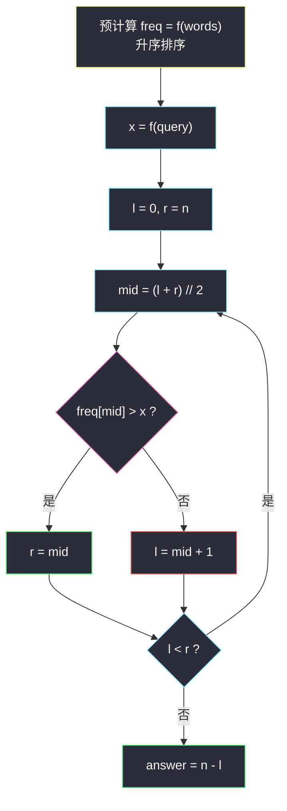
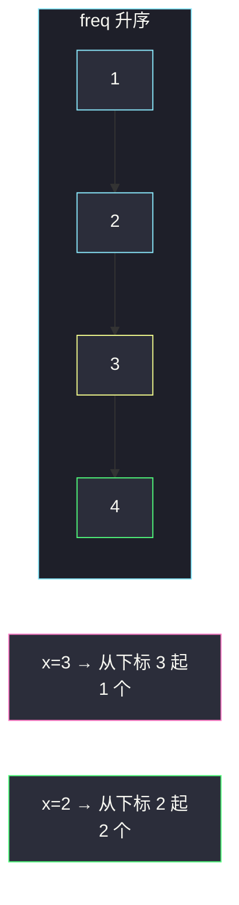

# 比较字符串最小字母出现频次（预计算 + 二分计数）

## 一、问题描述

定义函数 `f(s)`：统计字符串 `s` 里**字典序最小的那个字母**出现了几次（`s` 非空）。例如 `s = "dcce"`，最小字母是 `c`，出现 2 次，所以 `f(s) = 2`。

给你待查表 `queries` 和词汇表 `words`。对每个 `queries[i]`，统计 `words` 中有多少个词 `W` 满足 `f(queries[i]) < f(W)`。返回整数数组 `answer`，`answer[i]` 是第 `i` 次查询的结果。

> 🔗 LeetCode 1170：https://leetcode.cn/problems/compare-strings-by-frequency-of-the-smallest-character/
>
> 数据范围：`1 <= queries.length, words.length <= 2000`，每个串长 `∈ [1, 10]`，只含小写字母。

**示例 1**

```
输入：queries = ["cbd"], words = ["zaaaz"]
输出：[1]
解释：f("cbd") = 1（最小字母 b 出现 1 次），f("zaaaz") = 3（最小字母 a 出现 3 次），1 < 3。
```

**示例 2**

```
输入：queries = ["bbb","cc"], words = ["a","aa","aaa","aaaa"]
输出：[1,2]
解释：words 的 f 依次为 1, 2, 3, 4。
      f("bbb") = 3，严格更大的只有 4 → 1 个；
      f("cc")  = 2，严格更大的有 3、4 → 2 个。
```

**直观理解**

每次查询都在问：词汇表里有多少个词的「最小字母频次」比我大。`f` 只依赖每个串自己，可以先全部算出来，再变成「有序数组上，比 `x` 大的有几个」——标准二分计数。

---

## 二、暴力解法

每个 query 扫一遍 words，现场算 `f` 再比较：

```python
class Solution:
    def numSmallerByFrequency(self, queries: List[str], words: List[str]) -> List[int]:
        def f(s: str) -> int:
            return s.count(min(s))

        ans = []
        for q in queries:
            fq = f(q)
            ans.append(sum(1 for w in words if fq < f(w)))
        return ans
```

### 复杂度

- **时间**：`O(m · n · L)`。`m`、`n` 各 2000，`L ≤ 10`，约 `4·10^7` 次字符扫描，勉强能过，但每次 query 都把 words 的 `f` 重算一遍。
- **空间**：`O(m)` 存答案。

### 🔴 瓶颈在哪里

`f(word)` 与当前 query 无关，却被算了 `m` 遍。预计算一次、排序一次，每个 query 就能用二分在 `O(log n)` 内回答「有多少个更大的 f」。

---

## 三、优化探索（核心章节）

> 📚 本题在灵茶题单中属于 **01-滑动窗口与双指针 · §1.2 进阶**（滑窗收尾批：把「逐个比较」升级成「预计算 + 有序结构上二分计数」）。`f` 的值域很小，但骨架仍是：先丢掉重复计算，再在有序数组上找严格大于 `x` 的个数。

### 3.1 f 怎么算

最小字母 = `min(s)`，频次 = 它出现几次。串长 ≤ 10，扫一遍即可，不必排序：

```
f(s) = s.count(min(s))
```

`f` 的取值范围是 `[1, 10]`。

### 3.2 预计算 + 排序

令 `freq[j] = f(words[j])`，再把 `freq` **升序**排序。对查询值 `x = f(queries[i])`，要的是 `freq` 里严格大于 `x` 的个数。有序之后这些「更大的」全挤在数组右端，只要找到**第一个 `> x` 的下标** `p`，答案就是 `n - p`。

### 3.3 二分：第一个严格大于 x（左闭右开一套走到底）

全程使用左闭右开区间 `[l, r)`，循环不变式：**`[0, l)` 里的值都 `≤ x`，`[r, n)` 里的值都 `> x`**。循环结束时 `l == r`，`l` 就是第一个 `> x` 的下标（若全体 `≤ x` 则 `l = n`）。

```
l, r = 0, n
while l < r:
    mid = (l + r) // 2
    if freq[mid] > x: r = mid       # mid 已在「蓝区」（更大），答案 ≤ mid
    else:             l = mid + 1   # mid ≤ x，答案在右边
答案个数 = n - l
```

这正是 Python `bisect.bisect_right(freq, x)`：插入点在所有 `x` 之后，也就是第一个 `> x`。主解直接调用它。



### 3.4 值域只有 1..10 时的计数替代

`f ∈ [1, 10]`，也可以开 11 格桶，统计每种频次的词数，再做后缀和：`cnt[x] = 有多少词的 f ≥ x`。查询 `x` 的答案就是 `cnt[x + 1]`。时间变成线性，但§1.2 这批要练的是「排序 + 二分找第一个更大」，主解走二分。

### 3.5 一句话核心

> **每个词的 f 只算一次、排好序；查询变成「有序数组里严格大于 x 的个数」= `n - bisect_right(freq, x)`。**

---

## 四、代码实现

### Python（主解：预计算 + bisect_right）

```python
from bisect import bisect_right

class Solution:
    def numSmallerByFrequency(self, queries: List[str], words: List[str]) -> List[int]:
        def f(s: str) -> int:
            return s.count(min(s))

        freq = sorted(f(w) for w in words)          # 升序
        n = len(freq)
        return [n - bisect_right(freq, f(q)) for q in queries]
```

手写左闭右开、与 `bisect_right` 完全等价：

```python
def count_greater(freq: List[int], x: int) -> int:
    l, r = 0, len(freq)           # [l, r)
    while l < r:
        mid = (l + r) // 2
        if freq[mid] > x:
            r = mid
        else:
            l = mid + 1
    return len(freq) - l          # [l, n) 全 > x
```

**变量含义**

| 变量 | 含义 |
|------|------|
| `f(s)` | `s` 中最小字母的出现次数 |
| `freq` | 每个 word 的 `f`，已升序 |
| `x` | 当前 query 的 `f` |
| `l` / `r` | 左闭右开 `[l, r)`：`[0,l)` 都 `≤ x`，`[r,n)` 都 `> x` |
| `n - l` | 严格大于 `x` 的个数 |

**循环不变式**：每次缩小后，分界点（第一个 `> x`）始终落在 `[l, r)` 内。

### Java（最优解同款）

```java
class Solution {
    public int[] numSmallerByFrequency(String[] queries, String[] words) {
        int n = words.length;
        int[] freq = new int[n];
        for (int i = 0; i < n; i++) freq[i] = f(words[i]);
        Arrays.sort(freq);
        int[] ans = new int[queries.length];
        for (int i = 0; i < queries.length; i++) {
            int x = f(queries[i]);
            int l = 0, r = n;                    // [l, r)
            while (l < r) {
                int mid = l + (r - l) / 2;
                if (freq[mid] > x) r = mid;
                else l = mid + 1;
            }
            ans[i] = n - l;
        }
        return ans;
    }

    private int f(String s) {
        char mn = 'z';
        int cnt = 0;
        for (int i = 0; i < s.length(); i++) {
            char c = s.charAt(i);
            if (c < mn) { mn = c; cnt = 1; }
            else if (c == mn) cnt++;
        }
        return cnt;
    }
}
```

---

## 五、具体例子演示

以示例 2：`queries = ["bbb","cc"]`，`words = ["a","aa","aaa","aaaa"]`。

**预处理**：`f(words) = [1, 2, 3, 4]`，已有序。`n = 4`。

**查询 1**：`x = f("bbb") = 3`。要找第一个 `> 3` 的下标。

| 轮次 | l | r | mid | freq[mid] | `> 3` ? | 动作 |
|------|---|---|-----|-----------|---------|------|
| 1 | 0 | 4 | 2 | 3 | ✗ | `l = 3` |
| 2 | 3 | 4 | 3 | 4 | ✓ | `r = 3` |

`l == r == 3`，个数 `4 - 3 = 1`（只有 `aaaa`）✓。

**查询 2**：`x = f("cc") = 2`。

| 轮次 | l | r | mid | freq[mid] | `> 2` ? | 动作 |
|------|---|---|-----|-----------|---------|------|
| 1 | 0 | 4 | 2 | 3 | ✓ | `r = 2` |
| 2 | 0 | 2 | 1 | 2 | ✗ | `l = 2` |

`l == 2`，个数 `4 - 2 = 2`（`aaa`、`aaaa`）✓。得到 `[1, 2]`。



示例 1：`freq = [3]`，`x = 1`，`bisect_right([3], 1) = 0`，`1 - 0 = 1` ✓。

---

## 六、复杂度分析

| 方法 | 时间 | 空间 | 说明 |
|------|------|------|------|
| 每个 query 重扫 words | `O(m · n · L)` | `O(1)` 额外 | `L ≤ 10`，能过但重复算 f |
| 预计算 + 排序 + 二分（主解） | `O((n + m) log n + Σ长度)` | `O(n)` | 每个 f 算一次；每次查询 `O(log n)` |
| 桶计数 + 后缀和 | `O(n + m + Σ长度)` | `O(1)` 桶 | `f ∈ [1, 10]` 时更优，不练二分 |

`Σ长度` 来自计算所有 `f`；`n log n` 来自排序，`m log n` 来自查询。

---

## 七、对比总结

| 维度 | 暴力 | 排序 + 二分 | 桶计数 |
|------|------|-------------|--------|
| 重复算 f | 每个 query 一遍 | 只算一次 | 只算一次 |
| 查询 | `O(n)` | `O(log n)` | `O(1)` |
| 适用 | 对拍 | `f` 范围大、要练二分 | 本题值域极小 |

**易错点**

1. **`bisect_left` 与 `bisect_right` 搞反**：要的是严格大于 `x`，必须用 `bisect_right`（第一个 `> x`）。`bisect_left` 会把等于 `x` 的也算进「更大」，答案偏大。
2. **写成 `≥` 而题目是 `<`**：`f(q) < f(w)` 不含相等。示例 2 里 `f("bbb") = 3`，`aaa` 的 3 不能计入。
3. **`f` 不是最短串、也不是字母种类**：只看字典序最小的那一个字母的次数。`"zaaaz"` 最小是 `a` 不是 `z`。
4. **区间中途改成闭区间**：`r = mid` 与 `l = mid + 1` 是左闭右开配套；若写成 `r = mid - 1` 却仍用 `while l < r`，会漏掉 `freq[mid]`。
5. Java 手写 `f` 时，遇到更小字母要把 `cnt` **重置为 1**，不是只更新 `mn`。

**模板（有序数组「严格大于 x 的个数」，左闭右开）**

```python
l, r = 0, n
while l < r:
    mid = (l + r) // 2
    if a[mid] > x: r = mid
    else:          l = mid + 1
return n - l                    # 等价 n - bisect_right(a, x)
```

---

## 八、举一反三

| 题目 | 关系 |
|------|------|
| [34. 在排序数组中查找元素的第一个和最后一个位置](https://leetcode.cn/problems/find-first-and-last-position-of-element-in-sorted-array/) | `bisect_left` / `bisect_right` 原型，本题只用了右端 |
| [744. 寻找比目标字母大的最小字母](https://leetcode.cn/problems/find-smallest-letter-greater-than-target/) | 同样「第一个严格更大」，环形数组多一步取模 |
| [35. 搜索插入位置](https://leetcode.cn/problems/search-insert-position/) | `bisect_left`：第一个 `≥ x` |
| [2089. 找出数组排序后的目标下标](https://leetcode.cn/problems/find-target-indices-after-sorting-array/) | 排序后等于 target 的一段 = 两次二分相减 |
| [436. 寻找右区间](https://leetcode.cn/problems/find-right-interval/) | 按起点排序，对每个 interval 二分第一个 `start ≥ end` |
| [275. H 指数 II](https://leetcode.cn/problems/h-index-ii/) | 同批：有序数组上二分判定，见 `h-index-ii.md` |
| [704. 二分查找](https://leetcode.cn/problems/binary-search/) | 左闭右开骨架的最小例子 |

**思想迁移**

- 查询之间互相独立、被查询对象不变 → 预计算 + 排序，把「数一数」变成「找分界下标」。
- 「有多少个 `> x`」= `n - 第一个 > x 的下标`；「有多少个 `≥ x`」= `n - 第一个 ≥ x 的下标`。换一个比较符，模板其余不动。
- 口诀：**「f 先算完再排队；bisect_right 切一刀，刀右边全是更大。」**
