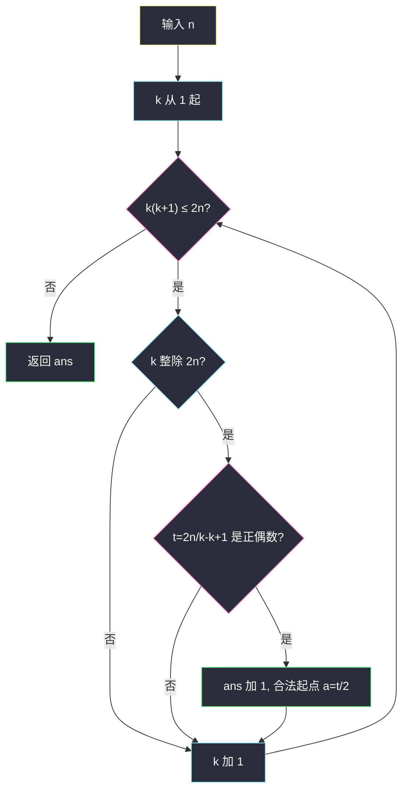
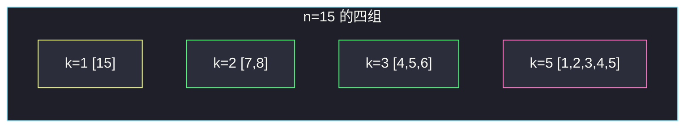

# 连续整数求和（枚举项数 k · 因子条件）

## 一、问题描述

给定正整数 `n`，问有多少组**连续正整数**加起来恰好等于 `n`。单独一个 `[n]` 也算一组。

连续指差为 1 的一段，例如 `2+3+4`，不能跳数字，不能出现 0 或负数。

> 🔗 LeetCode 829：https://leetcode.cn/problems/consecutive-numbers-sum/
>
> 数据范围：`1 ≤ n ≤ 10^9`。必须亚线性，**禁止**从起点 `a=1..n` 做 `O(n)` 枚举。
>
> 📚 灵茶题单：**§1.5 因子**（1694 分）。把求和写成 `n = k·a + k(k-1)/2`，化成 `2n = k(2a+k-1)`。枚举项数 `k`，检查 `k` 是否整除 `2n`、`a` 是否为正整数。等价结论：答案 = `n` 的**奇数因子个数**；主解建议枚举 `k`，奇数因子作对照。

**示例 1**

```
输入：n = 5
输出：2
解释：5 ； 2+3。共 2 组。
```

**示例 2**

```
输入：n = 9
输出：3
解释：9 ； 4+5 ； 2+3+4。共 3 组。
```

**示例 3**

```
输入：n = 15
输出：4
解释：15 ； 7+8 ； 4+5+6 ； 1+2+3+4+5。共 4 组。
```

官方示例 3 把 `7+8` 写成 `8+7`，同一组，只是顺序反过来。

**直观理解**

`n` 本身永远是一种写法，所以答案至少是 1。还可以试长度为 2、3、… 的窗口能否罩住 `n`。窗口太长时，即使从 1 加到 `k` 已经超过 `n`，可以停。`n=10^9` 时最长大约 `√(2n)` 项，枚举项数而不是起点。

---

## 二、暴力解法

枚举起点 `a ≥ 1`，从 `a` 往右累加，加到恰好 `n` 就记一种，超过就换下一个起点。

```python
class Solution:
    def consecutiveNumbersSum(self, n: int) -> int:
        ans = 0
        for a in range(1, n + 1):
            s = 0
            x = a
            while s < n:
                s += x
                x += 1
            if s == n:
                ans += 1
        return ans
```

`n=5,9,15` 能对拍官方，`n=1` 得 1。但内层最多加到 `n`，总体 `O(n²)` 量级，`n=10^9` 完全不可用。即使用「从 `a` 起连续 `k` 项之和 = `k(2a+k-1)/2`」对每个 `a` 解 `k`，仍是 `O(n)` 个起点。

### 🔴 瓶颈在哪里

未知量有两个：起点 `a` 和长度 `k`。`a` 的范围是 `1..n`，`k` 的范围只有 `1..O(√n)`（见下）。应当枚举短的那个，再检查另一个是不是正整数。这正是 §1.5：整除条件代替搜索。

---

## 三、优化探索（核心章节）

> 📚 本题在灵茶题单中属于 **§1.5 因子**。连续 `k` 项是等差数列，求和后出现因子 `k`。枚举可能整除 `2n` 的 `k`，用奇偶条件保证起点 `a` 是整数。

### 3.1 从求和公式到整除

设连续 `k` 项从正整数 `a` 起：

```
n = a + (a+1) + … + (a+k-1)
  = k*a + (0+1+…+k-1)
  = k*a + k(k-1)/2
```

两边乘 2：

```
2n = k * (2a + k - 1)
```

记 `m = 2a + k - 1`，则 `2n = k·m`。`a ≥ 1` 推出：

```
m = 2a + k - 1 ≥ 2 + k - 1 = k + 1
⇒ k(k+1) ≤ 2n
```

这是 `k` 的上界：一旦 `k(k+1) > 2n`，即使从 1 加到 `k` 也已经大于 `n`，更长的段不可能。`k` 最大约 `√(2n)`，`n=10^9` 时大约 `4.5×10^4`，枚举得起。

还要 `a` 是正整数。由 `2a = 2n/k - k + 1` 得三个检查：

1. `k` 整除 `2n`（否则 `2n/k` 不是整数，`a` 更不会是整数）；
2. `t = 2n/k - k + 1` 为**正偶数**（`t = 2a`：偶保证 `a` 是整数，正保证 `a ≥ 1`）；
3. `k(k+1) ≤ 2n`（已作为循环终止条件）。

漏掉第 2 条会把「`t` 是奇数」误判成合法——整数除法 `t//2` 仍能给出一个整数，但那段数的和并不等于 `n`。见第五节 `n=4`。

循环上界其实已经蕴含 `t ≥ 2`：一旦 `k` 整除 `2n`，由 `k(k+1) ≤ 2n` 得 `2n/k ≥ k+1`，于是 `t = 2n/k - k + 1 ≥ 2`。代码里仍写 `t > 0` 是为了和「`a ≥ 1`」对得上，方便默写。奇偶不能省：上界管不到「`t` 是奇数」这种假整数。



### 3.2 为什么必须含 k=1，以及 n=1

`k=1`：`2n = 1·(2a + 0)` ⇒ `a = n`。`t = 2n - 1 + 1 = 2n` 恒为偶数。`1·2 = 2 ≤ 2n` 对任意正整数 `n` 成立。所以**每一问都包含 `[n]` 这一组**，答案 ≥ 1。

`n=1`：上界 `k(k+1) ≤ 2`，只有 `k=1`。答案 1，对应 `[1]`。没有 `0+1`，0 不是正整数。

### 3.3 等价视角：奇数因子个数

`2n = k·m`，且 `m` 与 `k` **一奇一偶**（因为 `t = m - k + 1` 为偶数 ⇔ `m` 与 `k` 奇偶相反）。于是两个因子里恰好一个为奇数，这个奇数因子整除 `2n` 且为奇，故整除 `n`。

反之，`n` 的每一个奇数因子 `d` 恰好对应一种写法：在 `{k=d, k=2n/d}` 里有且仅有一个能让 `a ≥ 1`。

- `d` 较小时，取 `k=d`（奇数项，中心在 `n/d` 附近）；
- `d` 接近 `n` 时，`k=d` 会让起点变成负数，改用 `k=2n/d`（很短的一段）。

因此方案数 = `n` 的奇数正因子个数。`n=15=3×5` 的奇数因子 `{1,3,5,15}` 共 4，对拍示例 3。主解仍枚举 `k`：上界清晰，奇偶条件写在明处，不容易漏。

### 3.4 一句话核心

> **2n = k(2a+k-1)。枚举 k 直到 k(k+1)>2n，要求 k 整除 2n 且 (2n/k - k + 1) 为正偶数。k=1 永远合法。**

---

## 四、代码实现

### Python（主解：枚举项数 k）

```python
class Solution:
    def consecutiveNumbersSum(self, n: int) -> int:
        ans = 0
        k = 1
        while k * (k + 1) <= 2 * n:
            if (2 * n) % k == 0:
                t = (2 * n) // k - k + 1
                if t > 0 and t % 2 == 0:
                    ans += 1
            k += 1
        return ans
```

**变量含义**

| 写法 | 含义 |
|------|------|
| `k` | 连续项数，从 1 到约 `√(2n)` |
| `(2*n) % k == 0` | `k` 整除 `2n` |
| `t = 2n/k - k + 1` | 等于 `2a`，必须是正偶数 |
| `k*(k+1) <= 2*n` | `a ≥ 1` 的必要条件，也是循环终止 |

对照版（奇数因子，答案相同，不作为主解）：

```python
class Solution:
    def consecutiveNumbersSum(self, n: int) -> int:
        ans = 0
        d = 1
        while d * d <= n:
            if n % d == 0:
                if d % 2 == 1:
                    ans += 1
                other = n // d
                if other != d and other % 2 == 1:
                    ans += 1
            d += 1
        return ans
```

`n` 写成 `2^α × 奇数` 后，奇数部分的因子个数就是答案；枚举到 `√n` 即可列出全部因子。

### Java（可选，同一套 k 枚举）

```java
class Solution {
    public int consecutiveNumbersSum(int n) {
        int ans = 0;
        for (int k = 1; (long) k * (k + 1) <= 2L * n; k++) {
            if ((2L * n) % k == 0) {
                long t = (2L * n) / k - k + 1;
                if (t > 0 && t % 2 == 0) {
                    ans++;
                }
            }
        }
        return ans;
    }
}
```

`k * (k+1)` 在 `k ≈ √(2n)`、`n=10^9` 时约 `2×10^9`，会超过 `int` 上限，必须用 `long`。Python 没有这个问题。

---

## 五、具体例子演示

下面按主解逐步代入 `k`，官方三例全部对拍。

### 5.1 n = 5（官方示例 1）

`2n = 10`。`k(k+1) ≤ 10` ⇒ `k=1,2,3`（`3×4=12>10` 停）。

| k | k 整除 10？ | t = 10/k - k + 1 | t 正偶数？ | a = t/2 | 序列 |
|---|-------------|------------------|------------|---------|------|
| 1 | 是 | 10-1+1=10 | 是 | 5 | `[5]` |
| 2 | 是 | 5-2+1=4 | 是 | 2 | `[2,3]` |
| 3 | 否 | — | — | — | — |

答案 2。对拍官方。

### 5.2 n = 9（官方示例 2）

`2n = 18`。`k(k+1) ≤ 18` ⇒ `k=1..5`（`5×6=30>18`；`4×5=20>18`，所以 k 到 3）。

`k=1`：`1×2=2≤18`；`k=2`：`2×3=6≤18`；`k=3`：`3×4=12≤18`；`k=4`：`4×5=20>18` 停止。只有 1、2、3。

| k | 18%k | t | 合法？ | 序列 |
|---|------|---|--------|------|
| 1 | 0 | 18-1+1=18 | a=9 | `[9]` |
| 2 | 0 | 9-2+1=8 | a=4 | `[4,5]` |
| 3 | 0 | 6-3+1=4 | a=2 | `[2,3,4]` |

答案 3。对拍官方。

### 5.3 n = 15（官方示例 3，端到端）

`2n = 30`。上界：`k=1` → `2≤30`；…；`k=5`：`5×6=30≤30`；`k=6`：`6×7=42>30` 停止。所以 k=1..5。

| k | 30%k | t = 30/k - k + 1 | 奇偶 | 结论 | 序列 |
|---|------|------------------|------|------|------|
| 1 | 0 | 30-1+1=30 | 偶 | a=15 | `[15]` |
| 2 | 0 | 15-2+1=14 | 偶 | a=7 | `[7,8]` |
| 3 | 0 | 10-3+1=8 | 偶 | a=4 | `[4,5,6]` |
| 4 | 30%4=2 ≠0 | — | — | 丢弃 | — |
| 5 | 0 | 6-5+1=2 | 偶 | a=1 | `[1,2,3,4,5]` |

答案 4。对拍官方。注意 `k=4` 被「不整除」挡掉：若硬算 `30/4=7.5`，根本没有整数 `m`。



黄是「永远存在」的单元素组；粉是从 1 起加到 5，正好把上界 `k(k+1)=2n` 用满，`a=1` 贴在正整数边界上。

### 5.4 奇偶条件：n = 4（不要漏）

`2n=8`。`k=1`：`t=8-1+1=8`，合法 `[4]`。`k=2`：`2` 整除 `8`，`t=4-2+1=3` **奇数**。若写成 `a = t//2 = 1`，会得到 `[1,2]`，和是 3 不是 4。必须丢弃。`k=3`：`3×4=12>8` 停止。答案 1。

奇数因子对照：`4=2^2` 的奇数因子只有 `{1}`，也是 1。对得上。

### 5.5 奇数因子对照（n=15）

| 奇数因子 d | 尝试 k=d | a | 或 k=2n/d | a | 实际采用 |
|------------|----------|---|-----------|---|---------|
| 1 | k=1 | 15≥1 | k=30 | 负数 | k=1 → `[15]` |
| 3 | k=3 | 4≥1 | k=10 | 负数 | k=3 → `[4,5,6]` |
| 5 | k=5 | 1≥1 | k=6 | a=0 非法 | k=5 → `[1,2,3,4,5]` |
| 15 | k=15 | 负数 | k=2 | 7≥1 | k=2 → `[7,8]` |

四个 `d` 四种写法，与枚举 `k` 一致。每个奇数因子只贡献**一种**合法 `k`。

### 5.6 再代入 n=3 与 k 贴上界

`n=3`，`2n=6`。`k=1`：`t=6-1+1=6`，`a=3`，`[3]`。`k=2`：`2×3=6≤6`，贴上界；`t=3-2+1=2`，`a=1`，`[1,2]`。`k=3`：`3×4=12>6` 停。答案 2。

把 `k=2` 代回原式核对：`2·3 = 2·(2a+2-1) ⇒ 6 = 2·(2a+1) ⇒ 2a+1=3 ⇒ a=1`。和是 `1+2=3`。上界取等号时起点恰好是 1，仍然合法。

`n=100` 奇数因子：先剥 2，`100=2^2×25`，`25=5^2` 的奇数因子 `{1,5,25}`，答案 3。`2n=200`，`k` 上界 `k(k+1)≤200` 最大 k=13（`13×14=182`，`14×15=210>200`）。整除 200 且 t 为偶的只有：

| k | t = 200/k - k + 1 | a | 序列 |
|---|-------------------|---|------|
| 1 | 200 | 100 | `[100]` |
| 5 | 40-5+1=36 | 18 | `[18,19,20,21,22]` |
| 8 | 25-8+1=18 | 9 | `[9,10,…,16]` |

核对：`18+19+20+21+22=100`；`9+10+…+16 = 8×(9+16)/2=100`。`k=2,4,10` 也能整除 200，但 t 为奇数，丢掉。三种合法 k 对上三个奇数因子：k=1 ↔ d=1，k=5 ↔ d=5，k=8 ↔ d=25（因为 `m=2n/k=25`）。

**边界汇总**

| n | 答案 | 说明 |
|---|------|------|
| 1 | 1 | 只有 `[1]` |
| 3 | 2 | `[3]`，`[1,2]` |
| 4 | 1 | `[1,2]` 和不是 4，奇偶把 k=2 滤掉 |
| 5 | 2 | 官方 |
| 9 | 3 | 官方 |
| 15 | 4 | 官方 |

---

## 六、复杂度分析

| 方法 | 时间 | 空间 | 说明 |
|------|------|------|------|
| 枚举起点累加 | `O(n²)` | `O(1)` | 不可用 |
| 枚举起点解方程 | `O(n)` | `O(1)` | `n=10^9` 超时 |
| 枚举 k（主解） | `O(√n)` | `O(1)` | k 上限 `√(2n)` |
| 枚举奇数因子 | `O(√n)` | `O(1)` | 枚举到 `√n` |

`n=10^9` 时主解大约四五万次循环，远小于时限。不要预处理因子表，单次查询没必要。

---

## 七、对比总结

| 维度 | 枚举 k | 奇数因子 | 枚举起点 |
|------|--------|----------|----------|
| 循环次数 | `√(2n)` | `√n` | n |
| 条件 | 整除 + t 为正偶数 | d 奇且 d 整除 n | 累加或解 k |
| 与 §1.5 | 直接看到因子 k | 答案的闭式解释 | 没吃到因子结构 |
| 推荐 | 主解，条件写得全 | 对照 / 面试口述 | 仅用于对拍小 n |

**易错点**

1. **漏掉 k=1**：循环从 2 起会少算永远存在的 `[n]`。
2. **漏奇偶**：`t % 2 == 0` 必须写。`n=4` 的 k=2 是标准反例。
3. **允许 a=0 或负数**：`t>0`（即 `a≥1`）与 `k(k+1)≤2n` 等价，写循环上界即可；若循环写成 `k*k<=2n` 可能多一个非法 k。
4. **枚举 a 到 n**：能过样例，大数据 TLE，也没学到因子。
5. **`k` 整除 `n` 而不是 `2n`**：公式是 `2n=k·m`。奇数 k 时 k 整除 n，偶数 k 时 k 只保证整除 2n。
6. **把 `8+7` 和 `7+8` 算两组**：同一段连续整数。
7. **n=1 返回 0**：1 是正整数，`[1]` 合法。

---

## 八、举一反三

| 题目 | 关系 |
|------|------|
| [1952. 三除数](https://leetcode.cn/problems/three-divisors/) | 同属 §1.5：因子形态判定 |
| [1390. 四因数](https://leetcode.cn/problems/four-divisors/) | 因子个数 = 4 的两种形态 |
| [441. 排列硬币](https://leetcode.cn/problems/arranging-coins/) | 三角数 `k(k+1)/2 ≤ n`，和本题上界同源 |
| [1492. n 的第 k 个因子](https://leetcode.cn/problems/the-kth-factor-of-n/) | 枚举到根号再对称 |
| [2521. 数组乘积中的不同质因数数目](https://leetcode.cn/problems/distinct-prime-factors-of-product-of-array/) | 同批 §1.3：拆因子而不是枚举值 |
| [842. 将数组拆分成斐波那契序列](https://leetcode.cn/problems/split-array-into-fibonacci-sequence/) | 另一类「连续段求和/递推」的拆分 |

**思想迁移**

- 等差求和会出现 `k` 和 `2a+k-1` 两个因子；枚举较短维度，用整除 + 奇偶还原另一个。
- 口诀：**「枚举项数 k，2n 能除尽，t 必须是正偶数；k=1 永远算上。」**
