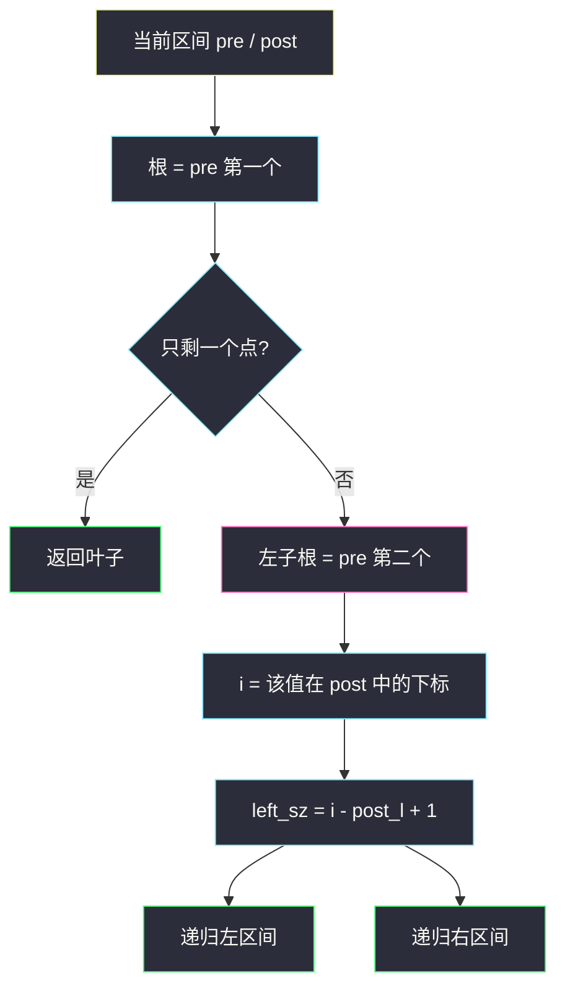
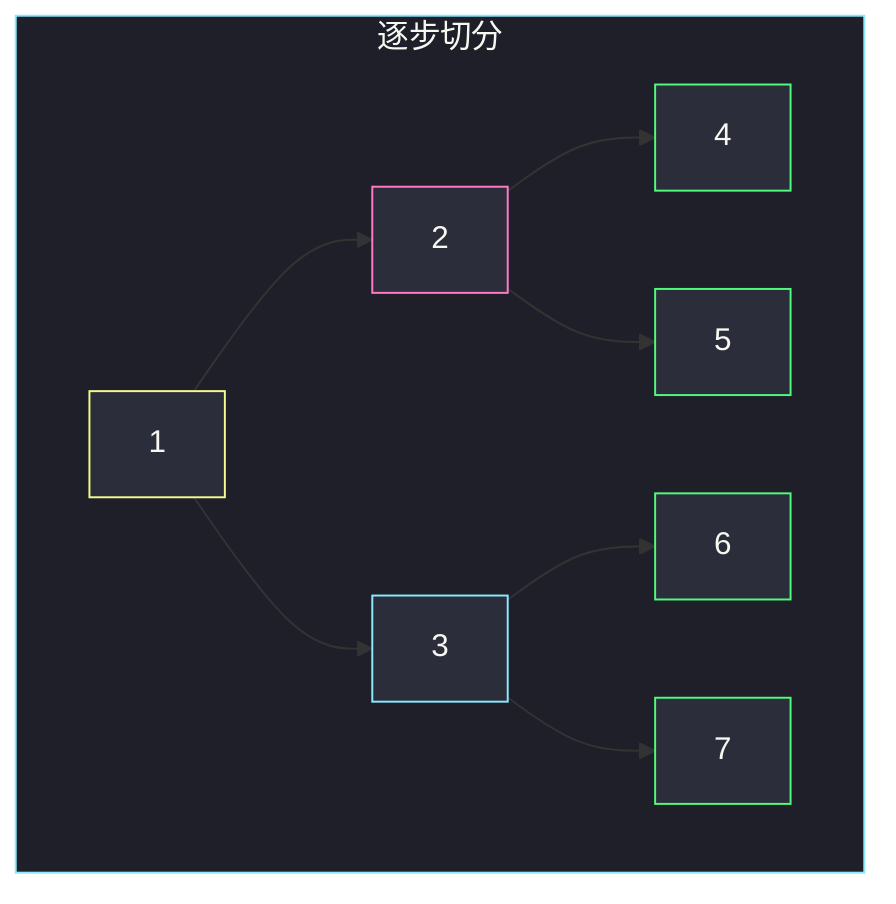

# 根据前序和后序遍历构造二叉树（左子根切区间）

## 一、问题描述

给定一棵二叉树的**前序遍历** `preorder` 和**后序遍历** `postorder`（值互不相同），请还原这棵树。可能有多棵树对应同一对序列，返回其中**任意一棵**即可。

> 🔗 LeetCode 889：https://leetcode.cn/problems/construct-binary-tree-from-preorder-and-postorder-traversal/
>
> 📚 灵神题单：**二叉树 · §2.10 创建二叉树**
>
> 数据范围：`1 ≤ preorder.length ≤ 30`，两数组长度相同、值互异，保证能还原成某棵二叉树。

**示例 1**

```
输入：preorder = [1,2,4,5,3,6,7]，postorder = [4,5,2,6,7,3,1]
输出：[1,2,3,4,5,6,7]
```

```
前序：根 | 左子树前序 | 右子树前序
后序：左子树后序 | 右子树后序 | 根
```

**示例 2**

```
输入：preorder = [1]，postorder = [1]
输出：[1]
```

**直观理解**

前序第一个、后序最后一个都是根，这没争议。缺的是中序，所以**无法唯一**判断「下一个值是左孩子还是右孩子」（只有一个孩子时，挂左或挂右的前/后序一模一样）。题面允许任意，约定「有孩子就先当左子」即可。

切分关键：根的下一个前序值 `pre[1]` 一定是**某一侧子树的根**；默认当左子根，到后序里找到它，就能读出左子树有多长。

---

## 二、暴力解法

枚举左子树大小 `sz = 0 .. n-1`，检查前序切出的那段值集合是否等于后序对应那段；对上了再递归两边。最坏接近卡特兰数棵候选，`n = 30` 会爆。

```python
class Solution:
    def constructFromPrePost(self, preorder: List[int], postorder: List[int]) -> Optional[TreeNode]:
        def build(pre: List[int], post: List[int]) -> Optional[TreeNode]:
            if not pre:
                return None
            root = TreeNode(pre[0])
            if len(pre) == 1:
                return root
            for sz in range(1, len(pre)):          # 枚举左子长度
                left_set = set(pre[1:1 + sz])
                if left_set == set(post[:sz]):
                    root.left = build(pre[1:1 + sz], post[:sz])
                    root.right = build(pre[1 + sz:], post[sz:-1])
                    return root
            root.left = build(pre[1:], post[:-1])   # 整段都是左（或都是右）
            return root
        return build(preorder, postorder)
```

每层 `O(n)` 建 set，再乘分支，远超 `O(n)`。

### 复杂度

- **时间**：指数级（枚举切分）。
- **空间**：`O(n)` 递归栈 + 切片。

### 🔴 瓶颈在哪里

不必枚举 `sz`：左子根就是 `pre[1]`，它在后序中的位置**直接给出**左子树长度。哈希表 `值 → 后序下标` 后，每次切分 `O(1)`。

---

## 三、优化探索（核心章节）

> 📚 对齐灵神 **§2.10 创建二叉树**：和 105 / 106 一样是「根 + 切区间 + 递归分治」。105 用中序定位左右，本题用「左子根在后序中的下标」定位。

### 3.1 区间含义

对当前子树，前序区间 `[pre_l, pre_r]`、后序区间 `[post_l, post_r]`（闭区间）：

- 根值 = `preorder[pre_l]`（也等于 `postorder[post_r]`）
- 若 `pre_l == pre_r`：叶子，直接返回
- 否则左子根值 = `preorder[pre_l + 1]`
- 在后序里它的下标是 `i`，则左子树长度 `left_sz = i - post_l + 1`

切：

```
左：pre[pre_l+1 .. pre_l+left_sz]     post[post_l .. i]
右：pre[pre_l+left_sz+1 .. pre_r]     post[i+1 .. post_r-1]
```

后序最后一个是当前根，不进入左右子问题。



### 3.2 答案不唯一时我们选哪棵

只有一棵子树时，`pre[1]` 其实是那唯一孩子的根；算法会把它挂到**左边**。挂右边得到的前序、后序完全相同，都合法。不要试图「再判断该挂哪边」——题面不要求唯一。

### 3.3 一句话核心

> **根是前序头；下一个前序值当左子根，用它在后序中的位置切出左子树长度，左右分别递归。**

---

## 四、代码实现

### Python（主解：哈希定位 + 下标分治）

```python
class Solution:
    def constructFromPrePost(
        self, preorder: List[int], postorder: List[int]
    ) -> Optional[TreeNode]:
        pos = {v: i for i, v in enumerate(postorder)}

        def build(pre_l: int, pre_r: int, post_l: int, post_r: int) -> Optional[TreeNode]:
            if pre_l > pre_r:
                return None
            root = TreeNode(preorder[pre_l])
            if pre_l == pre_r:
                return root
            left_root = preorder[pre_l + 1]
            i = pos[left_root]
            left_sz = i - post_l + 1
            root.left = build(pre_l + 1, pre_l + left_sz, post_l, i)
            root.right = build(pre_l + left_sz + 1, pre_r, i + 1, post_r - 1)
            return root

        n = len(preorder)
        return build(0, n - 1, 0, n - 1)
```

**变量含义**

| 变量 | 含义 |
|------|------|
| `pos` | 值 → 在 `postorder` 中的下标 |
| `pre_l, pre_r` | 当前子树占用的前序闭区间 |
| `post_l, post_r` | 当前子树占用的后序闭区间 |
| `left_sz` | 左子树结点个数 |

不要切片复制数组：`n` 虽小，下标版才是和 105 同一套默写。`pre_l > pre_r` 出现在「没有右子」时，直接返回空。

---

## 五、具体例子演示

`pre = [1,2,4,5,3,6,7]`，`post = [4,5,2,6,7,3,1]`。`pos`：`4→0, 5→1, 2→2, 6→3, 7→4, 3→5, 1→6`。

**① `build(0,6, 0,6)`** 整棵树

- 根 = 1；左子根 = 2；`i = 2`；`left_sz = 2 - 0 + 1 = 3`
- 左：`pre[1..3]=[2,4,5]`，`post[0..2]=[4,5,2]`
- 右：`pre[4..6]=[3,6,7]`，`post[3..5]=[6,7,3]`（丢掉末尾的 1）

**② 左子 `build(1,3, 0,2)`** 根 2

- 左子根 = 4；`i = 0`；`left_sz = 1`
- 左：`pre[2..2]=[4]`，`post[0..0]=[4]` → 叶子 4
- 右：`pre[3..3]=[5]`，`post[1..1]=[5]` → 叶子 5

**③ 右子 `build(4,6, 3,5)`** 根 3

- 左子根 = 6；`i = 3`；`left_sz = 1`
- 左：叶子 6；右：叶子 7

| 调用 | 前序切片 | 后序切片 | 根 | left_sz | 左 / 右 |
|------|----------|----------|----|---------|---------|
| 整树 | `[1,2,4,5,3,6,7]` | `[4,5,2,6,7,3,1]` | 1 | 3 | `[2,4,5]` / `[3,6,7]` |
| 左 | `[2,4,5]` | `[4,5,2]` | 2 | 1 | `[4]` / `[5]` |
| 右 | `[3,6,7]` | `[6,7,3]` | 3 | 1 | `[6]` / `[7]` |
| 叶子 | `[4]` 等 | 同值 | 自身 | — | — |



对拍：这棵树的前序是 `1,2,4,5,3,6,7`，后序是 `4,5,2,6,7,3,1`，与输入一致。

---

## 六、复杂度分析

| 方法 | 时间 | 空间 | 说明 |
|------|------|------|------|
| 枚举左子长度 | 指数 | `O(n)` | n≤30 仍不稳 |
| 哈希 + 分治（主解） | `O(n)` | `O(n)` | 每点建一次；`pos` 与递归栈 |

每个下标作为某次调用的根恰好一次，哈希查询 `O(1)`。

---

## 七、对比总结

| 题目 | 已知序列 | 靠什么切左右 |
|------|----------|--------------|
| 105 | 前序 + **中序** | 根在中序中的位置（唯一） |
| 106 | 中序 + 后序 | 根在中序中的位置（唯一） |
| **889（本题）** | 前序 + 后序 | 左子根在后序中的位置（约定挂左，不唯一） |

**易错点**

1. **后序右边界忘了 −1**：当前根占 `post_r`，右子用 `post_r - 1`。
2. **`left_sz` 算成 `i - post_l`**：漏了 `+ 1`，左子少一个点。
3. **空右子**：`pre_l + left_sz + 1 > pre_r` 时递归返回 `None`，不要特判漏掉。
4. **切片版反复 `index`**：每次 `post.index(x)` 是 `O(n)`，最坏 `O(n²)`；先建 `pos`。
5. **强求唯一树**：只有一个孩子时左右都行，选左即可。

**模板（§2.10 分治建树）**

```python
root = TreeNode(pre[pre_l])
i = pos[pre[pre_l + 1]]
left_sz = i - post_l + 1
root.left  = build(...)
root.right = build(...)
```

---

## 八、举一反三

| 题目 | 关系 |
|------|------|
| [105. 从前序与中序遍历序列构造二叉树](https://leetcode.cn/problems/construct-binary-tree-from-preorder-and-inorder-traversal/) | 中序让左右唯一；哈希切区间同骨架 |
| [106. 从中序与后序遍历序列构造二叉树](https://leetcode.cn/problems/construct-binary-tree-from-inorder-and-postorder-traversal/) | 根在后序末尾，仍靠中序切 |
| [1008. 前序遍历构造二叉搜索树](https://leetcode.cn/problems/construct-binary-search-tree-from-preorder-traversal/) | 有 BST 序，上界/下界代替第二段序列 |
| [654. 最大二叉树](https://leetcode.cn/problems/maximum-binary-tree/) | 数组最大值当根，再分左右，同属 §2.10 |
| [889 对照 · 本题](https://leetcode.cn/problems/construct-binary-tree-from-preorder-and-postorder-traversal/) | 缺中序 → 答案不唯一 |

**思想迁移**

- 两种遍历能还原，是因为「根的位置 + 一段连续区间 = 一棵子树」。
- 口诀：**「前序第二个是左子根；它在后序里出现的位置，就是左子树的右端。」**
