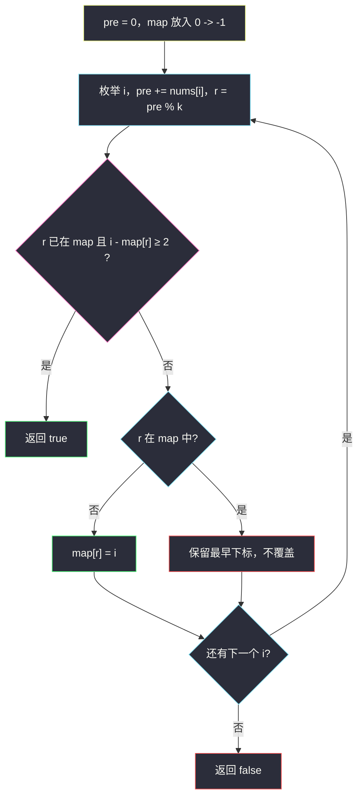
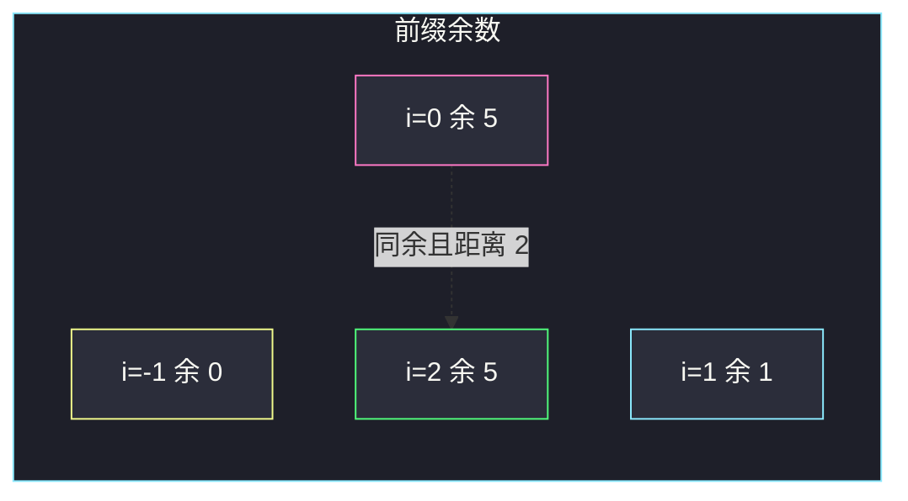

# 连续的子数组和（前缀和模 k + 最早下标）

## 一、问题描述

给你一个整数数组 `nums` 和一个整数 `k`，如果 `nums` 中存在长度为**至少为 2** 的连续子数组，其元素和是 `k` 的倍数（包括 0 倍，即和为 0），返回 `true`；否则返回 `false`。

「`k` 的倍数」指存在整数 `n`（可正、负、零）使子数组和 = `n * k`。本题数据保证 `k ≥ 1`。

> 🔗 LeetCode 523：https://leetcode.cn/problems/continuous-subarray-sum/
>
> 数据范围：`1 <= nums.length <= 10^5`，`0 <= nums[i] <= 10^9`，`1 <= k <= 2^31 - 1`。

**示例 1**

```
输入：nums = [23,2,4,6,7], k = 6
输出：true
解释：子数组 [2,4] 和为 6。
```

**示例 2**

```
输入：nums = [23,2,6,4,7], k = 6
输出：true
解释：子数组 [23,2,6,4,7] 和为 42 = 7*6；[2,6,4] 和为 12 也可以。
```

**示例 3**

```
输入：nums = [23,2,6,4,7], k = 13
输出：false
解释：没有任何长度 ≥ 2 的连续段，其和对 13 余 0。
```

**直观理解**

连续段的和 = 两段前缀和之差。差是 `k` 的倍数 ⇔ 两段前缀和对 `k` 同余。再要求下标距离至少 2。哈希表记下每种余数**最早**出现的位置。

---

## 二、暴力解法

枚举左右端点累加：

```python
class Solution:
    def checkSubarraySum(self, nums: List[int], k: int) -> bool:
        n = len(nums)
        for i in range(n):
            s = 0
            for j in range(i, n):
                s += nums[j]
                if j - i + 1 >= 2 and s % k == 0:
                    return True
        return False
```

### 复杂度

- **时间**：`O(n²)`。`n` 达 `10^5`，超时。
- **空间**：`O(1)`。

### 🔴 瓶颈在哪里

子数组和用前缀和 `O(1)` 取出后仍有 `O(n²)` 对。同余条件把「差为 k 的倍数」收成「余数相等」，每种余数只需留一个最早下标，枚举右端变成 `O(1)` 查询。

---

## 三、优化探索（核心章节）

> 📚 本题在灵茶题单中属于 **前缀和与哈希表 · §1.2**。和「两数之和」一样：左边把余数存进表，右边查配对；这里配对的是**同一个余数**，且距离 ≥ 2。

### 3.1 同余

设 `pre[i]` = `nums[0] + … + nums[i]`（`i` 从 0 起）。子数组 `nums[l+1 .. r]` 的和为 `pre[r] - pre[l]`。

```
pre[r] - pre[l] 是 k 的倍数
⇔  pre[r] % k == pre[l] % k
```

长度 `r - l ≥ 2`。空前缀 `pre[-1] = 0`，余数 0，下标记成 `-1`：这样「从下标 0 一直加到 r」也能和 0 比较，且 `r - (-1) ≥ 2` 即 `r ≥ 1`，正好挡住「单个元素是 k 的倍数」这种长度 1。

### 3.2 哈希表存最早下标

同一余数出现第三次、第四次时，更早的那个下标距离更大，更容易满足 ≥ 2。所以**只记第一次**，不要覆盖。

若当前 `i` 与表中同余下标 `j` 满足 `i - j ≥ 2`，返回 true。若 `i - j == 1`，说明中间只隔一个元素，长度不够，继续往后（保留原来的 `j`）。



### 3.3 关于 k = 0

部分旧题解说要特判 `k = 0`。当前题面 `k ≥ 1`，直接 `pre % k` 即可，不必分支。

元素可为 0：连续两个 0 的和是 0，是 k 的倍数，长度 2，应返回 true。余数一直是同一个，下标差到 2 就会命中。

### 3.4 一句话核心

> **前缀和对 k 取余；哈希表记每个余数最早下标（含 0 → -1）；再次遇到同一余数且下标差 ≥ 2 就是合法段。**

---

## 四、代码实现

### Python（主解）

```python
class Solution:
    def checkSubarraySum(self, nums: List[int], k: int) -> bool:
        seen = {0: -1}                        # 空前缀余数 0
        pre = 0
        for i, x in enumerate(nums):
            pre += x
            r = pre % k
            if r in seen:
                if i - seen[r] >= 2:
                    return True
            else:
                seen[r] = i                   # 只记最早
        return False
```

**变量含义**

| 变量 | 含义 |
|------|------|
| `pre` | `nums[0..i]` 的和 |
| `r` | `pre % k` |
| `seen[r]` | 该余数第一次出现时，前缀最后一个元素的下标；`0:-1` 表示空前缀 |

### Java（最优解同款）

```java
class Solution {
    public boolean checkSubarraySum(int[] nums, int k) {
        Map<Integer, Integer> seen = new HashMap<>();
        seen.put(0, -1);
        long pre = 0;
        for (int i = 0; i < nums.length; i++) {
            pre += nums[i];
            int r = (int) (pre % k);
            if (seen.containsKey(r)) {
                if (i - seen.get(r) >= 2) return true;
            } else {
                seen.put(r, i);
            }
        }
        return false;
    }
}
```

Java 用 `long` 累加，避免 `int` 溢出（`n · 10^9` 可超 2^31）。`k` 为正，`pre ≥ 0`，`%` 结果非负。

---

## 五、具体例子演示

### 5.1 `nums = [23, 2, 4, 6, 7]`，`k = 6`

| i | x | pre | r = pre%6 | seen（更新前） | 判定 | seen（更新后） |
|---|---|-----|-----------|----------------|------|----------------|
| | | 0 | 0 | `{0:-1}` | 初始 | `{0:-1}` |
| 0 | 23 | 23 | 5 | 无 5 | 记入 | `{0:-1, 5:0}` |
| 1 | 2 | 25 | 1 | 无 1 | 记入 | `{…, 1:1}` |
| 2 | 4 | 29 | 5 | `5→0`，`2-0=2≥2` | **true** | — |

子数组下标 `(0,2]` 即 `[2,4]`，和 6。第一步余数 5 在 i=0，空前缀对不上长度 2；等到 i=2 再次余 5 才够长。



### 5.2 `nums = [23, 2, 6, 4, 7]`，`k = 13`

| i | x | pre | r | seen | 判定 |
|---|---|-----|---|------|------|
| 0 | 23 | 23 | 10 | 记 `10:0` | 否 |
| 1 | 2 | 25 | 12 | 记 `12:1` | 否 |
| 2 | 6 | 31 | 5 | 记 `5:2` | 否 |
| 3 | 4 | 35 | 9 | 记 `9:3` | 否 |
| 4 | 7 | 42 | 3 | 记 `3:4` | 否 |

余数 10、12、5、9、3 互不相同，也从未回到 0（除了空前缀）。返回 **false** ✓。

对照同数组 `k = 6`（题面示例 2）。前缀和 23, 25, 31, 35, 42，余数 5, 1, 1, 5, 0：

| i | x | pre | r | seen 动作 | 判定 |
|---|---|-----|---|---------|------|
| 0 | 23 | 23 | 5 | 记 `5:0` | 否 |
| 1 | 2 | 25 | 1 | 记 `1:1` | 否 |
| 2 | 6 | 31 | 1 | `1→1`，差 1 **不够**，不覆盖 | 否 |
| 3 | 4 | 35 | 5 | `5→0`，差 3 ≥ 2 | **true** |

命中子数组 `[2,6,4]`（下标 1..3），和 12。若 i=2 时误把 `seen[1]` 改成 2，后面仍可能靠余数 5 得救；但若只有「隔 1 再隔很远」的同余，覆盖最早下标就会漏。

单元素 `[6]`、`k=6`：i=0 余 0，`0-(-1)=1 < 2`，false。连续 `[0,0]`：i=0 余 0 差 1 不够；i=1 差 2，true。

---

## 六、复杂度分析

| 方法 | 时间 | 空间 | 说明 |
|------|------|------|------|
| 枚举子数组 | `O(n²)` | `O(1)` | n=1e5 超时 |
| 前缀余数 + 哈希（主解） | `O(n)` | `O(min(n, k))` | 不同余数最多 n+1 种；哈希只存余数→下标 |

只扫一遍数组。找到一对合法段即可提前返回；最坏没有合法段时走完全长。`k` 很大时不同余数不超过 `n+1`（含空前缀），空间是 `O(n)` 而不是 `O(k)`。

---

## 七、对比总结

| 维度 | 暴力 | 前缀哈希 |
|------|------|----------|
| 查「差是倍数」 | 真的做减法再 `%` | 余数相等即差为倍数 |
| 长度 ≥ 2 | `j-i+1` | 下标差；空前缀用 `-1` |
| 重复余数 | 无状态 | 保留最早下标 |

**易错点**

1. **不放 `0:-1`**：从下标 0 开始、和恰好为 k 倍数的长段会漏掉。
2. **覆盖最早下标**：`i-j==1` 时若写成 `seen[r]=i`，后面更长的合法段可能丢。
3. **长度写成 `> 2`**：差恰好 2 是合法的最短段。
4. **把 `k=0` 写进新解**：当前约束 `k≥1`。
5. **Java `int` 累加溢出**：`pre` 用 `long`。
6. **把「存在一个元素是 k 的倍数」当 true**：长度必须 ≥ 2，空前缀下标 -1 就是为了挡住这种情况。

**模板（§1.2 前缀同余）**

```python
seen = {0: -1}
pre = 0
for i, x in enumerate(nums):
    pre += x
    r = pre % k
    if r in seen:
        if i - seen[r] >= 2: return True
    else:
        seen[r] = i
```

---

## 八、举一反三

| 题目 | 关系 |
|------|------|
| [974. 和可被 K 整除的子数组](https://leetcode.cn/problems/subarray-sums-divisible-by-k/) | 同余计数，不限制长度，哈希存次数而非下标 |
| [560. 和为 K 的子数组](https://leetcode.cn/problems/subarray-sum-equals-k/) | §1.2 经典：查 `pre - k`，不取模 |
| [525. 连续数组](https://leetcode.cn/problems/contiguous-array/) | 0/1 差分前缀，同余思想变成「前缀相等」 |
| [437. 路径总和 III](https://leetcode.cn/problems/path-sum-iii/) | 树上前缀和 + 哈希 |
| [325. 和等于 k 的最长子数组长度](https://leetcode.cn/problems/maximum-size-subarray-sum-equals-k/) | 同样最早下标，目标改为 `pre - k` |

**思想迁移**

- 「连续段的某种和 / 差满足模意义条件」→ 前缀落到余数，哈希留位置或次数。
- 口诀：**「空前缀余 0 放在 -1；同余再见面，下标至少隔 2。」**
