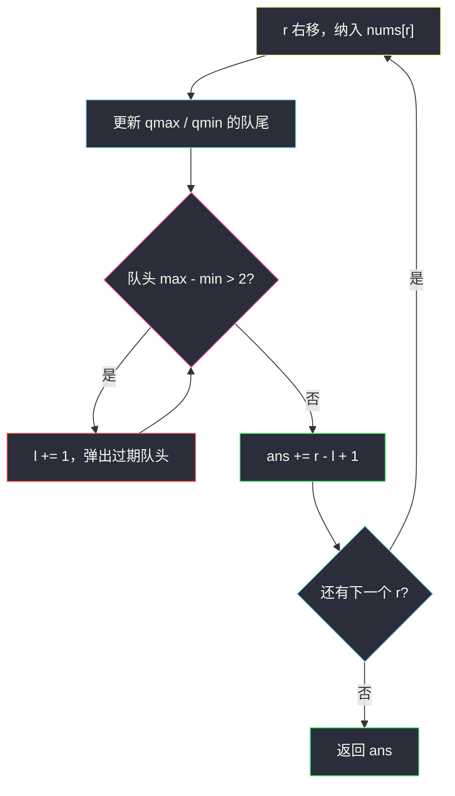
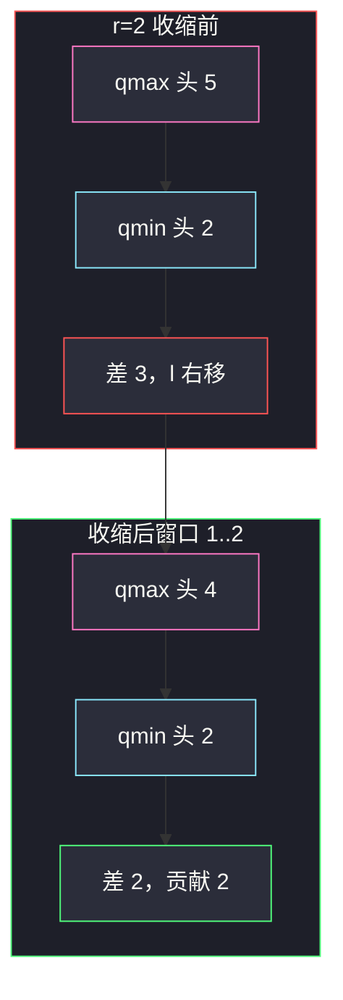

# 不间断子数组

## 一、问题描述

给你数组 `nums`。一个子数组称为**不间断**，当且仅当其中任意两数之差的绝对值都不超过 2。求这样的子数组个数（单元素也算）。

任意两数差 ≤ 2，等价于这段里 **最大值减最小值 ≤ 2**。

> 🔗 LeetCode 2762：https://leetcode.cn/problems/continuous-subarrays/
>
> 数据范围：`1 ≤ n ≤ 10^5`，`1 ≤ nums[i] ≤ 10^9`。必须线性。

**示例 1**

```
输入：nums = [5,4,2,4]
输出：8
解释：长度为 1 的 4 段；长度为 2 的 [5,4]、[4,2]、[2,4]；
      长度为 3 的 [4,2,4]。[5,4,2] 的 max-min = 3，不合法。
      4+3+1 = 8。
```

**示例 2**

```
输入：nums = [1,2,3]
输出：6
解释：全部 C 种子数组都合法（3-1=2），个数 = n(n+1)/2 = 6。
```

**直观理解**

固定右端 `r`，左端能取的最左位置 `l` 满足窗口 `[l, r]` 的 max−min ≤ 2。这个 `l` 只会向右挪、不会回退（再往左一定更差）。窗口合法时，所有以 `r` 结尾的子数组 `[l,r]`、`[l+1,r]`、…、`[r,r]` 都合法，一次加上 `r-l+1` 个。窗口的 max/min 用两个单调队列维护。

---

## 二、暴力解法

枚举左右端，维护区间 max/min：

```python
class Solution:
    def continuousSubarrays(self, nums: List[int]) -> int:
        n = len(nums)
        ans = 0
        for i in range(n):
            mx = mn = nums[i]
            for j in range(i, n):
                mx = max(mx, nums[j])
                mn = min(mn, nums[j])
                if mx - mn <= 2:
                    ans += 1
                else:
                    break
        return ans
```

右端继续扩展只会使 max 更大或 min 更小，一旦超 2 就可以 `break`。最坏仍是 `O(n²)`。

### 复杂度

- **时间**：`O(n²)`。`n = 10^5` 超时。
- **空间**：`O(1)`。

### 🔴 瓶颈在哪里

每个右端对应的合法左端范围是一段前缀，而且左端单调右移。缺的只是窗口 max/min 的 `O(1)` 查询——单调队列（或有序集合）正好干这个。

---

## 三、优化探索（核心章节）

> 📚 本题在灵茶题单中属于 **单调队列 · §4.4**。变长窗口维护 max/min：一个递减队列出窗口最大值，一个递增队列出最小值。

### 3.1 计数公式

右端 `r` 纳入后，把左端 `l` 右移直到 `max(nums[l..r]) - min(nums[l..r]) ≤ 2`。此时：

- `[l, r]` 合法，它的任何子段 `[l', r]`（`l ≤ l' ≤ r`）也合法（子段的 max/min 只会更松）；
- `[l-1, r]` 不合法（否则 `l` 还能再左）。

所以以 `r` 为右端的不间断子数组恰好 `r - l + 1` 个。

### 3.2 两个单调队列

队列里存**下标**，对应值从队头到队尾单调：

| 队列 | 单调性 | 队头 |
|------|--------|------|
| `qmax` | `nums` 递减 | 窗口最大值的下标 |
| `qmin` | `nums` 递增 | 窗口最小值的下标 |

纳入 `r`：

- `qmax`：尾部 ≤ `nums[r]` 的全弹掉（它们不可能再当 max），再把 `r` 入队；
- `qmin`：尾部 ≥ `nums[r]` 的全弹掉，再把 `r` 入队。

收缩：当 `nums[qmax[0]] - nums[qmin[0]] > 2` 时 `l += 1`，并丢掉队头下标 `< l` 的过期元素。

每个下标最多入队、出队一次，整体 `O(n)`。



### 3.3 和「最长」题的差别

[1438. 绝对差不超过限制的最长连续子数组](https://leetcode.cn/problems/longest-continuous-subarray-with-absolute-diff-less-than-or-equal-to-limit/) 窗口条件完全一样，只是那题取 `max(r-l+1)`，本题把每个合法窗口的「以 r 结尾的条数」累加起来。骨架可以原样搬。

### 3.4 一句话核心

> **右端扩张，两个单调队列盯着 max/min；超 2 就吐左；每个合法 `[l,r]` 贡献 `r-l+1`。**

---

## 四、代码实现

### Python（主解：双单调队列）

```python
class Solution:
    def continuousSubarrays(self, nums: List[int]) -> int:
        qmax, qmin = deque(), deque()
        l = 0
        ans = 0
        for r, x in enumerate(nums):
            while qmax and nums[qmax[-1]] <= x:
                qmax.pop()
            qmax.append(r)
            while qmin and nums[qmin[-1]] >= x:
                qmin.pop()
            qmin.append(r)
            while nums[qmax[0]] - nums[qmin[0]] > 2:
                l += 1
                if qmax[0] < l:
                    qmax.popleft()
                if qmin[0] < l:
                    qmin.popleft()
            ans += r - l + 1
        return ans
```

**变量含义**

| 变量 | 含义 |
|------|------|
| `qmax` | 递减下标队列，队头是窗口 max |
| `qmin` | 递增下标队列，队头是窗口 min |
| `l` / `r` | 当前合法窗口左右端 |
| `ans` | 不间断子数组个数 |

提交时 `from collections import deque`。也可用 `SortedList` 放窗口里的值，每次取 `sl[-1] - sl[0]`，写法短但多一个 `log n`。

---

## 五、具体例子演示

以示例 1：`nums = [5, 4, 2, 4]`。队列里写「下标(值)」，队头在左。

**r = 0，x = 5**

- `qmax`：`[0(5)]`；`qmin`：`[0(5)]`
- max−min = 0 ≤ 2，`l = 0`
- 贡献 `0-0+1 = 1`，`ans = 1`
- 以 0 结尾：`[5]`

**r = 1，x = 4**

- `qmax` 尾 5 > 4，留下，入 1 → `[0(5), 1(4)]`
- `qmin` 尾 5 ≥ 4，弹出 0，入 1 → `[1(4)]`
- max=5，min=4，差 1；`l = 0`
- 贡献 2，`ans = 3`
- 以 1 结尾：`[5,4]`、`[4]`

**r = 2，x = 2**

- `qmax`：`[0(5), 1(4), 2(2)]`；`qmin` 弹出 4，入 2 → `[2(2)]`
- max=5，min=2，差 3 > 2 → `l` 变成 1，弹出过期的 `qmax` 队头 0
- 现在 `qmax = [1(4), 2(2)]`，`qmin = [2(2)]`，差 2
- 贡献 `2-1+1 = 2`，`ans = 5`
- 以 2 结尾：`[4,2]`、`[2]`（`[5,4,2]` 被踢掉）

**r = 3，x = 4**

- `qmax`：尾 2 ≤ 4 弹出，尾 4 ≤ 4 弹出，入 3 → `[3(4)]`
- `qmin`：尾 2 < 4，留下，入 3 → `[2(2), 3(4)]`
- max=4，min=2，差 2；`l = 1`
- 贡献 3，`ans = 8`
- 以 3 结尾：`[4,2,4]`、`[2,4]`、`[4]`



示例 2：`[1,2,3]` 全程差 ≤ 2，`l` 一直是 0，贡献 1+2+3=6。

---

## 六、复杂度分析

| 方法 | 时间 | 空间 | 说明 |
|------|------|------|------|
| 枚举端点 | `O(n²)` | `O(1)` | 超时 |
| 双单调队列（主解） | `O(n)` | `O(n)` | 每下标进出队列一次 |
| `SortedList` 维护窗口 | `O(n log n)` | `O(n)` | 能过，常数更大 |

---

## 七、对比总结

| 维度 | 暴力 | 单调队列 |
|------|------|----------|
| max/min | 内层循环现算 | 队头 `O(1)` |
| 左端 | 每个右端从头试 | 只右移，不回退 |
| 计数 | 合法就 +1 | 一段合法左端一次加 `r-l+1` |

**易错点**

1. **只保证相邻差 ≤ 2**：`[1,3,1]` 相邻差都是 2，整段 max−min 也是 2，仍然合法；反例是 `[5,4,2]`，相邻看似不大，两端差 3。判定必须看全局 max/min。
2. **队列存值不存下标**：过期元素删不干净。存下标，用 `q[0] < l` 判断离开窗口。
3. **`qmax` 写成递增**：队头就不是 max。
4. **收缩时只动 `l` 不弹队头**：队头指着窗口外的旧 max/min，后面全错。

**模板（§4.4 窗口 max/min）**

```python
while qmax and nums[qmax[-1]] <= x: qmax.pop()
qmax.append(r)
# qmin 对称
while nums[qmax[0]] - nums[qmin[0]] > limit:
    l += 1
    # 弹出下标 < l 的队头
ans += r - l + 1
```

---

## 八、举一反三

| 题目 | 关系 |
|------|------|
| [1438. 绝对差不超过限制的最长连续子数组](https://leetcode.cn/problems/longest-continuous-subarray-with-absolute-diff-less-than-or-equal-to-limit/) | 同一窗口条件，改成求最长 |
| [239. 滑动窗口最大值](https://leetcode.cn/problems/sliding-window-maximum/) | 定长窗口的单调队列原型 |
| [2398. 预算内的最多机器人数目](https://leetcode.cn/problems/maximum-number-of-robots-within-budget/) | 窗口 max + 前缀和，再卡预算 |
| [862. 和至少为 K 的最短子数组](https://leetcode.cn/problems/shortest-subarray-with-sum-at-least-k/) | 单调队列用在前缀和上 |
| [209. 长度最小的子数组](https://leetcode.cn/problems/minimum-size-subarray-sum/) | 变长窗口计数/求长，条件换成区间和 |

**思想迁移**

- 「子数组要 max−min 受限制」→ 双单调队列 + 左端只右移。
- 口诀：**「两个队列盯两端，超限吐左；合法窗口一次加上以右端结尾的全部。」**
