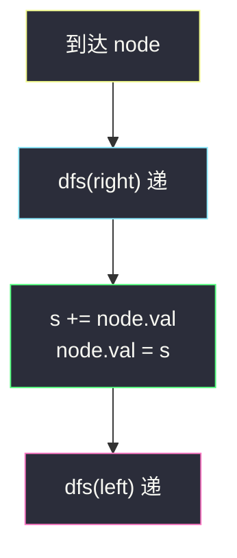

# 把二叉搜索树转换为累加树（反中序 · 有递有归）

## 一、问题描述

给定一棵二叉搜索树（BST）的根 `root`，把它改成累加树：每个节点的新值 = **原值** + **所有比它大的节点值之和**。就地修改，返回根。

BST 保证：左 < 根 < 右；本题节点值互不相同。

> 🔗 LeetCode 538：https://leetcode.cn/problems/convert-bst-to-greater-tree/
>
> 数据范围：节点数 `[0, 10^4]`，`-10^4 <= Node.val <= 10^4`，值唯一，输入是合法 BST。
>
> 📚 灵茶题单：**二叉树 · §2.5 有递有归**（1375 分）。
>
> 与 [1038. 从二叉搜索树到更大和树](https://leetcode.cn/problems/binary-search-tree-to-greater-sum-tree/) **同一做法**（见 `binary-search-tree-to-greater-sum-tree.md`）。

**示例 1**

```
输入：root = [4,1,6,0,2,5,7,null,null,null,3,null,null,null,8]
输出：[30,36,21,36,35,26,15,null,null,null,33,null,null,null,8]
原树：
              4
            /   \
           1     6
          / \   / \
         0   2 5   7
              \     \
               3     8
4 的新值 = 4+5+6+7+8 = 30；1 的新值 = 1+2+…+8 = 36。
```

**示例 2**

```
输入：root = [0,null,1]
输出：[1,null,1]
0 变成 0+1=1，1 右边没有更大的，仍是 1。
```

**直观理解**

BST 的中序（左-根-右）是升序。反过来走 **右-根-左**，就是从大到小扫一遍。边走边累加「已经见过的更大值之和 `s`」，当前节点 `+= s` 即可。先走进右子树，是「递」；从右边回来时 `s` 已经备好，改根，再走进左子树——有递有归。

---

## 二、暴力解法

对每个节点扫整棵树，把所有更大的值加到它头上。先拷一份原值，避免改过的节点干扰比较：

```python
class Solution:
    def convertBST(self, root: Optional[TreeNode]) -> Optional[TreeNode]:
        vals = []

        def collect(node):
            if node:
                vals.append(node.val)
                collect(node.left)
                collect(node.right)

        def add_greater(node):
            if node is None:
                return
            orig = node.val
            node.val += sum(v for v in vals if v > orig)
            add_greater(node.left)
            add_greater(node.right)

        collect(root)
        add_greater(root)
        return root
```

### 复杂度

- **时间**：`O(n²)`，每个点扫一遍 `vals`。
- **空间**：`O(n)`。

`n = 10^4` 勉强能过，完全没用 BST。

### 🔴 瓶颈在哪里

比当前节点大的值，在 BST 里全在它的**右子树**，以及祖先中「它位于其左子树」的那些节点。从大到小遍历时，这些值恰好都已经走过——一条反中序就能收齐，不必每次全局求和。

---

## 三、优化探索（核心章节）

> 📚 本题在灵茶题单中属于 **二叉树 · §2.5 有递有归**。中序是 BST 的升序；反过来先右后左，归回来的 `s` 就是所有更大值之和。#1038 题面几乎相同，代码可直接复用。

### 3.1 反中序 = 降序

普通中序：0,1,2,3,4,5,6,7,8。  
反中序（右-根-左）：8,7,6,5,4,3,2,1,0。

维护 `s = 目前已访问节点的原值之和`（它们都更大）。每到一个节点：

1. 先 `dfs(right)` —— **递**：把所有更大的走完
2. `s += node.val`，`node.val = s` —— **归**：用回来的 `s` 改自己
3. 再 `dfs(left)` —— **递**：左边的点会看到「含自己在内」的更大值和

### 3.2 有递有归在参数上的样子

闭包里的 `s` 其实是「从右子树归上来的和」。写成参数更直白：

```
dfs(node, s)  # s = 已经见过的更大值之和
    s = dfs(right, s)     # 递右，归回更大值和
    node.val += s         # 改自己
    s = node.val          # 自己也变成「更大」
    return dfs(left, s)   # 递左，把更新后的 s 带下去
```

面试默写用闭包 `s` 更短，语义一样。



黄是入口，青是先走更大的一边，绿是归回来改值，粉是带着新 `s` 去更小的一边。

### 3.3 一句话核心

> **右-根-左从大到小走；先走右拿到更大值之和，再改根，再走左。**

---

## 四、代码实现

### Python（主解：反中序累加）

```python
class Solution:
    def convertBST(self, root: Optional[TreeNode]) -> Optional[TreeNode]:
        s = 0

        def dfs(node: Optional[TreeNode]) -> None:
            nonlocal s
            if node is None:
                return
            dfs(node.right)     # 递：更大的先走完
            s += node.val       # 归：s 已是更大值之和
            node.val = s
            dfs(node.left)      # 递：左边看到更新后的 s

        dfs(root)
        return root
```

**变量含义**

| 变量 | 含义 |
|------|------|
| `s` | 反中序中已经访问过的节点**原值**之和 = 所有更大值之和（含刚累加的自己之后，等于当前节点新值） |
| `node.val = s` | 新值 = 原值 + 更大值之和 |

空树 `dfs(None)` 直接回，返回 `None`。叶子没有右孩子，`s` 不变再累加自己。

等价写法：`node.val += s` 然后 `s = node.val`（此时 `s` 进循环前不含自己）。

### Java（可选）

```java
class Solution {
    private int s = 0;
    public TreeNode convertBST(TreeNode root) {
        s = 0;
        dfs(root);
        return root;
    }
    private void dfs(TreeNode node) {
        if (node == null) return;
        dfs(node.right);
        s += node.val;
        node.val = s;
        dfs(node.left);
    }
}
```

---

## 五、具体例子演示

示例 1。反中序访问并跟踪 `s`（每次是「加上本节点原值之后」）。

```
              4
            /   \
           1     6
          / \   / \
         0   2 5   7
              \     \
               3     8
```

| 步 | 访问节点（原值） | 进入时 s（更大值和） | 新值 = 原值+s | 离开时 s |
|----|------------------|----------------------|---------------|----------|
| 1 | 8 | 0 | 8 | 8 |
| 2 | 7 | 8 | 15 | 15 |
| 3 | 6 | 15 | 21 | 21 |
| 4 | 5 | 21 | 26 | 26 |
| 5 | 4 | 26 | **30** | 30 |
| 6 | 3 | 30 | 33 | 33 |
| 7 | 2 | 33 | 35 | 35 |
| 8 | 1 | 35 | 36 | 36 |
| 9 | 0 | 36 | 36 | 36 |

与官方输出一致：根 30，左子 36，右子 21，8 仍是 8。


粉是根被改成 30 的那一步；绿是最小的 0 吃进全部更大值。

---

## 六、复杂度分析

| 方法 | 时间 | 空间 | 说明 |
|------|------|------|------|
| 每点全局求和 | `O(n²)` | `O(n)` | 没用 BST |
| 反中序累加（主解） | `O(n)` | `O(h)` 递归栈 | 每个点进出一次 |

---

## 七、对比总结

| 维度 | 普通中序 | 本题反中序 |
|------|----------|------------|
| 顺序 | 从小到大 | 从大到小 |
| `s` 的含义 | 更小值之和（改法对称） | 更大值之和 |
| 与 #1038 | — | 同一套代码 |

若题目改成「加上所有更小的」，改回左-根-右即可，`s` 含义对调。

**易错点**

1. **走成左-根-右**：那是从小到大，`s` 变成更小值和，和新值定义相反。
2. **忘了 `nonlocal s` / 成员变量**：内层赋值会造出局部 `s`，累加断掉。
3. **先改值再走右**：右边还没计入，根会少加。必须先右后改。
4. **空树**：`dfs(None)` 直接返回，根就是 `None`。
5. 这题就地改；不要 new 一棵树，返回的仍是同一批节点。

---

## 八、举一反三

| 题目 | 关系 |
|------|------|
| [1038. 从二叉搜索树到更大和树](https://leetcode.cn/problems/binary-search-tree-to-greater-sum-tree/) | **同题**；见 `binary-search-tree-to-greater-sum-tree.md` |
| [230. 二叉搜索树中第K小的元素](https://leetcode.cn/problems/kth-smallest-element-in-a-bst/) | 中序从小到大，走到第 k 个 |
| [938. 二叉搜索树的范围和](https://leetcode.cn/problems/range-sum-of-bst/) | 中序或按界剪枝累加 |
| [783. 二叉搜索树节点最小距离](https://leetcode.cn/problems/minimum-distance-between-bst-nodes/) | 中序相邻差 |
| [173. 二叉搜索树迭代器](https://leetcode.cn/problems/binary-search-tree-iterator/) | 中序的迭代版本 |

**思想迁移**

- BST 上「比我大的全部」= 反中序前缀和；「比我小的全部」= 正中序前缀和。
- 口诀：**「右-根-左从大到小；先走右，归改根，再走左。」**
