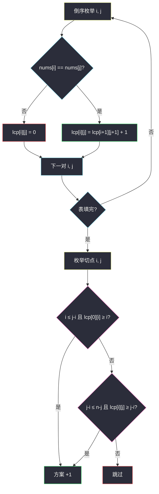
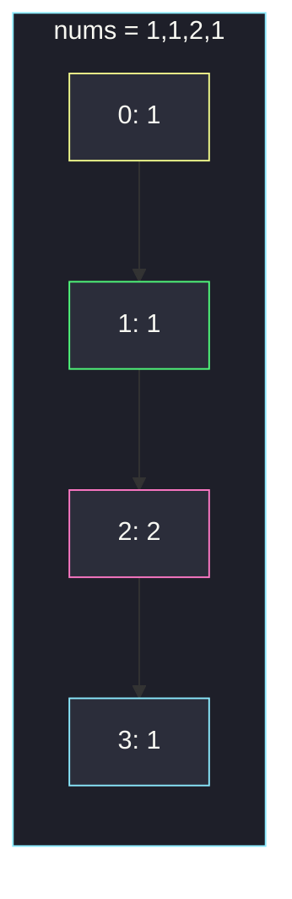

# 统计数组中的美丽分割（LCP / Z 函数）

## 一、问题描述

给定整数数组 `nums`，把它切成三段**非空连续**子数组 `nums1`、`nums2`、`nums3`，拼接后必须还原成原数组。一种切法称为**美丽分割**，当且仅当下面两条至少成立一条：

- `nums1` 是 `nums2` 的前缀；或
- `nums2` 是 `nums3` 的前缀。

返回美丽分割的方案数。两条同时成立只计 **1** 次。

> 🔗 LeetCode 3388：https://leetcode.cn/problems/count-beautiful-splits-in-an-array/
>
> 数据范围：`1 ≤ nums.length ≤ 5000`，`0 ≤ nums[i] ≤ 50`。`n = 5000` 必须做到 `O(n²)`，三次方枚举比内容过不了。
>
> 📚 灵茶题单：**二、Z 函数（后缀的前缀）**。Z 函数 `z[i]` = `s[i:]` 与 `s[0:]` 的最长公共前缀，正好是「某个后缀的前缀有多长」。本题要比较的是**任意两个后缀**的 LCP，用一张从表尾递推的 `lcp[i][j]` 一次建好，枚举两个切点时 `O(1)` 判定。不要写成「左右 unique 个数相等」——那是另一道切分数组题。

**示例 1**

```
输入：nums = [1,1,2,1]
输出：2
解释：
[1] | [1,2] | [1]   → nums1 是 nums2 的前缀
[1] | [1]   | [2,1] → nums1 是 nums2 的前缀
```

**示例 2**

```
输入：nums = [1,2,3,4]
输出：0
解释：四个数互不相同，任何一段都当不成下一段的前缀。
```

**直观理解**

两个切点把数组分成左 / 中 / 右。合法切点要让「左段整段出现在中段开头」，或者「中段整段出现在右段开头」。前缀关系还要求被当模板的那段**不能更长**，否则后面那段装不下。

---

## 二、暴力解法

切点用半开区间：`nums1 = nums[0:i]`，`nums2 = nums[i:j]`，`nums3 = nums[j:n]`，约束 `1 ≤ i < j ≤ n-1`。对每个 `(i, j)` 直接切片比较。

```python
class Solution:
    def beautifulSplits(self, nums: List[int]) -> int:
        n = len(nums)
        ans = 0
        for i in range(1, n - 1):
            for j in range(i + 1, n):
                a = nums[:i]
                b = nums[i:j]
                c = nums[j:]
                ok = False
                if len(a) <= len(b) and b[: len(a)] == a:
                    ok = True
                if len(b) <= len(c) and c[: len(b)] == b:
                    ok = True
                ans += int(ok)
        return ans
```

官方两例都能过。每次比较最坏扫 `O(n)` 个元素，切点 `O(n²)` 对，总时间 `O(n³)`。`n = 5000` 时约 `1.25·10¹¹` 次操作，超时。

### 🔴 瓶颈在哪里

真正慢的不是「有多少对切点」，而是**每一对都从头比一遍**。`nums[0:i]` 和 `nums[i:2i]` 是否相等，会被很多不同的 `j` 反复问。把「任意两个后缀的最长公共前缀」预处理成表，判定从 `O(n)` 降到 `O(1)`。

---

## 三、优化探索（核心章节）

> 📚 本题在灵茶题单中属于 **二、Z 函数（后缀的前缀）**。主解用二维 LCP（Z 的批量版）；后文补「每个起点算一次 Z」的写法，骨架相同。

### 3.1 切点与三段长度

下标 0-based，切点 `i`、`j` 表示第一段、第二段的**右开端**：

| 段 | 区间 | 长度 |
|----|------|------|
| nums1 | `nums[0:i]` | `i` |
| nums2 | `nums[i:j]` | `j - i` |
| nums3 | `nums[j:n]` | `n - j` |

非空 ⇔ `1 ≤ i < j < n`（`j` 最大取 `n-1`，给第三段至少留 1 个元素）。

### 3.2 前缀判定翻译成 LCP

记 `lcp[p][q]` = `nums[p:]` 与 `nums[q:]` 的最长公共前缀长度。

- nums1 是 nums2 的前缀 ⇔ 长度够：`i ≤ j - i`，且内容够：`lcp[0][i] ≥ i`（`nums[0:i]` 等于 `nums[i:2i]`，而 `2i ≤ j` 保证这段落在 nums2 里）。
- nums2 是 nums3 的前缀 ⇔ `j - i ≤ n - j`，且 `lcp[i][j] ≥ j - i`。

第二条的长度不等式其实被 LCP 定义隐含了：`lcp[i][j] ≤ n - j`，所以 `lcp[i][j] ≥ j - i` 已经推出 `j - i ≤ n - j`。第一条**不能省** `i ≤ j - i`：`lcp[0][i] ≥ i` 只说明「从 `i` 出发的**整个后缀**」的前 `i` 个元素对得上，nums2 可能比 `i` 短，对上了也装不下 nums1。

两条是 **OR**。例如 `[1,1,1]` 切成 `[1]|[1]|[1]`，两条都真，答案只加 1。

### 3.3 从表尾填 LCP

两个后缀的 LCP 满足：

- `nums[i] != nums[j]` → `lcp[i][j] = 0`
- 相等 → `lcp[i][j] = lcp[i+1][j+1] + 1`

依赖的是更大的下标，所以 `i`、`j` 从 `n-1` 倒着走。越界格子视为 0，数组开 `n+1` 即可。本题只用 `j > i` 的一半。



### 3.4 和 Z 函数的关系

经典 Z 数组：`z[i]` = `s[i:]` 与 **`s[0:]`** 的 LCP，也就是 `lcp[0][i]`。灵神把这一节叫「后缀的前缀」，读法就是：每个后缀，当多长的前缀，能对上整串开头。

判定「nums1 是 nums2 的前缀」只用 `z[i]`（对整个 `nums` 求一次 Z）。判定「nums2 是 nums3 的前缀」要对**每个起点 `i`** 再求 `nums[i:]` 的 Z，然后看 `z[j - i]`。每个 Z 是 `O(n)`，起点 `O(n)` 个，总时间仍是 `O(n²)`，空间可压到 `O(n)`。主解用二维表更短、更好默写；Z 是同一件事的「按行」算法。

字符串哈希也能 `O(1)` 问「两段是否相等」，预处理 `O(n)`。`n = 5000` 三种都行，LCP 没有模数、没有碰撞。

### 3.5 一句话核心

> **倒序 DP 得到任意两后缀的 LCP；枚举切点，长度够且 LCP 够则计 1，两条 OR 不重复加。**

---

## 四、代码实现

### Python（主解：二维 LCP）

```python
from typing import List


class Solution:
    def beautifulSplits(self, nums: List[int]) -> int:
        n = len(nums)
        lcp = [[0] * (n + 1) for _ in range(n + 1)]
        for i in range(n - 1, -1, -1):
            for j in range(n - 1, i, -1):
                if nums[i] == nums[j]:
                    lcp[i][j] = lcp[i + 1][j + 1] + 1
        ans = 0
        for i in range(1, n - 1):
            for j in range(i + 1, n):
                a = i <= j - i and lcp[0][i] >= i
                b = j - i <= n - j and lcp[i][j] >= j - i
                ans += int(a or b)
        return ans
```

**变量含义**

| 写法 | 含义 |
|------|------|
| `i` | nums1 的长度，也是 nums2 的起点 |
| `j` | nums1+nums2 的长度，也是 nums3 的起点 |
| `lcp[p][q]` | 后缀 `p` 与后缀 `q` 的 LCP |
| `a` | nums1 是否为 nums2 前缀 |
| `b` | nums2 是否为 nums3 前缀 |
| `a or b` | 美丽；两真仍只加 1 |

`n < 3` 时两层循环不跑，返回 0，符合「三段都非空」。

---

## 五、具体例子演示

### 5.1 官方示例 1：`[1,1,2,1]` 填 LCP 再枚举

`n = 4`。只填 `j > i`，从右下角往左上：

| i\j | 1 | 2 | 3 |
|-----|---|---|---|
| 0 | `1==1` → `lcp[1][2]+1 = 1` | `1≠2` → 0 | `1==1` → 1 |
| 1 | — | `1≠2` → 0 | `1==1` → 1 |
| 2 | — | — | `2≠1` → 0 |

逐步：

1. `(i,j)=(2,3)`：`2≠1`，`lcp[2][3]=0`
2. `(1,3)`：`1==1`，后继 `lcp[2][4]=0`，`lcp[1][3]=1`
3. `(1,2)`：`1≠2`，`0`
4. `(0,3)`：`1==1`，`lcp[1][4]+1=1`
5. `(0,2)`：`1≠2`，`0`
6. `(0,1)`：`1==1`，`lcp[1][2]+1=1`

切点：

| i | j | 三段 | 条件 a | 条件 b | 计 |
|---|---|------|--------|--------|----|
| 1 | 2 | `[1]\|[1]\|[2,1]` | `1≤1` 且 `lcp[0][1]=1≥1` | `1≤2` 但 `lcp[1][2]=0` | 1 |
| 1 | 3 | `[1]\|[1,2]\|[1]` | 同上，`1≤2` | `2≤1`？否 | 1 |
| 2 | 3 | `[1,1]\|[2]\|[1]` | `2≤1`？否 | `lcp[2][3]=0` | 0 |

答案 2，对拍官方。注意第二种切法 nums3=`[1]`，nums2=`[1,2]` 更长，b 直接因长度失败；靠的是 a。



黄是 nums1 起点；绿是示例里两次切法共用的第二段起点 `i=1`；粉是对不上前缀的 `2`。

### 5.2 官方示例 2：`[1,2,3,4]`

任意 `i≠j` 都 `nums[i]≠nums[j]`，LCP 全 0。`lcp[0][i]≥i` 需要 `i≥1` 的正长度，全失败；`lcp[i][j]` 同理。答案 0。

### 5.3 两条同时成立：`[1,1,1]`

切点只有 `(1,2)`：`[1]|[1]|[1]`。

- a：`1≤1` 且 `lcp[0][1]=2≥1`
- b：`1≤1` 且 `lcp[1][2]=1≥1`

`a or b` 为真，`ans += 1`，不是 2。`n=3` 只有这一种三段切法，答案 1。

### 5.4 必须检查 `i ≤ j-i`：`[1,2,1,2,9]`

`lcp[0][2]`：`[1,2,1,2,9]` 与 `[1,2,9]` 的 LCP 是 2，所以 `lcp[0][2]≥2` 成立。若忘掉长度：

- 切 `(i,j)=(2,3)` → `[1,2]|[1]|[2,9]`，nums1 长度 2，nums2 长度 1，**不是**前缀关系，不能算。
- 合法的是 `(2,4)`：`[1,2]|[1,2]|[9]`，`2≤2` 且 LCP 够。

对拍暴力：只有这 1 种。这就是「LCP 看的是整段后缀，nums2 可能更短」。

---

## 六、复杂度分析

| 方法 | 时间 | 空间 | 说明 |
|------|------|------|------|
| 枚举切点 + 切片比较 | `O(n³)` | `O(1)` 额外 | `n=5000` 超时 |
| 二维 LCP + 枚举（主解） | `O(n²)` | `O(n²)` | 建表、枚举都是两层 `n` |
| 每个起点一次 Z 函数 | `O(n²)` | `O(n)` | 与 LCP 等价，常数略大 |
| 字符串哈希 | `O(n²)` | `O(n)` | 要双模防碰撞，本题不必 |

`5000² = 2.5·10⁷`，Python 也能过。只需上三角时不要把 `lcp[i][j]` 和 `lcp[j][i]` 都开一遍再各填一次，浪费内存。

---

## 七、对比总结

| 维度 | 暴力 | LCP 表 | 按行 Z |
|------|------|--------|--------|
| 判定一段是否前缀 | 每次 `O(n)` | `O(1)` | `O(1)`（Z 已算好） |
| 预处理 | 无 | 倒序 DP | n 次 Z |
| 空间 | `O(1)` | `O(n²)` | `O(n)` |

**易错点**

1. **写成 unique 个数相等**：题面是数组前缀，不是「左右不同元素个数」。
2. **漏掉 `i ≤ j-i`**：见 5.4，`lcp[0][i]≥i` 推不出 nums2 够长。
3. **两条都成立加 2**：`int(a or b)` 或 `if a or b: ans += 1`。
4. **切点写成闭区间搞错长度**：统一右开，`i` 就是 nums1 长度。
5. **LCP 正着填**：依赖 `i+1, j+1`，必须倒序。
6. **`n<3` 特判漏了**：循环自然返回 0，不必写，但别手滑 `range(n)` 让第三段为空。
7. **哈希只比相等却忘了「不能更长」**：哈希问的是等长子串，仍要先比长度。

---

## 八、举一反三

| 题目 | 关系 |
|------|------|
| [2223. 构造字符串的总得分](https://leetcode.cn/problems/sum-of-scores-of-built-strings/) | 标准 Z 函数：每个后缀与整串的 LCP 求和 |
| [3031. 将单词恢复初始状态所需的最短时间 II](https://leetcode.cn/problems/minimum-time-to-revert-word-to-initial-state-ii/) | 用 Z 看删掉前缀后剩下的是否仍是原串前缀 |
| [1316. 不同的循环子字符串](https://leetcode.cn/problems/distinct-echo-substrings/) | 「由两段相同子串拼成」，LCP / 哈希 |
| [28. 找出字符串中第一个匹配项的下标](https://leetcode.cn/problems/find-the-index-of-the-first-occurrence-in-a-string/)（`find-the-index-of-the-first-occurrence-in-a-string.md`） | next 是「前缀的后缀」；本题 Z 是「后缀的前缀」 |
| [1392. 最长快乐前缀](https://leetcode.cn/problems/longest-happy-prefix/)（`longest-happy-prefix.md`） | 整串的最长真前后缀，KMP `next[n-1]` |
| [1525. 字符串的好分割数目](https://leetcode.cn/problems/number-of-good-ways-to-split-a-string/) | **对照题**：左右 unique 个数相等，别和 3388 混 |

**思想迁移**

- 需要反复问「`A[p:]` 和 `A[q:]` 能对上多长」→ 倒序 LCP 或 Z。
- 口诀：**「后缀对后缀，表从尾巴填；切点只问长度够不够、LCP 够不够。」**
