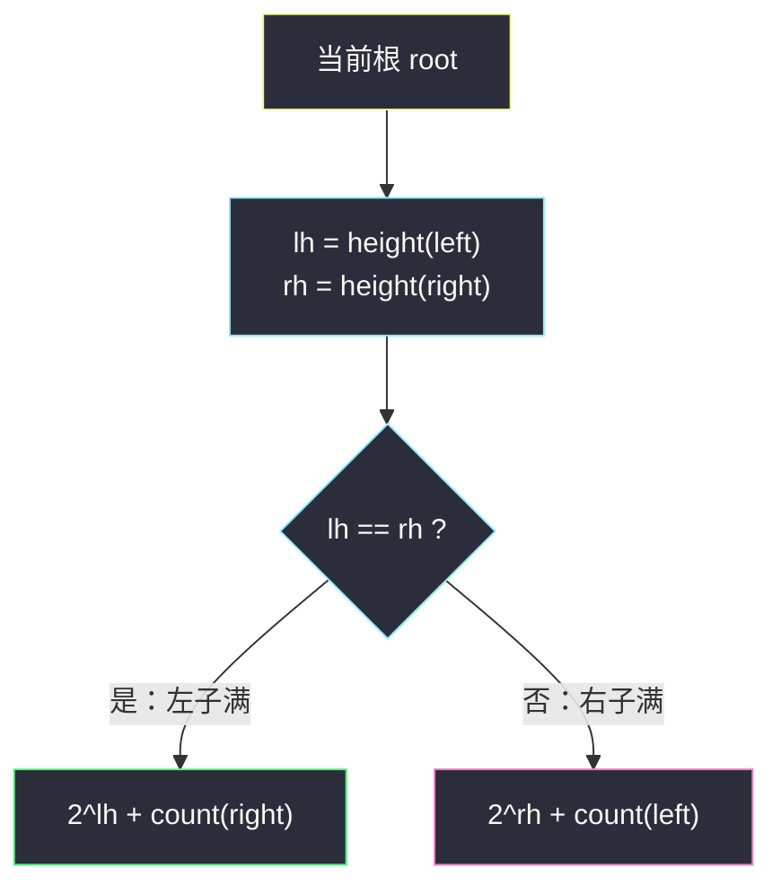
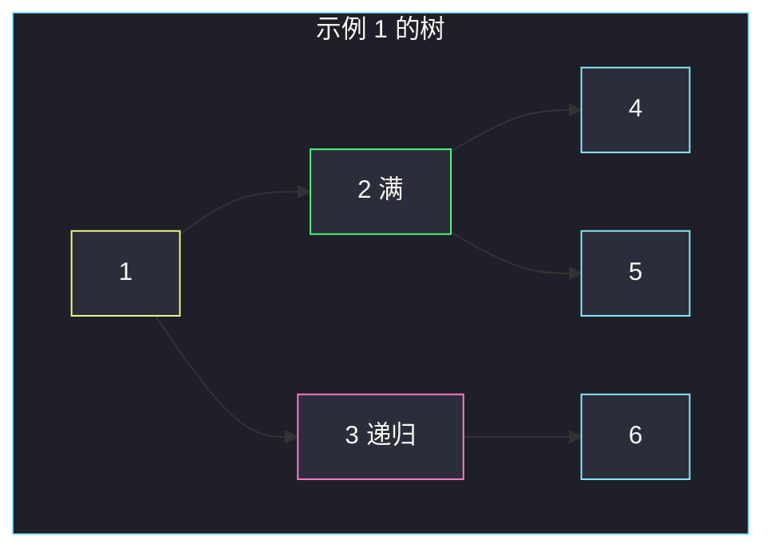

# 完全二叉树的节点个数（高度二分 · 满树公式）

## 一、问题描述

给你一棵**完全二叉树**的根节点 `root`，求出该树的节点个数。

完全二叉树的定义：除了最底层，其余层都是满的；最底层的节点都集中在**左侧**。空树、单节点、满二叉树都是完全二叉树的特例。

进阶：可以设计一个比朴素遍历更快的算法吗？

> 🔗 LeetCode 222：https://leetcode.cn/problems/count-complete-tree-nodes/
>
> 数据范围：树中节点数目在 `[0, 5·10^4]`，`0 <= Node.val <= 5·10^4`，题目保证输入是完全二叉树。

**示例 1**

```
输入：root = [1,2,3,4,5,6]
输出：6
解释：共 6 个节点，最后一层缺最右侧一个。
```

**示例 2**

```
输入：root = []
输出：0
```

**示例 3**

```
输入：root = [1]
输出：1
```

**直观理解**

普通二叉树只能把每个节点摸一遍，`O(n)`。完全二叉树多了一条强约束：**缺口只可能出现在最后一层靠右的位置**。这意味着：任意节点的左右子树里，至少有一棵是**满的**（满二叉树节点数 = `2^h - 1`，`O(1)` 算完），只需递归那棵可能不满的。高度只要沿最左链走，`O(h)`；整棵树高度 `h = ⌊log n⌋`，总时间压到 `O(log² n)`。

---

## 二、暴力解法

层序或递归把每个节点加一，完全二叉树的性质完全没用上：

```python
class Solution:
    def countNodes(self, root: Optional[TreeNode]) -> int:
        if not root:
            return 0
        q, ans = [root], 0
        while q:
            node = q.pop(0)
            ans += 1
            if node.left:
                q.append(node.left)
            if node.right:
                q.append(node.right)
        return ans
```

递归一句话也能写：`return 0 if not root else 1 + self.countNodes(root.left) + self.countNodes(root.right)`。

### 复杂度

- **时间**：`O(n)`，每个节点进出一次。
- **空间**：BFS 最底层约 `n/2`，`O(n)`；递归深度 `O(h) = O(log n)`。

`n = 5·10^4` 能过。进阶要的是利用「完全」把一部分子树一次性用公式算掉。

### 🔴 瓶颈在哪里

满二叉树不需要逐个点名：高度 `h`（含根）就有 `2^h - 1` 个节点。完全二叉树里总有一侧是满的，暴力把满的那侧也扫了一遍。

---

## 三、优化探索（核心章节）

> 📚 本题在灵茶题单中属于 **02-二分查找 · 四、其他**。表面上在数节点，真正用的是：高度 `O(log n)` 的比较，每次把问题规模砍半，整体 `O(log² n)`，和二分同一量级。

### 3.1 只量最左链

定义 `height(node)` = 从 `node` 一直走 **left** 走到空，经过的节点数（空树为 0）。完全二叉树里这就是这棵子树的高度：缺口只在最后一层右侧，最左链一定顶到最底层。

对当前根，令 `lh = height(root.left)`，`rh = height(root.right)`。

### 3.2 两种情况

**情况 A：`lh == rh`**。左子树最后一层是满的（否则右子树高度会更矮）。左子是高度 `lh` 的满树，节点数 `2^{lh} - 1`，再加根，再加上右子（右子仍是完全二叉树，递归）：

```
ans = 2^lh + count(root.right)
```

（`2^lh - 1 + 1 = 2^lh`。）

**情况 B：`lh == rh + 1`**（完全二叉树只可能差 1）。右子树最后一层是满的，右子是高度 `rh` 的满树：

```
ans = 2^rh + count(root.left)
```



每层只递归**一侧**，另一侧 `O(1)` 用公式关掉。量高度 `O(h)`，递归深度 `O(h)`，合计 `O(h²) = O(log² n)`。

### 3.3 一句话核心

> **完全二叉树左右高度一比：等高则左满，用 `2^lh` 加上递归右；不等则右满，用 `2^rh` 加上递归左。**

---

## 四、代码实现

### Python（主解：高度比较）

```python
# Definition for a binary tree node.
# class TreeNode:
#     def __init__(self, val=0, left=None, right=None):
#         self.val = val
#         self.left = left
#         self.right = right

class Solution:
    def countNodes(self, root: Optional[TreeNode]) -> int:
        if not root:
            return 0

        def height(node: Optional[TreeNode]) -> int:
            h = 0
            while node:                     # 只走最左链
                h += 1
                node = node.left
            return h

        lh = height(root.left)
        rh = height(root.right)
        if lh == rh:                        # 左子满
            return (1 << lh) + self.countNodes(root.right)
        else:                               # 右子满
            return (1 << rh) + self.countNodes(root.left)
```

**变量含义**

| 变量 | 含义 |
|------|------|
| `height(node)` | `node` 子树高度（沿 left 走到底） |
| `lh` / `rh` | 左 / 右子树高度 |
| `1 << lh` | `2^lh`，满左子 + 根 |

空树直接 0；叶子 `lh = rh = 0`，返回 `1 << 0 + count(None) = 1`。

---

## 五、具体例子演示

以示例 1 为例：

```
        1
       / \
      2   3
     / \ /
    4  5 6
```

**根 = 1**：`lh = height(2) = 2`（2→4），`rh = height(3) = 2`（3→6）。`lh == rh`，左子满，`ans = 2² + count(3) = 4 + count(3)`。

**根 = 3**：`lh = height(6) = 1`，`rh = height(None) = 0`。不等，右子满，`ans = 2⁰ + count(6) = 1 + count(6)`。

**根 = 6**：`lh = rh = 0`，`ans = 1 + count(None) = 1`。

回溯：`count(3) = 2`，`count(1) = 4 + 2 = 6` ✓。

| 当前根 | lh | rh | 比较 | 公式项 | 递归侧 | 子问题返回 | 本层答案 |
|--------|----|----|------|--------|--------|------------|----------|
| 1 | 2 | 2 | 相等 | `2^2 = 4` | 右 3 | 2 | **6** |
| 3 | 1 | 0 | 不等 | `2^0 = 1` | 左 6 | 1 | **2** |
| 6 | 0 | 0 | 相等 | `2^0 = 1` | 右 None | 0 | **1** |



---

## 六、复杂度分析

| 方法 | 时间 | 空间 | 说明 |
|------|------|------|------|
| BFS / 递归遍历 | `O(n)` | BFS `O(n)` / 递归 `O(log n)` | 没用完全性 |
| 高度比较（主解） | `O(log² n)` | `O(log n)` 递归栈 | 每层 `O(log n)` 量高，递归 `O(log n)` 层 |

---

## 七、对比总结

| 维度 | 普通二叉树 | 完全二叉树（本题） | 满二叉树 |
|------|------------|-------------------|----------|
| 计数 | 必须 `O(n)` | 一侧公式 + 一侧递归 | `2^h - 1` 一次算完 |
| 高度 | 左右都要量 | 只走最左链 | 同左 |

**易错点**

1. **高度必须走 left**：走 right 会把最后一层的缺口当成「树更矮」，公式全错。
2. **`1 << lh` 已经含根**：不要再 `+ 1`，否则每个满子树都会多算一个。
3. **空树 / 叶子**：`height(None) = 0`，叶子返回 1，不必特判。
4. 这不是二叉搜索树，**不能按 val 二分**；二分的是「高度把规模砍半」。
5. 普通二叉树套这套公式是错的：左右高度相等推不出左子是满的。

---

## 八、举一反三

| 题目 | 关系 |
|------|------|
| [104. 二叉树的最大深度](https://leetcode.cn/problems/maximum-depth-of-binary-tree/) | 普通树高度，左右都要递归 |
| [110. 平衡二叉树](https://leetcode.cn/problems/balanced-binary-tree/) | 同样比较左右高度，判定差是否 ≤ 1 |
| [958. 二叉树的完全性检验](https://leetcode.cn/problems/check-completeness-of-a-binary-tree/) | 本题的前提；BFS 遇到空之后不能再出现节点 |
| [222 的对照 · 统计所有节点](https://leetcode.cn/problems/count-complete-tree-nodes/) | 若输入不是完全二叉树，退回 `O(n)` 遍历 |
| [111. 二叉树的最小深度](https://leetcode.cn/problems/minimum-depth-of-binary-tree/) | 最左链在完全二叉树里恰好等于最小深度 |

**思想迁移**

- 结构有「一侧必满」的保证时，先 `O(1)` 关掉满的那边，再递归缺口。
- 口诀：**「最左链量高；等高左满走右，不等右满走左；`2^h` 含根。」**
