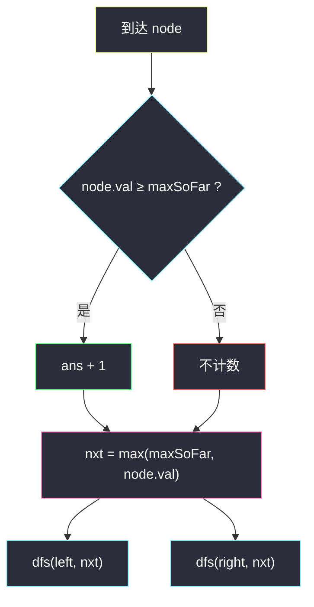
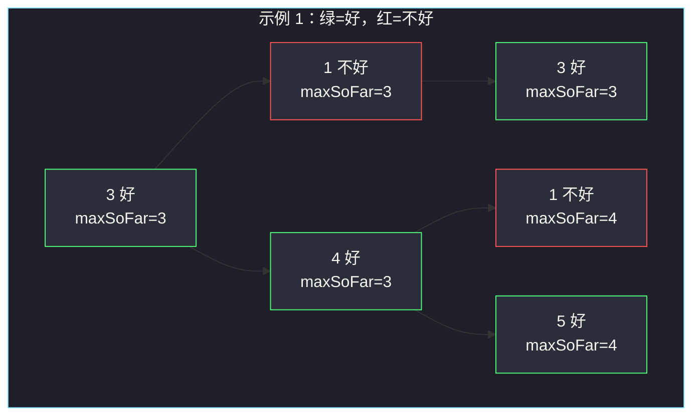

# 统计二叉树中好节点的数目（自顶向下 · 路径最大值）

## 一、问题描述

给你一棵二叉树的根 `root`。若从根到某节点的路径上，**没有比它严格更大的值**，该节点就是**好节点**。返回好节点的个数。

根一定是好节点：它的路径上只有自己。值相等也算好——「没有严格更大」允许并列最大。

> 🔗 LeetCode 1448：https://leetcode.cn/problems/count-good-nodes-in-binary-tree/
>
> 数据范围：节点数 `[1, 10^5]`，`-10^4 <= Node.val <= 10^4`。
>
> 📚 灵茶题单：**二叉树 · §2.2 自顶向下 DFS（先序遍历）**（1360 分）。

**示例 1**

```
输入：root = [3,1,4,3,null,1,5]
输出：4
树形：
        3
       / \
      1   4
     /   / \
    3   1   5
好节点：根 3、左下 3、右子 4、右下 5。左 1 与 4 下的 1 不是。
```

**示例 2**

```
输入：root = [3,3,null,4,2]
输出：3
树形：
      3
     /
    3
   / \
  4   2
2 的路径是 3 → 3 → 2，路上有比 2 大的 3，不是好节点。
```

**直观理解**

一个点好不好，只取决于**它上面那条链**的最大值。从根往下走时把「路上见过的最大值」带着，到一个点立刻能判断，再把更新后的最大值交给左右孩子。这就是 §2.2 的自顶向下：祖先信息当参数往下传。

---

## 二、暴力解法

把根到当前点的整条路径存进数组，每次用 `max(path)` 判断：

```python
class Solution:
    def goodNodes(self, root: Optional[TreeNode]) -> int:
        ans = 0

        def dfs(node: Optional[TreeNode], path: list[int]) -> None:
            nonlocal ans
            if node is None:
                return
            path.append(node.val)
            if node.val >= max(path):
                ans += 1
            dfs(node.left, path)
            dfs(node.right, path)
            path.pop()

        dfs(root, [])
        return ans
```

### 复杂度

- **时间**：每个点扫一遍路径，路径最长 `O(n)`（链），合计 `O(n²)`。
- **空间**：递归栈 + 路径数组 `O(n)`。

`n = 10^5` 的链会超时。

### 🔴 瓶颈在哪里

`max(path)` 每次从零扫。路径只多一个点，最大值要么不变，要么变成当前值——维护一个标量 `maxSoFar` 即可，不必整条路径。

---

## 三、优化探索（核心章节）

> 📚 本题在灵茶题单中属于 **二叉树 · §2.2 自顶向下 DFS（先序遍历）**。判断只依赖祖先，先处理自己再下潜，参数带着路上的最大值。

### 3.1 好节点的等价说法

节点 `x` 是好节点 ⇔ `x.val` ≥ 根到 `x` 路径上所有点的最大值 ⇔ `x.val` ≥ 所有祖先的最大值（根没有祖先，恒成立）。

记进入 `x` 时祖先最大值为 `maxSoFar`：

- `x.val >= maxSoFar` → 计数 +1
- 传给孩子的最大值 = `max(maxSoFar, x.val)`

### 3.2 先序：先用祖先信息，再往下传



左右互不影响：左子树改不了右子树的祖先链。参数按值传递（或递归帧各自一份），回来时 `maxSoFar` 自动复原，不必手动撤销。

### 3.3 初值

第一次调用可以 `dfs(root, -inf)`，根一定被算上；也可以 `dfs(root, root.val)`，根满足 `val >= val`。节点值最小 `-10^4`，用 `-10**9` 或 `float('-inf')` 都安全。

### 3.4 一句话核心

> **带着路上最大值往下走：当前值 ≥ 它就算好节点，再把更大的那个传给孩子。**

---

## 四、代码实现

### Python（主解：先序 + maxSoFar）

```python
class Solution:
    def goodNodes(self, root: Optional[TreeNode]) -> int:
        def dfs(node: Optional[TreeNode], max_so_far: int) -> int:
            if node is None:
                return 0
            good = 1 if node.val >= max_so_far else 0
            nxt = max(max_so_far, node.val)
            return good + dfs(node.left, nxt) + dfs(node.right, nxt)

        return dfs(root, root.val)
```

**变量含义**

| 变量 | 含义 |
|------|------|
| `max_so_far` | 进入本节点前，祖先上的最大值 |
| `good` | 本节点是好节点则为 1 |
| `nxt` | 传给孩子的路径最大值 |

空孩子返回 0。根用 `root.val` 当初始 `max_so_far`，根自己一定计入。

### Java（可选）

```java
class Solution {
    public int goodNodes(TreeNode root) {
        return dfs(root, root.val);
    }
    private int dfs(TreeNode node, int maxSoFar) {
        if (node == null) return 0;
        int good = node.val >= maxSoFar ? 1 : 0;
        int nxt = Math.max(maxSoFar, node.val);
        return good + dfs(node.left, nxt) + dfs(node.right, nxt);
    }
}
```

---

## 五、具体例子演示

以示例 1 为例，先序（根 → 左 → 右）。`maxSoFar` 是**进入时的祖先最大**。

```
        3
       / \
      1   4
     /   / \
    3   1   5
```

| 访问顺序 | 节点 | 进入时 maxSoFar | 比较 | 好节点? | 传给孩子 |
|----------|------|-----------------|------|---------|----------|
| 1 | 3（根） | 3 | 3 ≥ 3 | 是 | 3 |
| 2 | 1 | 3 | 1 ≥ 3 | **否** | 3 |
| 3 | 3（左下） | 3 | 3 ≥ 3 | 是 | 3 |
| 4 | 4 | 3 | 4 ≥ 3 | 是 | 4 |
| 5 | 1 | 4 | 1 ≥ 4 | **否** | 4 |
| 6 | 5 | 4 | 5 ≥ 4 | 是 | 5 |

答案 4。注意左下那个 3：路上有根 3，**相等也算好**。

示例 2 逐步：

```
      3
     /
    3
   / \
  4   2
```

| 访问顺序 | 节点 | 进入时 maxSoFar | 比较 | 好节点? | 传给孩子 |
|----------|------|-----------------|------|---------|----------|
| 1 | 3（根） | 3 | 3 ≥ 3 | 是 | 3 |
| 2 | 3（左） | 3 | 3 ≥ 3 | 是 | 3 |
| 3 | 4 | 3 | 4 ≥ 3 | 是 | 4 |
| 4 | 2 | 3 | 2 ≥ 3 | **否** | 3 |

2 的祖先最大是 3，严格更大，所以不是好节点。答案 3。



---

## 六、复杂度分析

| 方法 | 时间 | 空间 | 说明 |
|------|------|------|------|
| 存路径再 `max` | `O(n²)` | `O(n)` | 链上每次扫路径 |
| 先序带 maxSoFar（主解） | `O(n)` | `O(h)` 递归栈 | 每点 `O(1)` 判断；最坏链 `h = n` |

---

## 七、对比总结

| 维度 | 暴力存路径 | 自顶向下参数 |
|------|------------|--------------|
| 祖先信息 | 数组里现算 | 一个整数往下传 |
| 撤销 | 显式 `pop` | 递归返回即复原 |
| 适用 | 需要整条路径时 | 只需路径上的最值/和 |

**易错点**

1. **写成严格大于**：条件是 `>=`，相等也是好节点。
2. **`maxSoFar` 含不含自己**：进入时只含祖先；比较完再 `max` 传给孩子。不要先更新再比较，否则每个点都「大于等于自己」，全算好。
3. **初值过大**：若误用 `10^9` 当祖先最大，根都会被判坏。用 `root.val` 或负无穷。
4. 这不是 BST，**不能**靠左小右大剪枝。
5. 左右子树的 `maxSoFar` 从同一份拷出去，互不污染。

---

## 八、举一反三

| 题目 | 关系 |
|------|------|
| [1026. 节点与其祖先之间的最大差值](https://leetcode.cn/problems/maximum-difference-between-node-and-ancestor/) | 同样自顶向下，参数改成祖先最大与最小 |
| [98. 验证二叉搜索树](https://leetcode.cn/problems/validate-binary-search-tree/) | 先序带上下界，也是祖先约束往下传 |
| [129. 求根节点到叶节点数字之和](https://leetcode.cn/problems/sum-root-to-leaf-numbers/) | 先序把路径上的数「合成」往下带 |
| [112. 路径总和](https://leetcode.cn/problems/path-sum/) | 往下带剩余目标和 |
| [257. 二叉树的所有路径](https://leetcode.cn/problems/binary-tree-paths/) | 需要整条路径时才显式回溯 |

**思想迁移**

- 决策只看祖先 → §2.2 自顶向下，参数递下去。
- 口诀：**「路上最大值跟着走；≥ 就算好，再 max 传给孩子。」**
