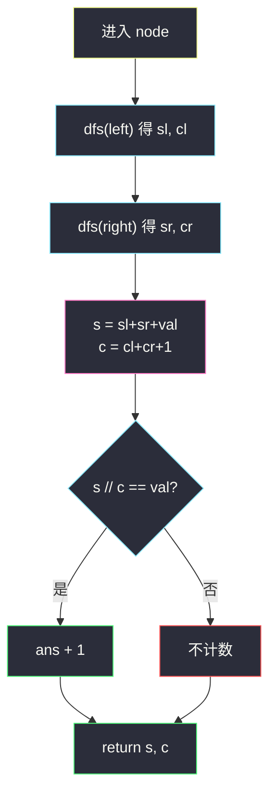
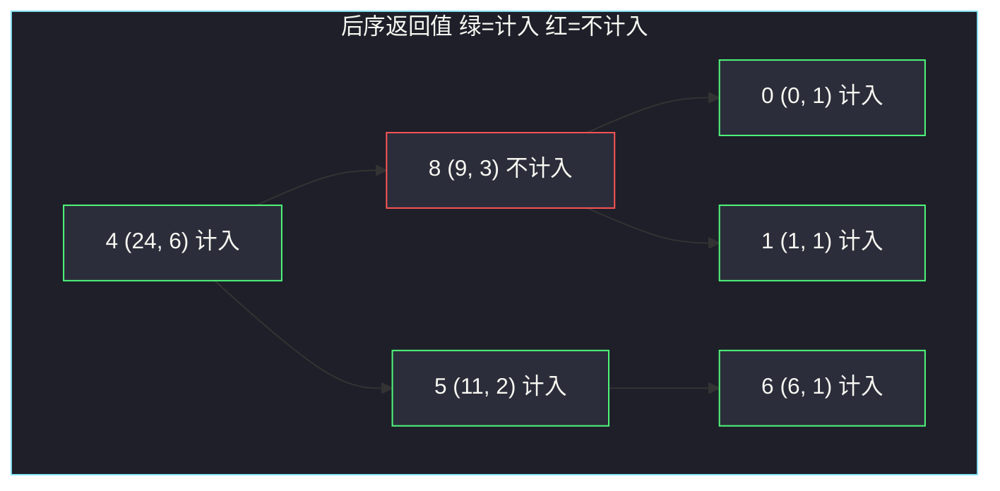

# 统计值等于子树平均值的节点数（自底向上 · 返回 sum 与 count）

## 一、问题描述

给你一棵二叉树的根 `root`。统计有多少个节点，它的值**等于其自身子树的平均值**。子树包含该节点以及它下面的所有后代。平均值是子树所有值的和除以节点个数，**向下取整**（整数除法）。

> 🔗 LeetCode 2265：https://leetcode.cn/problems/count-nodes-equal-to-average-of-subtree/
>
> 数据范围：节点数 `[1, 1000]`，`0 <= Node.val <= 1000`。
>
> 📚 灵茶题单：**二叉树 · §2.3 自底向上 DFS（后序遍历）**（1473 分）。

**示例 1**

```
输入：root = [4,8,5,0,1,null,6]
输出：5
树形：
        4
       / \
      8   5
     / \   \
    0   1   6
4：24/6 = 4；5：11/2 = 5；0、1、6 单节点等于自己。
8：9/3 = 3 ≠ 8，不计入。
```

**示例 2**

```
输入：root = [1]
输出：1
单节点子树平均值就是自己。
```

**直观理解**

一个点算不算，取决于**整棵子树**的和与节点数，和祖先无关。后序保证左右子树先算完，当前点把两份 `(sum, count)` 拼起来，立刻能判断自己，再把拼好的结果交给父亲。这就是 §2.3：默认子树已经处理完。

---

## 二、暴力解法

对每个节点单独 DFS 一遍它的子树，求和、计数，再判断：

```python
class Solution:
    def averageOfSubtree(self, root: Optional[TreeNode]) -> int:
        def stats(node: Optional[TreeNode]) -> tuple[int, int]:
            if node is None:
                return 0, 0
            ls, lc = stats(node.left)
            rs, rc = stats(node.right)
            return ls + rs + node.val, lc + rc + 1

        ans = 0

        def dfs(node: Optional[TreeNode]) -> None:
            nonlocal ans
            if node is None:
                return
            s, c = stats(node)
            if s // c == node.val:
                ans += 1
            dfs(node.left)
            dfs(node.right)

        dfs(root)
        return ans
```

每个点都把子树重新走一遍。

### 复杂度

- **时间**：每个点当根扫子树，最坏链上 `O(n²)`。
- **空间**：递归栈 `O(n)`。

本题 `n ≤ 1000` 能过，但同一棵子树被算了很多次。

### 🔴 瓶颈在哪里

`stats(node)` 需要的信息，正好是 `stats(left)` 与 `stats(right)` 的拼接。后序一次遍历就能让每个点拿到自己的 `(sum, count)`，不必套两层 DFS。

---

## 三、优化探索（核心章节）

> 📚 本题在灵茶题单中属于 **二叉树 · §2.3 自底向上 DFS（后序遍历）**。先递归左右，默认子树已处理完，再算当前点，把汇总结果返回给父亲。

### 3.1 子树要返回什么

平均值 = `⌊子树和 / 子树节点数⌋`。两个整数就够：

- `s`：子树所有 `val` 之和（含自己）
- `c`：子树节点个数（含自己）

空节点返回 `(0, 0)`。当前点：

```
s = left.s + right.s + node.val
c = left.c + right.c + 1
若 s // c == node.val，计数 +1
把 (s, c) 返回给父亲
```

叶子：`s = val`，`c = 1`，`val // 1 == val`，**每个叶子都会被算上**。

### 3.2 后序：先子树，再自己



计数可以用外部 `ans`，也可以让 DFS 多返回一个「子树里符合条件的节点数」。主解用外部计数，返回值保持 `(s, c)` 两个数，最好默写。

父亲只需要和与个数去拼自己的平均值，不需要知道孩子里已经计了几个点——那份计数用外部变量攒即可。

### 3.3 向下取整

题目写明「求和再除以 n，向下舍入到最近整数」。节点值全是非负，Python / Java 的整数除法 `s // c`、`s / c` 就是向零/向下，结果一致。**不要**写成四舍五入，也不要用浮点 `round`。

### 3.4 一句话核心

> **后序返回 (子树和, 子树节点数)；平均值用整除 `sum // cnt`，等于 `node.val` 就计数 +1。**

---

## 四、代码实现

### Python（主解：后序返回 sum 与 count）

```python
class Solution:
    def averageOfSubtree(self, root: Optional[TreeNode]) -> int:
        ans = 0

        def dfs(node: Optional[TreeNode]) -> tuple[int, int]:
            nonlocal ans
            if node is None:
                return 0, 0
            sl, cl = dfs(node.left)
            sr, cr = dfs(node.right)
            s = sl + sr + node.val
            c = cl + cr + 1
            if s // c == node.val:
                ans += 1
            return s, c

        dfs(root)
        return ans
```

**变量含义**

| 变量 | 含义 |
|------|------|
| `sl, cl` | 左子树的和、节点数 |
| `sr, cr` | 右子树的和、节点数 |
| `s, c` | 以当前节点为根的子树和、节点数 |
| `ans` | 满足「值 = 子树平均值」的节点个数 |

`c` 至少为 1（当前节点一定算进去），不会除零。

### Java（可选）

```java
class Solution {
    private int ans;
    public int averageOfSubtree(TreeNode root) {
        dfs(root);
        return ans;
    }
    private int[] dfs(TreeNode node) {
        if (node == null) return new int[]{0, 0};
        int[] L = dfs(node.left), R = dfs(node.right);
        int s = L[0] + R[0] + node.val;
        int c = L[1] + R[1] + 1;
        if (s / c == node.val) ans++;
        return new int[]{s, c};
    }
}
```

---

## 五、具体例子演示

以示例 1 后序跟踪。每个节点在左右都返回之后，才算出自己的 `(s, c)` 并决定是否计数。

```
        4
       / \
      8   5
     / \   \
    0   1   6
```

| 完成顺序 | 节点 | 左 (s, c) | 右 (s, c) | 自己 (s, c) | s // c | 等于 val? | ans |
|----------|------|-----------|-----------|-------------|--------|-----------|-----|
| 1 | 0 | (0, 0) | (0, 0) | (0, 1) | 0 | 是 | 1 |
| 2 | 1 | (0, 0) | (0, 0) | (1, 1) | 1 | 是 | 2 |
| 3 | 8 | (0, 1) | (1, 1) | (9, 3) | 3 | **否** | 2 |
| 4 | 6 | (0, 0) | (0, 0) | (6, 1) | 6 | 是 | 3 |
| 5 | 5 | (0, 0) | (6, 1) | (11, 2) | 5 | 是 | 4 |
| 6 | 4 | (9, 3) | (11, 2) | (24, 6) | 4 | 是 | 5 |

注意节点 8：子树是 `{8, 0, 1}`，和 9、个数 3，`9 // 3 = 3 ≠ 8`。若误用四舍五入或只拿左右孩子的平均、忘了算自己，都会错。

节点 5 是整除陷阱：`11 / 2` 在 Python 3 得到浮点 `5.5`，`5.5 == 5` 为假，会把本该计入的 5 漏掉。必须写 `11 // 2`（或 Java 的 `int` 除法 `11 / 2`），得到 5。

示例 2：唯一节点 `(1, 1)`，`1 // 1 = 1`，答案 1。



---

## 六、复杂度分析

| 方法 | 时间 | 空间 | 说明 |
|------|------|------|------|
| 每点再扫一遍子树 | `O(n²)` | `O(n)` | 子树被重复统计 |
| 后序返回 (sum, count)（主解） | `O(n)` | `O(h)` 递归栈 | 每点 `O(1)` 合并；最坏链 `h = n` |

`n ≤ 1000`，主解一次遍历足够。值最大 1000、节点 1000，子树和最大约 `10^6`，普通 `int` 不会溢出。

判断只用整数：先加再整除，全程不必引入浮点。

空树基例返回 `(0, 0)`，当前 `c` 至少为 1，除法安全。

---

## 七、对比总结

| 维度 | 两层 DFS | 一次后序 |
|------|----------|----------|
| 子树信息 | 每个祖先重新算 | 孩子返回后拼接 |
| 与 §2.2 的差别 | — | 本题不看祖先，只看子树 |
| 返回值 | 只在内层用 | `(sum, count)` 交给父亲 |

**易错点**

1. **必须整除**：`s // c`，不是 `/`、也不是 `round`。示例 1 的节点 5：`11 // 2 = 5` 才相等。
2. **漏算自己**：子树定义包含当前节点，`c` 一定 `+1`，`s` 一定 `+ node.val`。
3. **用左右平均值再平均**：那不是整棵子树的平均。必须用总和 / 总个数。
4. **空节点当成 1 个点**：`None` 返回 `(0, 0)`，不要返回 `(0, 1)`。
5. 先序无法先拿到子树和，本题必须后序（或等价地先递归再算）。

---

## 八、举一反三

| 题目 | 关系 |
|------|------|
| [814. 二叉树剪枝](https://leetcode.cn/problems/binary-tree-pruning/) | 同款 §2.3；本目录 `binary-tree-pruning.md` 也是「子树先算完再决定当前点」 |
| [508. 出现次数最多的子树元素和](https://leetcode.cn/problems/most-frequent-subtree-sum/) | 后序返回子树和 |
| [1339. 分裂二叉树的最大乘积](https://leetcode.cn/problems/maximum-product-of-splitted-binary-tree/) | 先求整棵和，后序用子树和算乘积 |
| [1973. 值等于子节点值之和的节点数量](https://leetcode.cn/problems/count-nodes-equal-to-sum-of-descendants/) | 判断条件改成「值 = 左右子树和」（不含自己） |
| [1120. 子树的最大平均值](https://leetcode.cn/problems/maximum-average-subtree/) | 同样返回 (sum, count)，比较的是真正的平均值而非是否相等 |
| [1448. 统计二叉树中好节点的数目](https://leetcode.cn/problems/count-good-nodes-in-binary-tree/) | 对照 §2.2：好节点看祖先 max（本目录 `count-good-nodes-in-binary-tree.md`），本题看子树平均 |

**思想迁移**

- 决策只看子树 → §2.3 自底向上，返回值带齐父亲需要的统计量。
- 和 §2.2 对照：祖先信息往下传；子树信息往上返回。本题属于后者。
- 口诀：**「左右先返回 (和, 个数)；拼上自己整除，相等就 +1。」**
