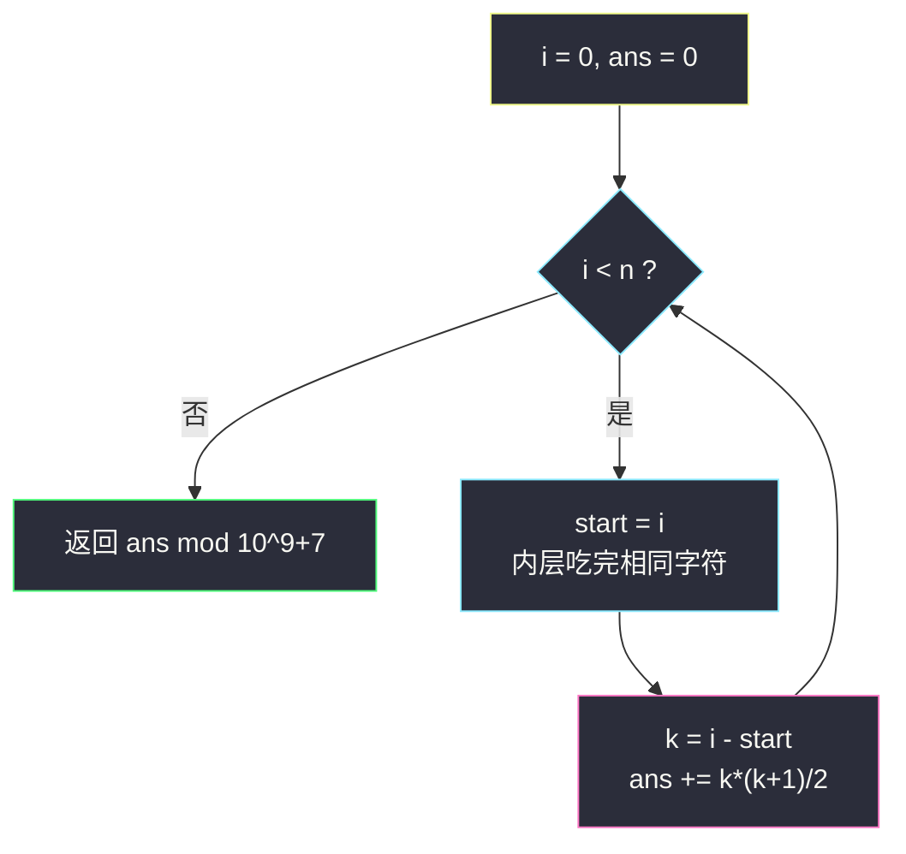
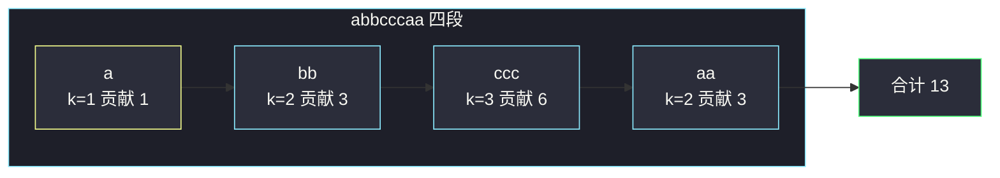

# 统计同质子字符串的数目（分组循环 · 连续段贡献公式）

## 一、问题描述

给你一个字符串 `s`，返回 `s` 中**同质子字符串**的数目。答案可能很大，对 `10^9 + 7` 取模。

**同质**：串里每一个字符都相同。子字符串必须连续。

> 🔗 LeetCode 1759：https://leetcode.cn/problems/count-number-of-homogenous-substrings/
>
> 数据范围：`1 <= s.length <= 10^5`，`s` 只含小写字母。

**示例 1**

```
输入：s = "abbcccaa"
输出：13
解释：
"a" × 3，"aa" × 1
"b" × 2，"bb" × 1
"c" × 3，"cc" × 2，"ccc" × 1
3+1+2+1+3+2+1 = 13
```

**示例 2**

```
输入：s = "xy"
输出：2
解释：只有单字符 "x"、"y"。

输入：s = "zzzzz"
输出：15
解释：长度为 5 的全 z 段，子串数 = 5×6/2 = 15。
```

**直观理解**

跨了两种不同字符的子串（如 `"ab"`、`"bcc"`）一定不是同质的。所以同质子串**全部藏在「连续相同字符」的段里**：`"abbcccaa"` 切成 `a | bb | ccc | aa`，每段独立计数，再加起来。本题是灵神题单 **六、分组循环** 的典型公式题：外层 `while i < n`，内层把同一段吃完，用段长 `k` 套 `k(k+1)/2`。

---

## 二、暴力解法

枚举每一个起点 `i`，向右扩张终点 `j`，一旦出现与 `s[i]` 不同的字符就停——更右边不可能再同质。

```python
class Solution:
    def countHomogenous(self, s: str) -> int:
        MOD = 10**9 + 7
        n, ans = len(s), 0
        for i in range(n):
            for j in range(i, n):
                if s[j] != s[i]:
                    break
                ans += 1
        return ans % MOD
```

正确：每个同质子串恰好被它的起点统计一次。

### 复杂度

- **时间**：`O(n^2)`。最坏全相同（`"zzzzz..."`）内层走满，`n = 10^5` 必超时。
- **空间**：`O(1)`。

### 🔴 瓶颈在哪里

内层是在**逐个**数子串。一段长度为 `k` 的全同字符，子串个数其实有闭式：任意 `l, r`（`0 ≤ l ≤ r < k`）都合法，共 `k(k+1)/2` 个。把「数」换成「算」，每段 `O(1)`，整串一遍扫描即可。

---

## 三、优化探索（核心章节）

> 📚 本题在灵茶题单中属于 **六、分组循环**。模板：外层 `while i < n` 定位段首，内层把「同一段」吃到头，再对 `[start, i)` 做 `O(1)` 结算。同族还有「全 0 子数组」「仅含 1 的子串」——贡献公式几乎一字不差。

### 3.1 观察特征

| 特征 | 说明 |
|------|------|
| 同质 ⇒ 不能跨段 | 不同字符是天然边界 |
| 段内任意子串都同质 | 段长 `k` 贡献 `k(k+1)/2` |
| 段与段可独立 | 答案 = 各段贡献之和 |

### 3.2 段长公式

长度为 `k` 的段 `"ccccc"`（`k = 5`）：

- 长 1：5 个，长 2：4 个，…，长 `k`：1 个
- 合计 `k + (k-1) + ... + 1 = k(k+1)/2`

对拍直觉：`"aa"` → 3（`"a"`、`"a"`、`"aa"`）；`"aaa"` → 6。与枚举一致。

### 3.3 分组循环骨架

```text
i = 0
while i < n:
    start = i
    i += 1
    while i < n and s[i] == s[start]:   # 把本段吃完
        i += 1
    k = i - start
    ans += k * (k + 1) / 2
```

每个下标恰好进内层一次，总时间 `O(n)`。



### 3.4 等价视角：扫到每个位置累加

扫到下标 `j` 时，若当前连续段已经有 `cnt` 个相同字符，则**以 `j` 为右端**的同质子串恰好 `cnt` 个（左端可以是段内任意位置）。于是 `ans += cnt`，最后取模。这与「每段结束时加 `k(k+1)/2`」代数恒等：`1+2+...+k = k(k+1)/2`。分组循环把这段加法一次性算完。

### 3.5 一句话核心

> **按字符切成连续段，每段长 `k` 贡献 `k(k+1)/2`，再对 `10^9+7` 取模。**

---

## 四、代码实现

### Python（主解：分组循环）

```python
class Solution:
    def countHomogenous(self, s: str) -> int:
        MOD = 10**9 + 7
        n, ans, i = len(s), 0, 0
        while i < n:
            start = i
            i += 1
            while i < n and s[i] == s[start]:  # 吃完本段
                i += 1
            k = i - start
            ans = (ans + k * (k + 1) // 2) % MOD
        return ans
```

**变量含义**

| 变量 | 含义 |
|------|------|
| `start` | 本段第一个下标 |
| `i` | 内层结束后指向**下一段段首**（或 `n`） |
| `k` | 本段长度 `i - start` |
| `ans` | 已结算段的同质子串数（已取模） |

**循环不变式**：每次外层开始时，`s[0..i)` 的同质子串已全部计入 `ans`；`i` 要么是 0，要么是一段新字符的起点。

**逐位累加写法（等价，不必分组）**

```python
class Solution:
    def countHomogenous(self, s: str) -> int:
        MOD, ans, cnt = 10**9 + 7, 0, 0
        for i, c in enumerate(s):
            cnt = cnt + 1 if i > 0 and c == s[i - 1] else 1
            ans = (ans + cnt) % MOD
        return ans
```

### Java（分组循环）

```java
class Solution {
    public int countHomogenous(String s) {
        final int MOD = 1_000_000_007;
        int n = s.length(), ans = 0, i = 0;
        while (i < n) {
            int start = i;
            i++;
            while (i < n && s.charAt(i) == s.charAt(start)) i++;
            long k = i - start;                       // k*(k+1)/2 可能超 int
            ans = (int) ((ans + k * (k + 1) / 2) % MOD);
        }
        return ans;
    }
}
```

`k` 最大 `10^5`，`k(k+1)/2` 约 `5×10^9`，Java 必须用 `long` 再取模。

---

## 五、具体例子演示

以 `s = "abbcccaa"` 走主解。下标 `0..7`，字符 `a b b c c c a a`。

| 段 | start | 内层停在 i | 段内容 | k | 贡献 `k(k+1)/2` | ans |
|----|-------|------------|--------|---|-----------------|-----|
| 1 | 0 | 1 | `a` | 1 | 1 | 1 |
| 2 | 1 | 3 | `bb` | 2 | 3 | 4 |
| 3 | 3 | 6 | `ccc` | 3 | 6 | 10 |
| 4 | 6 | 8 | `aa` | 2 | 3 | 13 |

`i = 8 = n`，返回 **13** ✓。与示例拆分一致：`1 + (2+1) + (3+2+1) + (2+1) = 13`。

**同一例子用逐位 `ans += cnt` 对拍**（`cnt` = 当前段已扫长度 = 以当前位置为右端的同质子串数）：

| j | 字符 | 与上一个相同？ | cnt | 本步加入 | 累计 |
|---|------|----------------|-----|----------|------|
| 0 | a | 段首 | 1 | 1 | 1 |
| 1 | b | 否 | 1 | 1 | 2 |
| 2 | b | 是 | 2 | 2 | 4 |
| 3 | c | 否 | 1 | 1 | 5 |
| 4 | c | 是 | 2 | 2 | 7 |
| 5 | c | 是 | 3 | 3 | 10 |
| 6 | a | 否 | 1 | 1 | 11 |
| 7 | a | 是 | 2 | 2 | 13 |

每段结束时累计增量正好是 `1+2+...+k`，与分组公式相同。

**全同串 `s = "zzzzz"`**：一整段 `k = 5`，贡献 `15`，一次结算结束。

**两段边界 `s = "xy"`**：两段各 `k = 1`，`1+1 = 2`。



---

## 六、复杂度分析

| 方法 | 时间 | 空间 | 说明 |
|------|------|------|------|
| 枚举起点扩张 | `O(n^2)` | `O(1)` | `n = 10^5` 超时 |
| 分组循环 + 公式（主解） | `O(n)` | `O(1)` | 每下标访问常数次 |
| 逐位 `ans += cnt` | `O(n)` | `O(1)` | 与主解同阶，写法更短 |

---

## 七、对比总结

| 维度 | 本题 | #1513 仅含 1 | #2348 全 0 子数组 |
|------|------|----------------|-------------------|
| 分组键 | 连续相同字符 | 连续 `'1'` | 连续 `0` |
| 贡献 | `k(k+1)/2` | 同左（只数 1 段） | 同左（只数 0 段） |
| 取模 | 要 | 要 | 要（返回 long） |

**易错点**

1. **漏取模**：`n = 10^5` 全相同，答案约 `5×10^9`，超过 `int`，也超过 `10^9+7`，必须模。
2. **Java 乘法溢出**：先把 `k` 提成 `long` 再算 `k*(k+1)/2`。
3. **内层比较写错**：应与**段首**（或 `s[i-1]`）比，不要和「上一段」比。
4. **空段**：`s` 非空，不会出现 `k = 0`；单字符 `k = 1` 贡献 1，别特判丢了。
5. **不要 DP 子串表**：`dp[i][j]` 是 `O(n^2)` 空间，完全没必要。

**模板（分组循环吃同值段，Python）**

```python
i, n = 0, len(s)
while i < n:
    start = i
    i += 1
    while i < n and s[i] == s[start]:
        i += 1
    k = i - start
    # 对本段 O(1) 结算
```

---

## 八、举一反三

| 题目 | 关系 |
|------|------|
| [1513. 仅含 1 的子串数](https://leetcode.cn/problems/number-of-substrings-with-only-1s/) | 只对 `'1'` 段套同一公式 |
| [2348. 全 0 子数组的数目](https://leetcode.cn/problems/number-of-zero-filled-subarrays/) | 只对 `0` 段套同一公式 |
| [1446. 连续字符](https://leetcode.cn/problems/consecutive-characters/) | 分组后取 `max(k)`，不计组合数 |
| [830. 较大分组的位置](https://leetcode.cn/problems/positions-of-large-groups/) | 分组后筛 `k >= 3` 的闭区间 |
| [2110. 股票平滑下跌阶段的数目](https://leetcode.cn/problems/number-of-smooth-descent-periods-of-a-stock/) | 分组键改成「相邻差恰好为 1」 |
| [2982. 找出出现至少三次的最长特殊子字符串 II](https://leetcode.cn/problems/find-longest-special-substring-that-occurs-thrice-ii/) | 先分组收集段长，再在长度上二分 |

**思想迁移**

- 子串必须「整段同质」时，先切段再闭式计数，不要枚举所有 `[l, r]`。
- 看到「连续相同 / 连续满足某局部条件」，优先写分组循环：外层找段首，内层吃到条件破裂。
- 口诀：**「同质不跨界，段长套三角数；外层开新段，内层一次吃到头。」**
