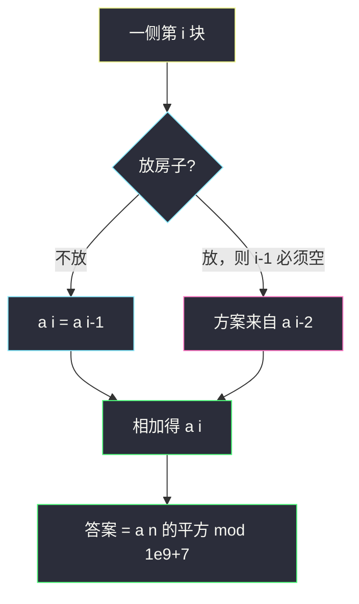
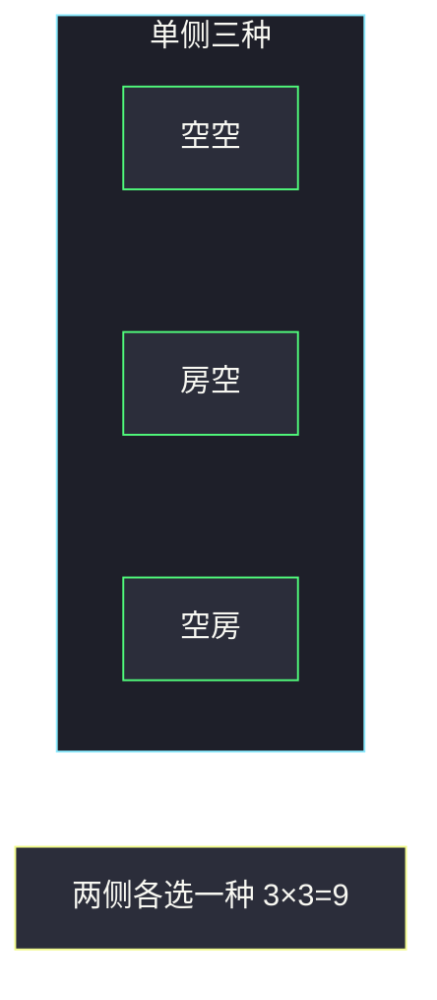

# 统计放置房子的方式数（打家劫舍计数 · 两侧平方）

## 一、问题描述

一条街两侧各有 `n` 块地。**同一侧**相邻两块不能都放房子；**对侧**互不影响（同一编号的左右两块可以同时放）。求放置方案数，模 `10^9+7`。空着也算一种方案。

> 🔗 LeetCode 2320：https://leetcode.cn/problems/count-number-of-ways-to-place-houses/
>
> 数据范围：`1 ≤ n ≤ 10^4`。
>
> 📚 灵茶题单：**§1.2 打家劫舍**。单侧就是「相邻不能偷」的计数版；两侧独立，答案是单侧方案数的平方。

方法名 `countHousePlacements`。

**示例 1**

```
输入：n = 1
输出：4
解释：空；只左；只右；左右都放。共 4 种。
```

**示例 2**

```
输入：n = 2
输出：9
解释：单侧 3 种（空空、房空、空房），两侧 3×3=9。不能同侧两房相邻。
```

**直观理解**

先忘掉对侧。一侧 `n` 块地，每块放或不放，不能有两个 1 相邻——和打家劫舍能偷的「安排种数」一样，只是本题求的是方案数不是最大金额。算出一侧 `f(n)`（含全空），另一侧同样是 `f(n)`，相乘取模。

---

## 二、暴力解法

一侧用 DFS 枚举放/不放，再平方。

```python
class Solution:
    def countHousePlacements(self, n: int) -> int:
        MOD = 10**9 + 7

        def dfs(i: int, prev_put: bool) -> int:
            if i == n:
                return 1
            ans = dfs(i + 1, False)  # 这里不放
            if not prev_put:
                ans += dfs(i + 1, True)  # 可以放
            return ans

        one = dfs(0, False)
        return (one * one) % MOD
```

两例都能对拍。`n=10^4` 时指数爆炸。

### 🔴 瓶颈在哪里

`dfs(i, prev)` 只有 `2n` 个状态，线性 DP 就能数完。转移和斐波那契相同。

---

## 三、优化探索（核心章节）

> 📚 灵茶 **§1.2 打家劫舍**。198 题是 `max(不偷, 偷+隔一家)`；本题把 max 换成 **相加**（两种互斥安排都算方案）。

### 3.1 单侧递推

`a[i]` = 一侧前 `i` 块地的方案数（含全空）。

- 第 `i` 块不放：前 `i-1` 块任意合法，`a[i-1]` 种。
- 第 `i` 块放：第 `i-1` 块必须空，前 `i-2` 块任意合法，`a[i-2]` 种。

所以 `a[i] = a[i-1] + a[i-2]`。

边界：

- `a[0] = 1`（0 块地，一种「什么都没有」）
- `a[1] = 2`（空，或放一所）

于是 `a[2]=3, a[3]=5, a[4]=8, …`，从 `a[1]` 起就是斐波那契：`a[n] = F_{n+2}`（`F_1=F_2=1`）。

也可以拆成两个数组：`empty[i]` = 第 `i` 块为空的方案，`fill[i]` = 第 `i` 块有房的方案。

- `empty[i] = empty[i-1] + fill[i-1]`（前一块随便）
- `fill[i] = empty[i-1]`（前一块必须空）

`a[i] = empty[i] + fill[i]`，化简后仍是同一条递推。面试时若怕边界写错，用这对变量更不容易把「放」那枝接到 `a[i-1]` 上。

和 [70. 爬楼梯](https://leetcode.cn/problems/climbing-stairs/) 的关系：爬楼梯 `f(n)=f(n-1)+f(n-2)` 是「最后一步跨 1 或跨 2」；本题「最后一块空或放（放则倒数第二必空）」结构相同，只是初值不同：爬楼梯 `f(1)=1, f(2)=2`，本题 `a(1)=2, a(2)=3`。同一条斐波那契，本题相当于 `a(n) = F_{n+2}`（`F_1=F_2=1`）。

### 3.2 两侧

对侧没有约束，配置互相独立。答案 `(a[n] * a[n]) % MOD`。

`n=1`：`2²=4`；`n=2`：`3²=9`。对拍官方。



### 3.3 不要乘 2n 或当成一条长街

若错误地把两侧连成 `2n` 块环形/线性打家劫舍，会对侧约束搞错。题面明确：对面那块可以同时放。是两条独立的链，不是一条。

### 3.4 一句话核心

> **单侧斐波那契（含空）；两侧独立，方案数平方取模。**

---

## 四、代码实现

### Python（主解）

```python
class Solution:
    def countHousePlacements(self, n: int) -> int:
        MOD = 10**9 + 7
        prev, cur = 1, 2  # a[0], a[1]
        for _ in range(2, n + 1):
            prev, cur = cur, (prev + cur) % MOD
        return (cur * cur) % MOD
```

`n=1` 时循环不跑，`cur=2`，返回 4。

**变量含义**

| 写法 | 含义 |
|------|------|
| `prev` | `a[i-2]`，给「第 i 块放房」用 |
| `cur` | `a[i-1]`，给「第 i 块不放」用 |
| `cur * cur % MOD` | 两侧独立相乘 |

空 / 放拆开写，边界更直观（与主解等价）：

```python
class Solution:
    def countHousePlacements(self, n: int) -> int:
        MOD = 10**9 + 7
        empty, fill = 1, 1  # 第 1 块：空 或 放，各 1 种
        for _ in range(2, n + 1):
            empty, fill = (empty + fill) % MOD, empty
        one = (empty + fill) % MOD
        return (one * one) % MOD
```

### Java（最优解）

```java
class Solution {
    public int countHousePlacements(int n) {
        final int MOD = 1_000_000_007;
        long prev = 1, cur = 2;
        for (int i = 2; i <= n; i++) {
            long nxt = (prev + cur) % MOD;
            prev = cur;
            cur = nxt;
        }
        return (int) (cur * cur % MOD);
    }
}
```

平方前用 `long`，否则 `int` 相乘溢出。

---

## 五、具体例子演示

### 5.1 官方示例 1：`n=1` → 4

单侧两方案：`_` 或 `H`。左右搭配：

| 左侧 | 右侧 | 合法 |
|------|------|------|
| 空 | 空 | 是 |
| 房 | 空 | 是 |
| 空 | 房 | 是 |
| 房 | 房 | 是（对侧无限制） |

共 4。对拍官方。

### 5.2 官方示例 2：`n=2` → 9

单侧三种：`__`、`H_`、`_H`。非法：`HH`。

两侧各选一种，`3×3=9`。例如左 `H_`、右 `H_` 合法（同侧不邻，对侧同列可以都是房）。左 `H_`、右 `_H` 也合法。对拍官方 9。



逐步递推核对：

| i | a[i-2] | a[i-1] | a[i] | a[i]² |
|---|--------|--------|------|-------|
| 0 | — | — | 1 | — |
| 1 | — | 1 | 2 | **4** |
| 2 | 1 | 2 | 3 | **9** |
| 3 | 2 | 3 | 5 | 25 |

`n=3` 时单侧 5 种（`___`, `H__`, `_H_`, `__H`, `H_H`），答案 25。非法的是 `HH_`、`_HH`、`HHH`：都有同侧相邻。

把 5 种单侧方案和另一侧任意搭配，例如左 `H_H`、右 `H_H`：左右两列都「对放」，完全合法——约束从不穿过马路。

### 5.3 和「一排 2n 块」的差别

有人会把街「拉直」成 2n 块再打家劫舍。那样会把「马路对面」误判成相邻。题面的相邻只沿同一侧的编号 1..n。编号相同的左右两块中间是马路，可以同时放。

### 5.4 模数

`n` 到 `10^4`，`a[n]` 是很大的斐波那契数，必须每步 `% MOD`，最后平方再模。漏模会错，先平方再模但中间用 32 位也会溢。

---

## 六、复杂度分析

| 方法 | 时间 | 空间 | 说明 |
|------|------|------|------|
| DFS 枚举 | `O(φ^n)` | `O(n)` 栈 | 超时 |
| 滚动斐波那契（主解） | `O(n)` | `O(1)` | `n≤10^4` |

矩阵快速幂可以把单侧降到 `O(log n)`，本题 `n=10^4` 没必要。若改成 `n=10^18` 才需要。

滚动两个变量时，`prev` 对应 `a[i-2]`，`cur` 对应 `a[i-1]`，下一轮 `nxt = prev+cur` 就是 `a[i]`。和打家劫舍滚动的写法一样，只是运算符从 `max` 换成了 `+`。

---

## 七、对比总结

| 维度 | 198 打家劫舍 | 本题 |
|------|-------------|------|
| 转移 | `max(skip, take)` | **`skip + take`**（计数） |
| 房子 | 一排 | **两排独立** |
| 答案 | 最大金额 | `a[n]² % MOD` |
| 全空 | 金额 0 | **算 1 种方案** |

**易错点**

1. **漏全空**：`a[1]` 必须是 2 不是 1。
2. **两侧再加「对位不能同时放」**：题面允许对放。
3. **`a[i] = a[i-1] + a[i-1]`**：放的那枝是 `a[i-2]`。
4. **平方溢出**：Java 用 `long`。
5. **模完再平方忘了再模**：`(cur % MOD) * (cur % MOD) % MOD`。
6. **`n=10^4` 还去 DFS**：必须递推。
7. **把 `a[0]` 当成 0**：0 块地有 1 种空配置，写成 0 会让 `a[2]=a[1]+a[0]` 少 1，得到 2 而不是 3，`n=2` 会输出 4 而不是 9。

---

## 八、举一反三

| 题目 | 关系 |
|------|------|
| [198. 打家劫舍](https://leetcode.cn/problems/house-robber/) | 同一转移改成 max |
| [70. 爬楼梯](https://leetcode.cn/problems/climbing-stairs/) | 同样斐波那契计数 |
| [213. 打家劫舍 II](https://leetcode.cn/problems/house-robber-ii/) | 环形一排 |
| [337. 打家劫舍 III](https://leetcode.cn/problems/house-robber-iii/) | 树形相邻 |
| [790. 多米诺和托米诺平铺](https://leetcode.cn/problems/domino-and-tromino-tiling/) | 铺砖计数 DP |
| [1411. 给 N x 3 网格图涂色的方案数](https://leetcode.cn/problems/number-of-ways-to-paint-n-x-3-grid/) | 多行染色，相邻约束 |

**思想迁移**

- 打家劫舍求金额用 max，求方案用加；独立的两排就平方。
- 口诀：**「单侧斐波那契含空；两侧互不挡，平方取模。」**
