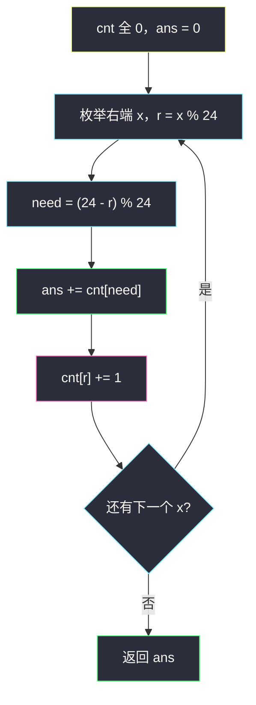
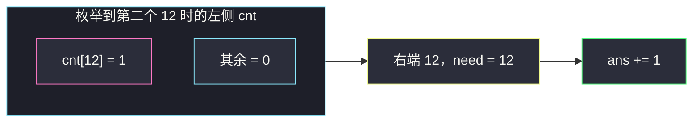

# 构成整天的下标对数目 II（枚举右，维护左）

## 一、问题描述

给你一个整数数组 `hours`，表示以小时为单位的时间，返回满足 `i < j` 且 `hours[i] + hours[j]` 构成「整天」的下标对数目。

整天 = 时长是 24 小时的整数倍（24、48、72…）。

> 🔗 LeetCode 3185：https://leetcode.cn/problems/count-pairs-that-form-a-complete-day-ii/
>
> 数据范围：`1 ≤ hours.length ≤ 5·10^5`，`1 ≤ hours[i] ≤ 10^9`。n 很大，`O(n²)` 超时。
>
> 方法名：`countCompleteDayPairs`。Python 返回 `int`；Java 返回 `long`。

**示例 1**

```
输入：hours = [12, 12, 30, 24, 24]
输出：2
解释：下标对 (0, 1)：12+12=24；(3, 4)：24+24=48。
```

**示例 2**

```
输入：hours = [72, 48, 24, 3]
输出：3
解释：(0,1) 72+48=120；(0,2) 72+24=96；(1,2) 48+24=72。都是 24 的倍数。
```

**直观理解**

两个时长加起来是 24 的倍数，只看各自除以 24 的余数：余数 `r` 必须配 `(24 - r) % 24`。从左到右枚举右边这个数，左边已经出现过的余数用长度为 24 的计数器统计。

---

## 二、暴力解法

双重循环检查每一对：

```python
class Solution:
    def countCompleteDayPairs(self, hours: List[int]) -> int:
        n, ans = len(hours), 0
        for j in range(n):
            for i in range(j):
                if (hours[i] + hours[j]) % 24 == 0:
                    ans += 1
        return ans
```

这就是 [3184. 构成整天的下标对数目 I](https://leetcode.cn/problems/count-pairs-that-form-a-complete-day-i/) 的做法：I 的 `n ≤ 100`，平方能过；本题 `n ≤ 5·10^5`，必超时。

### 复杂度

- **时间**：`O(n²)`。
- **空间**：`O(1)`。

### 🔴 瓶颈在哪里

配对只依赖余数，余数只有 24 种。不必回头扫左边每一个 `hours[i]`，数一下左边有多少个「能和当前余数凑成 0 mod 24」即可。

---

## 三、优化探索（核心章节）

> 📚 本题在灵茶题单中属于 **枚举右，维护左 · §0.1**。固定 j 为右端，答案加上左边能与 `hours[j]` 配成整天的个数，再把 j 自己计入左边。

### 3.1 余数配对

```
(hours[i] + hours[j]) % 24 == 0
⇔ (hours[i] % 24 + hours[j] % 24) % 24 == 0
```

设当前右边 `x` 的余数是 `r = x % 24`，左边需要的余数是 `need = (24 - r) % 24`：

| r | need | 说明 |
|---|------|------|
| 0 | 0 | 两个都是 24 的倍数，和仍是倍数 |
| 12 | 12 | 12+12=24 |
| 1 | 23 | 1+23=24 |
| 6 | 18 | 其它成对 |

 `% 24` 写在 `24-r` 外面：当 `r=0` 时 `24-0=24`，`24%24=0`，才能自己配自己。

### 3.2 数组 `cnt[24]`

`cnt[t]` = 当前下标左边，余数为 `t` 的元素个数。枚举到 `x` 时：

1. `ans += cnt[need]` —— 只统计 `i < j`
2. `cnt[r] += 1` —— 再把自己留给后面的右端

顺序不能反：先加计数再查询会把「自己和自己」算进去，但要求 `i < j`。



### 3.3 为何是 O(1) 空间

余数种类固定 24，`cnt` 长度恒为 24，与 n、与 `hours[i]` 的大小都无关。这和「两数之和 = target」哈希表同一骨架，只是模 24 后桶特别少。

和 #3184 对照：I 允许平方枚举，把 `(hours[i]+hours[j]) % 24 == 0` 写进双重循环即可；II 把这句翻译成「查对面那只桶」。公式相同，复杂度差在「要不要扫左边每一个人」。

自配对不要特殊分支：`need` 公式已经让 0 和 12 查到自己那一格。写 `if r==0 or r==12: ans += C(cnt[r], 2)` 反而容易和「枚举过程中的增量」搅在一起。

### 3.4 一句话核心

> **余数 r 配 (24-r)%24；枚举右端先用 cnt 累加答案，再 cnt[r]++。0 配 0，12 配 12。**

---

## 四、代码实现

### Python（主解：枚举右维护左）

```python
class Solution:
    def countCompleteDayPairs(self, hours: List[int]) -> int:
        cnt = [0] * 24
        ans = 0
        for x in hours:
            r = x % 24
            ans += cnt[(24 - r) % 24]
            cnt[r] += 1
        return ans
```

**变量含义**

| 变量 | 含义 |
|------|------|
| `r` | 当前右端 `x` 对 24 的余数 |
| `cnt[t]` | 严格在当前下标左边、余数为 t 的个数 |
| `ans` | 合法下标对数目 |

### Java（最优解同款，返回 long）

```java
class Solution {
    public long countCompleteDayPairs(int[] hours) {
        int[] cnt = new int[24];
        long ans = 0;
        for (int x : hours) {
            int r = x % 24;
            ans += cnt[(24 - r) % 24];
            cnt[r]++;
        }
        return ans;
    }
}
```

最坏全部余数相同且自配（全是 0 或全是 12），对数约 `n(n-1)/2`，可达 `1.25·10^11`，Java 必须用 `long`。

---

## 五、具体例子演示

### 5.1 `hours = [12, 12, 30, 24, 24]`

余数：`12, 12, 6, 0, 0`。12 的配对是 12，0 的配对是 0，6 的配对是 18。

| 步 | x | r | need | 查询 cnt[need] | ans | 随后 cnt |
|----|---|---|------|----------------|-----|----------|
| 1 | 12 | 12 | 12 | 0 | 0 | `cnt[12]=1` |
| 2 | 12 | 12 | 12 | 1 | **1** | `cnt[12]=2` |
| 3 | 30 | 6 | 18 | 0 | 1 | `cnt[6]=1` |
| 4 | 24 | 0 | 0 | 0 | 1 | `cnt[0]=1` |
| 5 | 24 | 0 | 0 | 1 | **2** | `cnt[0]=2` |

第 2 步加上的是下标对 `(0,1)`；第 5 步是 `(3,4)`。30 在左边找不到余 18，不贡献。



### 5.2 `hours = [72, 48, 24, 3]`

余数全是 `0, 0, 0, 3`。0 配 0，每来一个新的 0 就加上「左边已有多少个 0」。

| 步 | x | r | need | cnt[need] | ans | cnt[0] |
|----|---|---|------|-----------|-----|--------|
| 1 | 72 | 0 | 0 | 0 | 0 | 1 |
| 2 | 48 | 0 | 0 | 1 | 1 | 2 |
| 3 | 24 | 0 | 0 | 2 | 3 | 3 |
| 4 | 3 | 3 | 21 | 0 | 3 | 3 |

三个 0 两两配对 `C(3,2)=3`，最后一个 3 无伴侣。输出 3 ✓。

三个 0 两两配对 `C(3,2)=3`，最后一个 3 无伴侣。输出 3 ✓。

这就是「枚举右」的增量：左边每多一个可配余数，当前右端就多贡献那么多对，等价于组合数，但不必事后再 `n*(n-1)/2`。

若误写成先 `cnt[r]++` 再查询，第 1 个 0 就会 `ans += 1`，把自己算进去，后面每个 0 也都多 1，答案变成 6，错。

再看自配的另一档：`hours = [12, 36, 60]`，余数全是 12。逐步 `ans += 0,1,2` 得 3，即三对都是 12+12=24。`need = (24-12)%24 = 12`，和 0 一样走「自己配自己」的格子，只是桶下标不同。

### 5.3 非自配：`hours = [1, 2, 23]`

余数 1、2、23。23 的 `need = (24-23)%24 = 1`。

| 步 | x | r | need | cnt[need] | ans | 更新 |
|----|---|---|------|-----------|-----|------|
| 1 | 1 | 1 | 23 | 0 | 0 | `cnt[1]=1` |
| 2 | 2 | 2 | 22 | 0 | 0 | `cnt[2]=1` |
| 3 | 23 | 23 | 1 | 1 | **1** | `cnt[23]=1` |

只有 `(0,2)`：1+23=24。2 找不到 22，不贡献。这和对拍暴力双重循环一致。

---

## 六、复杂度分析

| 方法 | 时间 | 空间 | 说明 |
|------|------|------|------|
| 双重循环（I 能过） | `O(n²)` | `O(1)` | II 超时 |
| 枚举右维护左（主解） | `O(n)` | `O(1)` | `cnt` 长度 24 |

---

## 七、对比总结

| 维度 | #3184 暴力 | #3185 计数 |
|------|------------|------------|
| n | ≤ 100 | ≤ 5·10^5 |
| 配对 | 真的做加法再 `% 24` | 余数桶 `cnt[(24-r)%24]` |
| 顺序 | 两层下标 | 先查后加，保证 `i < j` |
| 0 与 12 | 加法后取模自然对 | 公式 `(24-r)%24` 自动指向自己 |

枚举到某个 `x` 时，`cnt` 里装的全是下标更小的元素，因此每一对 `(i,j)` 恰好在 `j` 被枚举到的那一拍计入一次，不会漏、不会双计。

**易错点**

1. **`need = 24 - r` 忘了再 `% 24`**：`r=0` 时变成 24，数组越界；即便不越界也对不上 `cnt[0]`。
2. **先 `cnt[r]++` 再查询**：自配对（0 与 0、12 与 12）会多算「自己和自己」。
3. **Java 用 `int` 累加 ans**：对数可超过 2^31-1。
4. **当成「和恰好 24」**：48、72 也是整天，必须用模而不是 `== 24`。
5. **哈希表按原值计数**：`hours[i]` 达 `10^9`，必须先 `% 24`。

**模板（§0.1 枚举右维护左，模意义两数之和）**

```python
cnt = [0] * m
for x in nums:
    r = x % m
    ans += cnt[(m - r) % m]
    cnt[r] += 1
```

整天问题里 `m = 24`。

---

## 八、举一反三

| 题目 | 关系 |
|------|------|
| [3184. 构成整天的下标对数目 I](https://leetcode.cn/problems/count-pairs-that-form-a-complete-day-i/) | 同一题意，n≤100，暴力对照 |
| [1. 两数之和](https://leetcode.cn/problems/two-sum/) | §0.1 原型：查 `target-x` 再插入 |
| [1679. K 和数对的最大数目](https://leetcode.cn/problems/max-number-of-k-sum-pairs/) | 配对后要从 cnt 里减掉，贪心次数 |
| [1512. 好数对的数目](https://leetcode.cn/problems/number-of-good-pairs/) | 枚举右，左边相同值的 cnt |
| [1010. 总持续时间可被 60 整除的歌曲](https://leetcode.cn/problems/pairs-of-songs-with-total-durations-divisible-by-60/) | 把 24 换成 60，代码几乎一样 |
| [1497. 检查数组对是否可以被 k 整除](https://leetcode.cn/problems/check-if-array-pairs-are-divisible-by-k/) | 余数配对，但是否能两两用完 |

**思想迁移**

- 见到「无序下标对、条件只依赖两个元素的某种和/差」，固定右端，左边用频率表 `O(1)` 查。
- 模 `m` 的「和为倍数」与「两数之和 = m」是同一张表：对角线上 `0` 与 `m/2`（当 m 为偶数）是自配对。
- 口诀：**「先问左边有多少个能配上的余数，再把自己的余数放进桶；0 和 12 是自己配自己。」**
