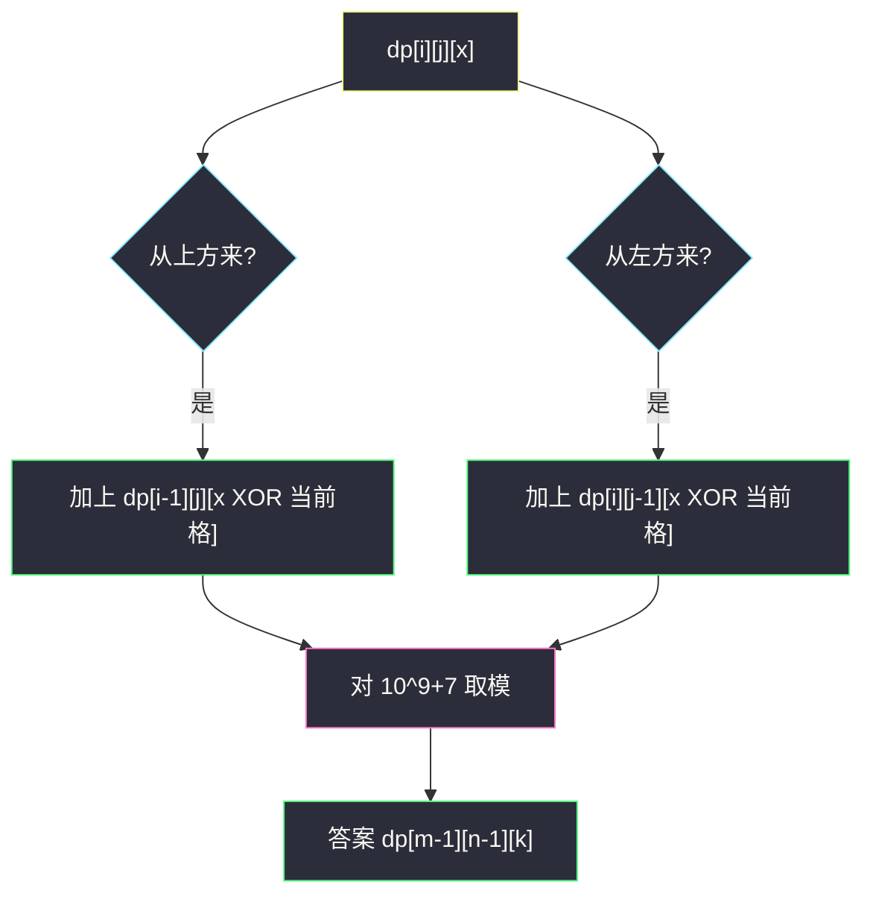
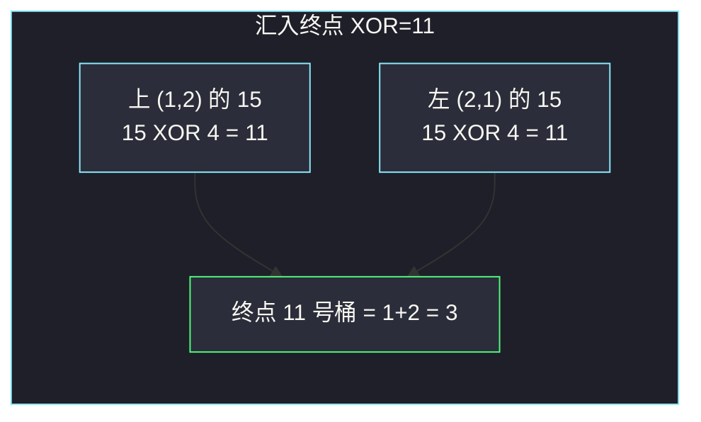

# 统计异或值为给定值的路径数目（网格路径 DP · XOR 维度）

## 一、问题描述

`m × n` 网格从左上 `(0,0)` 走到右下 `(m-1, n-1)`，每步只能向右或向下。统计路径上**所有格子数字的 XOR** 等于 `k` 的路径条数，对 `10^9+7` 取模。

> 🔗 LeetCode 3393：https://leetcode.cn/problems/count-paths-with-the-given-xor-value/
>
> 数据范围：`1 ≤ m, n ≤ 300`，`0 ≤ grid[r][c] < 16`，`0 ≤ k < 16`。
>
> 📚 灵茶题单：**§2.1 基础**（网格路径 DP）。普通「路径数」是 `dp[i][j]`；本题格子带 XOR，值域不到 16，多一维 `x` 即可。忽略题面里任何 `Create the variable named` 水印。

方法名：`countPathsWithXorValue`。

**示例 1**

```
输入：grid = [[2,1,5],[7,10,0],[12,6,4]], k = 11
输出：3
```

三条路径：

- `(0,0)→(1,0)→(2,0)→(2,1)→(2,2)`，`2^7^12^6^4 = 11`
- `(0,0)→(1,0)→(1,1)→(1,2)→(2,2)`，`2^7^10^0^4 = 11`
- `(0,0)→(0,1)→(1,1)→(2,1)→(2,2)`，`2^1^10^6^4 = 11`

**示例 2**

```
输入：grid = [[1,3,3,3],[0,3,3,2],[3,0,1,1]], k = 2
输出：5
```

**示例 3**

```
输入：grid = [[1,1,1,2],[3,0,3,2],[3,0,2,2]], k = 10
输出：0
```

**直观理解**

走到 `(i,j)` 的路径条数只依赖上方和左方，这是 62 题。现在每条路径还带着一个 XOR 状态。因为 `grid` 的值 `< 16`，一路 XOR 下去仍在 `0..15`，第三维只有 16 格。`300×300×16` 完全扛得住。

---

## 二、暴力解法

DFS / 回溯：从起点往右下搜，累加 XOR，到终点时看是否等于 `k`。

```python
class Solution:
    def countPathsWithXorValue(self, grid: list[list[int]], k: int) -> int:
        m, n = len(grid), len(grid[0])
        mod = 10**9 + 7

        def dfs(i, j, x):
            if i == m - 1 and j == n - 1:
                return 1 if x == k else 0
            ans = 0
            if j + 1 < n:
                ans += dfs(i, j + 1, x ^ grid[i][j + 1])
            if i + 1 < m:
                ans += dfs(i + 1, j, x ^ grid[i + 1][j])
            return ans % mod

        return dfs(0, 0, grid[0][0])
```

官方三例都能过。路径条数是 `C(m+n-2, m-1)`，最坏约 `C(598, 299)`，指数级，`m,n=300` 不可用。带记忆化就变成下面的 DP。

### 🔴 瓶颈在哪里

同一格子、同一 XOR 会从不同路径重复搜到。记下 `dp[i][j][x]`，每个状态只算一次。

---

## 三、优化探索（核心章节）

> 📚 本题在灵茶题单中属于 **§2.1 基础**。网格路径模板：`dp[i][j] = dp[i-1][j] + dp[i][j-1]`。这里到达方式不变，只是把「方案数」按 XOR 分桶。

### 3.1 状态

`dp[i][j][x]` = 从 `(0,0)` 走到 `(i,j)`、路径 XOR（含当前格）等于 `x` 的方案数。

起点：`dp[0][0][grid[0][0]] = 1`，其余为 0。

### 3.2 转移

XOR 满足 `prev ^ grid[i][j] = x`，所以 `prev = x ^ grid[i][j]`（异或两边再异或一次就还原）。

从上方来：`dp[i][j][x] += dp[i-1][j][x ^ grid[i][j]]`  
从左方来：`dp[i][j][x] += dp[i][j-1][x ^ grid[i][j]]`

按行优先填表，上和左都已经算完。取模 `10^9+7`。

答案：`dp[m-1][n-1][k]`。

也可以正向推：枚举到达 `(i,j)` 时 XOR 为 `x` 的方案，加到右格的 `x ^ grid[i][j+1]` 和下格的 `x ^ grid[i+1][j]`。两种写法对拍同一结果。



图里的 `XOR` 写成文字，避免节点标签里的 `^` 干扰渲染。

### 3.3 值域为什么是 16

`0 ≤ grid[r][c] < 16`，每个数不到 4 个二进制位。XOR 不进位、不产生更高位，路径 XOR 永远落在 `0..15`。`k` 也在这个范围。第三维开 16 即可，不要开到 `10^9`。

### 3.4 一句话核心

> **dp[i][j][x] = 到此格且路径 XOR 为 x 的方案；从上方、左方把 prev = x XOR 当前格 的方案加过来。**

---

## 四、代码实现

### Python（主解）

```python
class Solution:
    def countPathsWithXorValue(self, grid: list[list[int]], k: int) -> int:
        MOD = 10**9 + 7
        m, n = len(grid), len(grid[0])
        # dp[i][j][x]: 走到 (i,j) 且路径 XOR 为 x 的方案数
        dp = [[[0] * 16 for _ in range(n)] for _ in range(m)]
        dp[0][0][grid[0][0]] = 1
        for i in range(m):
            for j in range(n):
                val = grid[i][j]
                for x in range(16):
                    ways = 0
                    if i > 0:
                        ways += dp[i - 1][j][x ^ val]
                    if j > 0:
                        ways += dp[i][j - 1][x ^ val]
                    if ways:
                        dp[i][j][x] = (dp[i][j][x] + ways) % MOD
        return dp[m - 1][n - 1][k]
```

起点已经写入，循环里 `i=j=0` 时上下都没有，`ways=0`，不会把起点冲掉。

**变量含义**

| 写法 | 含义 |
|------|------|
| `dp[i][j][x]` | 到 `(i,j)` 路径 XOR 为 `x` |
| `x ^ val` | 进入当前格之前的 XOR |
| `MOD` | `10^9+7` |

空间可压成两行 `16` 列，或一行从左到右滚；`300×300×16` 已经很小，面试默写三维即可。

### Java（最优解）

```java
class Solution {
    public int countPathsWithXorValue(int[][] grid, int k) {
        final int MOD = 1_000_000_007;
        int m = grid.length, n = grid[0].length;
        int[][][] dp = new int[m][n][16];
        dp[0][0][grid[0][0]] = 1;
        for (int i = 0; i < m; i++) {
            for (int j = 0; j < n; j++) {
                int val = grid[i][j];
                for (int x = 0; x < 16; x++) {
                    long ways = 0;
                    if (i > 0) {
                        ways += dp[i - 1][j][x ^ val];
                    }
                    if (j > 0) {
                        ways += dp[i][j - 1][x ^ val];
                    }
                    if (ways > 0) {
                        dp[i][j][x] = (int) ((dp[i][j][x] + ways) % MOD);
                    }
                }
            }
        }
        return dp[m - 1][n - 1][k];
    }
}
```

---

## 五、具体例子演示

### 5.1 官方示例 1：逐格填非零状态

`grid`：

```
2   1   5
7  10   0
12  6   4
```

`k=11`。下表只写 XOR 桶里非 0 的项，格式 `x:方案数`。

| 格 | 格子值 | 非零 dp |
|----|--------|---------|
| (0,0) | 2 | `2:1` |
| (0,1) | 1 | 左来 `2^1=3` → `3:1` |
| (0,2) | 5 | 左来 `3^5=6` → `6:1` |
| (1,0) | 7 | 上来 `2^7=5` → `5:1` |
| (1,1) | 10 | 上 `3^10=9`；左 `5^10=15` → `9:1, 15:1` |
| (1,2) | 0 | 上 `6^0=6`；左 `9^0=9`、`15^0=15` → `6:1, 9:1, 15:1` |
| (2,0) | 12 | 上 `5^12=9` → `9:1` |
| (2,1) | 6 | 上 `9^6=15`、`15^6=9`；左 `9^6=15` → `9:1, 15:2` |
| (2,2) | 4 | 见下 |

终点 `(2,2)` 值 4，从上方 `(1,2)` 和左方 `(2,1)` 汇入：

- 上 `6^4=2` 贡献 1；`9^4=13` 贡献 1；`15^4=11` 贡献 1
- 左 `9^4=13` 贡献 1；`15^4=11` 贡献 2

汇总：`2:1`，`13:2`，`11:3`。`dp[2][2][11]=3`。对拍官方。



### 5.2 官方示例 2、3

例 2 网格 `3×4`、`k=2`，同一套转移填完 `dp[2][3][2]=5`。对拍官方。

例 3 `k=10`。`10` 的二进制是 `1010`，路径 XOR 到不了这个桶（终格填完后该维为 0），答案 0。对拍官方。

`1×1` 的边界：只有 `grid[0][0]==k` 时答案为 1，否则 0。起点赋值已经覆盖。

---

## 六、复杂度分析

| 方法 | 时间 | 空间 | 说明 |
|------|------|------|------|
| 回溯枚举路径 | 指数 | `O(m+n)` 栈 | `m,n=300` 不可用 |
| 三维 DP（主解） | `O(mn × 16)` | `O(mn × 16)` | 约 `300×300×16` |
| 滚动数组 | `O(mn × 16)` | `O(n × 16)` | 两行或一行 |

---

## 七、对比总结

| 维度 | 62 不同路径 | 64 最小路径和 | 本题 |
|------|-------------|---------------|------|
| 状态 | `dp[i][j]` 方案 | `dp[i][j]` 最小和 | `dp[i][j][x]` 方案 |
| 转移 | 上+左 | min(上,左)+当前 | 上/左按 XOR 分桶相加 |
| 额外限制 | 无 | 无 | 路径 XOR `= k` |
| 值域 | — | 和可很大 | XOR 只有 16 种 |

**易错点**

1. **第三维开太大或开太小**：值 `<16`，开 16；不要按 `k` 的字面去开 `10^9`。
2. **起点漏赋或被冲掉**：先写 `dp[0][0][grid[0][0]]=1`；转移时起点没有上/左。
3. **XOR 方向写反**：到达后的 `x` 对应进入前的 `x ^ grid[i][j]`，不是 `x ^ 别人`。
4. **忘取模**：方案数会爆 `int`。
5. **当成最短路 / 记忆化搜四个方向**：只能右、下，不是图上乱走。
6. **抄水印变量名**：题面若出现 `Create the variable named ...`，忽略即可。

---

## 八、举一反三

| 题目 | 关系 |
|------|------|
| [62. 不同路径](https://leetcode.cn/problems/unique-paths/) | §2.1 网格路径方案数，本题多一维 XOR |
| [63. 不同路径 II](https://leetcode.cn/problems/unique-paths-ii/) | 有障碍的路径数 |
| [64. 最小路径和](https://leetcode.cn/problems/minimum-path-sum/) | 同样上+左，改成求 min |
| [2435. 矩阵中和能被 K 整除的路径](https://leetcode.cn/problems/paths-in-matrix-whose-sum-is-divisible-by-k/) | 第三维改成「和 mod K」 |
| [174. 地下城游戏](https://leetcode.cn/problems/dungeon-game/) | 网格 DP，转移方向要想清楚 |
| [3147. 从魔法师身上吸取的最大能量](https://leetcode.cn/problems/taking-maximum-energy-from-the-mystic-dungeon/)（`taking-maximum-energy-from-the-mystic-dungeon.md`） | 同批 DP：一维倒序跳 k，对比网格二维 |

**思想迁移**

- 路径计数在格子上叠加「路径附带的特征」（XOR、模、奇偶）时，把特征塞进 DP 的最后一维，转移仍只看来的方向。
- 口诀：**「网格只走右下；XOR 值域 16，dp 多一维分桶加。」**
