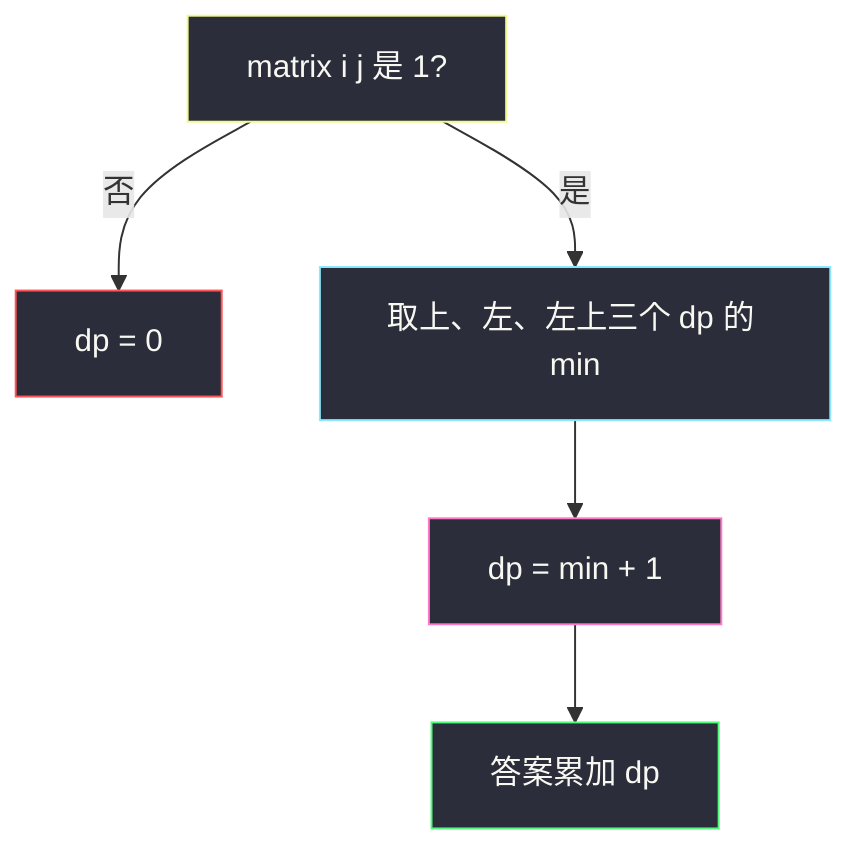
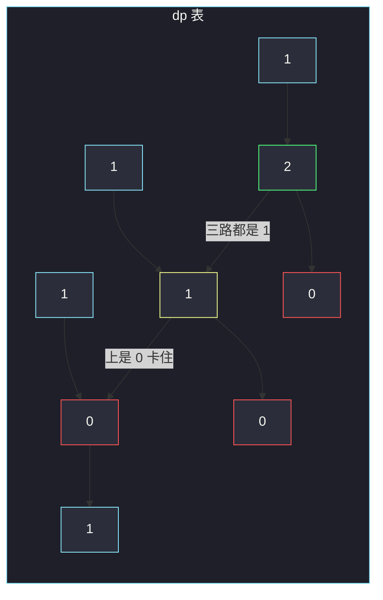

# 统计全为 1 的正方形子矩阵（以右下角为状态的 DP）

## 一、问题描述

给你一个 `m × n` 的 0-1 矩阵 `matrix`，请统计有多少个**正方形**子矩阵，其元素全部为 1。边长 1 的单个 `1` 也算。

> 🔗 LeetCode 1277：https://leetcode.cn/problems/count-square-submatrices-with-all-ones/
>
> 数据范围：`1 <= m, n <= 300`，`matrix[i][j]` 为 0 或 1。
>
> 📚 灵茶题单：**单调栈 · 二、矩形**。本题用直方图 DP（正方形版）：`dp[i][j]` = 以 `(i,j)` 为右下角的最大正方形边长；答案是所有 `dp` 之和。矩形计数见 1504，最大矩形见 [85](https://leetcode.cn/problems/maximal-rectangle/)。

**示例 1**

```
输入：
matrix =
[[0,1,1,1],
 [1,1,1,1],
 [0,1,1,1]]
输出：15
解释：边长 1 的正方形 10 个，边长 2 的 4 个，边长 3 的 1 个。
```

**示例 2**

```
输入：
matrix =
[[1,0,1],
 [1,1,0],
 [1,1,0]]
输出：7
解释：6 个边长 1，加上以 (2,1) 为右下角的 1 个边长 2。
```

**直观理解**

任意一个全 1 正方形，都有唯一的右下角。若最大能延伸的边长是 `k`，那么以这个格子为右下角、边长为 `1,2,…,k` 的正方形各有一个，正好贡献 `k` 到答案。所以不必枚举边长，只要求每个格子当右下角时能撑多大，然后把这些边长加起来。

---

## 二、暴力解法

枚举右下角 `(i,j)` 和边长 `k`，检查以它为右下角的 `k×k` 是否全 1。检查要看 `k²` 个格子，总时间大约 `O(m n · min(m,n)³)`，`300⁴` 量级超时。

用「前缀和快速判断全 1」能把检查降到 `O(1)`，仍要枚举 `O(m n min(m,n))` 个正方形，`300³ = 2.7·10^7` 勉强，但转移还能再降一维。

```python
class Solution:
    def countSquares(self, matrix: List[List[int]]) -> int:
        m, n = len(matrix), len(matrix[0])
        ans = 0
        for i in range(m):
            for j in range(n):
                if matrix[i][j] == 0:
                    continue
                for k in range(1, min(i, j) + 2):
                    ok = True
                    for x in range(i - k + 1, i + 1):
                        for y in range(j - k + 1, j + 1):
                            if matrix[x][y] == 0:
                                ok = False
                                break
                        if not ok:
                            break
                    if ok:
                        ans += 1
                    else:
                        break
        return ans
```

### 复杂度

- **时间**：最坏 `O(m n · L³)`，`L=min(m,n)`，超时。
- **空间**：`O(1)`。

### 🔴 瓶颈在哪里

边长为 `k` 的正方形，其上方、左方、左上三个边长 `k-1` 的正方形必须都合法。这三个量正是三个邻居格子的 `dp`。取 min 再加 1，每个格子 `O(1)` 转移。

---

## 三、优化探索（核心章节）

> 📚 对齐灵神 **二、矩形**。正方形比矩形简单：边长一个数就能描述。矩形要分别管高和宽，常用每层直方图 + 单调栈（84 / 85 / 1504）。本题只数正方形，DP 即可。

### 3.1 状态

`dp[i][j]` = 以格子 `(i,j)` 为**右下角**的、全 1 正方形的**最大边长**。

若 `matrix[i][j] == 0`，则 `dp[i][j] = 0`。

### 3.2 转移

若 `matrix[i][j] == 1`：

`dp[i][j] = min(dp[i-1][j], dp[i][j-1], dp[i-1][j-1]) + 1`

第一行、第一列没有三个邻居，`dp[i][j] = matrix[i][j]`（0 或 1）。

为什么是三者取 min：要构成边长 `k`，需要

- 正上那个格子能撑出 `k-1`（覆盖左边 `k-1` 列、上面 `k-1` 行的正方形）；
- 正左同理；
- 左上同理。

三者里最矮的那条边卡住 `k-1`。再把当前格子这个 `1` 补上，边长加一。缺任意一块，大正方形会在那一角破洞。



### 3.3 答案为什么是 Σ dp

以 `(i,j)` 为右下角、边长恰好为 `t` 的正方形（`1 ≤ t ≤ dp[i][j]`）各有且仅有一个。所以这个格子贡献 `dp[i][j]` 个正方形。全部格子加起来就是矩阵里正方形总数。

对比 [221. 最大正方形](https://leetcode.cn/problems/maximal-square/)：转移一模一样，那边取全局 `max(dp)` 再平方当面积，这边把 `dp` **求和**。

### 3.4 原地

`matrix` 已经是 0/1 整数矩阵，可以直接把 `matrix[i][j]` 改写成 `dp`。依赖的是上、左、左上，按行从左到右扫时都已是新值，不会冲掉还没读的。空间 `O(1)` 额外。

### 3.5 和直方图的关系

也可以逐行把「以当前行为底的连续 1 高度」当成直方图，再数「直方图里有多少个全 1 正方形」。正方形要求宽 = 高，比 84 的「任意宽」更窄，最后仍等价于上述 `min(上,左,左上)+1`。矩形题单把本题放在 84/85 前面，当 DP 热身。

### 3.6 一句话核心

> **`dp[i][j] = min(上, 左, 左上) + 1`（当前为 1）；答案是所有 `dp` 的和。**

---

## 四、代码实现

### Python（主解：额外 dp 表，好画图）

```python
class Solution:
    def countSquares(self, matrix: List[List[int]]) -> int:
        m, n = len(matrix), len(matrix[0])
        dp = [[0] * n for _ in range(m)]
        ans = 0
        for i in range(m):
            for j in range(n):
                if matrix[i][j] == 0:
                    continue
                if i == 0 or j == 0:
                    dp[i][j] = 1
                else:
                    dp[i][j] = min(dp[i - 1][j], dp[i][j - 1], dp[i - 1][j - 1]) + 1
                ans += dp[i][j]
        return ans
```

### Python（原地）

```python
class Solution:
    def countSquares(self, matrix: List[List[int]]) -> int:
        m, n = len(matrix), len(matrix[0])
        ans = 0
        for i in range(m):
            for j in range(n):
                if matrix[i][j] == 1 and i and j:
                    matrix[i][j] = min(matrix[i - 1][j], matrix[i][j - 1], matrix[i - 1][j - 1]) + 1
                ans += matrix[i][j]
        return ans
```

第一行/列保持 0 或 1，`i and j` 为假时直接把原值加进答案。注意原地会改输入。

### Java（额外数组）

```java
class Solution {
    public int countSquares(int[][] matrix) {
        int m = matrix.length, n = matrix[0].length, ans = 0;
        int[][] dp = new int[m][n];
        for (int i = 0; i < m; i++) {
            for (int j = 0; j < n; j++) {
                if (matrix[i][j] == 0) {
                    continue;
                }
                if (i == 0 || j == 0) {
                    dp[i][j] = 1;
                } else {
                    dp[i][j] = Math.min(Math.min(dp[i - 1][j], dp[i][j - 1]),
                                        dp[i - 1][j - 1]) + 1;
                }
                ans += dp[i][j];
            }
        }
        return ans;
    }
}
```

---

## 五、具体例子演示

### 5.1 官方示例 2 —— 逐步填表

`matrix`：

```
1 0 1
1 1 0
1 1 0
```

按行扫描，写出每个格子的 `dp` 和累加。

| 格子 | matrix | 上 / 左 / 左上 | dp | ans |
|------|--------|----------------|----|-----|
| (0,0) | 1 | 边界 | 1 | 1 |
| (0,1) | 0 | | 0 | 1 |
| (0,2) | 1 | 边界 | 1 | 2 |
| (1,0) | 1 | 边界 | 1 | 3 |
| (1,1) | 1 | `0, 1, 1` → min=0 | **1** | 4 |
| (1,2) | 0 | | 0 | 4 |
| (2,0) | 1 | 边界 | 1 | 5 |
| (2,1) | 1 | `1, 1, 1` → min=1 | **2** | 7 |
| (2,2) | 0 | | 0 | 7 |

`(1,1)` 上面是 0，三个邻居 min 被 0 卡住，只能边长 1。`(2,1)` 三个邻居都是 1，边长 2：对应格子

```
1 1
1 1   ← 右下角 (2,1)
```

没有边长 3：矩阵根本没有 3 行 3 列的全 1。

填完的 `dp`：

```
1 0 1
1 1 0
1 2 0
```

和 `1+0+1+1+1+0+1+2+0 = 7`。



### 5.2 官方示例 1 —— 出现边长 3

`matrix`：

```
0 1 1 1
1 1 1 1
0 1 1 1
```

`dp`：

```
0 1 1 1
1 1 2 2
0 1 2 3
```

逐步看第二行、第三行的「扩边」：

| 格子 | 邻居 min | dp | 含义 |
|------|----------|----|------|
| (1,2) | min(上1, 左1, 左上1)=1 | 2 | 右下在第二行第三列的 2×2 |
| (1,3) | min(1,2,1)=1 | 2 | 右边那个 2×2 |
| (2,2) | min(2,1,1)=1 | 2 | 再下一行，仍被左/左上的 1 卡住 |
| (2,3) | min(2,2,2)=2 | **3** | 三个方向都能撑 2，加上自己成 3×3 |

`(2,3)` 的 3 贡献 3：边长 1、2、3 各一个。全表求和：`0+1+1+1 + 1+1+2+2 + 0+1+2+3 = 15`。面试写 `min+1` 即可，不必再转直方图。

### 5.3 全 0 与单行

`[[0,0],[0,0]]`：所有 `dp=0`，答案 0。

`[[1,1,1]]`：三个边界 1，没有「上、左上」，不能出现边长 2。答案 3。说明正方形受行、列同时限制，单行永远只有边长 1。

---

## 六、复杂度分析

| 方法 | 时间 | 空间 | 说明 |
|------|------|------|------|
| 枚举右下角+边长+检查 | `O(m n L³)` | `O(1)` | `L=min(m,n)`，超时 |
| DP（主解） | `O(m n)` | `O(m n)` | 每格常数转移 |
| 原地 DP | `O(m n)` | `O(1)` 额外 | 改写输入 |

---

## 七、对比总结

| 维度 | 暴力枚举正方形 | DP |
|------|----------------|----|
| 边长 | 显式循环 k | 藏在 `dp` 值里 |
| 检查全 1 | 每次扫 k² 格 | 三个邻居已经保证了内部 |
| 计数 | 合法就 +1 | 一次加上整个 `dp[i][j]` |

**易错点**

1. **只累加 `1` 而不是 `dp`**：那只数了边长 1，漏掉大正方形。
2. **漏左上**：只看上和左，形如「缺左上角」的缺口会误判成大正方形。
3. **第一行用了 `i-1`**：越界。边界格子最多边长 1。
4. **和 221 搞混**：221 要 `max*max` 当面积；本题要 **sum**。
5. **原地时从右往左扫**：会先改掉左上/左，依赖顺序必须从左到右、从上到下。

**模板（正方形 DP）**

```python
# matrix[i][j]==1:
#   dp[i][j] = min(上, 左, 左上) + 1
# ans += dp[i][j]
```

---

## 八、举一反三

| 题目 | 关系 |
|------|------|
| [221. 最大正方形](https://leetcode.cn/problems/maximal-square/) | 同一转移，求 `max(dp)²` |
| [84. 柱状图中最大的矩形](https://leetcode.cn/problems/largest-rectangle-in-histogram/) | 一维直方图最大矩形，单调栈存下标 |
| [85. 最大矩形](https://leetcode.cn/problems/maximal-rectangle/) | 每层当直方图套 84，矩形不是正方形 |
| [1504. 统计全 1 子矩形](https://leetcode.cn/problems/count-submatrices-with-all-ones/) | 数矩形，常用高度数组 + 单调栈 |
| [316. 去除重复字母](https://leetcode.cn/problems/remove-duplicate-letters/) | 同批单调栈另一支：字典序贪心 |

**思想迁移**

- 见到「数（或最大）全 1 正方形」，右下角 + 三个邻居取 min。见到「矩形」，改直方图 + 单调栈。
- 口诀：**「右下角边长 = min(上,左,左上)+1；答案把边长全部加起来。」**
