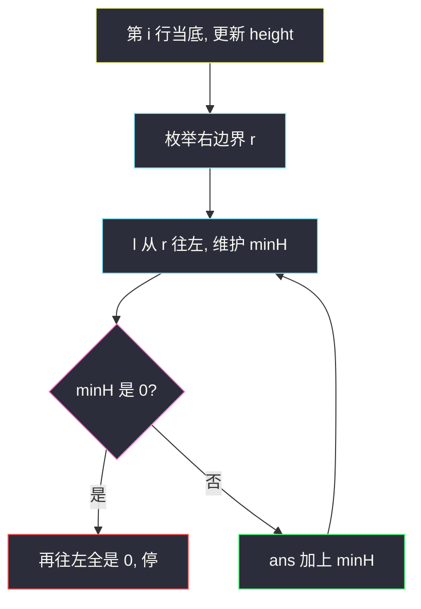
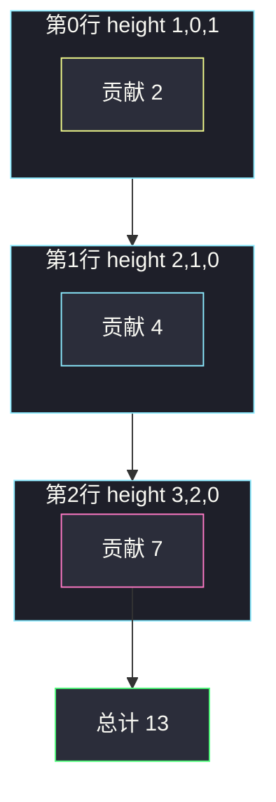

# 统计全 1 子矩形（直方图高度 + 向左取 min）

## 一、问题描述

给你一个 `m × n` 的二进制矩阵 `mat`，请返回有多少个**子矩形**的元素全部为 1。子矩形由任意两行、两列围成，内部必须全是 1。注意：本题数的是**矩形**，不只是正方形。

> 🔗 LeetCode 1504：https://leetcode.cn/problems/count-submatrices-with-all-ones/
>
> 数据范围：`1 <= m, n <= 150`，`mat[i][j]` 只含 `0` 或 `1`。`n ≤ 150` 使得 `O(n² m)` 稳过。
>
> 📚 灵茶题单：**单调栈 · 二、矩形**。同节先有 [#1277 统计全为 1 的正方形子矩阵](https://leetcode.cn/problems/count-square-submatrices-with-all-ones/)（只数正方形），本题把「边长」放开成「高可以是 `1..minH` 的任意矩形」。

**示例 1**

```
输入：mat = [[1,0,1],[1,1,0],[1,1,0]]
输出：13
解释：6 个 1×1、2 个 1×2、3 个 2×1、1 个 2×2、1 个 3×1。
```

矩阵长这样（`#` 为 1）：

```
# . #
# # .
# # .
```

**示例 2**

```
输入：mat = [[0,1,1,0],[0,1,1,1],[1,1,1,0]]
输出：24
```

**直观理解**

枚举「矩形的底边落在哪一行」：把这一行之上、每一列连续 1 的个数看成一根柱子，矩阵就变成柱状图。底边固定后，再枚举右边界，向左看这些柱子的**最低高度** `minH`——高度可以取 `1, 2, …, minH`，恰好贡献 `minH` 个全 1 矩形。这就是本题的贡献公式。

---

## 二、暴力解法

枚举左上角 `(r1, c1)` 和右下角 `(r2, c2)`，再扫一遍子矩形里有没有 0。

```python
class Solution:
    def numSubmat(self, mat: list[list[int]]) -> int:
        m, n = len(mat), len(mat[0])
        ans = 0
        for r1 in range(m):
            for c1 in range(n):
                for r2 in range(r1, m):
                    for c2 in range(c1, n):
                        ok = True
                        for i in range(r1, r2 + 1):
                            for j in range(c1, c2 + 1):
                                if mat[i][j] == 0:
                                    ok = False
                                    break
                            if not ok:
                                break
                        if ok:
                            ans += 1
        return ans
```

### 复杂度

- **时间**：`O(m² n² · mn)`，六重循环。`m = n = 150` 直接超时。
- **空间**：`O(1)`。

### 🔴 瓶颈在哪里

同一个底边、同一段列区间被反复检查。其实「底边在第 `i` 行、列 `[l, r]`」能不能当全 1 矩形，只取决于这几列从第 `i` 行往上连续 1 有多高——预处理成高度数组后，贡献就是这段高度的最小值。不必每次重扫格子。

---

## 三、优化探索（核心章节）

> 📚 本题在灵茶题单中属于 **单调栈 · 二、矩形**。先把矩阵压成直方图（和 [#84 柱状图中最大的矩形](https://leetcode.cn/problems/largest-rectangle-in-histogram/) 同一预处理），区别是 84 求最大面积，本题**计数**：底边固定时，每段 `[l, r]` 贡献 `min(height[l..r])` 个矩形。

### 3.1 高度数组：每一行当底边

从第 0 行扫到第 `i` 行，维护 `height[j]`：

- `mat[i][j] == 1`：`height[j] += 1`（这根柱又高了一格）
- `mat[i][j] == 0`：`height[j] = 0`（连续 1 被切断）

`height[j]` 的含义：以第 `i` 行为底、第 `j` 列向上连续 1 的个数。之后只在这个一维直方图上计数，底边都贴着第 `i` 行。

### 3.2 贡献公式（必须写死）

底边在第 `i` 行、左右列分别为 `l ≤ r` 的全 1 矩形：高度只能是 `1, 2, …, H`，其中

`H = min(height[l], height[l+1], …, height[r])`

因为矩形要贴着底边往上长，每一列都得够得到这个高度。所以这一对 `(l, r)` **恰好贡献 `H` 个**矩形（高分别为 1 到 `H`）。`H = 0` 时贡献 0（中间有空柱）。

固定右边界 `r`，让左边界 `l` 从 `r` 往左走，边走边维护 `minH = min(height[l..r])`，每次 `ans += minH`。`minH` 变成 0 就可以停——再往左 `min` 还是 0。

对每个 `(i, r)` 当「右下角所在列」，向左扩展，这就是较易懂的 `O(n² m)` 主解。



### 3.3 单调栈：右边界固定时的前缀贡献

令 `dp[r]` = 底边在当前行、**右边界恰好为 `r`** 的全 1 矩形个数，也就是 `sum_{l=0..r} min(height[l..r])`。

找 `r` 左边最近的**严格更矮**柱下标 `p`（没有则 `p = -1`）：

- 列 `p+1 .. r` 的高度都 `≥ height[r]`，所以这些左端点的 `min` 就是 `height[r]`，贡献 `height[r] * (r - p)`
- 左端点 `≤ p` 时，`min(height[l..r]) = min(height[l..p])`（因为 `height[p] < height[r]`，更矮的那个卡死了最小值），这一段正好是 `dp[p]`

于是：

`dp[r] = height[r] * (r - p) + (dp[p] if p ≥ 0 else 0)`

单调递增栈弹出 `≥ height[r]` 的柱以求 `p`。这是「以当前柱为最矮、右边界固定」的贡献拆分。`n ≤ 150` 时两种都能过，面试优先讲清 `minH` 公式。

### 3.4 不变式

处理完第 `i` 行后：`height[j]` 是以 `i` 为底第 `j` 列向上连续 1 个数；向左扫时 `minH = min(height[l..r])`；`ans` 只累加**底边恰好在第 `i` 行**的矩形，更靠上的底已在更早的 `i` 里数过。

### 3.5 一句话核心

> **每一行当底边做成直方图；枚举右边界向左取 `minH`，贡献就是 `minH`（高度 1 到 `minH` 各一个矩形）。**

---

## 四、代码实现

### Python（主解：高度 + 向左 min）

```python
class Solution:
    def numSubmat(self, mat: list[list[int]]) -> int:
        m, n = len(mat), len(mat[0])
        height = [0] * n
        ans = 0
        for i in range(m):
            for j in range(n):
                height[j] = height[j] + 1 if mat[i][j] else 0
            for r in range(n):
                min_h = 10**9
                for l in range(r, -1, -1):
                    min_h = min(min_h, height[l])
                    if min_h == 0:
                        break
                    ans += min_h
        return ans
```

**变量含义**

| 变量 | 含义 |
|------|------|
| `height[j]` | 以当前行 `i` 为底，第 `j` 列向上连续 1 的个数 |
| `r` | 矩形右边界 |
| `l` | 矩形左边界，从 `r` 往左扩 |
| `min_h` | `height[l..r]` 的最小值，本步贡献 |
| `ans` | 全 1 子矩形总数 |

### Python（单调栈优化，对照用）

```python
class Solution:
    def numSubmat(self, mat: list[list[int]]) -> int:
        m, n = len(mat), len(mat[0])
        height = [0] * n
        ans = 0
        for i in range(m):
            for j in range(n):
                height[j] = height[j] + 1 if mat[i][j] else 0
            stack = [-1]          # 哨兵：左边虚拟高度 -inf
            dp = [0] * n          # 右边界为 j 的贡献
            for j in range(n):
                while stack[-1] != -1 and height[stack[-1]] >= height[j]:
                    stack.pop()
                p = stack[-1]
                dp[j] = height[j] * (j - p) + (dp[p] if p != -1 else 0)
                ans += dp[j]
                stack.append(j)
        return ans
```

弹出条件用 `≥`，保证栈里剩下的是**严格更矮**的 `p`，这样 `dp[p]` 才能直接加过来。等高柱要先弹出，否则 `height[p] == height[j]` 时最小值公式不成立。

---

## 五、具体例子演示

### 5.1 官方示例 1：逐步高度、向左 min

`mat = [[1,0,1],[1,1,0],[1,1,0]]`。下面每一格写「本步 `minH` / 累加」。

**第 0 行当底**，`height = [1, 0, 1]`

| 右边界 r | 向左 l | height 切片 | minH | 累加 | ans |
|----------|--------|-------------|------|------|-----|
| 0 | 0 | `[1]` | 1 | +1 | 1 |
| 1 | 1 | `[0]` | 0 | 停 | 1 |
| 2 | 2 | `[1]` | 1 | +1 | 2 |
| 2 | 1 | `[0,1]` | 0 | 停 | 2 |

底边在第 0 行只有两根孤立的 1，两个 1×1。

**第 1 行当底**，`height = [2, 1, 0]`

| 右边界 r | 向左 l | minH | 含义 | ans |
|----------|--------|------|------|-----|
| 0 | 0 | 2 | 高 1 或 2 的 1 列矩形 | 4 |
| 1 | 1 | 1 | 只含第 1 列、高 1 | 5 |
| 1 | 0 | 1 | 两列、高被第 1 列卡成 1 | 6 |
| 2 | 2 | 0 | 空柱，停 | 6 |

**第 2 行当底**，`height = [3, 2, 0]`

| 右边界 r | 向左 l | minH | 含义 | ans |
|----------|--------|------|------|-----|
| 0 | 0 | 3 | 最左列高 1/2/3 | 9 |
| 1 | 1 | 2 | 第 1 列高 1/2 | 11 |
| 1 | 0 | 2 | 两列、min(3,2)=2 | 13 |
| 2 | 2 | 0 | 停 | 13 |

左下 2×2 那块：高 2、宽 2，对应最后一次 `minH = 2` 里「高为 2 的那一个」；高为 1 的 2×2 也在同一次 `+2` 里。总共 13，与官方一致。



### 5.2 同一例子的单调栈 `dp`

第 2 行 `height = [3, 2, 0]`，栈底哨兵 `-1`：

| j | height | 弹栈 | p | 公式 | dp[j] |
|---|--------|------|---|------|-------|
| 0 | 3 | 无 | -1 | `3 * (0-(-1)) + 0` | 3 |
| 1 | 2 | 弹出 0（3≥2） | -1 | `2 * (1-(-1)) + 0` | 4 |
| 2 | 0 | 弹出 1 | -1 | `0 * ...` | 0 |

`dp = [3, 4, 0]`，行和 7，与向左 min 一致。`j = 1` 时 `p = -1`：两列都 `≥ 2`，贡献 `2*2 = 4`，正是上一表里 `+2` 再 `+2`。

### 5.3 正方形会少算

`[[1,1],[1,1]]` 若只数正方形是 5；本题还要两个 1×2、两个 2×1，一共 9。`minH` 把扁矩形也算进去。

---

## 六、复杂度分析

| 方法 | 时间 | 空间 | 说明 |
|------|------|------|------|
| 枚举四角再扫内部 | `O(m³ n³)` | `O(1)` | `n = 150` 超时 |
| 高度 + 向左 min（主解） | `O(m n²)` | `O(n)` | `150³ ≈ 3·10⁶`，可通过 |
| 高度 + 单调栈 | `O(m n)` | `O(n)` | 每个柱进栈出栈一次 |

---

## 七、对比总结

| 维度 | 六重暴力 | 向左 min | 单调栈 |
|------|----------|----------|--------|
| 计数对象 | 每个子矩形扫一遍 | 底边 + 左右列，贡献 `minH` | 右边界的 `dp[r]` |
| 和 #84 的关系 | 无关 | 同一套 `height` | 栈用来累加而不是结算面积 |
| 和 #1277 的关系 | 正方形是矩形的子集 | 1277 用 `dp` 数边长 | 本题 `minH` 允许高 ≠ 宽 |

**易错点**

1. **只数正方形**：漏掉 1×2、2×1 这类扁矩形。
2. **高度遇到 0 不清零**：连续 1 被 0 切断后 `height[j]` 必须置 0，不能继续累加。
3. **矩形底边重复计数**：每个矩形只在「它真正的底边那一行」被数一次；不要再往上枚举底。
4. **单调栈弹出用 `>` 而不是 `≥`**：等高时 `dp[p]` 不能直接加，必须弹出等高柱。
5. **`minH` 变成 0 还不 break**：正确性还在，只是浪费；逻辑上再往左全是 0。

**模板（二、矩形 · 计数）**

```python
# 每行更新 height 后：
# 枚举右边界 r，向左维护 minH，ans += minH
# 或：单调栈求严格更矮的 p，dp[r] = height[r]*(r-p) + dp[p]
```

---

## 八、举一反三

| 题目 | 关系 |
|------|------|
| [84. 柱状图中最大的矩形](https://leetcode.cn/problems/largest-rectangle-in-histogram/) | 同一直方图，求最大面积而不是计数 |
| [85. 最大矩形](https://leetcode.cn/problems/maximal-rectangle/) | 二进制矩阵压成 `height` 后对每一行跑 #84 |
| [1277. 统计全为 1 的正方形子矩阵](https://leetcode.cn/problems/count-square-submatrices-with-all-ones/) | 只数正方形，DP `min(上, 左, 左上)+1` |
| [1727. 重新排列后的最大子矩阵](https://leetcode.cn/problems/largest-submatrix-with-rearrangements/) | 同款 `height`，但列可重排，改成排序后 `h * 宽度` |
| [221. 最大正方形](https://leetcode.cn/problems/maximal-square/) | 1277 的「只求最大边」版本 |

**思想迁移**

- 见到「全 1 子矩形」，先问底边在哪一行，再把列压成柱状图。
- 口诀：**「一行当底出高度，右端往左取 minH；贡献就是这个 min。」**
