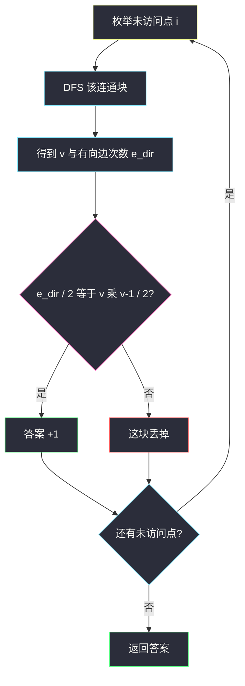
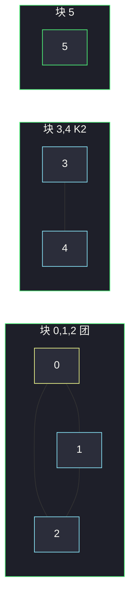

# 统计完全连通分量的数量（分量内点数与边数）

## 一、问题描述

`n` 个点（编号 `0 .. n-1`）的无向图，边列表 `edges`。一个连通分量叫作**完全**的，当且仅当分量里每一对点都有边（即它是团 / 完全图 `K_v`）。求有多少个完全连通分量。

> 🔗 LeetCode 2685：https://leetcode.cn/problems/count-the-number-of-complete-components/
>
> 数据范围：`1 ≤ n ≤ 50`，无重边、无自环。`n` 很小，邻接矩阵、DFS、并查集都能过；题单这一节练的是 **DFS 扫连通块时同时数点、数边**。
>
> 📚 灵茶题单：**§1.1 DFS**（图论基础：连通分量）。

**示例 1**

```
输入：n = 6, edges = [[0,1],[0,2],[1,2],[3,4]]
输出：3
```

三块：`{0,1,2}` 三角形（3 边），`{3,4}` 一条边，`{5}` 孤立点。都是完全图。

**示例 2**

```
输入：n = 6, edges = [[0,1],[0,2],[1,2],[3,4],[3,5]]
输出：1
```

`{0,1,2}` 仍是团；`{3,4,5}` 缺边 `4–5`，不是完全图。只有 1 个。

**直观理解**

连通只保证「能互相走过去」，完全还要求「每对都直接连着」。`v` 个点的完全图边数必须恰好是 `v*(v-1)/2`。于是：找出每个连通块，数点数 `v`、边数 `e`，判断 `e == v*(v-1)/2`。

孤立点 `v=1, e=0`，`0 == 0`，算完全（`K_1`）。两个点一条边是 `K_2`，也算。

---

## 二、暴力解法

`n ≤ 50`，每个连通块里两两点对去邻接矩阵查边，缺一条就否。正确，但要先知道块里有哪些点。

```python
from typing import List

class Solution:
    def countCompleteComponents(self, n: int, edges: List[List[int]]) -> int:
        g = [[False] * n for _ in range(n)]
        adj = [[] for _ in range(n)]
        for a, b in edges:
            g[a][b] = g[b][a] = True
            adj[a].append(b)
            adj[b].append(a)
        vis = [False] * n

        def dfs(u, nodes):
            vis[u] = True
            nodes.append(u)
            for v in adj[u]:
                if not vis[v]:
                    dfs(v, nodes)

        ans = 0
        for i in range(n):
            if vis[i]:
                continue
            nodes = []
            dfs(i, nodes)
            ok = True
            for x in range(len(nodes)):
                for y in range(x + 1, len(nodes)):
                    if not g[nodes[x]][nodes[y]]:
                        ok = False
            if ok:
                ans += 1
        return ans
```

块大时内部 `O(v²)`，全局仍可接受。不必两两查：边数公式一次比完。

### 🔴 瓶颈在哪里

遍历连通块时，邻接表长度之和就是「有向意义下的边次数」= `2e`。DFS 一遍同时拿到 `v` 和 `2e`，再 `/2` 比公式。少一次双重循环，也好默写。

---

## 三、优化探索（核心章节）

> 📚 本题在灵茶题单中属于 **§1.1 DFS**。连通分量上统计结构量。

### 3.1 完全图判定

无向简单图、无重边自环时：

```text
完全  ⟺  e = v * (v - 1) / 2
```

`e` 更少：缺边。`e` 不可能更多（简单图）。所以只要等式，不必再查「是否真的每对都连」——在简单图假设下两者等价。

### 3.2 DFS 同时数点、数边

从块内一点出发，访问每个点 `v += 1`；扫到一条邻接表项 `e_dir += 1`（每条无向边被两端各计一次）。块结束：`e = e_dir / 2`。



BFS、并查集先缩点再数边，结论一样。并查集要注意：边要在 `union` 时累加到代表元，或事后按代表元分桶。DFS 最直接。

染色、二分图（[is-graph-bipartite.md](./is-graph-bipartite.md)）也是「连通块内推约束」；本题推的是边数公式，不是 2-染色。

### 3.3 一句话核心

> **每个连通块 DFS 数 v 和 2e；`e == v*(v-1)/2` 则这块是完全图。**

---

## 四、代码实现

### Python（主解：DFS 数点边）

```python
from typing import List

class Solution:
    def countCompleteComponents(self, n: int, edges: List[List[int]]) -> int:
        g = [[] for _ in range(n)]
        for a, b in edges:
            g[a].append(b)
            g[b].append(a)
        vis = [False] * n

        def dfs(u: int) -> tuple[int, int]:
            vis[u] = True
            vc, ec = 1, 0
            for v in g[u]:
                ec += 1
                if not vis[v]:
                    a, b = dfs(v)
                    vc += a
                    ec += b
            return vc, ec

        ans = 0
        for i in range(n):
            if not vis[i]:
                vc, ec = dfs(i)
                if ec // 2 == vc * (vc - 1) // 2:
                    ans += 1
        return ans
```

`ec` 是有向计数，比较时 `// 2`。整数除法两边都整除，不必担心奇数：无向图 `ec` 必为偶数。

另一种写法：收集块内点列表 `nodes`，再 `sum(len(g[x]) for x in nodes) // 2`，避免递归返回两个值，一样。

并查集：`union` 时边数加到代表元，最后每个根看 `e == size*(size-1)/2`。`n=50` 三种都能过，题单这一节优先 DFS 计数。

---

## 五、具体例子演示

示例 1：`n=6`，边 `0–1, 0–2, 1–2, 3–4`。

从 0 开始 DFS：访问 0,1,2。每个点度数 2，`ec = 2+2+2 = 6`，`e = 3`。`v=3`，需要 `3*2/2=3`。相等，计数 1。

从 3：访问 3,4。度数 1+1，`ec=2`，`e=1`。需要 `2*1/2=1`。计数 2。

从 5：孤立，`vc=1, ec=0`，需要 0。计数 3。



示例 2：多一条 `3–5`。块 `{3,4,5}`：DFS 从 3 走到 4、5。`len(g[3])=2`，`len(g[4])=1`，`len(g[5])=1`，`ec=4`，`e=2`。需要 `3*2/2=3`。`2 ≠ 3`，缺的正是 `4–5`。这块不加分。另一块三角形仍加 1。答案 1。

**逐步跟踪示例 2 的 `{3,4,5}`**

| 访问点 | 邻居扫描 | 累计 vc | 累计 ec |
|--------|----------|---------|---------|
| 进 3 | 邻 4、5，先递归 4 | 1 | 0 |
| 进 4 | 邻 3（已访，只 +1 边） | 2 | 1（4 的）+ 待回传 |
| 回 3 再进 5 | 邻 3 已访 | 3 | 各点度数加完 = 4 |
| 结束 | `4//2=2`，需要 3 | | 否 |

不要把 `ec` 当成无向边数去和 `v*(v-1)/2` 比——会差一倍，三角形 `6==3` 失败，全错。

示例 1 逐步（从 0 出发，邻接表按加点顺序 `0: [1,2], 1: [0,2], 2: [0,1]`）：

| 动作 | vc | ec 累加 |
|------|----|---------|
| 进 0，扫 1（未访→递归）、扫 2（稍后） | 1 | |
| 进 1，扫 0（已访 +1）、扫 2（未访→递归） | 2 | 1 的度数先记 |
| 进 2，扫 0、1 都已访 | 3 | 三个点度数 2+2+2 |
| 返回 | 3 | 6，`6//2=3` 等于需要的 3 |

树边 2 条、回边在无向图里就是那第 3 条团边。只数「走进未访点」会得到 `e=2`，三角形被误判成「缺边」。

---

## 六、复杂度分析

| 方法 | 时间 | 空间 | 说明 |
|------|------|------|------|
| DFS 数点边（主解） | `O(n + m)` | `O(n + m)` | 每点每边一次 |
| 块内两两点对 | `O(n²)` | `O(n + m)` 或 `O(n²)` 矩阵 | `n=50` 能过 |
| 并查集 + 分桶数边 | `O(n + m)` | `O(n + m)` | 等价 |

`m ≤ n(n-1)/2`，这里就是 `O(n²)` 量级，无压力。

---

## 七、对比总结

| 维度 | 只判连通 | 本题完全分量 |
|------|----------|--------------|
| 要的量 | 块的个数 | 块中满足团公式的个数 |
| DFS 返回 | 访问即可 | 必须带回 v、e |
| 孤立点 | 算一块 | 也算完全，别漏 |

**易错点**

1. **边数忘了 `/2`**：无向边在邻接表里出现两次。
2. **只数了 DFS 树边**：必须把回边、已访问邻居也计入 `ec`，否则三角形只数 2 条树边。
3. **漏孤立点**：外层 `for i in range(n)`，没有边的点也要开一块。
4. **建成有向**：漏反向，块会裂、边数会少。
5. **用 `== v*v/2`**：少了 `(v-1)`。

连通块 DFS 和 [is-graph-bipartite.md](./is-graph-bipartite.md) 共用「外层枚举未访问点、内层走完一块」；本题块内统计的是度数和，那边统计的是颜色冲突。

---

## 八、举一反三

| 题目 | 关系 |
|------|------|
| [547. 省份数量](https://leetcode.cn/problems/number-of-provinces/) | 只数连通块，不查是否完全 |
| [1319. 连通网络的操作次数](https://leetcode.cn/problems/number-of-operations-to-make-network-connected/) | 连通块个数 vs 多余边 |
| [785. 判断二分图](https://leetcode.cn/problems/is-graph-bipartite/) | 同样按连通块 DFS/BFS，约束换成染色，站内 [is-graph-bipartite.md](./is-graph-bipartite.md) |
| [2493. 将节点分成尽可能多的组](https://leetcode.cn/problems/divide-nodes-into-the-maximum-number-of-groups/) | 先判二分图再在块内 BFS |
| [1615. 最大网络秩](https://leetcode.cn/problems/maximal-network-rank/) | 度数与两点是否直接相连 |

**思想迁移**

- 连通块上的判定题：DFS/BFS 一遍收集块的统计量（点数、边数、度数序列、颜色）。
- 团 / 完全图：简单图里边数公式就够，不必 `O(v²)` 扫点对（当然扫也对）。
- 口诀：**「扫块；度数和 /2 得 e；e 等于 v 乘 v-1 /2 才加分。」**
