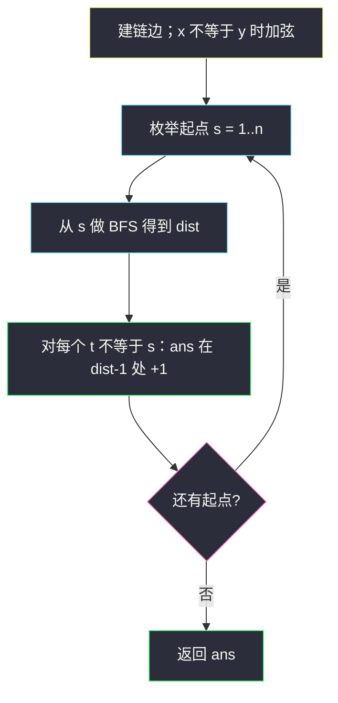
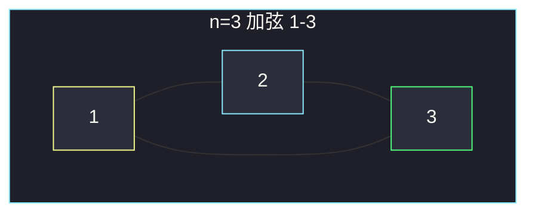

# 按距离统计房屋对数目 I（链 + 一条弦 · 每点 BFS）

## 一、问题描述

`n` 座房屋编号 **1 .. n**，相邻房屋 `i — i+1` 各有一条街。另外再连一条 `x — y`（`x` 可以等于 `y`）。对每个距离 `k = 1 .. n`，统计有序对 `(h1, h2)`（`h1 ≠ h2`）中，最短路 **恰好为 k** 的数量。返回长度为 `n` 的数组：下标 `0` 存 `k=1`，下标 `n-1` 存 `k=n`。

> 🔗 LeetCode 3015：https://leetcode.cn/problems/count-the-number-of-houses-at-a-certain-distance-i/
>
> 数据范围：`2 ≤ n ≤ 100`，`1 ≤ x, y ≤ n`。中文题面写「下标从 1 开始」，返回值仍是长度为 `n` 的列表，`ans[k-1]` 对应距离 k。
>
> 📚 灵茶题单：**图论 · §1.2 广度优先搜索（BFS）**（1658 分）。⚠️ 新题。

**示例 1**

```
输入：n = 3, x = 1, y = 3
输出：[6, 0, 0]
房屋 1-2-3 再加 1-3，变成三角形。任意两座距离都是 1。
6 个有序对：(1,2),(2,1),(2,3),(3,2),(1,3),(3,1)。
```

**示例 2**

```
输入：n = 5, x = 2, y = 4
输出：[10, 8, 2, 0, 0]
链 1-2-3-4-5 加弦 2-4。最远有序对是 (1,5) 与 (5,1)，距离 3。
```

**示例 3**

```
输入：n = 4, x = 1, y = 1
输出：[6, 4, 2, 0]
x = y，额外边是自环，距离等于纯链：1-2-3-4。
距离 1 有 6 对，距离 2 有 4 对，距离 3 有 2 对。
```

**直观理解**

图几乎是一条链，多一条弦（或一条废自环）。`n ≤ 100`，从每个起点 BFS 一遍，把到其它点的距离打进直方图。有序对：`(i,j)` 和 `(j,i)` 各计一次，无向最短路对称，所以每个无序对贡献 2。

编号是 **1-based**：建图、入队都用 1..n，或内部 0..n-1 但映射时别写错。

---

## 二、暴力解法

Floyd：`O(n³)` 求全源最短路，再按 `dist[i][j]` 填桶。`n = 100` 刚过，但题单考点是 BFS，Floyd 对「边权全 1」也过重。

```python
# dist 初始化 inf，相邻与 x-y 置 1，三重循环松弛
# for i,j i!=j: ans[dist[i][j]-1] += 1
```

### 复杂度

- **时间**：`O(n³)`。
- **空间**：`O(n²)`。

### 🔴 瓶颈在哪里

边权全是 1，单源最短路就是 BFS。全源 = 每个点当一次源，`O(n(n+m))`，`m ≈ n`，即 `O(n²)`，比 Floyd 少一截。

---

## 三、优化探索（核心章节）

> 📚 本题在灵茶题单中属于 **§1.2 BFS**。先建邻接表（链边 + 弦），对每个起点 BFS，按距离累加直方图。

### 3.1 建图

节点 `1 .. n`（或开 `n+1` 下标，0 空着）。

- 对 `i = 1 .. n-1`：无向边 `i — i+1`。
- 若 `x != y`：再加 `x — y`。`x == y` 时加自环不改变任何最短路，直接不加。

### 3.2 每点 BFS

从房屋 `s` 出发，`dist[s] = 0`。弹出 `u` 时，未访问邻居 `v` 的距离是 `dist[u]+1`。对每个 `t ≠ s`，`ans[dist[t]-1] += 1`。

所有起点都做完，有序对就齐了：从 1 走到 3 计一次，从 3 走到 1 在以 3 为源的那遍再计一次。



### 3.3 公式 `O(n²)`（优化段，非默写重点）

链上 `i` 到 `j` 的距离是 `|i-j|`。走弦时只有两种用法：先到 x 再一步到 y 再去 j，或先到 y 再一步到 x。因此

```
d = min(|i-j|, |i-x| + 1 + |j-y|, |i-y| + 1 + |j-x|)
```

对 `1 ≤ i < j ≤ n` 算完 `d` 后 `ans[d-1] += 2`（有序）。`x == y` 时后两项 ≥ `|i-j| + 1`，min 仍是 `|i-j|`，与自环无影响一致。

与 BFS 对拍：示例及随机 `n ≤ 100` 结果相同。II 期 `n` 到 `1e5` 才必须推公式闭式；本题 `n ≤ 100` 用 BFS 对齐题单即可。

### 3.4 一句话核心

> **链加一条弦；每个房屋当起点 BFS，dist 为 k 就给 ans[k-1] 加一（有序对自动乘 2）。**

---

## 四、代码实现

### Python（主解：建图 + 每点 BFS）

```python
from collections import deque

class Solution:
    def countOfPairs(self, n: int, x: int, y: int) -> list[int]:
        g = [[] for _ in range(n + 1)]
        for i in range(1, n):
            g[i].append(i + 1)
            g[i + 1].append(i)
        if x != y:
            g[x].append(y)
            g[y].append(x)

        ans = [0] * n
        for s in range(1, n + 1):
            dist = [-1] * (n + 1)
            dist[s] = 0
            q = deque([s])
            while q:
                u = q.popleft()
                for v in g[u]:
                    if dist[v] == -1:
                        dist[v] = dist[u] + 1
                        q.append(v)
            for t in range(1, n + 1):
                if t != s:
                    ans[dist[t] - 1] += 1
        return ans
```

**变量含义**

| 变量 | 含义 |
|------|------|
| `g[1..n]` | 无向邻接表 |
| `dist[t]` | 当前源 s 到 t 的最短街数 |
| `ans[k-1]` | 有序对中最短路恰好为 k 的个数 |

`dist == -1` 表示未入队。边权 1，第一次到达即为最短。

### 公式版（可选）

```python
class Solution:
    def countOfPairs(self, n: int, x: int, y: int) -> list[int]:
        ans = [0] * n
        for i in range(1, n + 1):
            for j in range(i + 1, n + 1):
                d = min(
                    abs(i - j),
                    abs(i - x) + 1 + abs(j - y),
                    abs(i - y) + 1 + abs(j - x),
                )
                ans[d - 1] += 2
        return ans
```

---

## 五、具体例子演示

### 示例 3（纯链，便于看层）

`n = 4, x = y = 1`，图就是 `1-2-3-4`。

从房屋 **1** 出发的 BFS 队列：

| 层 dist | 队列弹出 | 新入队 |
|---------|----------|--------|
| 0 | 1 | 2 |
| 1 | 2 | 3 |
| 2 | 3 | 4 |
| 3 | 4 | — |

给直方图：`(1,2)` 距离 1，`(1,3)` 距离 2，`(1,4)` 距离 3。各 +1。

从 2 出发：到 1、3 为 1，到 4 为 2。

四遍源做完（有序）：

| k | 有序对 | 个数 |
|---|--------|------|
| 1 | (1,2)(2,1)(2,3)(3,2)(3,4)(4,3) | 6 |
| 2 | (1,3)(3,1)(2,4)(4,2) | 4 |
| 3 | (1,4)(4,1) | 2 |
| 4 | 无 | 0 |

`ans = [6, 4, 2, 0]`。

### 示例 1（弦把直径打掉）

`n = 3, x = 1, y = 3`。



从 1：邻居 2 和 3 都在第 1 层，没有 dist≥2。三个源对称，共 6 个距离 1 的有序对，`[6,0,0]`。

原先链上 `(1,3)` 距离是 2，弦把它改成 1，所以 k=2 的桶是空的。

### 示例 2 从 1 出发

`n = 5`，边 `1-2-3-4-5` 加 `2-4`。

| dist | 点 | 说明 |
|------|----|------|
| 0 | 1 | 源 |
| 1 | 2 | 链上相邻 |
| 2 | 3、4 | 3 经 2；4 经弦 2-4，比 1-2-3-4 更短 |
| 3 | 5 | 2-4-5 |

`(1,5)` 距离 3 而不是链上的 4。对称的 `(5,1)` 在以 5 为源时再 +1，最终 k=3 的桶为 2。

---

## 六、复杂度分析

| 方法 | 时间 | 空间 | 说明 |
|------|------|------|------|
| Floyd | `O(n³)` | `O(n²)` | 边权 1 不必 |
| 每点 BFS（主解） | `O(n²)` | `O(n)` | 边数与 n 同阶，n 次 BFS |
| 两两公式 | `O(n²)` | `O(n)` | 常数更小，题单次选 |

空间：邻接表 `O(n)`，单次 BFS 的 `dist` 与队列 `O(n)`，`ans` 为 `O(n)`。每次 BFS 是 `O(n+m)`，总时间 `O(n(n+m)) = O(n²)`。

---

## 七、对比总结

| 维度 | Floyd | 每点 BFS | 公式 |
|------|-------|----------|------|
| 建模 | 邻接矩阵 | 邻接表 + 层数 | 三条路径取 min |
| 与题单 | 偏短 | 对齐 §1.2 | 优化段 |
| n=1e5（II） | 不行 | 不行 | 要再推闭式 |

**易错点**

1. **房屋编号当 0-based 建了 `n` 个点却连 `i — i+1` 连到 n**：应用 1..n 或转换后再 +1。
2. **`ans[dist]` 没减 1**：k 从 1 起，下标 0 存 k=1。
3. **只枚举 `i < j` 却只 +1**：那是无序对，题目要有序，应 +2，或者每个起点都 BFS。
4. **`x == y` 仍加自环还拿来当一步**：不影响 dist，但邻居循环可能多转一圈；干脆不加。
5. **把 `(h1,h2)` 理解成无序**：示例 1 若当无序会得到 3 而不是 6。
6. **弦只加单向**：无向街，`g[x]` 与 `g[y]` 都要写。
7. **距离 0 写进 ans**：`t == s` 必须跳过，否则 `ans[-1]` 或下标错。

---

## 八、举一反三

| 题目 | 关系 |
|------|------|
| [3017. 按距离统计房屋对数目 II](https://leetcode.cn/problems/count-the-number-of-houses-at-a-certain-distance-ii/) | 同一模型，`n` 到 1e5，必须公式 / 差分 |
| [743. 网络延迟时间](https://leetcode.cn/problems/network-delay-time/) | 单源最短路；边权不是 1 时改 Dijkstra |
| [752. 打开转盘锁](https://leetcode.cn/problems/open-the-lock/) | 隐式图 BFS 层数。见 [open-the-lock.md](./open-the-lock.md) |
| [841. 钥匙和房间](https://leetcode.cn/problems/keys-and-rooms/) | BFS/DFS 覆盖，不计距离直方图。见 [keys-and-rooms.md](./keys-and-rooms.md) |
| [815. 公交路线](https://leetcode.cn/problems/bus-routes/) | 先建模再 BFS 最短 |

**思想迁移**

- 小图 + 边权 1 + 要所有点对距离 → 每个源 BFS 打直方图。
- 口诀：**「1 到 n 连成链，x-y 加一条；每个房子当起点，距离 k 就给第 k 个桶加一。」**
